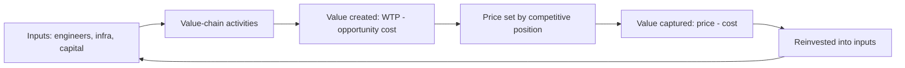


## What you'll learn
- The difference between *value creation* and *value capture*, and why a great product can still be a bad business.
- Why firms exist at all instead of every engineer being a freelance contractor - Coase's transaction-cost argument.
- Where engineering work sits in the [value chain](https://hbr.org/1985/07/from-competitive-advantage-to-corporate-strategy) and why that position determines what your work is worth.
- Why "we built the best product" is not a strategy and what the actual strategic levers are.

## Concepts

A business is a machine for creating value and capturing some fraction of it. Those are two different things, and conflating them is the most common engineering-side mistake when reading a strategy doc.

**Value creation** is the gap between what a customer would pay (their *willingness to pay*) and the *opportunity cost* of the inputs - the engineer's next-best job, the AWS bill for the next-best workload, the office rent for the next-best tenant. A firm that creates a lot of value is doing something useful. A firm that creates a little is, at best, redistributing.

**Value capture** is the slice of that gap the firm actually keeps as price minus cost. Anyone who has watched a brilliant engineering team get crushed by a worse competitor with better distribution has seen the mismatch in person. Linux created an extraordinary amount of value; Red Hat captured a sliver of it; AWS captured more than Red Hat did, by operating it. None of those parties built more of Linux than the others.

The two-by-two below is worth tattooing on every engineer's forearm before their first strategy review.

| | Low value capture | High value capture |
|---|---|---|
| **Low value creation** | Dead, but quietly | Rent-seeking - usually unstable |
| **High value creation** | The "great product, bad business" trap | The compounding businesses |

Engineering work disproportionately produces the top row. Strategy work - pricing, distribution, moats - is largely about pulling firms to the right.

### Why firms exist at all

[Ronald Coase asked the right question in 1937](https://onlinelibrary.wiley.com/doi/10.1111/j.1468-0335.1937.tb00002.x): if markets are so good at allocating resources, why does any work happen inside a firm? Why isn't every engineer a contractor selling pull requests by the hour?

His answer was *transaction costs*. Every market transaction has hidden costs: finding the counterparty, negotiating, drafting contracts, monitoring quality, enforcing payment. When those costs exceed the cost of doing the same work in-house under managerial direction, the work moves inside the firm. When the costs flip, the work moves back out.

You see Coase quietly running every "build vs. buy" decision an engineering org makes. SaaS vendors exist because integrating a payroll system in-house has high coordination cost. AWS exists because managing your own racks has high transaction cost with hardware vendors, real estate, and electricians. The cloud is a giant statement about transaction costs falling.

Engineers experience the limits of Coase from the inside. Why does your manager exist? Because the cost of coordinating five engineers via market contracts would be higher than the cost of one manager with hire-and-fire authority. Why does the org chart exist? Same reason, recursively.

### The value chain

Michael Porter's *value chain* decomposes a firm into the discrete activities that create value: inbound logistics, operations, outbound logistics, marketing/sales, service, plus support activities (HR, tech, procurement, infrastructure). For a software company, the chain compresses but doesn't vanish - the activities are roughly: build, operate, sell, support, and pay for it all.

The engineer's job sits inside *operations* (running the service) and *technology development* (a support activity in Porter's original framing). That placement matters. Activities further from the customer - like the platform engineer maintaining the build system - are further from where willingness-to-pay is determined. They're not less valuable. They're just one degree removed from the conversation about value capture, which is why their work has to be translated into business language to be funded. We will spend the rest of this course on that translation.

## Walkthrough

A worked example. Suppose your team is choosing between two projects.

```text
Project A - Reduce p99 latency on the checkout API from 800ms to 200ms.
Estimated cost: $300k (2 engineers · 6 months).

Project B - Add a feature competitors charge $20/user/month for.
Estimated cost: $300k (2 engineers · 6 months).
```

Both projects create value. Project A creates it for *every user every time they check out*. Project B creates it for *users who want that specific feature*. The crucial question is not which creates more value - it's which lets the firm capture more.

Project A's value capture is *indirect*: faster checkout → fewer abandoned carts → more revenue. Estimating that conversion lift requires the marketing analytics team. If the lift is 0.5% on $200M ARR, that's $1M/year - a 3x return on the investment.

Project B's capture is *direct*: it appears on the price sheet. If half of new enterprise prospects ask for that feature and 200 deals close per year, the feature might shift the close rate by a few percentage points - also worth a million or two.

The framework lets you evaluate them on the same axis. Neither is obviously better. The point is: a chapter that ends "we should reduce latency because performance matters" is not a business case. A chapter that ends "we should reduce latency because the marketing team estimates a 0.5% lift in conversion at $4M ARR/year" is.

## How it fits together



The loop closes. A firm that captures more than it spends compounds. A firm that doesn't, decays. Engineering work moves units around inside this loop - but the *shape* of the loop is set by strategy, pricing, and competition, which are the next four modules.

## Common pitfalls

| Pitfall | Why it happens | Fix |
|---|---|---|
| Conflating value created with value captured | Engineers anchor on "did we ship something good?" | Always ask separately: did this raise willingness-to-pay, did it reduce cost, did it raise the price we can charge? |
| Treating internal projects as having no business case | "It's just infrastructure" | Internal investments still have an ROI; the translation is via developer productivity, incident reduction, or unlocked product capability. |
| Assuming a great product wins | The "great product, bad business" trap | Distribution, switching costs, and pricing power often beat product quality. See: every product category with a #2 player making more money than the #1. |
| Reading the value chain as a process diagram | It's an *activity decomposition*, not a workflow | Activities run in parallel; the value chain just names them. |

## Exercises

1. Pick a product you use daily. Identify two activities in its value chain that *create* value for you. Identify one activity that exists primarily to *capture* value (a paywall, a tiering decision, a sales process). Notice that the third one is often invisible to engineers.
2. Take a recent engineering project you led. Write one sentence describing the value *created* and one sentence describing how the firm *captures* it. If the second sentence is hard to write, that's information.
3. Find a public S-1 (e.g. [Snowflake's](https://www.sec.gov/Archives/edgar/data/1640147/000119312520245725/d427360ds1.htm)) and identify the top three "risk factors" the company names. Almost all of them are about value capture, not value creation. Why?

## Recap & next

- A business creates value and captures some of it; the two are different and often unrelated.
- Coase's answer to "why firms exist" - transaction costs - silently drives every build-vs-buy decision in the org.
- The value chain places engineering work one to two steps removed from where willingness-to-pay is set, which is why translation matters.
- "Great product" is necessary but not sufficient; distribution, pricing, and moats determine capture.

Next, **Reading a P&L without panic** - the income statement decoded line by line.

