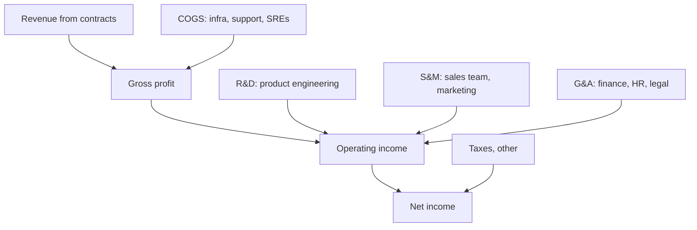


## What you'll learn
- The shape of a software company's income statement, line by line - revenue down to net income.
- What each line tells you about the business, and what "good" numbers look like for SaaS.
- Why R&D, S&M, and G&A are usually broken out separately, and how to read the ratios.
- Where engineering costs land on the P&L and why that placement matters.

## Concepts

The Profit and Loss statement - P&L, or income statement - is the single document executives stare at most. Public companies publish theirs quarterly in their [10-Q filings](https://www.sec.gov/page/searchedgar-form-types-explanation); private ones produce a version every month for the board. Once you can read one fluently, you can follow most exec conversations about company health.

It always has the same skeleton:

```text
                                    Q3'25       % of revenue
Revenue                           $100.0M           100%
  Cost of Revenue (COGS)          $(25.0)M         (25)%
                                  ────────
Gross Profit                       $75.0M            75%   ← gross margin
                                  ────────
Operating Expenses
  R&D                            $(30.0)M          (30)%
  Sales & Marketing              $(40.0)M          (40)%
  General & Admin                $(10.0)M          (10)%
                                  ────────
Operating Income (Loss)           $(5.0)M           (5)%
  Other income / expense           $1.0M             1%
  Taxes                            $0.0M             0%
                                  ────────
Net Income (Loss)                 $(4.0)M           (4)%
```

You read top-to-bottom. Each section answers one question.

### Revenue: what did customers pay us this period?

For SaaS, this is almost always recognised *ratably* - a $120k annual contract becomes $10k of revenue each month, not a $120k spike at signing. The cash hit the bank account upfront; the *revenue* line on the P&L doesn't. This is why "ARR" (annualised run-rate revenue) and "revenue" can diverge sharply when a company is growing fast or signing long deals - more on that in [Cash, profit, accruals](./03-cash-profit-accruals.md).

Read the year-over-year growth rate (typically shown alongside the absolute number). For B2B SaaS, the rough bar is: 100%+ is hypergrowth, 40–60% is solid growth-stage, 20–30% is late-stage but healthy, sub-20% with profitability is mature, sub-20% without profitability is a problem.

### COGS: what did it cost to *deliver* the revenue we recognised?

For a SaaS company, COGS is mostly *cloud infrastructure, customer support, third-party service costs*, and *the salaries of people who run the production service* (SREs, support engineers, sometimes a fraction of platform engineering). It does *not* include the salaries of engineers building *new* features - that's R&D.

Gross margin = (Revenue − COGS) / Revenue. This is the most important number on the entire statement. It tells you how much money is left over after you've delivered what the customer paid for, before you've paid for anything else.

| Industry | Typical gross margin |
|---|---|
| SaaS | 70–85% |
| Marketplaces | 60–80% (depending on take rate) |
| Hardware | 30–50% |
| Retail | 20–40% |
| Cloud infrastructure providers | 50–65% |

A SaaS company with 50% gross margin is doing something wrong, or isn't really SaaS. A SaaS company at 85% has a beautiful business - they have huge surplus to spend on R&D and S&M.

### Operating expenses: R&D, S&M, G&A

These are the costs of *growing* the business, not delivering what the customer already paid for. Public companies break them into three buckets:

- **R&D (Research & Development)** - the salaries of engineers building new features, plus a slice of management, plus product/design. For most SaaS companies, R&D is 15–30% of revenue. Under-investing here is a slow death; over-investing without a clear product strategy burns cash.
- **S&M (Sales & Marketing)** - sales team comp, ad spend, marketing programs, demand gen, partner programs. For SaaS, this is often the largest single line item - 30–50% of revenue is common at growth stage, and the line on which "is this company efficient?" is most often litigated. It encodes [CAC](./04-unit-economics.md): every dollar of S&M is buying some amount of new ARR.
- **G&A (General & Administrative)** - finance, HR, legal, the CEO's office, real estate. The "boring overhead." Typically 8–15% of revenue; if it's bigger than that, something is structurally off.

### Operating income, net income

**Operating income** = Gross profit − Opex. This is the profitability of the actual *operations* of the business, before you account for taxes, interest, or one-time events. For SaaS, this is the line investors care most about, often expressed as "operating margin" or "non-GAAP operating margin" (the latter strips out stock-based compensation, which is enormous in software).

**Net income** = Operating income + Other income/expense − Taxes. This is what hits retained earnings. For software companies, the gap between operating and net income is usually small unless they have significant interest income (large cash piles) or one-time items.

### Where engineering lands

A senior engineer's loaded cost (~$400k all-in including comp, benefits, equity, infrastructure) is on the P&L *somewhere*. The placement depends on what they do:

| Role | Where on the P&L | Why |
|---|---|---|
| SRE running production | COGS | Cost of delivering current revenue |
| Customer support engineer | COGS | Same |
| Product engineer (new features) | R&D | Investment in future revenue |
| Platform engineer (internal tools) | R&D | Investment, even if internal |
| Sales engineer (pre-sales) | S&M | Helps close deals |
| IT engineer | G&A | Overhead, not customer-facing |

The same person doing the same work can land in two different buckets depending on framing. This matters: shifting headcount from R&D to COGS can hurt gross margin while improving R&D efficiency, and vice-versa. Finance teams care about which bucket because the ratios drive valuation multiples.

## Walkthrough

Pull a real one. Here's Atlassian's FY24 P&L (rounded, [10-K filing](https://investors.atlassian.com/)) presented in the same structure:

```text
Revenue                          $4,360M         100%
Gross profit                     $3,640M          83.5%
  R&D                            $2,036M          46.7%
  S&M                            $890M            20.4%
  G&A                            $440M             10.1%
Operating loss                   $266M             6.1%
```

Three things to notice:

1. Gross margin of ~83% is excellent - pure-software SaaS at scale.
2. R&D at 47% of revenue is enormous. Atlassian invests heavily in product breadth (Jira, Confluence, Bitbucket, Compass, Loom…). That's a strategic choice - they're betting product breadth is the moat.
3. S&M at only 20% is unusually low for SaaS. Atlassian famously runs a low-touch, self-service motion - most customers buy without ever talking to a salesperson. The low S&M ratio is the visible footprint of that strategy.

Compare with a sales-led peer: Salesforce's R&D is ~15% and S&M is ~36%. Same industry, completely different P&L shape, because the *strategy* is different.

## How it fits together



## Common pitfalls

| Pitfall | Why it happens | Fix |
|---|---|---|
| Conflating revenue with cash | Revenue is recognised ratably; cash arrives in lumps | Look at the cash flow statement alongside the P&L. We cover this next chapter. |
| Treating gross margin as just a finance metric | It encodes "how scalable is this business?" | Low gross margin caps how much you can invest in R&D and S&M - it's a strategy constraint, not a finance trivia. |
| Ignoring stock-based compensation | SaaS companies report "non-GAAP" numbers that hide SBC | SBC is real dilution; read both GAAP and non-GAAP. |
| Misreading R&D as "engineering" | R&D includes product, design, eng management, and engineering benefits | When you see "20% of revenue going to R&D", remember it's not all engineers' base salaries. |
| Assuming bigger R&D = better company | Spend without strategy burns cash | Compare R&D-as-%-of-revenue across years - is it scaling efficiently or growing as fast as headcount? |

## Exercises

1. Pull the latest 10-Q from any public SaaS company you use. Identify revenue, gross margin, R&D %, S&M %, and operating margin. Compare the structure to Atlassian's above. Write one sentence per number explaining what it implies about the company's strategy.
2. For your own team, estimate which P&L bucket your salary lands in. If you're not sure, ask your finance partner - the answer often surprises engineers and reveals how your work is "framed" upstream.
3. Find a software company whose gross margin is below 60%. Look at the 10-K footnotes to find out *why* (usually: significant professional services revenue, hosted hardware costs, or significant infrastructure pass-through). The reason almost always reveals the business model.

## Recap & next

- The P&L is the same five-section skeleton everywhere: revenue, COGS, opex (R&D/S&M/G&A), operating income, net income.
- Gross margin is the most diagnostic single number - it caps how much you can invest in everything else.
- The split of opex into R&D/S&M/G&A encodes the company's strategy: a heavy S&M ratio signals sales-led; a heavy R&D ratio signals product-led.
- Where engineering costs land (COGS vs R&D) depends on what the engineer does, and the placement materially affects which ratios look healthy.

Next, **Cash, profit, accruals: what each actually means** - why a profitable company can still run out of money.

