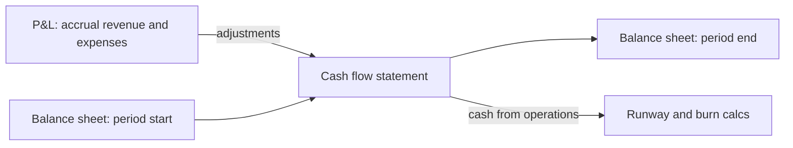


## What you'll learn
- Why a profitable company can still go bankrupt, and why an unprofitable one can have plenty of cash.
- The difference between *accrual* accounting (what the P&L uses) and *cash* accounting (what your bank balance shows).
- *Runway*, *burn rate*, and how to compute both from a board deck.
- The three financial statements and why the cash flow statement is the one engineers should read first.

## Concepts

The first time you read a board deck you'll notice that the same company is described with two profitability numbers that disagree by tens of millions of dollars. One says "net loss of $(80M)" and the other says "free cash flow of +$30M". Both are correct. The reason they disagree is *accrual accounting*, which is the convention every public company uses for its P&L.

### Accrual vs. cash, in one sentence each

- **Cash accounting** - you record revenue when the money lands in the bank and expenses when the money leaves it.
- **Accrual accounting** - you record revenue when it's *earned* (the customer has received the service) and expenses when they're *incurred* (the work has been done), regardless of when cash moves.

For SaaS, this matters constantly. Suppose a customer signs a $1.2M annual contract on January 1st and pays the full $1.2M upfront. Under accrual:

| | Jan | Feb | Mar | ... | Dec | Total |
|---|---|---|---|---|---|---|
| Revenue (P&L) | $100k | $100k | $100k | ... | $100k | $1.2M |
| Cash (bank account) | $1.2M | $0 | $0 | ... | $0 | $1.2M |

Revenue is recognised *ratably* - earned across the period of service. The cash is in the bank from day one. The difference creates an entry called *deferred revenue* on the balance sheet: a liability that says "we owe this customer eleven more months of service we've already been paid for."

Now flip it. The same customer signs a $1.2M annual contract on December 31st with [Net 60 payment terms](https://www.investopedia.com/terms/n/netdays.asp). The customer pays in two months but starts using the product immediately:

| | Jan | Feb | Mar | ... | Dec | Total |
|---|---|---|---|---|---|---|
| Revenue (P&L) | $100k | $100k | $100k | ... | $100k | $1.2M |
| Cash | $0 | $1.2M | $0 | ... | $0 | $1.2M |

January's revenue is real - the service was delivered. The cash comes later. The gap shows up on the balance sheet as *accounts receivable*: money owed to the company that it has earned but not yet collected.

### Why a profitable company can run out of cash

Consider a startup with the following pattern: it signs annual contracts billed annually upfront, has gross margin of 80%, and is growing. Its P&L looks ugly:

```text
Revenue        $20M       100%
COGS           $(4M)       (20)%
Gross profit   $16M         80%
R&D            $(15M)      (75)%
S&M            $(12M)      (60)%
G&A            $(4M)       (20)%
Operating loss $(15M)      (75)%
```

But here's what the bank balance looks like:

```text
Cash from ops:   $20M revenue + $30M deferred revenue from new annual deals
               − $4M COGS − $31M opex
               = $15M positive cash flow
```

It's losing $15M on the P&L and *generating* $15M in cash. The reason: customers pay annually upfront. The deferred-revenue float effectively finances the burn.

This is the structural reason high-growth SaaS companies can run "unprofitable" for years and not raise emergency capital. Their cash dynamics are healthier than their accrual P&L suggests. The reverse - a company with a profitable P&L and negative cash flow - is much rarer in SaaS and is usually a sign of revenue-recognition shenanigans or massive accounts receivable. WeWork's pre-IPO disclosures showed flavours of this dynamic and were one of the things investors choked on.

### Runway and burn

**Burn rate** = net cash leaving the company per month. Almost always quoted in monthly terms even if calculated from quarterly numbers.

**Runway** = (Cash on hand) / (Monthly burn). The number of months until you hit zero.

These two are the single most important numbers in any private company. The CEO of any startup knows their runway to the week. Public companies talk about it less because they have access to capital markets, but it still matters during downturns.

The formula breaks down when burn is volatile - for example, when a quarterly bill (e.g. annual subscription renewal *outflow*) skews the month. So real boards usually look at *trailing-12-month average burn* in addition to the latest month.

### The cash conversion cycle

In SaaS the cycle is unusually friendly to the company. The standard cash conversion cycle is:

```text
Days Sales Outstanding (DSO)  +  Days Inventory Outstanding  −  Days Payable Outstanding (DPO)
```

Software has no inventory, so DIO is zero. For an annual-billing-upfront SaaS, DSO is *negative* - customers pay before you've delivered the service. Combined with DPO of 30–60 days (the company pays its bills on standard terms), the result is a *negative* cash conversion cycle. The company is, in effect, being financed by its customers. This is one of the structural reasons SaaS is such a beloved business model.

### The three statements at a glance

Every company produces three financial statements. They link.

| Statement | Question it answers | Time horizon |
|---|---|---|
| P&L (income statement) | Did we make money this period? | Period (quarter/year) |
| Balance sheet | What do we own and owe right now? | Snapshot |
| Cash flow statement | How did cash actually move this period? | Period |

The cash flow statement *reconciles* the P&L's accrual numbers to the balance sheet's cash changes. It's organised in three sections:

- **Operating activities** - cash generated by the core business. Start with net income, then add back non-cash items (depreciation, SBC) and adjust for changes in working capital.
- **Investing activities** - capex, acquisitions, sales of assets.
- **Financing activities** - issuing/buying back stock, raising debt, paying dividends.

For SaaS, "cash from operating activities" is the line that matters. Engineers should read this before reading the P&L - it tells you whether the business is generating its own fuel.

## Walkthrough

A worked example. Hypothetical "Datadock" (not the real Datadog) closes Q1 with the following:

```text
Revenue (P&L, accrual)           $50M
COGS                            $(10M)
Opex                            $(55M)
Net loss                       $(15M)

But on the cash flow statement:
  Net loss                        $(15M)
  + Stock-based compensation       $20M    ← non-cash
  + Change in deferred revenue     $25M    ← customers prepaid for future service
  − Change in receivables         $(8M)    ← some customers haven't paid yet
                                ────────
Cash from operations              $22M
```

Datadock is "losing $15M" but generating $22M in cash. The lines that matter:

1. **SBC** ($20M): the company paid employees in stock. That's a real cost to existing shareholders (dilution), but no cash left the company.
2. **Deferred revenue** (+$25M): customers prepaid for service Datadock hasn't yet delivered.
3. **Receivables** (−$8M): some customers were billed but haven't paid. That hits cash even though revenue was already recognised.

The cash flow statement is where these reconciliations live. If you only read the P&L, you'd think this company was a disaster. If you only read the cash flow statement, you'd miss the dilution.

## How it fits together



## Common pitfalls

| Pitfall | Why it happens | Fix |
|---|---|---|
| Conflating P&L profit with cash | They're computed under different conventions | Look at both. The reconciliation is the cash flow statement. |
| Ignoring deferred revenue | "It's just a liability" | For SaaS, deferred revenue is a free loan from customers. Track it growing or shrinking. |
| Reading SBC as "free" | No cash leaves | It's dilution. Existing shareholders pay for it, just through ownership not cash. |
| Quoting "runway" without a date | Cash on hand changes constantly | Always cite "runway as of X" and confirm the burn assumption. |
| Treating burn as flat | Some months have one-time items | Look at trailing-12-month average and recent trend, not just last month. |

## Exercises

1. Take the most recent 10-Q from any public SaaS company. Find the cash flow statement. Identify the three biggest non-cash adjustments. For most, you'll find SBC is the largest. Note what fraction of revenue this represents - it's the company's silent ongoing equity grant to employees.
2. Build a one-page model for a fictional SaaS company billing $100k annual contracts upfront. Show its P&L and cash position over 12 months as it adds 1 new customer per month. Note when cash and revenue diverge most.
3. Take your own company's last all-hands. Look up whether the CFO quoted *revenue* growth, *ARR* growth, or *bookings* growth. All three can be different. Which one are they choosing to lead with, and why?

## Recap & next

- Accrual accounting records revenue when earned and expenses when incurred; cash accounting tracks the bank balance. The P&L uses accrual.
- Deferred revenue is the SaaS-specific magic: customers prepay annually for service, the cash is yours immediately, the revenue ratably.
- Runway and burn are the most-watched numbers in private companies. They're computed from cash, not P&L.
- The cash flow statement reconciles P&L profit to actual cash movement; engineers should read it before the P&L.

Next, **Unit economics: CAC, LTV, payback, retention** - the four numbers exec teams stare at.

