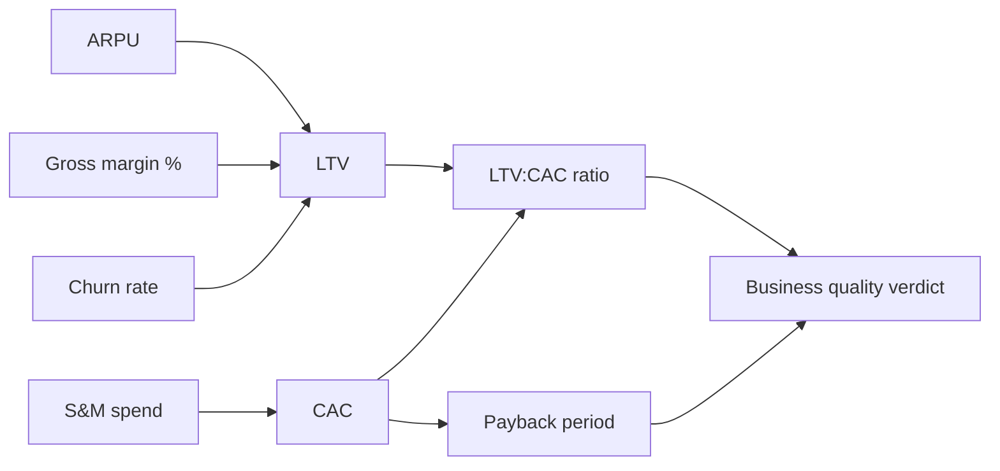


## What you'll learn
- The four numbers that define whether a SaaS business is real: CAC, LTV, payback, and retention.
- How each is computed, what "good" looks like, and the manipulations to watch for.
- How engineering investments - performance, onboarding, integrations, reliability - move each metric.
- Why the "LTV:CAC ratio" is the most-quoted and most-abused number in the industry.

## Concepts

Unit economics is the discipline of evaluating a business *one customer at a time*. The intuition: if the average customer is unprofitable, scaling the company just loses money faster. If the average customer is wildly profitable, you raise capital, pour gasoline on the fire, and grow.

For SaaS, four numbers carry almost all the weight. Most board decks revisit them every quarter.

### CAC - Customer Acquisition Cost

```text
CAC = (Total Sales & Marketing spend in period) / (New customers acquired in period)
```

Variations:

- **Blended CAC** - all S&M spend divided by all new customers (including free signups, organic conversions, paid conversions).
- **Paid CAC** - only the cost of *paid* channels divided by paid-channel conversions. Higher and more honest.
- **Fully-loaded CAC** - adds sales team comp, fully-loaded sales-engineering time, and proportional G&A. This is what a rigorous CFO will compute.

The variant matters. "Our CAC is $300" might mean blended CAC including the customer who signed up because their colleague tweeted about you. The paid CAC may be $3,000. Always ask which variant.

For B2B SaaS, common ranges by ACV (Annual Contract Value):

| ACV | Typical CAC | Common motion |
|---|---|---|
| $1k SMB | $500–$2k | PLG, self-serve, some inside sales |
| $10k mid-market | $5k–$20k | Inside sales + lighter marketing |
| $100k enterprise | $50k–$200k | Full-cycle AE, SEs, longer cycles |
| $1M+ strategic | $250k+ | Field sales, executive sponsorship |

### LTV - Lifetime Value

```text
LTV = (ARPU × Gross Margin %) / Churn Rate
```

This is the discounted-cash-flow-flavoured estimate of how much gross profit one customer will produce over their lifetime with the company. The formula assumes a steady-state world: customers pay the same ARPU (average revenue per user) forever, gross margin holds, and a fixed fraction churns each period.

The components:

- **ARPU** - annual or monthly average revenue per customer. Watch which.
- **Gross margin** - the LTV is in *gross-profit* dollars, not revenue dollars. A customer paying $10k with 80% gross margin contributes $8k gross profit per period. Some companies report "revenue LTV" without margin - that's the *most common* manipulation.
- **Churn** - fraction of customers lost per period (more in [GRR/NRR](/courses/engineers-mba/04-operating-a-software-business/01-saas-metric-tree/)). For B2B SaaS, annual logo churn of 5–7% is healthy, 7–10% is typical, 15%+ is concerning.

Quirks:

- The formula assumes infinite lifetime. For high-churn segments, this overstates LTV badly. Some teams cap "lifetime" at 3 or 5 years for honesty.
- Net-revenue retention >100% (existing customers expanding faster than others churn) makes the formula explode toward infinity. Some teams use a more conservative steady-state assumption.

### Payback period

```text
Payback period (months) = CAC / (Monthly gross profit per customer)
```

How many months until the cumulative gross profit from a customer pays back the cost of acquiring them. Easier to interpret than LTV:CAC because there's no fudge-able lifetime assumption.

For B2B SaaS:

| Payback (months) | Read |
|---|---|
| <12 | Excellent - efficient growth |
| 12–18 | Healthy growth-stage |
| 18–24 | Acceptable; watch trend |
| >24 | Capital-intensive; sustainable only with cheap capital |

A 24-month payback is the rough industry bar for venture-backed SaaS. During the 2020–2021 zero-interest-rate era, companies pushed it to 36 months in pursuit of growth. The 2022–2024 correction was largely about that number snapping back.

### Retention / churn

```text
Logo churn = (Customers lost in period) / (Customers at start of period)
Revenue churn = (Revenue lost in period from existing customers) / (Revenue at start)
```

For B2B SaaS, the more meaningful metric is *gross revenue retention* (GRR, only counting losses) and *net revenue retention* (NRR, including expansion). We cover those in [the SaaS metric tree](/courses/engineers-mba/04-operating-a-software-business/01-saas-metric-tree/). For unit economics, the key idea: low churn extends the LTV multiplier dramatically.

A customer with 90% retention has an expected lifetime of 10 years (1 / 10% churn). At 80% retention, lifetime is 5 years. At 70%, 3.3 years. Tiny shifts in retention map to massive shifts in LTV.

### Engineering levers on each metric

This is the table to internalise. Every metric here can be moved by engineering work.

| Metric | Engineering levers |
|---|---|
| CAC | Faster trial-to-paid funnel, self-serve onboarding, lower cost-per-lead via better SEO content systems, lower sales-engineering time per deal via better demo environments. |
| LTV (ARPU) | Usage-based pricing infrastructure, better upsell prompts, packaging changes, expansion features. |
| LTV (margin) | Infrastructure cost optimisation, multi-tenancy improvements, better automation reducing support load. |
| LTV (churn) | Reliability, performance, integrations, sticky data exports/imports, depth of product. |
| Payback | All of the above; faster onboarding shifts payback most directly. |

When someone in a strategy review says "we need to improve unit economics," the answer almost always rolls back to a finite list of engineering investments. The skill is mapping which one.

## Walkthrough

A worked example. SaaS company "Twilex" reports the following:

```text
ACV (annual contract value):     $24,000
Gross margin:                    75%
S&M spend last quarter:          $5M
New customers acquired:          200
Annual logo churn:               12%
```

Compute:

```text
CAC                = $5,000,000 / 200            = $25,000
Annual gross profit per customer = $24k × 75%    = $18,000
Monthly gross profit per customer                 = $1,500

Payback period     = $25,000 / $1,500            = 16.7 months
LTV                = $18,000 / 0.12              = $150,000
LTV:CAC ratio      = $150,000 / $25,000          = 6x
```

The 6x LTV:CAC and 16.7-month payback look good. But notice the levers:

- If churn improves from 12% to 8% (e.g. via reliability investments), LTV jumps to $225k. LTV:CAC becomes 9x.
- If CAC falls from $25k to $20k (e.g. via PLG-style self-serve onboarding), payback drops to 13.3 months.
- If gross margin improves from 75% to 80% (e.g. via infra optimisation), LTV becomes $160k.

Notice the asymmetry: a 4-point churn improvement moves LTV by $75k; a 5-point margin improvement moves it by only $10k. Retention is the dominant lever. Engineering work on reliability and integrations is usually higher-leverage than infra optimisation in unit-economic terms.

## How it fits together



## Common pitfalls

| Pitfall | Why it happens | Fix |
|---|---|---|
| Revenue LTV instead of gross-profit LTV | Higher number; flattering | Always compute LTV in gross-profit terms. |
| Blended CAC quoted as "CAC" | Includes free conversions, organic | Ask for paid CAC and fully-loaded CAC. |
| Ignoring CAC payback in favour of LTV:CAC | LTV depends on a fudgy "infinite lifetime" assumption | Use payback as the primary efficiency metric; LTV:CAC as a sanity check. |
| Computing LTV with NRR > 100% | Formula explodes to infinity | Cap NRR at 100% for the LTV calculation, or use a finite-horizon LTV. |
| Mixing customer cohorts | New customers and old customers have different economics | Look at cohort-level CAC payback by acquisition channel and segment. |

## Exercises

1. Take a SaaS company you know well. Estimate (or look up) their ACV, gross margin, churn, and S&M spend. Compute their CAC, LTV, payback, and LTV:CAC. Check your estimate against any disclosed unit-economic numbers in their public reporting.
2. For your own product, write down three engineering projects from the last six months and which unit-economics metric each was *intended* to move. For each, write down whether the eventual measurement confirmed the intent. Most engineers find this exercise reveals that the metric link wasn't ever measured.
3. Find a public SaaS company's investor day deck. Search for "payback" - they almost certainly disclose it. Note whether they show "blended" or "by segment" or "for new cohorts only." Each variant tells a different story about efficiency.

## Recap & next

- CAC, LTV, payback, and retention are the four numbers that define a SaaS business one customer at a time.
- Payback period is the most honest single metric - fewer fudge-able assumptions than LTV:CAC.
- Retention is the dominant lever on LTV; small improvements compound enormously.
- Every metric has direct engineering levers - reliability, onboarding speed, infra cost, integration depth.

Next, **Business model archetypes in software** - how subscription, usage-based, marketplace, and platform models shape everything downstream.

