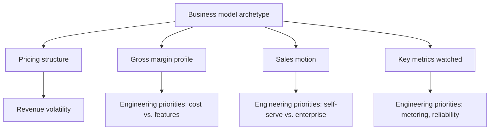


## What you'll learn
- The five major software business model archetypes - subscription, usage-based, marketplace, transactional, platform - and how each makes money.
- Why the model shapes pricing, gross margin, sales motion, and engineering priorities downstream.
- Hybrid and evolving models: when "SaaS" companies switch to usage-based, and what changes inside engineering when they do.
- How to identify which archetype a given company belongs to from public financials alone.

## Concepts

The business model is the *shape* of how a company makes money. Not the price sheet - the underlying mechanic that determines what you charge for, when revenue is recognised, and what gross margin looks like. Five archetypes cover most of software.

### 1. Subscription SaaS

The customer pays a recurring fee - monthly or annual - for ongoing access to the service. The pioneer is Salesforce (1999). The model dominates B2B software today.

**Mechanics:**
- Revenue is recurring and predictable. Annual contracts are the norm in B2B; monthly is common in SMB and consumer.
- Revenue is recognised ratably across the service period (see [accruals](/courses/engineers-mba/01-foundations-business-os/03-cash-profit-accruals/)).
- Cash often comes upfront (annual billing) → deferred revenue → negative cash conversion cycle.
- Gross margins are typically high (70–85%) because the marginal cost of an extra seat is small.

**What engineering optimises for:** reliability (churn driver), feature breadth (price-sheet expansion), multi-tenancy efficiency (margin), onboarding speed (CAC payback).

**Examples:** Atlassian, Salesforce, Workday, HubSpot, Figma, Notion.

### 2. Usage-based (consumption)

The customer pays per unit consumed - per API call, per gigabyte stored, per compute-hour. The pioneer is AWS (2006). The model has become dominant in infrastructure and developer tools.

**Mechanics:**
- Revenue scales with customer usage - uncapped on the upside but volatile on the downside.
- Often quoted as "NRR" - when usage grows in existing accounts, expansion happens automatically, no negotiation.
- Gross margins are typically lower (50–75%) because COGS scales with usage. The customer's heavy use of your service shows up directly in your AWS bill.
- Forecasting is harder. Revenue can drop suddenly if a major customer cuts usage.

**What engineering optimises for:** metering accuracy, infrastructure efficiency (every margin point matters), throughput, multi-tenant isolation under heavy load.

**Examples:** Twilio, Stripe, Cloudflare, AWS, Datadog (hybrid).

### 3. Marketplace

The platform connects two sides (buyers and sellers) and takes a "rake" or "take rate" on each transaction. The model is ancient (Sotheby's, 1744) but software marketplaces are recent.

**Mechanics:**
- Revenue is *transactional* - the platform earns a percentage on each unit of activity.
- Network effects often dominate the economics: more sellers attract more buyers, attracting more sellers.
- Take rates vary from 1% (large B2B marketplaces) to 30%+ (app stores).
- Gross margins are typically 60–80% but the unit of "gross profit" is the take, not the GMV.

**What engineering optimises for:** matching quality, trust/safety, dispute resolution, throughput on either side of the marketplace, anti-fraud, search and discovery.

**Examples:** Airbnb, Uber, Etsy, eBay, Shopify (hybrid), App Store.

### 4. Transactional (per-event)

The customer pays per discrete event - a payment processed, a message sent, an API call. Conceptually similar to usage-based but framed around *individual transactions* with externally-determined value.

**Mechanics:**
- Revenue is tied to the customer's own customer activity.
- Often a take-rate-on-volume model rather than a fixed unit price.
- Margins vary widely: payments are tightly bounded (~2–3% of transaction value, then ~50% margin on that fee); messaging is higher.
- Strong negative correlation with customer downturns - when their business slows, yours slows automatically.

**What engineering optimises for:** transaction latency, reliability, fraud detection, settlement timing, network of partner banks/carriers.

**Examples:** Stripe (per-transaction fee), Twilio (per-message), Plaid, Square.

### 5. Platform / infrastructure

The customer builds *on top of* the platform; the platform sells primitives (compute, storage, APIs) at scale. Margins compound because the platform's investment in the underlying infrastructure amortises across all customers.

**Mechanics:**
- Often combines subscription floors with usage-based overages.
- Two-sided value: the platform captures value from app developers *and* their end users (think iOS App Store).
- Gross margins range widely depending on infrastructure intensity (AWS ~30% operating margin, Cloudflare higher) but are bounded by the underlying cost of compute/storage/bandwidth.
- Strong moats from switching costs and ecosystem effects.

**What engineering optimises for:** the developer experience for the platform's API surface, throughput, observability, multi-region availability.

**Examples:** AWS, Cloudflare, GitHub, Stripe Connect, HashiCorp.

### The model shapes everything

A company's archetype determines an astonishing amount of what its engineering organisation looks like. Compare two companies of similar size:

| | Subscription SaaS | Usage-based |
|---|---|---|
| Gross margin | 80% | 60% |
| Revenue volatility | Low | High |
| S&M intensity | Higher % of revenue | Lower % (usage expansion is automatic) |
| Engineering priorities | Feature breadth, onboarding, reliability | Infra cost, metering, throughput |
| Sales motion | Annual contracts, multi-year | Often signup-and-go, with enterprise overlay |
| KPI obsession | NRR, gross margin, payback | Consumption velocity, NDR, cost per unit |

A subscription SaaS company that wants to reposition as usage-based - common during 2022–2024 - has to rebuild its metering infrastructure, change its pricing page, restructure its sales comp, and retrain its CFO. None of this is reversible cheaply.

### Hybrid models

Most real companies are hybrids. Datadog charges a subscription floor *plus* usage. Snowflake is pure usage-based. Stripe is transactional with usage-based overlays. The mix matters because each component has different gross margin, different forecastability, and different sales motion.

The most common hybrid in 2025 is "subscription + consumption commit": the customer agrees to a minimum annual spend (commit), and overages bill per-use. This combines the predictability of subscription with the upside of usage-based growth. Confluent, MongoDB-style cloud providers, and Cloudflare Workers all use variants of this.

## Walkthrough

A diagnostic exercise. Two anonymised public SaaS companies report similar revenue and similar growth:

```text
Company X:
  Revenue                   $500M
  Gross margin               78%
  S&M / revenue              42%
  NRR                        108%
  Free cash flow margin      15%

Company Y:
  Revenue                   $480M
  Gross margin               63%
  S&M / revenue              25%
  NRR                        125%
  Free cash flow margin      8%
```

Which model is each? Let's reason:

- **Company X** has 78% gross margin (subscription range), 42% S&M (heavy sales motion), 108% NRR (some expansion but mostly retention). This is subscription SaaS with an enterprise motion - Salesforce-flavoured.
- **Company Y** has 63% gross margin (usage-based range), 25% S&M (lower because expansion is automatic), 125% NRR (massive expansion). This is usage-based - Snowflake-flavoured.

The model can be inferred from the ratios alone. You don't even need the product description.

## How it fits together



## Common pitfalls

| Pitfall | Why it happens | Fix |
|---|---|---|
| Treating "SaaS" as one thing | "SaaS" covers subscription, usage-based, and hybrids | Identify the underlying archetype by looking at pricing page and gross margin. |
| Comparing companies across archetypes | Different metrics apply | Benchmark within archetype (subscription vs subscription, usage vs usage). |
| Assuming usage-based is "always better because NRR is high" | NRR > 100% can mask volatility | Look at the *distribution* of customer usage growth, not just the average. |
| Underestimating the cost of model transitions | Pricing/comp/billing changes are deep | Treat a model transition like a re-platforming - measured in years. |
| Conflating model with strategy | Same model can support many strategies | Two subscription SaaS can differ enormously in target market, channel, and product. |

## Exercises

1. Take three companies you know well. For each, identify the dominant model archetype, the secondary/hybrid component, and the gross margin you'd expect. Then look up the actual gross margin. Note any surprises.
2. For your own company, look at the pricing page. Classify the model. Note whether the gross margin matches the archetype expectation. If it doesn't, find out why (often: one product line is a different model than the others).
3. Imagine the company you work for switched from subscription to usage-based tomorrow. Write down three things that would change inside engineering. Then three things in sales. Then three in finance. This will give you intuition for why these transitions take years.

## Recap & next

- Five archetypes - subscription, usage-based, marketplace, transactional, platform - cover most software. Each has a distinct gross margin profile and engineering priority set.
- The model shapes pricing, sales motion, KPIs, and engineering priorities. It's not just a billing decision.
- Hybrids dominate in practice; subscription + consumption commit is the modern default.
- You can usually identify a model from the financial ratios alone.

Next, **Industry structure: Porter's Five Forces, applied to tech** - kicking off Module 2 with the most-used strategy framework.

