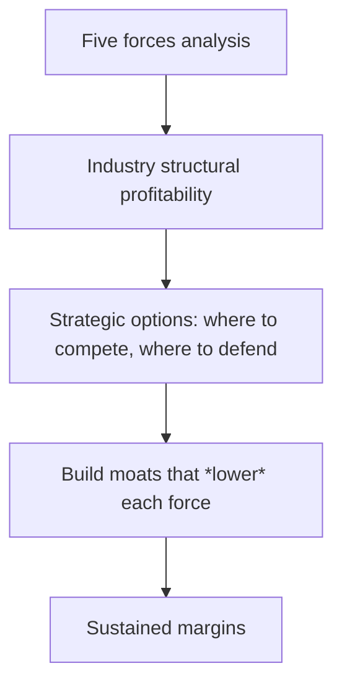


## What you'll learn
- The five forces - buyer power, supplier power, new entrants, substitutes, rivalry - and what each one diagnoses.
- How to apply the framework to a software company you know.
- Why "the industry" you're competing in often isn't the one stated on the marketing page.
- The limits of the framework - what it misses, and when to use complementary models.

## Concepts

Michael Porter introduced the Five Forces in 1979 as a way to diagnose the *structural profitability* of an industry. The idea: industry economics aren't accidents. They're set by five forces that determine how much of the value created flows to firms in the industry versus to customers, suppliers, or competitors.

The diagnostic question is: *why do firms in industry X make (or fail to make) money?* The answer comes from analysing each force.

```text
                    [ Threat of new entrants ]
                              ↓
   [ Supplier power ] → [ Industry rivalry ] ← [ Buyer power ]
                              ↑
                    [ Threat of substitutes ]
```

### 1. Buyer power

How much leverage do customers have over price and terms?

- **High** when buyers are concentrated (a few enterprise customers dominate revenue), when switching costs are low, when products are commoditised, when buyers can credibly threaten to build it themselves.
- **Low** when there are many fragmented buyers, when switching costs are high, when the product is mission-critical and small in cost terms ("budget dust"), when buyers can't realistically build alternatives.

Engineering signal: if your team gets pulled into Q3 RFPs from a single customer worth 20% of ARR, you're feeling high buyer power.

### 2. Supplier power

How much leverage do *your* inputs have over you?

- **High** when key inputs are concentrated (e.g. NVIDIA GPUs for AI), when supplier substitution is hard (a custom chip, a specific OS, a proprietary protocol), when suppliers can integrate forward (AWS competing with its customers via AWS-branded services).
- **Low** when inputs are commoditised, when you have multiple supplier options, when you're a large enough customer that the supplier needs you more than you need them.

Engineering signal: the constant "should we go multi-cloud?" debate is a supplier-power conversation. So is every public conversation about AI startups' dependence on NVIDIA.

### 3. Threat of new entrants

How easy is it for new players to come in and erode profits?

- **High** when capital requirements are low, when expertise is widely available, when distribution is easy (the cloud, app stores, open source), when there are no regulatory barriers.
- **Low** when capital is huge (chip fabs), when regulation is significant (banking, healthcare), when distribution is locked up by incumbents, when network effects favour incumbents.

The general trend in software has been *lower* barriers to entry - open source, cloud, low-code. The pushback has been the rise of *capital-intensive* AI training, which has reintroduced a capital moat for foundation models.

### 4. Threat of substitutes

Can the customer's job get done a fundamentally different way?

- **High** when alternative ways exist to satisfy the customer's job-to-be-done. Email replaced postal mail; Slack replaced internal email; LLMs are replacing certain SaaS analytics workflows.
- **Low** when the product addresses a job uniquely.

This force is the easiest to underestimate because substitutes often come from outside the industry's mental model. Kodak didn't lose to better film - they lost to phones.

### 5. Industry rivalry

How aggressively do current competitors fight?

- **High** when there are many competitors of similar size, when product differentiation is low, when exit barriers are high (e.g. heavy investment in industry-specific assets), when industry growth is slow.
- **Low** when there are few competitors, when differentiation is strong, when industry growth is fast (everyone can grow without taking share).

A market with a single strong incumbent often has low rivalry - and the incumbent captures most of the value.

### Putting it together

For each force, you grade *high*, *medium*, or *low*. A consistently *low* force profile means the industry is structurally profitable - firms in it tend to make money. A consistently *high* profile means margins are thin and most participants struggle.

For software, the canonical "good" Porter profile looks like:

| Force | Typical SaaS profile |
|---|---|
| Buyer power | Medium-low (many buyers, but enterprise concentration in segments) |
| Supplier power | Low-medium (cloud commodity, but possible GPU dependence) |
| Threat of new entrants | Medium-high (low capital, but trust takes time) |
| Threat of substitutes | Variable by category |
| Rivalry | High in commoditised categories, low in defended ones |

The good news for SaaS: the structural margins are decent. The bad news: low entry barriers + high rivalry in commoditised categories means margin pressure constantly.

### Defining the industry

The most common Porter mistake is to draw the industry boundary wrong. "We're in the CRM industry" is too broad if you're a vertical CRM for dentists; you face different forces from a horizontal player. The boundary is the set of substitutes the customer treats as interchangeable.

Get the boundary wrong and the five-force analysis tells you nothing useful. Get it right and the framework becomes a strategic compass.

## Walkthrough

Let's apply it to three companies engineers know.

### Stripe (payments)

| Force | Grade | Why |
|---|---|---|
| Buyer power | Medium-low | Many small merchants (low individual leverage); some enterprise concentration |
| Supplier power | Medium-high | Card networks (Visa/Mastercard) take a fixed cut; payment processors don't set interchange |
| New entrants | Medium | Regulatory compliance is a moat; capital required is moderate |
| Substitutes | Medium | Bank transfers, crypto, BNPL all peripherally compete |
| Rivalry | Medium-high | Adyen, Block, PayPal, regional players all fight for the same merchants |

Stripe earns money but the structural caps are clear: the card networks always take their cut, and competition keeps merchant fees compressed.

### Datadog (observability)

| Force | Grade | Why |
|---|---|---|
| Buyer power | Medium | Enterprise customers can threaten DIY (Prometheus, Grafana) |
| Supplier power | Low | Cloud is commoditised; Datadog runs across all of them |
| New entrants | High | Low capital, well-known patterns, open-source baseline (Prometheus) |
| Substitutes | High | OSS observability stacks are credible substitutes |
| Rivalry | High | New Relic, Dynatrace, Splunk, and many newer entrants compete fiercely |

Datadog is profitable but constantly under pressure. Their answer has been *product breadth*: become the platform of record so the customer can't credibly multi-vendor. The current rivalry profile explains why they keep launching adjacent products.

### Cloudflare (edge networking)

| Force | Grade | Why |
|---|---|---|
| Buyer power | Low-medium | Many small customers; large enterprises can multi-vendor with Akamai/Fastly |
| Supplier power | Low | Operates own network; not dependent on cloud providers |
| New entrants | Low | Operating a global edge network is capital-intensive |
| Substitutes | Medium | DIY proxies and CDN-as-a-service from clouds |
| Rivalry | Medium | Akamai, Fastly are credible but smaller competitors |

Cloudflare's Porter profile is structurally stronger than Datadog's. The capital requirements of running a real global edge network create a barrier most software businesses don't have.

The three companies illustrate that *being in software* tells you almost nothing - the industry structure within software varies dramatically.

## How it fits together



## Common pitfalls

| Pitfall | Why it happens | Fix |
|---|---|---|
| Drawing the industry boundary too broadly | "We're in B2B SaaS" | Pin down the set of substitutes for *this* customer's job. |
| Ignoring substitutes outside the industry | Easy to miss adjacent threats | LLMs, in-house builds, and behavioural changes all count. |
| Treating the framework as static | Industry structure changes | Re-run the analysis when conditions shift (new tech, regulation, capital availability). |
| Confusing competitive *position* with industry *structure* | These are separate questions | Porter Five Forces analyses the industry; competitive position is the next layer. |
| Skipping the framework for "intuition" | "We know our market" | Forcing the analysis exposes assumptions; intuition hides them. |

## Exercises

1. Pick your own company. Draw its Five Forces table. Grade each force as low/medium/high with one sentence of rationale. Now look at the company's last quarterly disclosure - does the strategy narrative match what your analysis predicts the constraints would be?
2. Repeat for an adjacent product in your company's portfolio. Note where the forces differ between the two products. Often the company is competing in *two distinct industries* with shared engineering - but the strategy should differ.
3. Find a company whose Porter profile got worse over the last 3 years (often: a force shifted from low to high). Examples: media (substitutes from streaming), retail (rivalry from Amazon). Write one paragraph on what the company did or should have done in response.

## Recap & next

- Five forces - buyer power, supplier power, new entrants, substitutes, rivalry - diagnose industry-level profitability.
- The framework's value is the *forced* analysis of each force; intuition skips over forces silently.
- Software has highly varied Porter profiles; "being in SaaS" doesn't tell you much about structural margins.
- Industry boundary definition is the make-or-break input; spend time on it.

Next, **Competitive advantage & moats** - once you've placed yourself in an industry, how do you build advantage that the five forces don't grind down?

