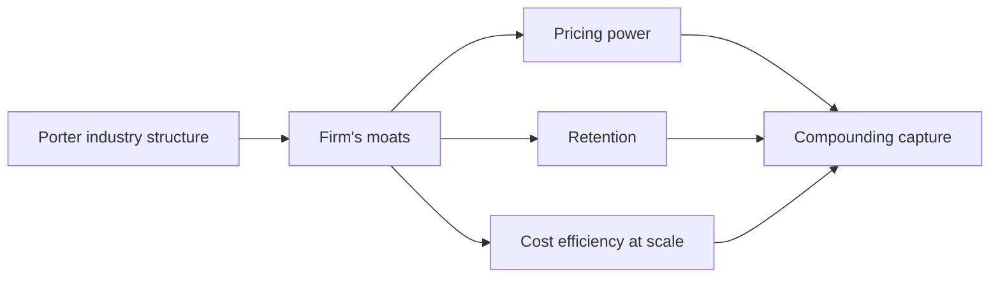


## What you'll learn
- The five canonical moat types: network effects, switching costs, scale economies, data/learning, brand.
- Which moats compound over time and which erode.
- How to identify what kind of moat (if any) your employer has.
- Why "great engineering" is necessary but not sufficient as a moat.

## Concepts

A *moat* is a structural reason it's hard for competitors to take your customers. Without a moat, every dollar of profit is an invitation for someone to undercut you. Warren Buffett popularised the term; Hamilton Helmer's [*7 Powers*](https://www.amazon.com/7-Powers-Foundations-Business-Strategy/dp/0998116319) is the modern canonical treatment.

Five moat types cover most of the cases that matter in software.

### 1. Network effects

Each new user makes the product more valuable for existing users. Adding a buyer makes a marketplace more useful to sellers. Adding a developer to a platform makes the platform more useful to users.

**Subtypes:**
- **Direct (same-side)** - users benefit from other users on the same side. Phone networks, messaging apps.
- **Indirect (cross-side)** - users on one side benefit from users on the other. Marketplaces, app stores, payment networks.
- **Data network effects** - more users generate more data, which improves the product for everyone (Waze, recommendation systems).

**Why this moat compounds**: every new user makes leaving harder for existing users. Slack's value to your team grows with each new colleague added.

**Why it can erode**: multi-homing (users participating on multiple networks at once), unbundling by category, regulator-mandated interoperability.

**Engineering work that builds it**: features that increase user interconnection (mentions, threads, shared workspaces), API surface that brings in third-party apps and developers, integrations that turn one-sided users into network participants.

### 2. Switching costs

The cost - in time, money, training, or risk - of moving to a competitor. Customers stay because leaving is expensive even when the destination is better.

**Subtypes:**
- **Data lock-in** - proprietary formats, accumulated data, complex migrations.
- **Integration lock-in** - dependencies woven through the customer's systems.
- **Workflow lock-in** - operating procedures and trained users built around your product.
- **Contractual lock-in** - multi-year contracts, prepayment, penalties.

**Why this moat compounds**: every additional integration, every additional user trained, every additional year of accumulated data increases the switching cost.

**Why it can erode**: open standards, data portability regulations, competitor-provided migration tooling. (Modern SaaS contracts often include cap on switching costs as an enterprise procurement requirement.)

**Engineering work that builds it**: deep API integrations, importers that aren't matched by exporters, accumulated configuration, native ecosystem features. The pejorative term "vendor lock-in" is just switching costs viewed from the customer's perspective.

### 3. Scale economies

Unit cost falls as scale grows. Fixed costs get amortised across more customers; bargaining power with suppliers grows; learning curve drops costs.

**Subtypes:**
- **Cost-side scale** - infrastructure, R&D, S&M efficiencies (e.g. AWS's per-unit cost of compute drops with volume).
- **Demand-side scale** - same as network effects; the demand side benefits.

**Why this moat compounds**: a 10x advantage in cost means competitors either operate at a loss or can't reach your customers profitably.

**Why it can erode**: technology shifts that reset the scale curve (cloud democratised access to global infrastructure; smaller players got AWS's scale on demand). Saturation - past some size, scale efficiencies plateau.

**Engineering work that builds it**: multi-tenancy architecture (the per-customer marginal cost gets very low), infrastructure efficiency (lower COGS per request), automation that reduces support cost per customer, R&D leverage (one feature serves all customers).

### 4. Data and learning advantages

The product gets better with use, and use is hard for competitors to replicate.

**Subtypes:**
- **Learning curve** - your team gets better at solving the customer's problem faster than competitors can.
- **Process power** - internal practices that produce superior products. Toyota's manufacturing system is the textbook example; in software, Amazon's Working Backwards process is often cited.
- **Counter-positioning** - your business model is structurally incompatible with the competitor's, so they can't copy it without harming their existing business.

**Why this moat compounds**: only the operator with the data advantage benefits from improvements; competitors stay where they were.

**Why it can erode**: data leakage (employees move, vendors disclose), commoditisation of the underlying technology (LLMs are commoditising many data advantages), regulatory data-sharing requirements.

**Engineering work that builds it**: telemetry, experimentation infrastructure, ML systems that compound on user data, internal tooling that makes the team faster.

### 5. Brand

Customers prefer the product because of trust, recognition, or status. Engineers underestimate this moat because it doesn't compile.

**Why this moat compounds**: every successful interaction reinforces the brand; trust is an asset that's slow to build and slow to lose.

**Why it can erode**: a single security incident, a single high-profile outage, a public misstep. Brand decay is non-linear - slow on the upside, fast on the downside.

**Engineering work that builds it**: reliability (the most underrated brand asset in B2B), security posture, transparency in incidents, public status pages. SLAs aren't just legal documents - they're brand commitments.

### Moats vs. operational excellence

A common misreading: "We have an engineering culture of excellence - that's our moat." It usually isn't. Operational excellence keeps you competitive; it rarely creates structural advantage. Competitors can hire your engineers, copy your patterns, and adopt your tools. A moat is a structural reason it's *hard* to compete with you. Engineering excellence is a force multiplier - but if it disappeared tomorrow, the moat would remain.

The corollary: the engineering work that *builds* moats is often less glamorous than the engineering work that produces excellence. Integration depth and reliability investments outlast benchmark-winning architectures.

### How moats interact with Porter

If [Porter Five Forces](./01-porters-five-forces.md) tells you the structural profitability of an industry, moats tell you whether your *firm* will sit above or below the industry average. A firm with multiple moats in a structurally attractive industry compounds - Visa, ASML, Stripe. A firm with no moat in a structurally unattractive industry is a slow death.

## Walkthrough

A diagnostic exercise. For each company below, name the dominant moat:

| Company | Moat | Reasoning |
|---|---|---|
| Visa | Network effect | Card-accepting merchants and cardholders reinforce each other; new entrants can't bootstrap either side |
| Salesforce | Switching costs | Multi-year customisation, integrated workflows, trained users |
| AWS | Scale economies | Massive infrastructure spread across all customers; reinvested R&D from years of compounding |
| Atlassian | Switching costs (Jira workflows, accumulated tickets, integrations) | Companies build operating procedures around Jira; hard to migrate |
| HashiCorp Vault | Switching costs (secrets baked into operational workflows) | Secrets engines and policies accumulate across teams |
| Cloudflare | Scale economies (global network) | Few competitors can fund their own global edge network |
| Figma | Network effects (collaboration) + switching costs (design files) | The collaboration loop pulls more designers in; design libraries trap them |

Note that most successful software companies have multiple moats. Salesforce has switching costs (workflows), brand (the CRM standard), and increasingly platform/network effects (AppExchange). Compounding moats are the most durable.

### Reading a moat from the financials

A real moat shows up in the financial statements. Look for:

| Signal | What it says |
|---|---|
| Stable or rising gross margins year-over-year | Pricing power; competitors can't undercut |
| NRR consistently >110% | Existing customers expand; switching cost or value-from-use is high |
| Low logo churn (<7% annual) | Switching costs are real, or the product is indispensable |
| Operating margin expansion at scale | Scale economies are real |
| Low S&M as % of revenue with strong growth | Brand, word-of-mouth, or network effect is funding growth |

A "moat" claim without these financial fingerprints is usually marketing language.

## How it fits together

## Common pitfalls

| Pitfall | Why it happens | Fix |
|---|---|---|
| Calling features "moats" | Features can be copied | A moat must be hard to copy structurally, not just hard to copy this quarter. |
| Treating brand as engineering's problem | Brand seems like marketing | Reliability, security, transparency build brand; engineers own them. |
| Ignoring multi-homing | Network effects assumed to be absolute | Many "network" products in software let users participate in multiple networks; weakens the moat. |
| Confusing operational excellence with moat | Excellence is necessary but rarely structural | Ask: if a competitor with $1B could replicate your engineering, would they catch up? |
| Believing scale always wins | Tech shifts can reset scale | The cloud reset many traditional scale moats. |

## Exercises

1. List the moats your employer claims, then check each against the financial signals above. Note any that show up in marketing but not in the financials.
2. Identify a moat that *eroded* over the last decade. Examples: print media's distribution scale, Microsoft's Office network-effect (now multi-home with Google Docs), Intel's process-tech learning curve. Write a paragraph on what reset the moat.
3. For your own team's roadmap, classify each major project as "builds moat", "operational excellence", or "table stakes." Most teams will find that very little of the roadmap explicitly builds moat. This is the conversation worth having with leadership.

## Recap & next

- Five moat types - network effects, switching costs, scale economies, data/learning, brand - cover almost all software cases.
- Real moats show up in the financials: stable margins, high NRR, low churn, S&M efficiency.
- Engineering excellence is necessary but rarely a moat; structural advantage usually comes from systems and decisions, not from execution speed.
- Compounding moats - multiple types reinforcing each other - are the most durable.

Next, **Disruption theory and the innovator's dilemma** - why the strongest companies with the best moats still get blindsided.

