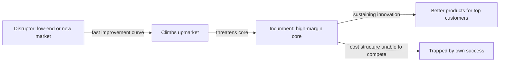


## What you'll learn
- Christensen's distinction between *sustaining* and *disruptive* innovation, and why most innovation is sustaining.
- The Jobs-to-be-Done lens and why "the customer hires the product" is a useful reframe.
- Two flavours of disruption - *low-end* and *new-market* - and how to recognise each.
- Why rational, well-run incumbents predictably lose to disruptors, and the structural limits of the theory.

## Concepts

Clayton Christensen's [*The Innovator's Dilemma*](https://www.amazon.com/Innovators-Dilemma-Revolutionary-Change-Business/dp/0062060244) is the most-cited business book engineers actually read. It explains a specific puzzle: why do *well-managed* companies - companies doing everything textbooks say to do - get crushed by entrants offering worse products? The disk-drive industry was Christensen's original case; software is full of replays.

### Sustaining vs. disruptive innovation

**Sustaining innovation** makes the existing product *better along the dimensions the existing customers value*. It's the bulk of innovation in any industry. Incumbents are very good at sustaining innovation because their organisations, customers, and processes are optimised around it.

**Disruptive innovation** changes the dimensions of competition. It's typically *worse* on the dimensions existing customers care about (performance, features, scale) but *better* on dimensions those customers don't yet value enough to pay for (price, simplicity, accessibility).

The trap: when a disruptor enters, the incumbent rationally dismisses it. The product is worse on every metric the incumbent measures. Existing customers don't want it. The disruptor's margins look terrible. By the time the disruptor's product is good enough that the incumbent's customers start defecting, it's too late.

Software examples:

| Disruptor | Disrupted | Initially worse at | But eventually better at |
|---|---|---|---|
| Linux | Solaris/AIX | Performance, support quality | Cost, accessibility, ecosystem |
| Salesforce | Siebel | Customisation, on-prem control | Cost, deployment speed, accessibility |
| Slack | Email, IRC | Search, archive durability | Real-time UX, threading, ecosystem |
| Figma | Sketch / Adobe | Single-user power features | Multi-user collaboration |
| Notion | Confluence + databases | Performance, formality | Flexibility, ease of use |

In each case, the disruptor's product was visibly worse for the incumbent's top customers. The disruptor served *non-consumers* or low-end customers the incumbent didn't fight for. Then the disruptor improved fast enough to climb upmarket - and the incumbent's customers started defecting.

### Why incumbents predictably lose

Christensen's deepest insight is that incumbents fail *rationally*. The asymmetry isn't about smart vs. dumb companies.

1. **Resource allocation favours the highest-margin opportunities**. The disruptor's market is small and low-margin; the incumbent's resource-allocation process correctly rejects it.
2. **Customer feedback is biased toward sustaining innovation**. Existing customers want what they have, only better. They don't ask for a product that ignores their priorities.
3. **Cost structure rules out competing on price**. Once the incumbent has high-margin enterprise customers, restructuring for a lower-margin business is organisationally impossible.
4. **Disruptors improve faster than the incumbent's customers' needs grow**. The disruptor's "worse" product eventually becomes "good enough" for the incumbent's customers.

When the incumbent finally responds, it's typically by:
- Trying to embed disruption into its existing business model (fails because the cost structure is wrong)
- Acquiring the disruptor (works only if the acquired entity is left alone)
- Building a separate business unit (rarely works because corporate processes leak in)

### Jobs-to-be-Done

A complementary lens, also from Christensen. Customers don't buy products for their attributes - they *hire* products to do a *job*. The job is consistent over time; the products that do it change.

Classic example: the milkshake job. McDonald's discovered that morning milkshakes weren't competing with other milkshakes - they were competing with bagels, bananas, and coffee for the "I need something to occupy a long commute and tide me over until lunch" job. Once you see the job, you redesign the product around it.

For software: a B2B team isn't really "buying project-management software." They're hiring a tool to do the job of "keep multiple stakeholders aligned without me having to chase them." Slack, email, Notion, a Google Doc, and Jira are all candidates. The category your competitor is in may not be the category the *customer* sees you in.

### Low-end vs. new-market disruption

Two distinct types:

**Low-end disruption** - the disruptor enters at the bottom of the existing market, offering a cheaper, simpler product to customers the incumbent over-serves. Toyota's entry into the US auto market began here.

**New-market disruption** - the disruptor brings the product to non-consumers, growing a market that didn't exist. Personal computers vs. mainframes; Squarespace vs. handwritten letters to a web designer.

The two have different implications. Low-end disruption threatens the incumbent's existing revenue. New-market disruption grows the pie and pulls customers from non-consumption. Both can eventually climb upmarket and threaten the incumbent's core.

### Limits of the theory

Disruption theory is descriptive in retrospect and often wrong predictively. The Apple iPhone, often called "disruptive," was actually a high-end sustaining innovation in a new category - entered from the top, not the bottom. Many "disruptors" don't disrupt. Many incumbents survive disruption (Microsoft survived multiple cycles).

Practical use: the theory is a *lens* for thinking about which threats to take seriously. It correctly flags the under-noticed entrant. It doesn't tell you which entrant will win.

## Walkthrough

A worked diagnostic: identify disruption signals in your industry.

For a B2B SaaS observability company (say, Datadog), the questions to ask:

1. **Is there a low-cost entrant serving customers we're ignoring?** *Yes* - Prometheus + Grafana stack serves cost-conscious teams Datadog over-serves.
2. **Is the cheap entrant's product improving faster than our customers' needs?** *Maybe* - managed Prometheus (e.g. Grafana Cloud) is closing the operational-cost gap.
3. **Is our cost structure compatible with competing on price?** *No* - Datadog's per-host pricing depends on enterprise-margin economics.
4. **Are there new-category entrants serving non-consumers?** *Yes* - AI-native observability and unified developer-experience tools target teams that previously couldn't afford full observability.
5. **What's our response?** Datadog has answered with product breadth (Module 2 Chapter 1's note on rivalry) and acquisitions, plus moves into adjacencies the disruptors don't yet serve.

This kind of analysis won't predict the winner. It will help you spot the threats that look small now and matter later. The same exercise is worth running on every major product line in your company.

## How it fits together

## Common pitfalls

| Pitfall | Why it happens | Fix |
|---|---|---|
| Calling any new entrant "disruptive" | The word is overused | A new entrant that competes on the *same* dimensions is sustaining, not disrupting. |
| Predicting which disruptor will win | Theory is descriptive, not predictive | Use it to identify *threats worth watching*, not to pick winners. |
| Dismissing disruptors because of margin or scale | That's exactly the trap | Track the rate of improvement, not the absolute starting point. |
| Building a separate business unit and integrating it | Corporate gravity pulls it back | If you spin up an internal disruptor, give it real autonomy or it dies. |
| Confusing JTBD with personas | Different mental models | JTBD is about the *job*; personas are about the *person*. Customers can have multiple jobs. |

## Exercises

1. Identify a disruptor in your own product's category. Note where it's "worse" today and where it's improving fastest. Estimate the rate of improvement vs. the rate at which your customers' needs grow.
2. Pick a famous "disrupted" incumbent (Blockbuster, Kodak, BlackBerry, Sun Microsystems). Re-read its strategic mistakes through Christensen's lens - what would have been the rational disruptor response? Note that almost none of them tried it.
3. For your team's roadmap, classify each project as *sustaining* (better for existing customers) or *disruptive* (worse on current dimensions, better on new ones). Most engineering teams will find ~95% of their work is sustaining. That's normal - but worth knowing.

## Recap & next

- Sustaining innovation improves the product on existing dimensions; disruptive innovation changes the dimensions.
- Incumbents lose to disruptors *rationally* - their cost structure, customer feedback, and resource allocation all push them away from the disruptor's market.
- Jobs-to-be-Done is a complementary lens: customers hire products for jobs, not for features.
- Disruption theory is more useful as a watch-list filter than as a predictor.

Next, **Build / Buy / Partner - the strategic version** - when to acquire, when to integrate, when to build, with worked M&A examples.

