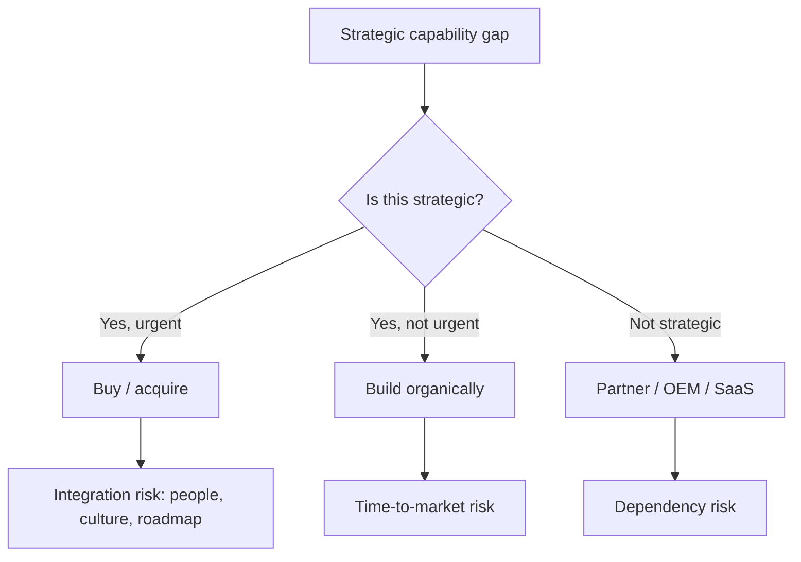


## What you'll learn
- The three strategic rationales for M&A: capability, market, and time-to-market.
- How to assess integration risk and culture fit honestly before approving an acquisition.
- When partnerships are the right answer instead of acquisition or build.
- Why most engineering "build vs. buy" debates ignore the strategic version of the question.

## Concepts

Engineers think of "build vs. buy" as a vendor decision - should we adopt a SaaS tool or write our own? The strategic version is the same question one level up: when a company needs a new capability or market, does it *build* it organically, *buy* a company that has it, or *partner* with someone who does?

The answer depends on three dimensions: how strategic is the capability, how scarce is the talent, and how compressed is the timeline. Get any of these wrong and you spend years and hundreds of millions.

### Why companies acquire

Three primary rationales:

**1. Capability acquisition.** The acquirer wants a technology, talent pool, or product the target has built. The classic case is "acqui-hire" - buying a struggling startup for its engineers. The strategic version: buying a company because it built something the acquirer can't reasonably replicate in a useful timeframe.

Examples: Microsoft acquiring GitHub (2018, $7.5B) for the developer community and developer tools market presence. Atlassian acquiring Trello (2017, $425M) for a consumer-grade product the enterprise-focused Atlassian had no DNA to build.

**2. Market access.** The acquirer wants to enter a new market - geographic, customer segment, or industry - and the target is established there.

Examples: Stripe acquiring Paystack (2020) for African market entry. Salesforce acquiring Slack (2021, $27.7B) to enter the collaboration market and reach end-user buyers Salesforce doesn't typically sell to.

**3. Time-to-market.** The acquirer could build the thing but the time to do so exceeds the strategic window. Buying is faster than building.

Examples: Facebook acquiring Instagram (2012, $1B) - Facebook had the engineering to build a photo app but couldn't bootstrap the network effect. Cisco's serial acquisitions of networking startups throughout the 2000s - each "build vs buy" answered in favour of buy because the technology window was closing.

A fourth, less honourable rationale exists: **defensive acquisition** - buying a competitor to prevent it from threatening you. Sometimes legitimate, sometimes regulator-flagged. Facebook's WhatsApp acquisition (2014, $19B) had elements of all four rationales.

### Integration risk

This is where most acquisitions fail. The acquired company's value usually depends on people, culture, and momentum - all of which acquisitions tend to break.

| Risk | What goes wrong | Mitigation |
|---|---|---|
| Key-person flight | Founders leave after earn-outs | Long earn-outs, equity retention, autonomy preservation |
| Culture clash | Acquired team rejects acquirer's processes | Maintain separate operations longer than feels comfortable |
| Roadmap disruption | Acquirer reprioritises the target's product | Lock down a 12-month roadmap as part of the deal |
| Customer attrition | Acquired customers worry about being deprecated | Strong public commitments; rapid product investment signals |
| Technical debt accumulation | Migrations and re-platforming take years | Budget realistically; expect 2-3x the initial estimate |

McKinsey research and post-mortems on hundreds of deals converge on a depressing baseline: most acquisitions don't create value for the acquirer. The successful ones share a few traits - clear strategic rationale, preserved autonomy, retained leadership, and a board-level integration discipline.

### Build vs. buy: the strategic question

The strategic build vs. buy question is *not* "what's cheaper?" It's "what's the cost of being late?"

Build cost = $X engineering investment + ($X × n quarters delay) × opportunity cost.

Buy cost = Acquisition price + integration cost + integration risk × probability of failure.

For a non-strategic capability, build is often correct. For a strategically critical capability with a closing window, buy is often correct. The fatal misreading is to estimate build cost as just the engineering work, ignoring time-to-market and opportunity cost.

Engineers reflexively favour build. Their value system (technical purity, autonomy, control) and incentive structure (visible work, technical reputation) both point that way. Sometimes the build is right; sometimes the team needs a senior counterweight reminding them that *not building* is also an option.

### Partnership as a third option

A partnership splits the difference: the company gets the capability without owning it. Common forms:

- **OEM / white-label** - embed the partner's product into yours, sometimes with cobranding.
- **Reseller** - sell the partner's product through your sales motion.
- **Strategic integration** - deep API integration, joint product development, shared customers.
- **Marketplace listing** - partner's product available through your platform.

When partnerships make sense:

- The capability is non-strategic, but customers want it.
- The capability would distract engineering from core work.
- Multiple partners can serve the same need (avoiding lock-in).
- The cost of acquisition is high relative to the strategic value.

When partnerships go wrong:

- Strategic conflicts emerge (the partner becomes a competitor).
- Joint customers blame both parties for issues.
- The partnership becomes "table stakes" and the partner extracts rent.
- Integration debt accumulates and no one wants to own it.

Stripe's relationships with banks and card networks are partnership-heavy. AWS's relationships with the consulting partners (Accenture, Deloitte) are partnership-heavy. Most successful platforms operate on a mix of build and partner.

### A worked decision

You're a CTO. Customer demand is rising for an AI feature inside your B2B product. Three options:

```text
Build internally (12 months, $5M):
- Strategic control
- Aligned with existing stack
- 12-month delay before customers see anything

Acquire AI startup (close in 3 months, $50M):
- Immediate capability
- Risk of integration failure
- Talent retention risk

Partner with foundation-model provider (deploy in 2 months, $300k/year):
- Fastest to market
- No long-term moat
- Partner pricing risk
```

The right answer depends on:

- Strategic importance: if this becomes the company's defining capability, build or buy.
- Timeline pressure: if the market is moving in months, partner first, then build/buy in parallel.
- Cash position: $50M acquisitions look very different at $200M ARR vs $20M ARR.
- Existing AI talent: if you can't hire, partner; if you can, build.

In practice, many companies execute all three sequentially: partner now to unblock customers, build a thin layer to test commitment, buy if it becomes strategically central.

## Walkthrough

Two real examples, contrasted.

### Stripe acquiring Paystack (2020)

**Rationale:** Market access. Stripe wanted Africa; Paystack was the leading payments processor in Nigeria with a strong product.

**Integration approach:** Preserved Paystack's brand, leadership, and product autonomy. Paystack still operates under its own name, with its own leadership, on its own stack.

**Outcome:** Considered a strong acquisition. Paystack's footprint grew; Stripe entered Africa without building it internally; the brand still has trust in market. The structural choice was: market entry capability > brand consolidation.

### Atlassian acquiring Trello (2017, $425M)

**Rationale:** Capability and customer base. Trello had a beloved consumer-grade kanban product with a self-serve, freemium motion. Atlassian wanted to expand from enterprise project management down into smaller teams and individual users.

**Integration approach:** Preserved Trello as a separate product with its own product team. The "Atlassian Trello" rebrand happened but the product retained its identity. Trello continues to operate alongside Jira, with overlap but not consolidation.

**Outcome:** Cited as a successful acquisition. The cultural and product autonomy preservation has been credited as the reason - Atlassian resisted the temptation to fold Trello into Jira. The lesson: when you acquire a culture-driven product, the value depends on letting the culture continue.

Both cases share a common factor: the acquirer didn't try to absorb the target. The opposite pattern - try to "integrate fully" - usually destroys value. Marissa Mayer's Yahoo era acquisitions (Tumblr, Polyvore, dozens more) are the canonical anti-examples.

## How it fits together



## Common pitfalls

| Pitfall | Why it happens | Fix |
|---|---|---|
| Estimating build cost as just engineering work | Engineers count salaries, not opportunity cost | Include time-to-market lost revenue and opportunity cost. |
| Acquiring and immediately integrating | "We bought it; let's optimise" | Preserve autonomy for 12–24 months minimum; resist the urge. |
| Treating partnerships as table stakes | Partner becomes critical, then expensive | Build a "what if this partner doubles their price?" contingency. |
| Acquihiring for technology | Talent flees in 18 months | Buy the company; preserve the team; build retention into the deal. |
| Letting engineering dominate the framing | "We could build this" doesn't address strategic timing | Force the question: "if we don't ship by X, what's lost?" |

## Exercises

1. List the last three acquisitions your company made (or major OSS dependencies adopted). For each, identify which of the three rationales (capability, market, time-to-market) was operative. Then evaluate the integration outcome.
2. Pick a recent failed acquisition in tech (e.g. Slack into Salesforce so far, or Yahoo into anything). Read coverage and identify which integration risk dominated.
3. For your team's next "build vs. buy" decision, write out the strategic build-cost (including time-to-market) and partner cost. Most teams discover the partner option is dramatically cheaper than the build option once opportunity cost is included.

## Recap & next

- Three primary M&A rationales: capability, market access, and time-to-market. Plus defensive.
- Integration risk dominates outcomes. Successful acquisitions usually preserve autonomy.
- The strategic build cost includes time-to-market and opportunity cost - not just engineering salaries.
- Partnerships are a powerful third option, especially for non-strategic capabilities and fast-moving markets.

Next, **Strategy as a portfolio: the three horizons** - how leadership balances core, adjacent, and transformative bets without strangling either.

