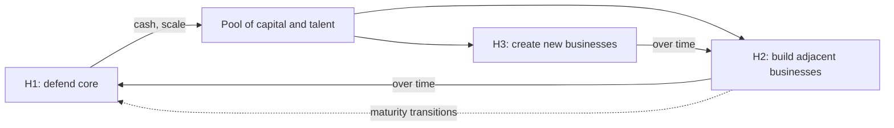


## What you'll learn
- McKinsey's three-horizons framework - core, adjacent, transformative - and what each one means in practice.
- How exec teams allocate capital and engineering across horizons (the 70/20/10 rule and its variants).
- The portfolio failure modes - under-investing in H2/H3, killing transformative bets prematurely, starving the core.
- How to read a company's strategy and identify which horizons are funded vs. neglected.

## Concepts

A company's strategy isn't *one* bet - it's a portfolio. Different bets have different time horizons, risk profiles, and return shapes. The job of the exec team is to balance them. The framework that dominates real strategy meetings is McKinsey's *three horizons*, popularised in the 1999 book [*The Alchemy of Growth*](https://www.amazon.com/Alchemy-Growth-Practical-Insights-Building/dp/0738203092).

### The three horizons

**Horizon 1 (H1) - Defend and extend the core.** The business that makes money today. Most engineering work, most capital, most management attention. Time horizon: 0–18 months. Return profile: predictable, near-term.

**Horizon 2 (H2) - Build emerging businesses.** Adjacencies that build on the core but address new customers, segments, or products. Time horizon: 18 months–3 years. Return profile: medium uncertainty, medium scale.

**Horizon 3 (H3) - Create new businesses.** Genuinely new bets - new markets, new technologies, transformative ideas that could become future cores. Time horizon: 3+ years. Return profile: high uncertainty, potentially transformative.

The classic illustration is Amazon. AWS started as an H3 bet in the early 2000s, became an H2 business through the 2010s, and is now the H1 profit engine. Retail was H1 in 2005; Prime was H2; the now-flat retail business is mature H1. Alexa and Amazon Ads have been H2/H3 in different phases.

### Why the three-horizon framing matters

The framework's value is that it forces the conversation: *what's the right mix of bets across time?*

The dominant failure modes:

**Over-investing in H1.** The company gets so good at optimising the core that it can't allocate capital or talent to new bets. By the time the core matures, there's nothing to take its place. Microsoft in the 2000s is the canonical case - strong Windows/Office monopoly, almost nothing in H2/H3 for a decade. Their recovery under Satya Nadella required brutal reallocation.

**Starving the core for "innovation."** The opposite failure. The company gets infatuated with H3 narratives and lets the core deteriorate. Yahoo throughout the 2010s.

**Killing H3 too early.** H3 bets look terrible on conventional metrics - low revenue, no profitability, uncertain TAM. The H1 finance discipline applied to H3 bets kills them. Most large-company H3 efforts die in their second year because they can't beat H1 ROI hurdles.

**Confusing H2 for H3.** Adjacent products that extend the core (H2) get rebranded as "new businesses" to justify investment. The strategy then claims H3 ambition without actually allocating to genuinely new bets.

### The 70/20/10 rule (and its variants)

A common allocation heuristic: 70% of resources to H1, 20% to H2, 10% to H3. Google formalised this internally under a similar rule. It's a *starting point*, not a law - actual allocations should reflect competitive position, life-cycle stage, and capital availability.

A startup with one product might be 100% H1 by necessity. A late-stage public company with declining growth might shift to 50/30/20. The point is to *consciously* choose the allocation rather than letting H1 default to 95%.

### Different metrics for different horizons

A persistent organisational mistake: applying H1 metrics to H2/H3 bets.

| Horizon | Right metrics | Wrong metrics (the ones used by default) |
|---|---|---|
| H1 | Revenue, margin, retention, market share | Same - work fine here |
| H2 | Cohort growth, customer acquisition, product-market-fit signals | Revenue, profitability |
| H3 | Learning, validated assumptions, optionality, key risk reduction | Revenue, ROI, payback period |

H3 bets shouldn't be measured on revenue. They should be measured on *what they teach you* and *what optionality they preserve*. The maturity test is: did we learn what we needed? Did we de-risk the critical unknown?

The most successful H3 efforts (AWS, Google Cloud Platform, GitHub Copilot before launch) had patron-style leadership at the exec level who shielded them from H1 metrics during their early years.

### How engineering work distributes across horizons

A useful exercise: classify your team's roadmap by horizon.

| Type of work | Typical horizon |
|---|---|
| Reliability improvements to the main product | H1 |
| New features for existing customers | H1 |
| Adjacent product launches | H2 |
| Migration to a new platform | H1 (despite feeling like H2) |
| Technical debt paydown | H1 (it's defending the core) |
| Internal platform/dev-velocity work | H1 (despite engineering's love of it) |
| Pilots with non-customers, new segments | H2 or H3 |
| Genuinely speculative new-tech R&D | H3 |
| Acquihires of pre-revenue startups | H3 |

Most engineering teams find their roadmap is ~95% H1. This isn't necessarily wrong - H1 should be the largest bucket - but it's worth knowing. If the company aspires to do anything transformative, somewhere there's an engineering team working on H3, and it's worth identifying who.

### Reading a company's portfolio from the outside

Public companies disclose enough to estimate horizon allocation. Look for:

- **R&D breakdown by segment** in 10-K filings. If 90% goes to one segment, the company is H1-dominant.
- **Acquired companies and their integration status.** Standalone acquisitions are often H2/H3 placeholders.
- **Earnings call language.** Phrases like "our second growth engine" or "long-term bets" signal H2/H3 emphasis.
- **Capex patterns.** Capital spending on new data centres, new manufacturing, new geographies signals H2/H3 commitments.

A company whose narrative claims H2/H3 ambition but whose R&D and capex flows are 95% H1 is in a mismatch between strategy and resource allocation. This is one of the more common patterns and an early warning sign.

## Walkthrough

A worked example. Hypothetical "Cloudish" SaaS company allocates roughly:

```text
H1 - defend & extend core (subscription SaaS): 80% of R&D, 90% of S&M
H2 - usage-based platform product: 15% of R&D, 8% of S&M
H3 - AI-native developer experiences: 5% of R&D, 2% of S&M
```

The allocation looks reasonable on paper - 80/15/5 is in the 70/20/10 neighbourhood. But:

- **H2 R&D allocation includes the migration of the core to a new architecture.** That's actually H1 work disguised as H2. Real H2 work might be only 5%.
- **The H3 product has been "in incubation" for 18 months with no shipping deadline.** Without ship pressure, H3 bets stagnate.
- **The CEO mentions H2 in every earnings call but H1 retains 95% of executive attention.** Patron-style sponsorship is missing.

The corrective questions for the exec team:

1. *What would have to be true for H2 to grow to $50M ARR in 24 months?* If no plan exists, H2 isn't really funded - it's marketing.
2. *Who is the H3 patron at the exec level?* If no one owns it, it will starve.
3. *What's our kill criteria for H3?* If there isn't one, the bet can never be wound down honourably.

These are the kinds of questions a Staff+ engineer or tech lead can ask in strategy reviews. They're rarely framed in horizon language but they're the same question underneath.

## How it fits together



## Common pitfalls

| Pitfall | Why it happens | Fix |
|---|---|---|
| Letting H1 default to 95%+ | H1 always has measurable urgency; H2/H3 don't | Allocate H2/H3 *explicitly* in capacity planning. |
| Applying H1 metrics to H3 | Defaults of the finance org | H3 measured on learning, not revenue. |
| Confusing H2 for H3 | Marketing pressure to claim innovation | Pin down what would make this bet succeed; if it requires only the existing core capability, it's H2 not H3. |
| Killing H3 in year two | "It hasn't shown ROI" | Define a kill-criterion at start: learning milestone, not revenue milestone. |
| Calling internal platform work H2/H3 | Engineers like it that way | Internal dev-velocity work is H1 - it's defending the core. |

## Exercises

1. For your own employer, classify the top 5 product lines or major initiatives by horizon. Then estimate the resource allocation. Note where the allocation diverges from what leadership says publicly.
2. Pick a public company (Amazon, Microsoft, Atlassian) and try to reconstruct their three-horizon allocation from their 10-K, earnings calls, and acquisitions. Note the gap between rhetoric and resource flow.
3. For your team's roadmap, classify each item by horizon and report the distribution. Discuss with your manager what the ratio "should" be given the company's strategic position. The conversation alone is usually valuable.

## Recap & next

- Strategy is a portfolio of bets across time horizons - H1 (core, 0–18mo), H2 (adjacent, 18mo–3yr), H3 (new businesses, 3yr+).
- The 70/20/10 allocation is a heuristic; actual allocation should reflect competitive position.
- The dominant failure modes are over-investing in H1, applying H1 metrics to H3, and confusing H2 for H3.
- Reading the gap between portfolio rhetoric and actual resource flow is one of the most useful exec-fluency skills an engineer can develop.

Next, kicking off **Module 3 - Markets, Customers & Go-To-Market**, starting with **Segmentation, ICP, and Jobs-to-be-Done**.

