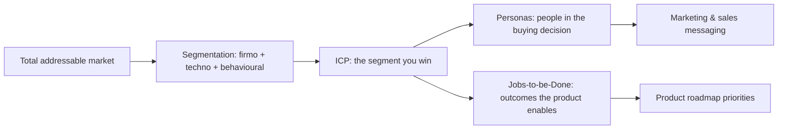


## What you'll learn
- The three classical bases of market segmentation - firmographic, technographic, behavioural - and when each one matters.
- What an Ideal Customer Profile (ICP) actually is, and how it differs from a persona.
- The Jobs-to-be-Done lens and why it consistently outperforms feature/persona thinking.
- How engineering decisions get warped when the ICP isn't crisp.

## Concepts

Market segmentation is the discipline of dividing a heterogeneous market into groups with similar needs. Every meaningful conversation about product, pricing, positioning, or GTM resolves down to segmentation. "Who are we for?" is the foundational question - and "everyone" is the answer that has bankrupted more startups than any other.

### The three classical segmentation axes

**Firmographic.** Properties of the *company*: industry, size, geography, regulatory regime, public/private status. For B2B SaaS this is usually the primary axis. "Mid-market SaaS companies in financial services in North America" is a firmographic segment.

**Technographic.** Properties of the *technology stack*. Which cloud provider, which language, which CRM, which competing tool they're currently using. Datadog segments heavily on technographic data because their product complements or replaces specific stacks. "Companies running Kubernetes in production" is a technographic segment.

**Behavioural.** Properties of how the customer *behaves* - engagement levels, growth trajectory, hiring patterns, recent funding events. "Series A startups that just hired their first VP of Engineering" is a behavioural segment.

Sophisticated GTM teams blend all three. A great target list for an enterprise security product might be: *firmographic* (regulated industries, US-based, $500M+ revenue) × *technographic* (running their own k8s) × *behavioural* (recent security incident or compliance audit).

### Ideal Customer Profile (ICP)

The ICP is the firmographic + technographic + behavioural description of the customer the product is *best for* - the customer the GTM motion is optimised to reach and the product is optimised to delight.

A good ICP is *narrow*. Not "B2B SaaS companies" but "B2B SaaS companies with 50–500 engineers, between Series B and pre-IPO, using AWS, who have a dedicated platform team." The narrowness is the point: it tells everyone in the company who to chase and (more importantly) who not to chase.

The most common ICP mistake is to make it aspirational rather than diagnostic. "We want to sell to the Fortune 500" is an aspirational ICP. "We win 35% of the deals we run against [Competitor X] in regulated industries with 200+ engineers" is a diagnostic ICP - it tells you where you actually win.

Test for a real ICP: can your CEO and your most junior salesperson independently describe the same one in a sentence? If not, the ICP isn't operational.

### ICP vs. persona

These get confused constantly. They're different.

**ICP** describes the *company* you sell to.

**Persona** describes the *individual person* who participates in the buying decision - economic buyer, technical buyer, champion, end user.

A product can have one ICP and multiple personas. The technical buyer (a director of platform engineering) cares about API ergonomics and runtime cost; the economic buyer (a VP/CIO) cares about TCO and integration risk; the end user cares about ergonomics. Marketing typically targets the technical buyer + champion; sales handles the economic buyer; product designs for the end user. Different content, different conversations, all within the same ICP.

### Jobs-to-be-Done

The Jobs-to-be-Done (JTBD) lens, from Christensen and Bob Moesta, asks: *what job did the customer hire this product to do?* The job is consistent over time and across customers; the products that do it change.

A useful JTBD statement has the form:

```text
When [situation], I want to [motivation], so I can [expected outcome].
```

For example, a marketing manager evaluating a CRM:

```text
When my pipeline reviews are pulled from spreadsheets every week, I want a system that auto-aggregates from email and meeting notes, so I can spend more time on strategy than data entry.
```

The job is "free up time from manual aggregation." The candidate solutions could be: a CRM, a workflow tool, an AI assistant, an admin hire. The customer evaluates all of them on how well they perform the job.

Why JTBD beats personas:
- **Personas have demographics**; jobs have desired outcomes.
- **Personas overlap with competitors**; jobs cut across categories.
- **Personas are static**; jobs change with situation.
- **Personas hide substitution threats** (competitors with similar personas); jobs expose them (any product that does the job competes).

### Segmentation traps

The most common ways segmentation breaks:

| Trap | Why it happens | Cost |
|---|---|---|
| Too-broad ICP | "We don't want to limit ourselves" | Every team optimises for a different customer; product, marketing, sales misalignment. |
| Aspirational ICP | "We *want* to be enterprise" | Engineering builds features for nobody. The product never wins anyone. |
| Confused ICP vs. persona | Misuse of terms | Marketing builds for the buyer; sales targets the wrong companies. |
| One ICP, multiple ICPs in practice | Different segments slip in via sales | Resource allocation gets fragmented; no segment served well. |
| Ignoring JTBD | "Customer journey" replaces "job" | The product gets built around persona attributes, not outcomes. |

### Why engineers should care

Engineers feel ICP confusion structurally. The signs:

- Roadmap whiplash: one quarter you're building for SMB, next quarter for enterprise.
- Feature creep: every customer request is a "yes" because every customer is the ICP.
- Performance trade-offs that don't make sense: optimising for a workload that's not the target customer's workload.
- Disagreements about API design that are really disagreements about who the API is for.

A crisp ICP is the single most powerful tool for resolving roadmap arguments. "We're not building that because Y customers don't use it that way" only works if everyone agrees who Y is.

## Walkthrough

A worked example. You're an engineer at a B2B SaaS company. The CEO says the ICP is "growing SaaS companies." That's not operational. Drill down:

```text
Phase 1 - firmographic:
  Industry: SaaS / digital-native services
  Size: 50–1000 employees, 15–200 engineers
  Revenue: $5M-$50M ARR
  Geography: US, Canada, UK initially
  Funding stage: Series B through pre-IPO

Phase 2 - technographic:
  Cloud: AWS or GCP (90% of pipeline)
  Container orchestration: production Kubernetes
  Existing stack: at least one of [Datadog, New Relic, Honeycomb]
  Identity: Okta or Auth0
  CI/CD: GitHub Actions or CircleCI

Phase 3 - behavioural:
  Has a dedicated platform team (3+ engineers)
  Recent hire of VP of Eng, DevOps lead, or Platform lead
  At least one engineering blog post in last 12 months
  Active in OSS or developer community

Jobs-to-be-done:
  When deploying changes to production frequently, our platform
  team wants a deployment system that surfaces risk before it
  reaches customers, so we can move fast without on-call shame.
```

This ICP is operational. A salesperson can build a list. A marketer can write copy. An engineer can prioritise features. A founder can pass on a poorly-fitting deal without internal debate.

Now flip it: imagine the same product trying to sell to "any company with a website." The roadmap fragments, marketing fragments, sales fragments, and the product becomes a worse version of three different things.

## How it fits together



## Common pitfalls

| Pitfall | Why it happens | Fix |
|---|---|---|
| Aspirational ICP | "We want to be enterprise" | ICP comes from where you win, not where you wish you won. |
| ICP as a slogan, not a list | "Modern teams that move fast" | Force a sharable filterable list with concrete criteria. |
| One ICP on paper, three in practice | Sales chases anything | Track ARR by segment, expose the gap, enforce alignment. |
| Personas without JTBD | Demographics don't predict purchase | Add a "what job did they hire us to do" question to every persona doc. |
| Ignoring TAM constraints | A perfectly defined ICP can be too small | Validate that the ICP at full saturation supports the company's growth ambition. |

## Exercises

1. Write down your company's stated ICP as you understand it. Then look at the customer list and identify the top 20% of customers by ARR. Are they consistent with the stated ICP? Most companies find the answer is "no" - the ICP is aspirational, not diagnostic.
2. For your team's last 5 feature commitments, identify which ICP-segment justified each. If two consecutive commitments were for different segments, that's the ICP fragmentation problem in miniature.
3. Take the JTBD framework. Pick one product you use daily and write the "When..., I want to..., so I can..." statement. Then list three alternative products that could perform the same job. Notice that the competitive set is broader than the marketing category.

## Recap & next

- Segmentation has three classical axes - firmographic, technographic, behavioural - that combine into an operational ICP.
- The ICP describes the *company* you win; the persona describes the *individual* in the buying decision.
- Jobs-to-be-Done captures *what the customer is trying to achieve*, which often crosses product categories.
- A crisp ICP is the single most powerful tool for resolving roadmap arguments inside engineering.

Next, **Positioning & narrative** - once you know who you're for, how do you tell them?

