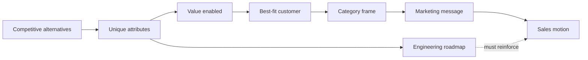


## What you'll learn
- April Dunford's positioning canvas - the five components of a positioning statement that actually works.
- The difference between features, benefits, value, and category - and why most product pages confuse them.
- Category creation vs. category entry, and which one to attempt.
- How engineering decisions encode positioning, often without anyone noticing.

## Concepts

Positioning is the act of locating your product in the customer's mind relative to the alternatives they're considering. It's not what you say in the headline - it's what the customer concludes about *what you are*, *who you're for*, and *why they should choose you over the alternatives*.

Most B2B SaaS products are positioned badly. The symptoms: a homepage that lists features instead of value; a sales motion that struggles to qualify; a product roadmap pulled in three directions because no one agrees on the category. The fix is rarely "better copywriting" - it's usually the underlying positioning.

April Dunford's [*Obviously Awesome*](https://www.aprildunford.com/obviously-awesome) gives the cleanest contemporary framework.

### The Dunford positioning canvas

Five components, in dependence order:

**1. Competitive alternatives.** What does the customer do *today* if they don't buy you? This is the actual competition - often not other products in your category, but spreadsheets, in-house builds, or "doing nothing."

**2. Unique attributes.** What does your product *have* that the alternatives don't? These are features, capabilities, integrations.

**3. Value (and proof).** What outcomes do those attributes *enable* for the customer? Value statements should be specific and measurable.

**4. Best-fit customer characteristics.** Which customers care most about the value? Translates back to ICP.

**5. Market category.** What frame helps the customer make sense of the product? This is where most products go wrong - they pick the wrong category or invent a fake one.

The order matters. You can't pick a category before you understand the alternatives; you can't claim value before you know what features support it; you can't define the best-fit customer before you know which value resonates.

### Features → benefits → value → category

A common confusion. The four are linked but distinct.

| Layer | What it is | Example |
|---|---|---|
| Feature | A capability of the product | "Distributed tracing across services" |
| Benefit | What the feature does for the user | "Find the source of latency spikes" |
| Value | What the user can do because of the benefit | "Reduce mean-time-to-resolve from hours to minutes" |
| Category | The frame the customer uses to understand the product | "Observability platform" |

Engineers default to the first layer. Marketing defaults to the second. Good positioning lives in the third. Investors and customers think in the fourth.

A homepage that says "the leading observability platform" without saying *what value* and *for whom* communicates nothing. A homepage that says "reduce MTTR by 70% for platform teams operating distributed systems" communicates everything.

### Category strategy

Three category-level choices:

**1. Win in an established category.** Take an existing category (CRM, observability, payments) and beat incumbents on a specific dimension. Most products take this path. The challenge: you have to be better on a dimension the customer values *and* communicate that quickly.

**2. Reframe an existing category.** Take the category but redefine its boundaries. Slack didn't say "we're a chat tool" - they said "we're channels for work," which reframed the category to include parts of email, IRC, and project management. Datadog reframed "infrastructure monitoring" into "observability." Reframing is hard but often more durable than head-to-head fighting.

**3. Create a new category.** Tell the market that an entirely new category exists and you're the leader. HubSpot did this with "inbound marketing." Figma started by claiming "collaborative design" as a new category distinct from "design tools." Category creation is the highest-risk move - most attempts fail because no one buys "an unknown thing from a new vendor."

The rule of thumb: only create a category if (a) the existing categories truly don't describe what you do, (b) you have the marketing budget to evangelise it, and (c) your sales motion can handle the educational overhead. Otherwise win or reframe an existing one.

### Engineering decisions encode positioning

This is the part engineers often miss. Many engineering decisions silently express positioning - and sometimes contradict the stated marketing.

| Engineering decision | What it positions you as |
|---|---|
| Free tier exists; minimum paid plan is $20/user/month | Self-serve, mid-market, individual-buyer GTM |
| No free tier; minimum is "contact sales" | Enterprise, top-down, multi-stakeholder GTM |
| 100ms p99 latency; multi-region deployment | "Mission-critical infrastructure" |
| 5-minute setup; minimal configuration | "Developer tool, plug and play" |
| Detailed RBAC, audit logs, SSO/SAML | "Enterprise security-conscious buyer" |
| Public API, OAuth, webhooks | "Platform, ecosystem-friendly" |
| Open-source core, paid commercial extras | "Developer-friendly, open-core business" |

If engineering builds a public API with a permissive license while marketing positions the company as "enterprise-grade with strict access controls," the inconsistency confuses customers. The product is doing one thing; the page says another. Usually the *engineering reality* wins because customers experience the product, not the page.

### Positioning is reversible (but expensive)

Many companies reposition over their lifecycle. Slack started as a B2B chat tool, repositioned around "channels for work," and is now repositioning under Salesforce as a "work operating system." Each reposition was driven by a recognised gap between what customers actually valued and what the product was sold as.

Repositioning costs:
- Website rewrites and brand work
- Sales team retraining
- Sometimes pricing/packaging changes
- Some customer churn from confused or unhappy buyers
- 12–24 months for the new positioning to settle

A small repositioning is fine and often healthy. A major one - moving categories, moving up-market, changing personas - is a multi-quarter project for the whole company.

## Walkthrough

A worked positioning exercise for a hypothetical B2B SaaS company.

**Product**: "Velora" - a SaaS tool that helps engineering managers visualise team throughput, bottlenecks, and on-call load.

**Bad positioning attempt**:
> "Velora is the leading engineering analytics platform. We help teams ship faster."

This is useless. Every analytics platform claims this. The CEO and the engineering manager will close the tab.

**Dunford-style positioning**:

```text
Competitive alternatives:
  - Manual reporting in Looker / Tableau using Git + Jira data
  - Linear's built-in cycle analytics
  - "We don't measure this"

Unique attributes:
  - Pre-built correlations between deployment frequency and incident rate
  - Direct GitHub Actions + PagerDuty integration
  - Slack reports that summarise weekly trends
  - On-call rotation analysis with burnout signals

Value:
  - Reduce time-to-insight from "weekly slack-and-spreadsheet ritual" to
    "morning Slack digest"
  - Catch burnout signals on individual engineers 2-3 weeks before
    they're spoken aloud
  - Defend engineering investment in 1:1s with VP Eng using throughput data

Best-fit customer:
  - 50-300 person engineering orgs
  - Already on GitHub + Linear or Jira + PagerDuty
  - Eng managers who own throughput goals, not just delivery

Market category: "Engineering management analytics"
  (notable: not "DevOps analytics" or "engineering productivity")
```

The positioning now does work. A user encountering it can quickly decide: *are we a match?* The features list is a means to an end (value); the category locates Velora; the alternatives confirm we're not selling to "anyone with engineers."

## How it fits together



## Common pitfalls

| Pitfall | Why it happens | Fix |
|---|---|---|
| Picking the wrong competitive alternatives | Use the in-category set instead of what customers actually do | Talk to recent buyers about what they considered. |
| Leading with features | Engineers wrote the homepage | Lead with value; relegate features to a section deeper in. |
| Category creation when reframing would do | Marketing wants to look bold | Only create a category if the existing one is truly inadequate. |
| Engineering decisions inconsistent with positioning | No one owns the alignment | A weekly check: does the product reality support the positioning? |
| Repositioning quietly | "We'll update the page" | Treat major repositioning as a 6+ month cross-functional project. |

## Exercises

1. Take your company's homepage. Identify which Dunford components are present, which are missing, and which are in the wrong order. Most pages fail at the "competitive alternatives" step - they don't say *what you'd otherwise do*.
2. List three engineering decisions made in the last year that silently changed (or reinforced) positioning. Examples: shipping SSO, adding a free tier, deprecating an integration.
3. For your product, write a one-paragraph positioning statement using Dunford's five components. Then test it: would your most junior salesperson recognise the positioning? Would your product engineer? Would a customer in the ICP?

## Recap & next

- Positioning is what the customer *concludes* about you, not what you say in the headline.
- The Dunford canvas - competitive alternatives, unique attributes, value, best-fit customer, market category - gives a forced ordering that exposes most mistakes.
- Engineering decisions encode positioning silently; misalignment between engineering reality and marketing positioning confuses customers and is usually won by the engineering reality.
- Category creation is rare and risky; category reframing is often more durable.

Next, **Pricing & packaging in B2B SaaS** - how the price sheet encodes strategy and what changes when you change it.

