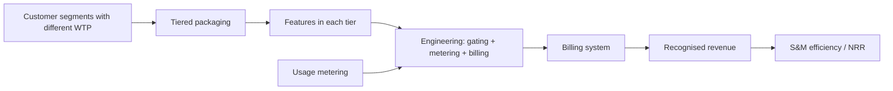


## What you'll learn
- The three dominant SaaS pricing models - seat-based, usage-based, hybrid - and what each encodes about the product.
- The mechanics of packaging: tiers, feature gating, and add-ons.
- Price discrimination and willingness-to-pay as the underlying economic logic.
- Why engineering owns more of pricing than they realise - and what to do about it.

## Concepts

Pricing is the single highest-leverage business decision a software company makes. A 1% price increase that holds without churn drops directly to operating income. A 5% packaging change can shift NRR by a dozen points. And yet pricing rarely gets the attention it deserves - most companies do an annual review at best, and engineering is almost never consulted.

That last bit is wrong. Engineering touches pricing in five ways: what's *meterable*, what's *gateable* (feature flags), what's *deployable* (SaaS architecture for entitlements), what's *integratable* (billing systems), and what's *enforceable* (without violating customer trust). Get any of these wrong and the pricing strategy can't ship.

### The three dominant models

**Seat-based (per-user).** Customer pays per user with access to the product. Salesforce, Atlassian, Notion, Figma. Predictable for customers, simple to forecast.

```text
Pros: Easy to understand; predictable revenue; aligns with hiring growth.
Cons: Discourages broad adoption (people share logins); caps revenue at user count.
Engineering surface: Need accurate seat counting; SSO/user-management integration.
```

**Usage-based (consumption).** Customer pays per unit consumed - API calls, GB stored, minutes processed. AWS, Twilio, Stripe, Cloudflare. Aligns revenue with value generated.

```text
Pros: Scales with customer success; lower friction to start; NRR > 100% common.
Cons: Hard to forecast; sticker-shock risk; needs sophisticated metering.
Engineering surface: Accurate metering, real-time rating, billing aggregation,
                     cost-control features (caps, alerts), credit systems.
```

**Hybrid (subscription + consumption).** A subscription floor with usage-based overages. Datadog (per-host pricing + log volume), Snowflake-style data platforms, Cloudflare Workers. Combines the predictability of subscription with usage-based upside.

```text
Pros: Predictable base; expansion built-in; matches enterprise procurement preferences.
Cons: Complex to communicate; complex to bill; price sheet hard to read.
Engineering surface: Metering + entitlements + commit consumption tracking.
```

A fourth, rarer model: **outcome-based**. Customer pays based on a measured business outcome (loans approved, fraud detected, customers acquired). Powerful but operationally hard. Usually appears as a custom enterprise contract rather than a standard SKU.

### Packaging: tiers, gates, add-ons

Packaging is the *grouping* of features into purchasable units. Most B2B SaaS uses a three-tier structure:

| Tier | Purpose | Typical features |
|---|---|---|
| Starter / Free | Acquire users, demonstrate value | Core functionality with limits (e.g. 5 seats, 10k events/mo) |
| Pro / Team | The product most paying customers use | Full feature set, no limits, modest support |
| Enterprise | Advanced security, custom requirements | SSO/SAML, audit logs, custom contracts, premium support |

The art is in *which features go in which tier*. Two principles guide it:

**Tier features by willingness-to-pay segment.** SSO is a near-universal enterprise requirement. Audit logs are enterprise. Advanced RBAC is enterprise. By gating these to the top tier, you let smaller customers buy without these features and force larger customers (who genuinely need them) up.

**Tier features by usage intensity.** Limits on volume - events per month, GB stored, seats - naturally tier users. The customer using 100x more value pays proportionally more.

**Add-ons** are features that orthogonally appeal to a subset of the customer base, not aligned with tier. Examples: data residency in EU, dedicated infrastructure, professional services packages. Add-ons preserve flexibility for the long tail of edge cases without complicating the main tier structure.

### Price discrimination

The economic engine behind tiering is *price discrimination*: charging different customers different prices for the same underlying capability based on their willingness to pay. Pure economic theory says this is profit-maximising. In practice the constraints are:

- **Detectability.** You can't price-discriminate based on properties customers can hide. Hence: charging large companies more requires *signals* (seat counts, request volume, contract size).
- **Customer perception of fairness.** Charging different list prices for the same feature publicly creates backlash. Hence: differentiated *packaging* rather than differentiated *prices* for the same thing.
- **Arbitrage.** Customers near a tier boundary will minimise to stay below it. Hence: limit selection of features per tier shouldn't be too obviously gameable.

The trick is to package *bundles of features* such that each bundle naturally attracts the right segment. Enterprise customers can't easily downgrade because they need SSO and audit logs. SMBs can't easily upgrade because they don't need (or want to pay for) those.

### Pricing as strategy

The price sheet *encodes* the company's strategy. Look at any two competitors and the differences in their pricing usually reveal strategic differences:

- Atlassian's per-user-per-month, sub-$20 starting price → low-touch, mid-market, self-service.
- Workday's "contact sales for all tiers" → enterprise-only, sales-led, custom contracts.
- DataDog's per-host pricing → infrastructure-monitoring positioning.
- Cloudflare's free-tier-for-most + enterprise → freemium funnel + upmarket motion.

When pricing changes, strategy is changing. When companies switch from seat-based to consumption-based, the entire GTM motion changes (see Module 3 Chapter 4).

### What engineering needs to know

The pricing model determines what engineering builds:

| Pricing model | Required engineering capabilities |
|---|---|
| Seat-based | Accurate seat tracking, user-management API, idempotent user provisioning |
| Usage-based | Real-time metering, rating engine, idempotent event collection, cost-control UI, credit/refund logic |
| Hybrid | All of the above + commit-and-overage tracking, prepaid-credit accounting |
| Outcome-based | Custom integrations to measure outcomes, often with customer's data sources |
| Free tier | Strict, race-free enforcement of limits (prevents abuse) |
| Tiered features | Feature-flagging by plan, entitlement service, plan-aware code paths |

These are deep engineering investments. A company that wants to add usage-based pricing without metering infrastructure is making a multi-quarter commitment. Most companies underestimate this work by a factor of 2-3x.

### Price changes

Raising prices is the single highest-ROI experiment a SaaS company can run, and the most rarely run. Industry studies (e.g. Patrick Campbell's research at [ProfitWell](https://www.profitwell.com/blog/pricing-strategy)) consistently find:

- B2B SaaS companies under-price by 20–40% on average.
- A 1% price increase produces ~10% improvement in EBIT in steady state.
- Annual price reviews are a baseline; quarterly is better.
- Grandfathering existing customers reduces churn; new pricing applies to new logos and renewals.

Engineering's role in pricing changes: the entitlement and billing systems need to support "old pricing" and "new pricing" simultaneously. Migrations are non-trivial.

## Walkthrough

Two contrasting packaging tables.

**Confluence (Atlassian) - seat-based with feature-gated tiers:**

```text
Free      $0          Up to 10 users, basic features
Standard  $5.16/user  Standard support, 250GB storage
Premium   $9.81/user  Advanced features, IP allowlisting, 24/7 support
Enterprise Custom     Centralised admin, audit logs, unlimited storage
```

This packaging encodes Atlassian's PLG strategy: a generous free tier acquires users; the paid tiers are explicitly priced; feature differentiation is mild (more about scale and admin); enterprise gets bespoke treatment.

**Snowflake - pure consumption (simplified):**

```text
Standard   $2/credit       Basic data warehouse
Enterprise $3/credit       + multi-cluster, time-travel up to 90 days
Business Critical $4/credit + advanced security, HIPAA, BAA
Virtual Private $6/credit  + isolated infrastructure
```

Notice the structure: same product (Snowflake), four tiers, each is a *multiplier* on the credit price. The customer's bill is `credits used × tier multiplier × $/credit`. This packaging encodes Snowflake's enterprise-trust strategy - security and isolation features push customers up because they have to.

The two pricing pages communicate different strategies even before you read any product information. That's the point.

## How it fits together



## Common pitfalls

| Pitfall | Why it happens | Fix |
|---|---|---|
| Pricing changes without engineering | "It's just a number" | Pricing changes require entitlement and billing engineering. |
| Free tier with unenforced limits | "We'll enforce later" | Without enforcement at code level, free tier becomes the product. |
| Too many tiers | "We want every customer to have a fit" | Customers can't choose; sales can't position. 3 tiers is canonical. |
| Inconsistent gating | A feature gated in one place leaks via API | Single entitlement service; all features check it. |
| Price never changes | "We're worried about churn" | Annual reviews are baseline. Grandfathering minimises churn. |

## Exercises

1. Look at your company's pricing page. Identify each tier's primary "what" (volume vs. features vs. support). Cross-check that the engineering systems enforce each tier consistently.
2. Identify three features your company has but doesn't currently charge for. For each, classify it as "should be a tier upgrade trigger," "should be an add-on," or "should be free (core)."
3. Find a competitor's pricing page. Reverse-engineer their strategy: are they PLG or sales-led? Are they targeting enterprise or SMB? Do their packaging choices align with their public strategy claims?

## Recap & next

- Three dominant SaaS pricing models - seat-based, usage-based, hybrid - each with distinct engineering requirements and GTM implications.
- Packaging encodes price discrimination through tiers and add-ons aligned with willingness-to-pay.
- The pricing page is a strategy document; changes reflect strategic shifts.
- Engineering owns metering, entitlements, billing, and enforcement - the work behind every pricing decision.

Next, **GTM motions: PLG, sales-led, hybrid** - how the pricing model and target segment determine the sales motion that scales.

