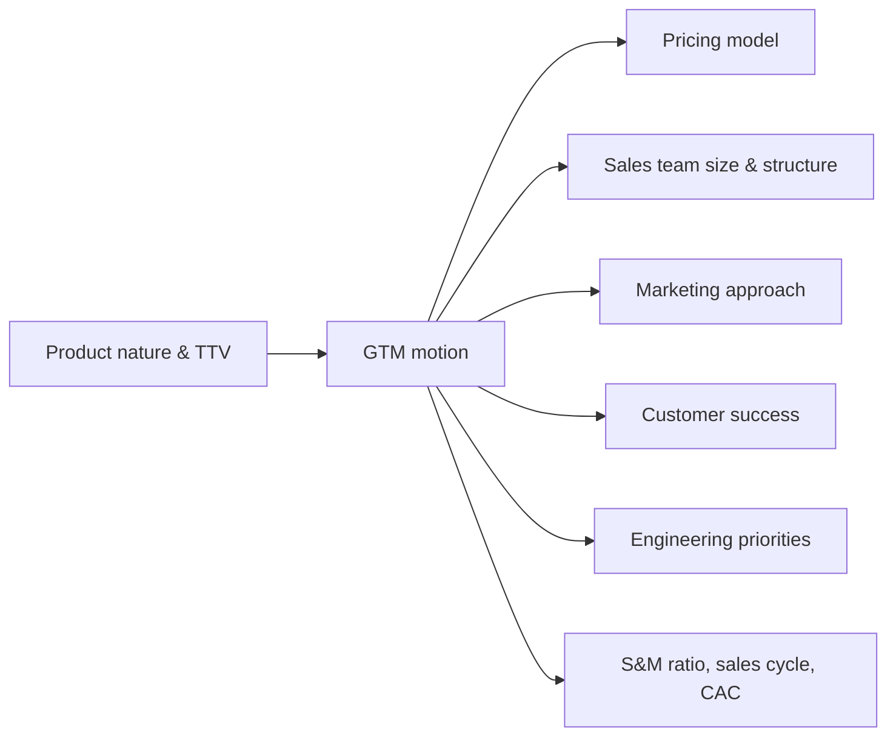


## What you'll learn
- The three dominant B2B SaaS go-to-market motions - product-led growth, sales-led, and hybrid - and what each looks like in numbers.
- When each motion works, what it costs, and what fails when it's applied to the wrong market.
- How engineering's product surface shapes what motions are even possible.
- The "PLG to enterprise" transition, the most common (and painful) GTM change in software.

## Concepts

A *GTM motion* is the system by which the company finds, qualifies, sells to, onboards, and expands customers. Every B2B SaaS company has one even if they don't think about it explicitly. The motion lives at the intersection of product, pricing, marketing, sales, and customer success.

Three motions dominate the modern landscape:

### 1. Product-led growth (PLG)

The product itself drives acquisition, conversion, and expansion. Marketing brings users to a free or self-serve product; the product converts them; expansion happens organically as usage grows.

**Hallmarks:**
- Free tier or free trial; no "contact sales" gate.
- Self-serve onboarding (signup → useful in 5 minutes).
- Pricing visible on the website.
- Many small customers; expansion via seat/usage growth.
- Word-of-mouth and individual buyers, not committee buyers.

**Examples:** Atlassian, Notion, Figma, Linear, Datadog (early days), HashiCorp Cloud Platform.

**Why it works:** Users adopt the product before the company is even aware of them. The CAC is low because acquisition happens via product utility, not paid acquisition. The product *is* the marketing.

**When it doesn't:** Products that need to be configured before they produce value (security, compliance), or that require a committee decision (multi-stakeholder enterprise deals), or that touch sensitive data (regulated industries).

### 2. Sales-led

A sales team drives acquisition. Inbound or outbound prospecting → qualification → discovery → demo → proposal → negotiation → close. The product gets bought after a sales-led education process.

**Hallmarks:**
- "Contact sales" or "request a demo" instead of "sign up."
- Pricing hidden or "available on request."
- High ACV - typically $50k+, often $250k+.
- Buying committees with technical, economic, and procurement personas.
- Long sales cycles (3–12 months).
- High S&M ratio (often 40–60% of revenue).

**Examples:** Salesforce, Workday, ServiceNow, Snowflake, Workato, Palantir.

**Why it works:** Enterprise customers want to be sold to. They have complex requirements, multiple stakeholders, security reviews, procurement processes. A salesperson navigates this; a self-serve product can't.

**When it doesn't:** SMB and mid-market customers who can decide alone. They resent being routed through sales for what feels like a $200/month decision. Sales-led motions also have minimum economics - you can't profitably sell a $1k product with a $50k cost-to-acquire.

### 3. Hybrid (PLG + sales overlay)

Start with PLG to acquire users; layer sales onto accounts when they grow. Most successful modern SaaS companies use a hybrid.

**Hallmarks:**
- Free tier and self-serve for low-end and individual users.
- Outbound sales targets specific accounts with growing usage signals.
- Pricing transparent up to a point; "contact sales" above a threshold.
- PLG-flavoured marketing for top-of-funnel; sales-flavoured for enterprise.

**Examples:** Datadog (started PLG, layered sales), Snowflake (sales-led with PLG hooks), HashiCorp (open-source → cloud product → enterprise).

The hybrid is hard to operate but compounds. The PLG motion provides cheap top-of-funnel; the sales motion captures large deals; usage signals from PLG identify which accounts to prioritise for outbound.

### Comparing the motions

The numbers tell the story:

| Metric | PLG | Sales-led | Hybrid |
|---|---|---|---|
| Typical ACV | $1k-$50k | $50k-$5M | $1k-$500k |
| CAC | Low ($500-$5k blended) | High ($50k-$500k) | Middle |
| Sales cycle | Days-weeks | Months | Mixed |
| Free tier | Yes | No | Yes |
| S&M as % revenue | 15-25% | 40-60% | 25-40% |
| Buying motion | Individual user | Committee | Both |
| Engineering priorities | Onboarding speed, self-serve | Custom integrations, security | All of the above |

### What engineering builds for each motion

**PLG demands:**
- Sub-5-minute time-to-value
- Self-serve onboarding with minimal config
- In-product upgrade flows
- Usage telemetry that drives product decisions
- Reliability and performance (cannot fall over under abuse from a viral signup)

**Sales-led demands:**
- Enterprise-grade security: SSO/SAML, audit logs, advanced RBAC
- Custom deployment options (private cloud, on-prem, single-tenant)
- Integration depth with enterprise stacks (Workday, Okta, ServiceNow)
- Compliance certifications: SOC 2 Type II, HIPAA, FedRAMP
- Custom contracts, custom features, custom commitments
- A "white-glove" customer success engineering function

**Hybrid demands:** All of the above. Hybrid is hard because the engineering org has to invest in *both* sets of capabilities simultaneously. Many companies fail because they try to support both motions with one engineering org sized for one.

### The PLG-to-enterprise transition

The most common GTM transition in modern SaaS: a PLG company has saturated its self-serve segment and needs to move upmarket to enterprise. This is one of the hardest transitions in business.

What changes:
1. **Product** - must add SSO, audit logs, advanced security. The "developer-friendly defaults" change.
2. **Sales** - hire account executives, sales engineers, account managers.
3. **Pricing** - add an enterprise tier; learn to negotiate custom contracts.
4. **Marketing** - content shifts from product-led to account-based.
5. **Customer success** - white-glove engagement instead of help-doc-driven.
6. **Finance** - invoicing, custom payment terms, multi-year deals.
7. **Engineering** - entirely new feature surface area for enterprise.

Companies that do this well include Atlassian (slow, patient, never lost the SMB), Figma (added enterprise without abandoning individuals), HashiCorp (open source → cloud → enterprise). Companies that did this badly are more numerous but more politely unnamed.

The opposite transition - enterprise to PLG - is even harder because the engineering and sales habits are deeply ingrained. Workday adding a free tier would be culturally unthinkable.

### Reading a GTM motion from the outside

You can identify a company's GTM motion in 30 seconds on their homepage:

| Signal | GTM motion |
|---|---|
| Big "Sign up free" button | PLG |
| Big "Contact sales" button | Sales-led |
| Both, with pricing visible | Hybrid |
| Visible pricing tiers | PLG or hybrid |
| "Talk to sales for pricing" | Sales-led |
| Free trial with credit card | Self-serve, often hybrid |
| Customer logos including F500 | At least partial sales-led |
| Engineering blog with deep technical posts | PLG (engineer audience) |
| Analyst reports prominently displayed | Sales-led (enterprise validation) |

## Walkthrough

A worked example. Consider two competitors in the API platform space.

**Postman (PLG → hybrid):**
- Started as a developer tool installed locally.
- Free tier for individuals, paid plans for teams.
- Sales motion added for enterprise contracts (governance, SSO, audit).
- Visible pricing up to "Enterprise" which is contact-sales.
- Time-to-value: 30 seconds (install and start using).

**Kong (open source + sales-led):**
- Open-source API gateway.
- Commercial product is sales-led.
- "Schedule a demo" rather than "sign up."
- Long sales cycles; large enterprise contracts.
- Time-to-value (commercial product): depends on the deployment engagement.

Both compete in the API space. Their GTM motions are completely different, driven by product nature (developer tool vs. infrastructure component) and customer (individual developer vs. platform team). Both can succeed; neither motion would work for the other product without restructuring.

The lesson: GTM motion is a strategic choice, but it's heavily constrained by product nature. The motion that works depends on whether the product is *developer-bought* or *committee-bought*; whether time-to-value is *seconds* or *quarters*; whether the deployment is *self-contained* or *integrated with enterprise systems*.

## How it fits together

## Common pitfalls

| Pitfall | Why it happens | Fix |
|---|---|---|
| Wrong motion for the product | "We want enterprise revenue" | The product's time-to-value and buying motion constrain the GTM. Adapt one or the other; don't fight both. |
| Hybrid without resourcing both motions | "We'll do both" | Hybrid requires investment in both sets of capabilities; under-resourcing creates a worst-of-both result. |
| PLG without telemetry | "Build the product, growth will come" | PLG requires usage analytics to identify expansion opportunities and at-risk accounts. |
| Sales-led without security investment | "We'll add SSO later" | Enterprise buyers gate-keep on security; missing certifications kills deals. |
| Treating GTM as marketing's problem | "GTM = pipeline" | GTM is product + pricing + sales + marketing + CS. Engineering owns critical parts. |

## Exercises

1. Visit five competitor websites in your industry. For each, identify which GTM motion they're running based on the signals on the homepage. Now compare to actual sales motion data if you have it.
2. For your own product, list three engineering investments in the next quarter that are required *for the current GTM motion*. Then identify whether your roadmap reflects them or whether they're under-prioritised vs. feature work.
3. If your company switched GTM motions tomorrow (PLG to enterprise, or vice versa), name three engineering capabilities that would have to be built. The exercise builds appreciation for how deeply GTM motion drives engineering investment.

## Recap & next

- Three dominant motions: PLG, sales-led, hybrid. Each has distinct hallmarks, costs, and engineering requirements.
- The motion is constrained by product nature - time-to-value, buying motion, deployment complexity.
- Hybrid is the modern default but requires investing in *both* sets of capabilities.
- The PLG-to-enterprise transition is the most common and most painful GTM change in modern software.

Next, **The funnel & pipeline math** - once the motion is chosen, what numbers does the company watch to know if it's working?

