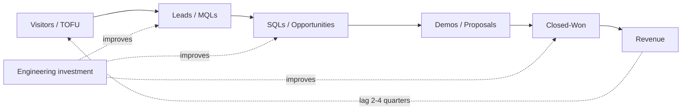


## What you'll learn
- The standard marketing/sales funnel stages - TOFU, MOFU, BOFU - and what each measures.
- Conversion rates: what's normal, what's broken, what's gamed.
- Sales velocity and pipeline coverage - the two numbers that tell you whether the quarter will hit.
- How leading vs. lagging indicators connect engineering work to revenue.

## Concepts

Engineers often hear "the pipeline" mentioned reverently in exec reviews and wonder what specifically is being discussed. The pipeline is the *forecasted* set of deals at various stages of progression, valued and weighted by stage probability. It is the closest thing a B2B SaaS company has to a leading indicator of revenue.

The funnel is the *historical* set of conversion rates from one stage to the next. The pipeline is its forward-looking application: "We have X opportunities at Y stages with Z weighted value - given historical conversion rates, what should close this quarter?"

Both rest on the same staged model.

### The standard funnel stages

Marketing and sales teams divide the funnel into stages. There's no universal naming convention but the structure is consistent.

```text
TOFU (top of funnel)
  Visitors / Anonymous traffic
       ↓ ~2-5%
  Leads (gave email, signed up)
       ↓ ~10-30%
  Marketing-Qualified Leads (MQLs)
       ↓ ~20-30%
MOFU (middle of funnel)
  Sales-Accepted Leads (SALs)
       ↓ ~40-60%
  Sales-Qualified Leads (SQLs)
       ↓ ~25-40%
  Opportunities (sales has accepted the deal as real)
       ↓ ~15-30%
BOFU (bottom of funnel)
  Proposal sent
       ↓ ~50-70%
  Closed-Won
```

The exact percentages vary by motion. PLG has high TOFU volumes and low average deal size; sales-led has lower volumes and higher average deal size. The *shape* is consistent - narrowing through the funnel as deals get qualified out.

Across the entire funnel, the rough industry conversions:

- **PLG** - 100 visitors → 1-2 paying customers ($)
- **Mid-market sales-led** - 100 MQLs → 5-10 closed-won ($$)
- **Enterprise sales-led** - 100 SQLs → 15-30 closed-won ($$$)

The numbers drop fast, which is why the only sustainable strategy is to *narrow the funnel* (better qualification) rather than *widen the top* (more leads). Most companies do the latter when they should do the former.

### Conversion rates

Healthy ranges depend on the segment:

| Stage transition | PLG | SMB sales-led | Enterprise |
|---|---|---|---|
| Visitor → Signup | 2-5% | n/a | n/a |
| Signup → Active user | 15-30% | n/a | n/a |
| Active user → Paid | 1-5% | n/a | n/a |
| Lead → MQL | n/a | 5-15% | 10-25% |
| MQL → SQL | n/a | 20-40% | 40-60% |
| SQL → Opportunity | n/a | 30-60% | 50-80% |
| Opportunity → Closed-won | 15-30% | 20-30% | 25-35% |
| Win rate (against named competitor) | n/a | 20-40% | 30-50% |

Conversion rates *trend* matters more than absolute numbers. A 25% opp-to-close rate trending down is more diagnostic than a 30% rate that's been stable.

The most-gamed conversion rate: MQL → SQL, where marketing wants to claim leads as MQLs and sales wants to disqualify them as SQLs. The internal tension is healthy; the games are not.

### Sales velocity

The standard formula:

```text
Sales Velocity = (Number of Opportunities × Average Deal Size × Win Rate) / Sales Cycle Length
```

A company with 100 open opportunities, $50k average ACV, 25% win rate, and 90-day sales cycles has sales velocity = (100 × $50k × 0.25) / 90 = $14k/day, or ~$1.3M per quarter from those opportunities.

The formula reveals four levers:

| Lever | What it means | Engineering involvement |
|---|---|---|
| Number of opportunities | Pipeline volume | Indirect - better product enables more deals to enter |
| Average deal size | ACV | Direct - features and packaging change ACV |
| Win rate | Conversion at the bottom | Direct - product quality, demos, technical credibility |
| Sales cycle length | Speed | Direct - onboarding, integration speed, technical decision support |

Notice the asymmetry: shortening sales cycles by 25% has the *same* revenue impact as raising win rate by 25%. Engineers usually focus on win-rate via features; cycle-length is often the easier lever.

### Pipeline coverage

The forecasting metric. The question: do we have *enough* pipeline to hit our quota?

```text
Pipeline Coverage = (Total weighted pipeline) / (Quota)
```

The rule of thumb: 3x coverage is the minimum, 4x is healthy, 5x+ is comfortable. The 3x comes from typical conversion: if you need $10M in closed revenue and your closing rate is ~30%, you need at least $33M of pipeline.

When coverage drops below 3x, the quarter is at risk. Sales scrambles to generate pipeline. Marketing gets pressured. Product gets pulled into "what can we ship this week to unblock this deal?" The chain reaches engineering quickly.

### Leading vs. lagging indicators

Revenue is the *lagging* indicator. By the time revenue drops, the underlying problem started 6-9 months ago.

Engineering work mostly affects leading indicators:

| Leading indicator | What it predicts | Engineering lever |
|---|---|---|
| Signup-to-activation rate | Future conversion to paid | Onboarding, time-to-value |
| Product engagement depth | Future retention | Feature stickiness, integrations |
| Customer health score | Future renewal | Reliability, support quality |
| Time from PoC to closed | Future win rate | Demo environments, security posture |
| Demos requested per month | Future pipeline | Product reputation, organic discovery |
| Public engineering content engagement | Future top-of-funnel | Developer relations, technical content |

A common engineering frustration: "We're working on the right things, but the revenue line isn't moving." That's normal - engineering's effect on lagging indicators takes 2-4 quarters to show up. The leading indicators move faster. Track those, not the revenue.

### The funnel as a feedback loop

Every funnel stage produces information about earlier stages. If 90% of opportunities that include a security review fail at the SQL stage, marketing should pre-qualify on security maturity. If 60% of demos in a vertical lose to a specific competitor, product should look at differentiation in that vertical.

The information flow:

```text
Closed-Lost reasons → product roadmap signals
Stalled deals → ICP refinement (or product gaps)
Slow MQL → SQL → marketing-sales alignment
High activation, low conversion → pricing or packaging
Low signup → poor positioning or targeting
```

Engineering teams that ignore this feedback loop end up shipping into the void. The most senior product engineers spend non-trivial time in customer-loss debriefs because that's where the most useful product information surfaces.

## Walkthrough

A worked example. A hypothetical SaaS company reports the following quarterly:

```text
Visitors:                    50,000
Signups:                     2,000        (4.0% conversion)
Active free users:           600          (30%)
Free → paid:                 18           (3%)
Pipeline (mid-market):       80 deals × $25k ACV × 30% win = $600k expected
Pipeline (enterprise):       20 deals × $200k ACV × 35% win = $1.4M expected
Total expected close:        $2M from sales-led + $450k ARR from PLG = $2.45M

Quota for the quarter:       $3.0M
Pipeline coverage:           ~$8M / $3M quota = 2.67x  ← low
```

The diagnostic conversation that should follow:

1. **Pipeline coverage is 2.67x, below the 3x threshold.** The quarter is at risk before it starts.
2. **Free-to-paid is 3%.** Industry standard for PLG is 1-5%; this is fine but watch the trend.
3. **Win rates are healthy** (30% mid-market, 35% enterprise) - the issue is upstream.
4. **Enterprise deal count is 20.** For 35% win rate at $200k average, that's only 7 closed deals. If quota requires more, the sales team needs more enterprise pipeline *now* - not better win rates.
5. **What's the leading indicator?** Demo requests in the last month - if they're up, pipeline will recover next quarter. If flat, marketing needs help.

This is the kind of analysis that happens in every QBR. Engineers attending these meetings often have surprising insight into the leading indicators (especially for PLG: free-tier activation, in-product engagement, time-to-first-value).

## How it fits together



## Common pitfalls

| Pitfall | Why it happens | Fix |
|---|---|---|
| Widening top-of-funnel to fix conversion | "More leads will fix it" | The leak is downstream; better qualification beats more volume. |
| Chasing revenue instead of leading indicators | Easy to measure, slow to move | Watch activation, engagement, demo-request volume. |
| Marketing vs. sales lead-quality blame | Definitions of MQL/SQL differ | Force shared definitions; track MQL → SQL conversion as the alignment metric. |
| Ignoring closed-lost reasons | "We won enough" | Closed-lost is the highest-information source for product roadmap. |
| Sales velocity hidden | "The formula is complicated" | Compute it monthly; the four levers are all visible. |

## Exercises

1. Pull your company's funnel data for the last 4 quarters. Compute sales velocity. Note which of the four levers is most movable. Most of the time it's sales cycle length, but engineers default to thinking win rate.
2. List the top 3 reasons your company lost deals last quarter. For each, identify whether engineering work would have changed the outcome. Then check if those items are on the roadmap.
3. For your team's last shipped feature, identify which funnel-stage leading indicator it should have moved. If you can't name one, the feature didn't have a measurable business case - which is sometimes fine, but worth knowing.

## Recap & next

- The funnel is the staged conversion model from visitor to closed deal; the pipeline is its forward application.
- Conversion rates vary by motion and segment; trend matters more than absolute numbers.
- Sales velocity exposes four levers: opportunity count, deal size, win rate, cycle length.
- Pipeline coverage of 3x quota is the minimum; below that, the quarter is at risk.
- Engineering work mostly affects leading indicators; revenue lags by 2-4 quarters.

Next, kicking off **Module 4 - Operating a Software Business**, starting with **The SaaS metric tree**.

