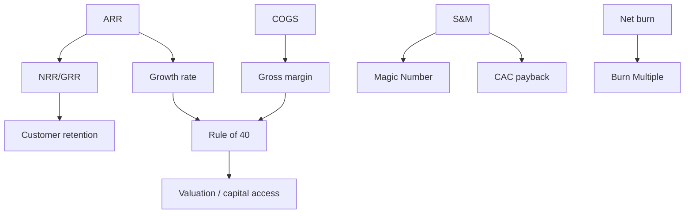


## What you'll learn
- The canonical SaaS metrics - ARR, MRR, NRR, GRR, magic number, burn multiple, rule of 40 - and what each measures.
- How the metrics relate to each other (the "metric tree") and which ones drive the others.
- What "good" looks like by stage and what gaming each metric looks like.
- Where engineering work shows up in each metric.

## Concepts

A B2B SaaS company's quarterly board deck has roughly the same 10 metrics every quarter. The metrics form a *tree*: revenue at the root, broken down into components, each of which has its own diagnostic value. Once you can read the tree fluently, exec reviews become legible.

### Annual Recurring Revenue (ARR) and MRR

**ARR** is the annualised value of recurring subscription contracts. A company with 1,000 customers at $100k annual contracts has $100M ARR. ARR is the most-quoted private-company SaaS metric - it's the "size" of the company.

**MRR** is the monthly version, used by smaller or earlier-stage companies. ARR = MRR × 12 for clean subscription companies.

Subtleties:
- ARR excludes one-time fees, professional services revenue, and other non-recurring revenue.
- ARR includes signed contracts even before revenue is recognised; revenue is the GAAP measure.
- ARR can include "committed" but not yet active contracts in some definitions - read the definition before believing the number.

For usage-based companies, the analogous metric is "annualised run-rate revenue" - usage trends projected forward. Less stable, but the closest equivalent.

### Net Revenue Retention (NRR) and Gross Revenue Retention (GRR)

These are the most important retention metrics in modern SaaS. Both measure what happens to the cohort of customers you had at the start of a period over the period.

```text
GRR = (Revenue from start-of-period cohort, at end-of-period, BEFORE expansion) / 
      (Revenue from start-of-period cohort, at start-of-period)
```

GRR captures *only the losses* - churn and contraction. It's capped at 100%. A GRR of 92% means you lost 8% of last year's revenue to churn and contraction (e.g. customers downgrading).

```text
NRR = (Revenue from start-of-period cohort, at end-of-period, INCLUDING expansion) / 
      (Revenue from start-of-period cohort, at start-of-period)
```

NRR includes expansion. It can exceed 100%. NRR > 100% means existing customers grew faster than others churned. This is the metric VCs prize most for usage-based companies.

What "good" looks like:

| Segment | Good GRR | Good NRR |
|---|---|---|
| SMB SaaS | 80-90% | 100-110% |
| Mid-market SaaS | 90-95% | 110-120% |
| Enterprise SaaS | 95%+ | 115-125% |
| Usage-based | n/a (different framing) | 120-140% |

A NRR of 120% means existing customers compound by 20% annually with no new sales. Companies with NRR > 130% are highly prized - they have a structural growth engine inside their existing base.

### Logo retention

Distinct from revenue retention. *Logo retention* = % of customers (by count) retained. Useful because customer count and customer value can diverge - a company can have low logo retention but high NRR if it loses small customers and expands large ones.

For B2B SaaS, annual logo churn of 5-7% is healthy; >15% is concerning.

### Magic Number

```text
Magic Number = (Net new ARR this period × 4) / (S&M spend last period)
```

Effectively the ratio of S&M efficiency: for every dollar spent on sales and marketing, how many dollars of annualised new revenue did you get?

Interpretation:

| Magic Number | Read |
|---|---|
| < 0.5 | Inefficient - fix or slow growth |
| 0.5-0.75 | Acceptable - typical growth-stage |
| 0.75-1.0 | Good - efficient growth |
| > 1.0 | Excellent - could pour more capital into S&M |

The 4x multiplier comes from "annualise the quarter." Engineering investments in PLG (lower CAC), product (better conversion), and reliability (lower churn → higher net new) all affect magic number.

### Burn Multiple

```text
Burn Multiple = Net Burn / Net New ARR
```

How many dollars of cash burn the company is taking on per dollar of new ARR added. Lower is better.

| Burn Multiple | Read |
|---|---|
| < 1 | Outstanding - burning less than $1 to add $1 ARR |
| 1-1.5 | Healthy growth-stage |
| 1.5-2 | Acceptable in good environments |
| > 2 | Capital-intensive - risky outside zero-interest-rate eras |

Burn multiple became a more popular metric after 2022 when capital got expensive. Pre-2022 companies could burn 3-5x and still be funded. Post-2022, burn multiple <1.5 is the bar most boards expect at growth stage.

### Rule of 40

```text
Rule of 40 = YoY Revenue Growth Rate (%) + Operating Margin (%)
```

A composite. The premise: at growth stage, the sum of growth rate and operating margin should exceed 40. A company growing 50% YoY with -10% operating margin scores 40 - acceptable. A company growing 20% YoY with 20% operating margin also scores 40 - also acceptable.

The rule encodes a trade-off: high growth justifies losses; high profitability justifies slower growth. It collapses if both are bad.

Public software companies are evaluated against rule of 40 in nearly every analyst note. The bar shifts with the market - in bull markets, 30 is the floor; in bear markets, 50 is.

### Other commonly-tracked metrics

- **CAC payback period** - covered in [Module 1 Chapter 4](/courses/engineers-mba/01-foundations-business-os/04-unit-economics/). Typically 12-24 months for healthy SaaS.
- **Gross margin** - covered in [Module 1 Chapter 2](/courses/engineers-mba/01-foundations-business-os/02-reading-a-pnl/). 70-85% for pure SaaS.
- **Sales productivity** - average ARR per quota-carrying rep per year. $1-2M for enterprise; $500k-$1M for mid-market.
- **Free-to-paid conversion** (PLG only) - 1-5% of free signups become paying customers.
- **Time to value** - minutes/hours/days from signup to first useful action. PLG companies obsess over this.

### How the metrics relate

The metrics form a tree:

```text
Revenue (root)
├── New ARR
│   ├── Number of deals (pipeline metrics, win rate)
│   └── Average deal size (pricing, packaging)
├── Expansion ARR (from existing)
│   ├── Seat/usage growth (product engagement)
│   └── Tier upgrades (pricing/packaging)
├── Contraction ARR
│   └── Downsells, downgrades (product utility)
└── Churn ARR
    └── Logo churn × ARR per lost logo

Costs
├── COGS (gross margin) - infrastructure, support
├── R&D - product engineering
├── S&M - sales, marketing
└── G&A - overhead
```

Engineering moves several metrics:

- **Reliability** → reduces churn → improves NRR, GRR.
- **Performance** → improves NRR via reduced contraction, improves CAC payback via reduced sales cycle.
- **Onboarding** → improves time-to-value → improves free-to-paid conversion.
- **Infrastructure cost** → improves gross margin → improves rule of 40.
- **Feature breadth** → enables tier upgrades → improves expansion ARR.

### Gaming the metrics

Every SaaS metric can be gamed. Common patterns to recognise:

| Metric | Gaming pattern |
|---|---|
| ARR | Including non-recurring revenue; including unsigned LOIs; including discount-heavy contracts at full price |
| NRR | Choosing cohort boundaries favourably; including upgrades from one-time fees |
| Magic Number | Excluding marketing spend; using "blended" CAC |
| Burn Multiple | Excluding stock-based compensation from burn |
| Rule of 40 | Using non-GAAP operating margin (strips out SBC) |
| CAC payback | Using marketing-only CAC instead of fully-loaded |

The signal of gaming: when management changes definitions between quarters or uses different definitions from their public peers. The cure: always ask for the definition.

## Walkthrough

A worked example. Company X reports:

```text
ARR: $200M (up from $150M last year = 33% growth)
Gross margin: 78%
NRR: 115%
GRR: 92%
Magic number: 0.8
Burn multiple: 1.4
Operating margin: -5%
Rule of 40: 33 + (-5) = 28
```

What this tells you:

1. **NRR of 115% with GRR of 92%** - existing customers contract by 8% but grow by 23%, net 15%. The business has a real expansion engine.
2. **Magic number 0.8** - decent S&M efficiency.
3. **Burn multiple 1.4** - healthy for growth stage. The company is burning $14k for every $10k of new ARR - sustainable.
4. **Rule of 40 = 28** - below the bar of 40. The company is growing fast but burning more than the growth justifies. Either growth needs to accelerate or burn needs to come down.
5. **The diagnostic conversation**: how do we get rule of 40 to 40? Either raise growth from 33% to 45% (hard) or improve margin from -5% to +7% (also hard but more controllable). Or both.

This kind of read happens in every board meeting. Once you can do it, you can follow the conversation.

## How it fits together



## Common pitfalls

| Pitfall | Why it happens | Fix |
|---|---|---|
| Conflating ARR with revenue | They differ by deferred revenue and timing | Watch both; the gap signals growth velocity. |
| Reporting NRR without GRR | Hides churn behind expansion | Always look at both; large NRR-GRR gaps reveal aggressive expansion masking weak retention. |
| Magic Number with non-fully-loaded S&M | Looks better | Fully-loaded includes sales benefits, sales-engineering time, G&A allocation. |
| Rule of 40 with non-GAAP margin | Strips SBC from costs | Both GAAP and non-GAAP versions matter; read both. |
| Comparing across stages | A $10M ARR company has different bars than a $1B ARR company | Use stage-appropriate benchmarks. |

## Exercises

1. For your own company, list the 5 metrics most quoted in the last board meeting. For each, write down the definition you understand and verify it with finance. Many discrepancies surface in this exercise.
2. Compute the rule of 40 for a public SaaS company from their latest 10-K. Check it against the analyst consensus number - small differences reveal definitional choices.
3. List 3 engineering investments your team made in the last year. For each, identify which SaaS metric it should have moved. Then check if there's a measurement of whether it did. Most teams discover the measurement was never set up.

## Recap & next

- The SaaS metric tree organises ARR, NRR, GRR, magic number, burn multiple, and rule of 40 into a coherent hierarchy.
- Each metric has standard ranges by stage; trend matters more than absolute number.
- Engineering work moves specific metrics: reliability → churn → NRR/GRR; performance → time-to-value → conversion; infra cost → gross margin → rule of 40.
- All metrics are gameable; ask for definitions and compare to peers.

Next, **Operating cadence: OKRs, planning, business reviews** - the annual/quarterly/monthly rhythm of a software company.

