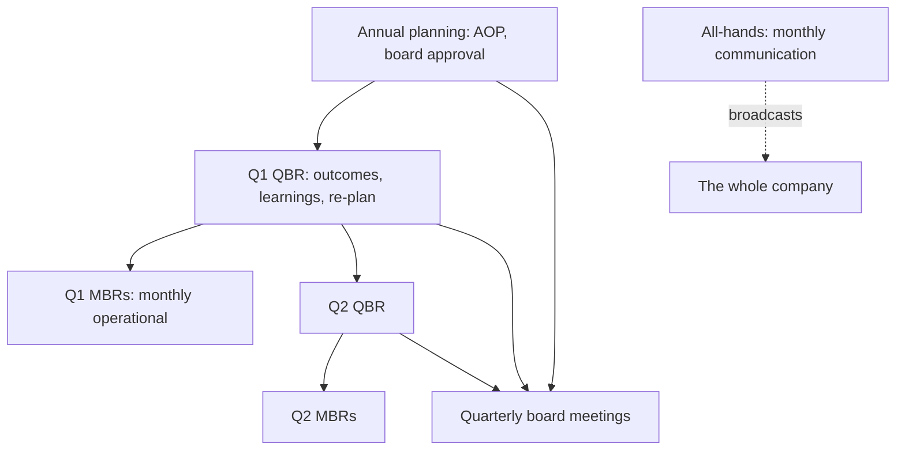


## What you'll learn
- The annual / quarterly / monthly rhythm of a software company and the purpose of each forum.
- OKRs vs. KPIs, what they're for, and how they go wrong.
- What actually happens in a Quarterly Business Review (QBR), a board meeting, and an all-hands.
- How engineering plugs into the cadence and what to bring to each meeting.

## Concepts

Every company that grows past 50 people develops an *operating cadence* - a recurring rhythm of planning, reviewing, and adjusting. The cadence is invisible from the outside but structural inside. Engineers who don't recognise the cadence often miss the windows where strategy is set, budgets are decided, and big bets are funded.

The cadence operates at three time scales: annual, quarterly, monthly. Different decisions happen at different scales.

### Annual: planning + board approval

The **Annual Operating Plan (AOP)** is the year's commitment to the board. It includes:
- Revenue targets by segment, by quarter
- Spend by department (headcount, S&M, infrastructure)
- Strategic priorities for the year
- Major capital allocation decisions (acquisitions, new offices, new products)

The AOP is built bottom-up *and* top-down: each function proposes a plan, leadership reconciles them, and the board approves the consolidated version. The process typically runs September-November for January-start fiscal years. The work is intense - every team submits multiple drafts, head-counts get fought over, budgets get cut, strategic bets get prioritised or killed.

Engineering's role in AOP: headcount requests, infrastructure capex projections, major platform/migration plans, R&D allocation by product line. Engineering leaders should be active drivers, not passive recipients - the AOP often defines what engineering can and cannot work on for the year.

### Quarterly: business reviews and re-planning

The **Quarterly Business Review (QBR)** is the most regular strategic conversation. Each function presents:
- Performance vs. plan for the quarter
- Outlook for the next 1-2 quarters
- Key risks and asks
- Strategic learnings from the quarter

QBRs run 1-3 days, typically with the leadership team and senior managers. Pre-reads are distributed in advance - sometimes 6-pagers, sometimes deck-form. The discussion is supposed to be *strategic*, not operational. (When it slides into operational, that's a sign the company is in trouble.)

Engineering at QBR: present roadmap progress and outcomes, flag strategic risks (e.g. a major architectural concern), make asks (capital, time, prioritisation). The most senior engineers attending QBR usually represent a specific business unit or product area.

### Monthly: business reviews (MBRs)

The **Monthly Business Review (MBR)** is shorter and more operational. Each function reports on:
- Last month's actuals
- Funnel and pipeline metrics
- Operating issues and corrective actions
- Items requiring leadership decisions

MBRs typically run half a day. They're less strategic, more diagnostic. The MBR is where missed quotas, slipping deadlines, and operational drift surface.

Engineering at MBR: usually a slide on uptime, incident summary, and roadmap progress. Sometimes a deeper dive if engineering is the operational bottleneck.

### Board meetings (quarterly, usually)

For private companies, the board meets quarterly. The board pre-read (a "board deck") goes out 5-7 days before the meeting. It covers:

- CEO's strategic update
- Financial performance (the metric tree from [Chapter 4.1](/courses/engineers-mba/04-operating-a-software-business/01-saas-metric-tree/))
- Functional updates (product, sales, marketing, customer success)
- Major risks and asks
- Specific board decisions required

Boards rarely make tactical decisions. Their job is to: (a) validate strategic direction, (b) approve major capital allocations, (c) hire/fire the CEO, (d) provide strategic guidance.

Engineering rarely presents to the board directly. The CTO sometimes does, on architectural strategy or platform investments. The board is interested in engineering *outcomes* (does the platform scale? are major risks managed?), not engineering *details*.

### The all-hands

A different kind of cadence event. The all-hands is communication, not decision-making. It typically happens monthly, with the full company in attendance. The CEO communicates:
- Strategic direction and updates
- Key wins and losses
- Major announcements
- Sometimes Q&A

For engineering, all-hands is mostly listen-mode. The signal value is high - the CEO's framing of priorities tells everyone what matters. A change in framing (e.g. shifting from "growth above all" to "profitable growth") is often the first signal of strategic re-direction.

### OKRs vs. KPIs

These are different tools for different purposes.

**KPIs (Key Performance Indicators)** are *steady-state operational metrics*. NRR, uptime, p99 latency, pipeline coverage. They run continuously and answer "how is the operation performing?" KPIs have targets but the targets stay relatively stable. Missing a KPI target prompts an investigation; chronically missing one prompts a structural fix.

**OKRs (Objectives and Key Results)** are *change-oriented goals* with a time horizon. They typically run quarterly or annually. An objective is qualitative ("Become the standard observability platform for fintech"); key results are quantitative ("Win 10 fintech logos over $100k ACV"; "Publish 3 industry-recognised case studies"). OKRs answer "what are we trying to change?"

The most common OKR mistake: writing OKRs that are really KPIs (steady-state targets). The result is meaningless because there's no change being driven.

A good OKR for an engineering team might be:

```text
Objective: Reduce customer-reported reliability incidents by half
KR1: P0/P1 incident rate < 1/month (currently 2.3/month)
KR2: MTTR for P1 incidents < 30 minutes (currently 78 minutes)
KR3: Customer satisfaction score for "reliability" > 4.2/5 (currently 3.6)
```

Note: each KR has a clear target with a baseline, and the objective is genuinely a change-effort with a defined success.

A bad OKR for the same team:

```text
Objective: Improve reliability
KR1: 99.95% uptime
KR2: Reduce incidents
KR3: Faster response to outages
```

This is a steady-state KPI dressed up as an OKR. The targets are either pre-existing or undefined; there's no theory of change.

### What to bring to each forum

A practical guide for engineers attending:

| Forum | Bring | Don't bring |
|---|---|---|
| Annual planning | Strategic engineering bets, headcount requests, infra plan | Sprint-level details |
| QBR | Roadmap outcomes, strategic risks, asks | Code-level discussion |
| MBR | Operational metrics, incident summary | Architectural debates |
| Board meeting | Architecture-level strategic story (rare, when invited) | Technical jargon |
| All-hands | Listen-mode | (Usually nothing to bring) |
| 1:1 with manager | Anything not on this list | (Anything fits here) |

The mismatch - bringing operational details to QBR or strategic debates to MBR - is one of the most common engineering communication mistakes.

## Walkthrough

A worked example. You're a senior engineer asked to present at an upcoming QBR. The CTO says "5 minutes on what your team did this quarter."

**Wrong approach** (operational):
> "Our team shipped 47 PRs, reduced flaky tests by 30%, ran 12 incidents, and migrated 60% of services to the new gateway."

This is great work, completely misaligned with the audience. Sales leadership doesn't know what a gateway is. The CEO is mentally checked out by minute 2.

**Right approach** (strategic):
> "Three things this quarter. First, we cut incident rate in half - which the customer success team confirms reduced support tickets by 30% and contributed to our NRR uptick. Second, we shipped the SSO/SAML support enterprise pipeline has been asking for; the deal team confirmed it unblocked $4M of stalled pipeline. Third, the platform migration is at 60% - on track for end of next quarter - which will let us launch the API platform on the new infrastructure. Risks: we have one senior engineer leaving and the gap in distributed-systems expertise is the biggest single risk to next quarter's commitments."

Same work, completely different impact. The frame is:
- Outcomes, not output
- Business metrics moved, not engineering metrics
- Asks and risks in business terms, not technical terms
- Calibrated to the audience's mental model

This is the translation skill that [Module 6 Chapter 1](/courses/engineers-mba/06-technical-leaders-playbook/01-translating-engineering-to-business/) covers in depth. It's the difference between engineering work being valued at the exec table and being invisible.

## How it fits together



## Common pitfalls

| Pitfall | Why it happens | Fix |
|---|---|---|
| Engineering absent from annual planning | "We just build what's asked" | The AOP defines what you'll work on; show up early and shape it. |
| Bringing operational details to QBR | Default to what you know | Translate to business outcomes; leave engineering details to MBR. |
| KPIs disguised as OKRs | Confusion of intent | OKRs are change goals; KPIs are operational metrics. Separate. |
| Missing the cadence calendar | "I wasn't told" | The cadence is public; ask for it and put it in your calendar. |
| Treating board meetings as theatre | "Board doesn't get involved in details" | Board questions surface strategic concerns; track and address them. |

## Exercises

1. Find your company's operating cadence calendar. If you can't find it, ask your manager to walk you through the annual rhythm. Many engineers have never seen it laid out.
2. Read the last board deck (or annual plan, if accessible). Identify the engineering asks and commitments. Note any gaps between what your team is doing and what the company committed externally.
3. For your own team's OKRs, classify each KR as "actual change goal" or "steady-state KPI in disguise." Most teams find 30-50% are disguised KPIs. Rewrite at least one to be a genuine change goal.

## Recap & next

- The operating cadence runs at three time scales: annual (planning), quarterly (QBRs, board), monthly (MBRs, all-hands).
- OKRs are change goals; KPIs are operational metrics. They're different tools for different purposes.
- What to bring to each forum differs sharply by audience and scope.
- Engineering presence in strategic forums (especially annual planning and QBR) shapes what gets funded and prioritised.

Next, **Org design as you scale** - how the org chart silently sets strategy, and why Conway's law runs in both directions.

