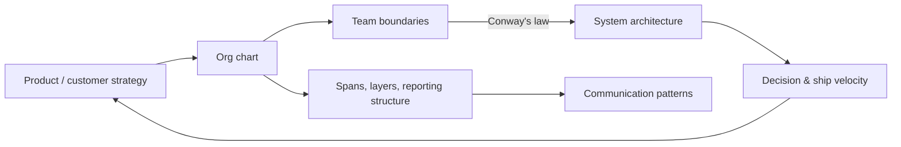


## What you'll learn
- The three canonical org structures - functional, divisional (product-line), matrix - and what each is good at.
- Two-pizza teams, spans and layers, and the geometry of how many people one manager can run.
- Conway's law and its inverse, and why org design is a strategic choice not an HR detail.
- The signs that an org needs to reorganise and the costs of doing it.

## Concepts

The org chart is one of the most under-respected strategic documents in any company. It silently determines what gets built, what gets neglected, what conversations are easy, and what conversations are nearly impossible. Engineers who don't read the org chart strategically miss most of the operational truth of their company.

### The three canonical structures

**Functional.** People grouped by *function*: engineering, product, design, sales, marketing, finance. Each function has its own leadership. Cross-functional work happens via coordination meetings and shared OKRs.

Strengths: deep functional expertise, efficient career ladders, clear specialisation. Most useful when the company has *one product* and *one customer segment*.

Weaknesses: cross-functional coordination is expensive. Functions optimise for their own metrics, not for the business outcome.

**Divisional / product-line.** People grouped by *product or business unit*: each division has its own engineering, product, design, marketing, sales. Divisions operate semi-independently with shared services (finance, HR, sometimes platform).

Strengths: faster product velocity, clearer ownership, easier accountability. Most useful when the company has *multiple products* or *multiple customer segments* that operate differently.

Weaknesses: duplicated effort, divergent technical decisions, organisational politics over shared resources.

**Matrix.** People report to *both* a functional manager and a product/division manager. The functional manager owns career growth and craft; the product manager owns delivery and outcomes.

Strengths: combines functional depth with product accountability. Most useful when products need shared infrastructure but have distinct customer focus.

Weaknesses: dual reporting is confusing, decision-making slower, perceived political. Many companies adopt matrix in name but operate functionally or divisionally underneath.

Most large software companies *evolve* through these structures:

1. **Early stage (0-50 people):** flat, ad-hoc. Roles are fluid.
2. **Functional (50-300):** product, engineering, sales, marketing have clear boundaries.
3. **Hybrid functional-divisional (300-1000):** product engineering organised by product line, but platform/infra/security remain functional.
4. **Matrix or full divisional (1000+):** business units have full P&L responsibility; only true platform stays shared.

### Two-pizza teams

Amazon's leadership principle that no team should be larger than two pizzas can feed (5-9 people). The constraint forces:
- Small, focused teams with clear scope
- Each team owns a service, deployment, and on-call
- Inter-team contracts via API, not shared code
- Decision velocity is high; coordination overhead is low

Two-pizza teams scale well because the *team* is the unit of organisation. Adding people means adding teams, not enlarging them. The pattern works best when service boundaries align with business boundaries (Conway's law, below).

The downside: small teams need to be self-sufficient on many dimensions, which requires investment in platforms, tooling, and shared infrastructure. Two-pizza teams without good platforms produce duplicated infrastructure across the company.

### Spans and layers

**Span of control** = number of direct reports per manager. **Layers** = number of management levels from CEO to IC.

The empirical findings:
- Span of 5-9 is the sweet spot for engineering management
- More than 9 directs and the manager loses depth on each report
- Fewer than 5 directs and the manager has too little to do (often a sign of an unnecessary layer)
- 7-10 layers is typical at 10k employees; 4-5 layers at 1k; 3-4 at 200

Each layer adds:
- Communication delay (information takes longer to propagate up and down)
- Translation loss (the message changes at each layer)
- Bureaucratic overhead (each layer wants to be involved in decisions)
- Career stagnation (slow promotion velocity)

The trade-off: more layers = more management capacity, but slower decisions. The right number is whatever supports your decision velocity.

### Conway's law

> "Organisations design systems that mirror their communication structure."
> - Melvin Conway, 1968

The system architecture and the org chart converge. A company with three teams will produce a system with three major components and interfaces matching their team boundaries. A company that reorganises into product divisions will, within 12-18 months, see its architecture restructure along those lines.

The inverse is even more useful: *if you want a specific architecture, design the org chart accordingly*. Want microservices with clean APIs between them? Form teams owning each service. Want a monolith with tight integration? Form one large team. The architecture follows the org.

This insight is one of the most underused tools in engineering leadership. Reorganisations are often done for HR/management reasons; the strategic version is to reorganise to *enable* an architecture or product strategy.

Example: many companies migrating from monolith to microservices fail because they reorganise the codebase without reorganising the teams. The result is microservices that are jointly owned (or unclearly owned), which is worse than a single monolith.

### Reorgs: when and why

Reorgs happen for several reasons:

| Reason | Quality |
|---|---|
| Architecture/strategy shift | Often good |
| New leadership wants to leave a mark | Often bad |
| Performance management at scale | Sometimes necessary |
| Mergers and acquisitions | Necessary but disruptive |
| Decision velocity has slowed | Often good |
| Customer segment expansion | Often good |

Reorg costs are usually underestimated:
- 6-12 months of slowed delivery
- Some attrition of senior people who land badly
- Erosion of trust in leadership if reorgs are frequent
- Knowledge loss as relationships re-form
- Reinvestment in tools, processes, runbooks per the new structure

The empirical guidance: reorgs should be rare (every 18-24 months at most), explicitly tied to a strategic shift, and communicated with the *reasoning* not just the new chart.

### Reading the org chart

A useful exercise: read the org chart, looking for these structural features:

| Pattern | What it suggests |
|---|---|
| Engineering reports through Product | Product-led culture |
| Engineering reports separately to CEO | Engineering-led culture, often platform-heavy |
| Sales reports directly to CEO | Sales-led culture |
| Customer Success in Sales | Revenue-focused CS (renewal-driven) |
| Customer Success in Product/Eng | Product-focused CS (success-driven) |
| Platform team owns CI/CD | Platform investment is real |
| No platform team | Either too small or in for trouble |
| 12+ direct reports to CEO | Often a transitional state; layer addition coming |
| Disproportionate G&A | Often a sign of operational dysfunction |

The org chart is the strategy in human form. A skeptic reading the org chart can often predict the next year's priorities without reading any planning documents.

## Walkthrough

A worked transition. A 200-person SaaS company at $30M ARR is reorganising. Current structure:

```text
CEO
├── Eng (40 people, functional)
│   ├── Frontend
│   ├── Backend
│   ├── Mobile
│   ├── Platform
│   └── QA
├── Product
├── Design
├── Sales
├── Marketing
└── CS
```

Problems:
- Cross-functional coordination is slow
- Backend team is a bottleneck for everything
- Product roadmap items take 3+ teams to ship
- Customer feedback gets diluted across many engineering teams

The proposal: reorganise into three product-line teams, each with its own frontend, backend, design, and product, plus a shared platform team.

```text
CEO
├── Product Eng (3 product lines: Core, Integrations, Analytics)
│   ├── Core (8 people: frontend, backend, design, PM)
│   ├── Integrations (8 people: similar mix)
│   └── Analytics (8 people: similar mix)
├── Platform Eng (10 people: shared infra, tooling, mobile core)
├── Design (centralized leadership; ICs embedded in product lines)
├── Sales
└── ...
```

Trade-offs of the new structure:

| Gain | Cost |
|---|---|
| Each product team owns the full stack | Some duplicated engineering (3 frontend teams) |
| Faster product velocity | Less depth in functional craft |
| Clearer ownership and accountability | Mobile expertise consolidates in platform - slower for product teams |
| Customer feedback maps to single owner | Some technical debt risk per product line |

This is a *Conway's law-aware* reorg: the team structure is being designed to produce the product architecture. The platform-team carve-out is a strategic decision - shared infrastructure will be owned by a dedicated team, preventing duplication.

The reorg will cost 6-9 months of delivery slowdown. The argument for doing it: the current functional structure is the bottleneck for the next $30M of ARR. If the diagnosis is wrong, the company gets the slowdown without the benefit.

## How it fits together



## Common pitfalls

| Pitfall | Why it happens | Fix |
|---|---|---|
| Reorg without strategy shift | Defaulted to "things feel slow" | Tie every reorg to a specific outcome you can measure 12 months later. |
| Architectural change without org change | "We'll just restructure the code" | The team structure has to support the architecture; Conway's law is real. |
| Excess layers | Each promotion adds one | Audit periodically; flatten when spans drop below 5. |
| Matrix in name only | "We'll just say it's matrix" | A matrix that operates as a functional org has matrix overhead with functional weaknesses. |
| Reorging every 6 months | New leadership keeps re-shuffling | Reorgs should be every 18-24 months max; more often signals leadership churn. |

## Exercises

1. Draw your company's org chart from memory. Compare with the official version. Note where your team's actual collaboration patterns don't match the chart - these are usually informal coordination channels worth understanding.
2. Identify three engineering decisions in the last year that were silently shaped by org structure (e.g. "we built this service because Team X owned this layer"). Note how a different org would have produced different decisions.
3. For an architectural change your team wants to make, ask: does the org chart support this architecture? If not, can the org be adjusted, or does the architecture need to change?

## Recap & next

- Three canonical structures - functional, divisional, matrix - fit different stages and strategies.
- Two-pizza teams scale via service ownership; spans of 5-9 are the sweet spot.
- Conway's law: the org chart and the architecture converge. The inverse is a strategic tool.
- Reorgs cost 6-12 months of velocity; tie them to strategic shifts, not to leadership preference.

Next, **Headcount, capacity & the cost of an engineer** - why hiring is a multi-million-dollar strategic decision.

