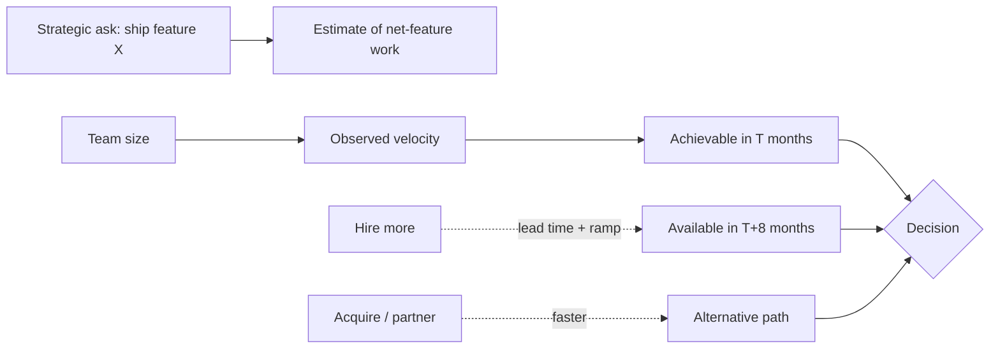


## What you'll learn
- The fully-loaded cost of an engineer - what goes into the number beyond base salary.
- The difference between *capacity* and *velocity* and why mistaking one for the other causes chronic over-commitment.
- Hiring lead times, ramp curves, and why "we'll hire faster" isn't a real plan.
- Headcount as a capital decision: why one engineering hire is structurally a multi-million-dollar commitment.

## Concepts

Engineers experience headcount decisions as HR events. From a business perspective, they're capital decisions. A senior engineer at a US tech company is a 3-5 year commitment of ~$400-500k/year fully-loaded - easily $1.5-2.5M in capital deployed per hire. By that math, the question "should we hire 3 more engineers?" is the same capital allocation question as "should we spend $5M on a new product line?" - and should get the same level of analytical rigour.

Most companies don't treat it this way. Headcount sneaks past board approval as "operating expense growth" while a $5M cap-ex project requires a memo and a vote. The asymmetry is one of the structural inefficiencies of how software companies are run.

### Fully-loaded cost

The visible cost of an engineer is base salary. The fully-loaded cost is several multiples of that. A US-based senior engineer at a typical SaaS company might look like:

```text
Base salary                                $200,000
Bonus (target)                              $30,000
Equity (annual vest, fair-value at grant)   $80,000
Employer payroll taxes (~7.65% + state)      $18,000
Health benefits (~$10-25k depending on family)  $18,000
401k match (3-6%)                             $9,000
Other benefits (life, disability, FSA, etc)   $5,000
                                            ────────
Direct comp + benefits                    $360,000

Allocated overhead:
  Office, equipment, software licenses      $15,000
  HR, recruiting, IT, finance allocation    $20,000
  Engineering management/leadership            $30,000
                                            ────────
Fully-loaded annual cost                  $425,000
```

The number varies by role, location, and company. Levels.fyi-style total comp is closer to "comp" than "fully-loaded." A staff engineer at a top tech company costs the company ~$700k-1M/year fully-loaded. A junior engineer in a lower-cost region might be ~$150k.

When engineers compute "is this project worth it?" they almost always use comp, not fully-loaded cost. The factor is typically 1.5-2x. A project that "costs 2 engineers × 6 months = $200k of salary" is closer to $400k of capital.

### Capacity vs. velocity

A confusion that drives chronic over-commitment.

**Capacity** = the maximum amount of work the team *can* do under ideal conditions.

**Velocity** = the *sustained* rate of work the team actually produces over time.

These differ by 30-60% for most engineering teams. The reasons:
- Time spent on operational work (oncall, support, bugs)
- Time spent on coordination (meetings, reviews)
- Time spent on hiring, mentoring, document writing
- Recovery time from intensive sprints
- Holidays, sick days, time off

A team of 6 engineers has *capacity* of ~6 × 50 hours/week × 50 weeks = 15,000 person-hours/year. Its *velocity* is typically 6,000-8,000 useful person-hours/year of net-new feature work. The remainder is the support and operational work that keeps the company running.

Planning based on capacity is the cause of most engineering over-commitment. The fix is straightforward: plan based on observed velocity, not theoretical capacity, and reserve 30-40% for non-feature work.

### Hiring lead times

"We'll hire" is rarely a fast answer to a capacity gap. Empirically:

| Role | Time from open req to seated | Time to productive |
|---|---|---|
| Junior engineer | 6-8 weeks | 2-3 months |
| Mid-level engineer | 8-12 weeks | 3-4 months |
| Senior engineer | 12-20 weeks | 4-6 months |
| Staff/principal | 16-24 weeks | 6-9 months |
| Engineering manager | 12-20 weeks | 3-6 months |

The "time to productive" is when the new hire is producing *net positive* value - accounting for the time existing engineers spend onboarding them, the slowdown from their early code, and the time they spend learning. Most new senior engineers don't break even until month 4-6.

The implication: "we'll hire 5 more engineers and be back on schedule" is rarely a real plan. By the time the engineers are productive, the gap has compounded. Hiring is a 6-12 month investment in *next year's* capacity, not a fix for this quarter's gap.

### Headcount as a capital decision

A useful reframing: a hiring decision is a multi-year capital commitment. The structural framing:

- Hiring 1 senior engineer = $400-500k/year × ~3-5 years = $1.5-2.5M
- Hiring a team of 5 = $7-12M of capital allocated to one product/area
- The reversal cost is significant: layoffs damage culture, the company's hiring brand, and morale for years

For comparison: a $5M capex project on physical infrastructure would require a board memo, sponsor, ROI analysis, and explicit approval. The hiring decision, of equivalent capital cost, often goes through as "engineering team expansion for the year" with little equivalent scrutiny.

The corrective discipline: treat headcount requests with the same rigour as cap-ex. Each request should answer:

- What outcome does this team enable that we can't otherwise achieve?
- What's the expected ROI? (Hard to compute, worth attempting.)
- What's the alternative use of this capital?
- What's the kill criteria if it doesn't work?

Some companies (Stripe, Notion, others) explicitly model headcount as capital allocation. Many don't, and the structural inefficiency shows up in over-hiring during bull markets and painful layoffs during bear markets.

### What a feature actually costs

A useful exercise: cost a feature accurately.

```text
Feature: SSO/SAML integration

Engineering: 2 senior engineers × 3 months
  = $400k × 2 × 0.25 = $200k loaded cost
Product: 1 PM × 1 month
  = $250k × 0.083 = $21k
Design: 1 designer × 2 weeks
  = $200k × 0.04 = $8k
QA: 1 engineer × 3 weeks
  = $250k × 0.06 = $15k
Documentation: tech writer × 2 weeks
  = $200k × 0.04 = $8k
Customer support training: support team × 5 hours each (10 people)
  = $100k × 0.0025 × 10 = $2.5k
Sales training: sales team briefing
  = $5k of time
Marketing materials, launch content
  = $10k

Total: ~$270k for the feature

Annual maintenance: ~$30k/year (debt, bugs, evolution)
```

The feature cost $270k, with ongoing maintenance of $30k/year. If the feature enables $1M of enterprise ARR over the next year, the math works. If it enables less, or if it could have been delivered by a $50k SaaS integration, the build decision was wrong.

The exercise alone improves engineering's strategic conversations. Most engineering teams have never costed a feature accurately, which is one reason "build vs buy" debates lean reflexively to build.

## Walkthrough

A worked headcount conversation. The CEO asks the VP Eng: "Can you ship the new analytics product by Q3?"

**The honest answer:**
> "Currently the platform team is 6 engineers. Velocity is ~6,000 hours/year of net feature work. The analytics product is estimated at ~12,000 hours of net feature work. That's two years of velocity at current size, or one year if we double the team.
>
> To double the team, we need to hire 6 senior engineers. At 16-week req-to-seated and 4-month time-to-productive, that's 8 months before they're producing useful work. So a 'double the team' plan reaches productive size around Q2 next year, and ships Q3 next year - not this Q3.
>
> Alternative options:
> 1. Ship the analytics product Q4 next year with current team size (more realistic).
> 2. Ship a minimum version Q3 this year with current team, full version a year later.
> 3. Acquire a small analytics startup ($5-10M, see [Module 2 Chapter 4](../02-strategy/04-build-buy-partner.md)) - possibly faster to market.
> 4. Pull from other product teams temporarily, accepting their roadmaps slip.
>
> My recommendation: option 2 (MVP Q3 + full Q3 next year). Option 3 is worth investigating in parallel."

This response reframes "can we hire to fix this?" as a real cost conversation. Most VPs are bad at this framing. The ones who get good at it become CTOs and CEOs.

## How it fits together



## Common pitfalls

| Pitfall | Why it happens | Fix |
|---|---|---|
| Using comp instead of fully-loaded cost | Visible number, easy default | Fully-loaded is 1.5-2x comp; use it in business cases. |
| Planning by capacity not velocity | Engineering optimism | Use observed velocity; reserve 30-40% for non-feature work. |
| "We'll hire faster" as a plan | Wishful | Hires take 6-12 months to be net positive; not a quarterly fix. |
| Skipping headcount business cases | "It's just OpEx growth" | Treat each hire as multi-million-dollar capital allocation; require ROI rationale. |
| Confusing layoffs with cost recovery | "We saved $X" | Layoffs damage hiring brand, culture, and trust for 12-24 months; the net cost is larger. |

## Exercises

1. Compute the fully-loaded cost of one of your engineers (your own salary, or a typical senior). Compare with the comp.fyi median for that level. The factor is usually 1.5-2x; verify for your company.
2. For your team, compute observed velocity over the last 4 quarters. Then compare with "capacity" (theoretical). The gap is your non-feature work load - often 30-50%.
3. For one feature shipped in the last year, cost it accurately using the model above. Then estimate the business outcome it produced. The ratio is your true ROI.

## Recap & next

- Fully-loaded engineering cost is 1.5-2x base comp; planning at base understates capital commitment.
- Capacity is the theoretical max; velocity is the sustained rate. They differ by 30-50% on most teams.
- Hiring lead times are 3-9 months by level, with 4-6 months ramp to productive contribution.
- A headcount decision is a multi-million-dollar capital commitment; treat it with the rigour of a cap-ex project.

Next, **Vendor economics & build-vs-buy at scale** - the real math behind "let's build it ourselves," with TCO, switching costs, and integration debt.

