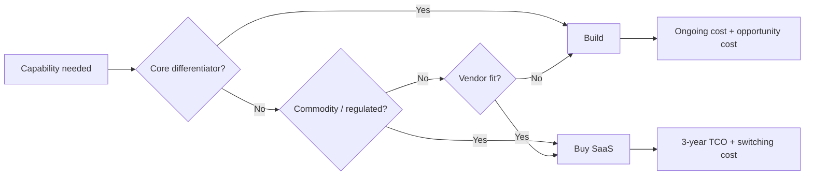


## What you'll learn
- Total Cost of Ownership (TCO) - what to include and what's commonly missed.
- Switching costs, integration debt, and the lock-in math that makes vendor choices semi-permanent.
- Vendor concentration risk and how to manage it.
- The narrow cases where "build it ourselves" actually wins.

## Concepts

The engineering "build vs. buy" question gets revisited about once a year per major tool. The naive version compares "annual SaaS subscription" to "engineering cost to build." The strategic version is much harder - and almost always weighted further toward "buy" than the naive comparison suggests.

### Total Cost of Ownership (TCO)

TCO is the *complete* cost of a tool over its useful life, including hidden costs. The textbook breakdown:

| Cost type | Captures | Often missed |
|---|---|---|
| License / subscription | Direct vendor invoice | - |
| Implementation | Setup, customisation, integration work | Cross-functional time, change management |
| Operation | Ongoing administration, monitoring | Manager time, sprawl across teams |
| Training | Onboarding to the tool | Repeat training as the tool evolves |
| Support contracts | Premium support / dedicated CSM | Internal "support of the support" |
| Compliance / audit | Security and audit overhead | Renewal-cycle reviews, SOC2 questionnaires |
| Switching costs | When you eventually leave | Almost always omitted from initial analysis |

For SaaS tools, the rule of thumb: the 3-year TCO is 1.5-2x the visible subscription cost. For complex tools (CRMs, ERPs, identity providers), 3-year TCO can be 3-5x. For "build it ourselves," the multiplier is much higher because operational and switching costs are dramatic.

### Build vs. buy: the real math

The build case is almost always understated. Here's the typical TCO comparison for a hypothetical "internal auth system":

```text
Option A: Use Auth0 / Okta-style identity provider
  Year 1: $50k subscription + $40k integration work = $90k
  Year 2: $60k subscription + $10k upkeep = $70k
  Year 3: $70k subscription + $10k upkeep = $80k
  3-year TCO: $240k

Option B: Build internal auth
  Year 1: 2 engineers × 9 months @ $450k loaded = $675k
  Year 2: 1 engineer × full-year for ongoing dev/support = $450k
  Year 3: 1 engineer × full-year (security patches, OIDC updates,
          MFA, audit log, etc) = $450k
  3-year TCO: $1.575M

  Plus: opportunity cost of those engineers not building product.
  Plus: ongoing maintenance burden ~$200k/year past Year 3.
  Plus: switching cost if we ever want to migrate later.
```

Build is 6-7x the TCO of buy in this example. The naive comparison ("$50k subscription vs. building it") gets the magnitude wrong by an order of magnitude.

Engineers reflexively underestimate build because:
- Ongoing maintenance gets compressed into "we'll keep it up to date" without sizing.
- Edge cases (compliance, audit, MFA, federation) aren't anticipated.
- The "we'll build a quick MVP" path leaves out the long tail of features the vendor already has.
- Opportunity cost (these engineers not building product) isn't priced in.

### When build does win

Build occasionally is the right answer. The cases:

1. **The capability is core to the product's strategic value.** If "great authentication" is what differentiates the product, building it is justified.
2. **The unit economics demand it.** At very high volumes, the marginal cost of a vendor's pricing becomes prohibitive vs. amortising a build. AWS S3 is an existence proof - eventually scale makes the buy decision flip back.
3. **The vendor can't meet a specific requirement.** Compliance, latency, geographic, integration depth that no vendor offers.
4. **The vendor is unreliable or will go away.** Vendor risk is real; if the only vendor in a category is a 10-person startup, build the critical path internally.
5. **Switching from a vendor we have to leave.** This is a forced build, not a choice.

The pattern: build for things that are core differentiators or where vendor economics genuinely don't work at scale. Buy for everything else.

### Integration debt

When a SaaS vendor is integrated into your product, the integration accumulates as debt over time:

- API contracts may change
- The vendor may deprecate features you use
- Auth and rate-limit assumptions get baked in
- Custom logic written around vendor quirks accumulates
- The "thin wrapper" you wrote becomes the "thick wrapper" no one wants to touch

Integration debt usually surfaces during:
- Vendor pricing changes (you're trapped)
- Vendor outages (you have no fallback)
- Vendor acquisition (terms change)
- Vendor end-of-life (you must migrate)

Mitigation: thin abstractions over each external vendor, with the abstraction matching your domain rather than the vendor's API. This is more work upfront but pays dividends when the vendor switches change.

### Switching costs

The cost of moving from vendor X to vendor Y. The components:

- **Data migration.** Moving accumulated state. Can be huge for stateful systems (CRM, observability, code hosting).
- **Integration re-work.** Every integration written to X must be re-written to Y.
- **Training re-cost.** Users learn the new tool.
- **Operational delta.** Two vendors run in parallel during the cutover.
- **Risk premium.** The new vendor may turn out to be worse; switching back is also costly.

Switching costs are why vendor decisions are semi-permanent. The de facto "we'll switch when we need to" assumption is rarely accurate - most "we'll switch" plans never execute because the switching cost outweighs any annual savings.

### Vendor concentration risk

Relying on a single vendor for critical functionality creates concentration risk:

- The vendor can change pricing (recent example: Twilio's 10x SMS pricing increase in some markets).
- The vendor can be acquired (Stripe Radar becoming part of a different company).
- The vendor can go down (every cloud outage tells this story).
- The vendor can change strategic direction (Meta deprecating APIs).

Mitigation strategies:
- **Multi-vendor by design** for critical path. Multi-cloud is the macro version; multi-CDN is the micro version.
- **Active second-source** - even if you don't use it daily, maintain a tested path.
- **Contractual protections** - price-cap clauses, deprecation notice clauses, data-portability clauses.

The 2022-2024 era taught many companies that "single vendor is fine" was an unhedged risk. Multi-vendor was suddenly important when vendors raised prices and customers were locked in.

### Build / buy / partner - revisited from the engineering side

[Module 2 Chapter 4](../02-strategy/04-build-buy-partner.md) covered build/buy/partner at the strategic level (acquisitions, market entry). The engineering-level version is the same question for individual capabilities. The framework:

| Capability type | Default choice |
|---|---|
| Core to product differentiation | Build |
| Commodity infrastructure | Buy or use cloud |
| Industry-standard (SSO, payments, email) | Buy |
| Specific regulatory or compliance need | Build only if no compliant vendor exists |
| Internal developer tooling | Buy first, build only if no vendor fits |
| Emerging tech (AI, etc.) | Partner first, build later |

The pattern: build the moat-relevant work; buy or partner everything else. Engineering teams that build everything end up with an internal ecosystem of half-built infrastructure that's worse than the vendor versions and consumes 30-40% of engineering capacity.

## Walkthrough

A worked decision. A SaaS company is choosing between using Stripe and building an internal payment processor.

```text
Option A: Use Stripe
  Stripe fees: 2.9% + $0.30 per transaction
  At $50M ARR: ~$1.5M/year in Stripe fees
  Engineering: 1 engineer × 3 months to integrate = $112k
  Ongoing: 0.25 engineer for maintenance = $112k/year

  3-year TCO: ~$5M + $336k engineering = $5.3M

Option B: Build internal payment processor
  Engineering: 8 engineers × 18 months = $5.4M
  Compliance: PCI DSS Level 1 certification = $200k initial, $100k/year
  Banking relationships: Setup $500k, maintenance complex
  Ongoing: 4 engineers full-time = $1.8M/year
  Card-network agreements (Visa, Mastercard): not feasible at this scale
  Fraud detection, dispute resolution, settlement: $1M+ to build

  Year-1 build cost: $7-8M
  Annual operating cost: $2-3M
  3-year TCO: ~$15-20M
  
  Result: 3-5x more expensive than Stripe, with significant operational risk.
```

The build case is wildly unfavourable. Reasons:
- Payments are not the company's differentiator.
- Compliance overhead (PCI DSS) is structural and expensive.
- Card-network agreements are gated at scale most companies don't reach.
- Fraud, disputes, settlement are entire engineering disciplines.

The case for buy is overwhelming. The pattern is general: deeply commoditised, deeply regulated, and operationally complex categories should almost always be bought. Stripe, identity providers (Auth0/Okta), email (SendGrid/Postmark), error tracking (Sentry), feature flags (LaunchDarkly), and payments are the classics.

The build winners: companies where the capability *is* the product (Stripe building its own infrastructure for payments).

## How it fits together



## Common pitfalls

| Pitfall | Why it happens | Fix |
|---|---|---|
| Comparing subscription to engineering build cost | Naive math | Use 3-year TCO with maintenance, switching, opportunity cost. |
| Underestimating ongoing maintenance | "We'll keep it up to date" | A built system requires 0.5-1 FTE/year in steady state per substantial component. |
| Ignoring switching costs in vendor choice | "We can switch later" | Switching costs make decisions semi-permanent. Choose carefully. |
| Single-vendor for critical path | Speed/ease | Critical-path systems should have a second-source plan, even if not actively used. |
| Build to learn (vs. build because we should) | "Engineering wants to" | Learning is a legitimate goal but not for production systems. |

## Exercises

1. Pick three SaaS tools your company uses. For each, estimate the 3-year TCO including hidden costs. Compare to the visible subscription. The factor is usually 1.5-3x.
2. Identify one capability your team built that, in retrospect, should have been bought. What was the rationale at the time? What's the cumulative cost of the build decision so far?
3. For your tier of SaaS vendors, identify which are *concentration risks* - vendors where a price change, outage, or acquisition would seriously damage you. Map the second-source options for the top 3.

## Recap & next

- TCO is 1.5-2x the visible subscription for SaaS; 3-5x or more for build.
- Build is rarely the right answer for commoditised or regulated capabilities; buy for those, build for differentiators.
- Switching costs make vendor decisions semi-permanent; choose with the next 5 years in mind.
- Vendor concentration is a structural risk worth actively managing for critical-path systems.

Next, kicking off **Module 5 - Capital, Risk & Decisions Under Uncertainty**, starting with **Capital allocation: how exec teams actually choose**.

