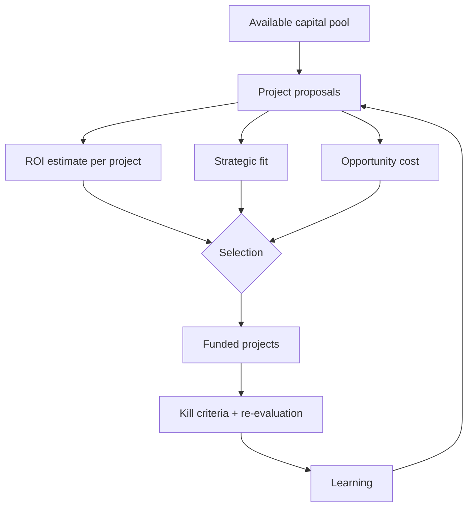


## What you'll learn
- Why a company's available capital is *always* less than the worthwhile projects competing for it.
- The implicit ROI bar - how exec teams compare apples-to-oranges projects, and what your project needs to clear.
- Opportunity cost, sunk-cost traps, and the difference between cancelling and pausing.
- Why most prioritisation frameworks (RICE, ICE, MoSCoW) underdeliver, and what successful teams do instead.

## Concepts

Capital allocation is the question every leadership team revisits, formally or informally, every quarter: *given finite capital, where should we put it?* The capital can be cash (literal $), engineering capacity (engineer-quarters), or executive attention (the scarcest resource at most large companies).

The corollary every engineer needs to internalise: there is *always* less capital than worthwhile projects. The question is never "is this project worth doing?" - it's "is this project worth doing *more than* the alternatives?" Many engineering proposals get approved or rejected on the second question without anyone explicitly stating it.

### The implicit ROI bar

Every exec team has an *implicit* ROI bar - the minimum return a project must clear to get funded. The bar isn't usually written down. It's discovered by watching what gets approved and what doesn't.

Common shape of the bar at different company stages:

| Stage | Typical implicit ROI bar |
|---|---|
| Startup (pre-PMF) | Survival / learning. Almost anything that materially de-risks the business. |
| Growth-stage SaaS | 3-5x return over 2-3 years; or sub-18-month payback; or strategic learning. |
| Mature SaaS | 4-6x return over 3-5 years; harder requirements for strategic bets. |
| Public / mature | NPV-positive with risk-adjusted hurdle rates; bar varies by horizon. |

Engineering projects rarely articulate ROI explicitly. The implicit framing is: *would this customer have churned without this?*, *would this deal close faster?*, *would we hire fewer engineers in five years if we built this platform?*

The skill engineers need: estimate the ROI of their work *before* asking for funding. Most engineering proposals don't do this. Most proposals that do, get funded.

### Opportunity cost

The real cost of any project is the *next-best project* you didn't do because you did this one.

If your team can ship two of: (A) a new feature, (B) a reliability improvement, (C) a platform migration - choosing A means giving up the next-best of B or C. The cost of A isn't its build cost; it's its build cost *plus the opportunity cost*.

This is why senior engineers and managers sometimes seem irrationally negative about good projects: they're not comparing the project to "doing nothing" - they're comparing it to what *else* the team could do.

A useful discipline: when proposing a project, always include "what we won't do if we do this" in the proposal. Most teams find this exercise surfaces an alternative that's better than the original proposal.

### Sunk-cost trap

When a project has consumed significant resources, there's organisational gravity to keep going. *We've already spent $5M; we can't just stop.* This is the sunk-cost fallacy in action.

The rational analysis is forward-looking: from now, given what we know, is finishing this project the best use of the remaining capital? Sometimes yes; sometimes no. The $5M already spent is irrelevant either way - it's gone regardless of the decision.

Real-world examples:
- The OS rewrite that's three years late and might never ship. Sunk cost says keep going. Forward analysis often says cut losses.
- The data warehouse migration where the team has done 60% of the work but the original justification has evaporated. Sunk cost says finish. Forward analysis sometimes says park and revisit.
- The acquisition that's not delivering the expected value. Sunk cost (and corporate ego) says keep investing. Forward analysis sometimes says "preserve standalone value and stop forcing integration."

The discipline is brutal but correct: every project should be re-evaluated against its forward-looking ROI, not its history.

### Sequencing investments

A more subtle insight. Capital allocation isn't just "which projects?" - it's "in what *order*?"

Sequencing matters because:
- Early-stage projects de-risk later ones. Building the data infrastructure before the analytics product is sequencing 101.
- Some projects compound returns. Network effects, brand, customer accumulation.
- Some projects produce learning. The first 100 customers are worth more than the next 1000 because they teach you what the product needs to be.
- Some windows close. Markets move; competitor entry; regulatory changes. A project worth $10M this year may be worth $1M next year.

Common sequencing pattern at a SaaS company:

```text
Year 1: Build core product → reach product-market fit (small revenue)
Year 2: Add table-stakes enterprise features (SSO, audit) → reach enterprise readiness
Year 3: Build expansion features → drive NRR
Year 4: Build adjacent products → expand TAM
Year 5: Build platform → enable ecosystem
```

A team that tries to jump directly from Year 1 to Year 4 without the intermediate work usually finds the leaps fail. The platform without enterprise features doesn't get bought; the adjacent product without core PMF doesn't get adopted.

### Why prioritisation frameworks underdeliver

RICE, ICE, MoSCoW, weighted scoring matrices - these frameworks promise to make prioritisation rigorous. They mostly fail in practice because:

1. **The scores are made up.** "Reach: 80, Impact: 7, Confidence: 60%" is rarely defensible. Teams optimise the scores rather than the underlying decisions.
2. **They don't model dependencies.** Sequencing matters; a static score doesn't capture it.
3. **They don't model strategic intent.** A project that scores low on user impact might be high on strategic value (e.g. enables a future product line).
4. **They don't distinguish projects from initiatives.** A 6-month initiative is not directly comparable to a 6-week feature.
5. **They imply objectivity that doesn't exist.** Prioritisation is fundamentally a judgement call.

What works better:

- **Top-down strategic guidance** from leadership, articulated in 1-2 paragraphs.
- **Themes and bets** rather than individual feature scores. Each theme gets a capacity allocation.
- **Explicit kill criteria** for in-flight bets.
- **Periodic re-evaluation** rather than annual locked-in plans.

The best teams use prioritisation frameworks as *conversation tools* (force the relevant questions) rather than *decision tools* (the score decides).

### What good capital allocation looks like

A few hallmarks:

| Sign | What it means |
|---|---|
| Strategic narrative in every funding decision | Connects to a larger story |
| Explicit kill criteria | Willingness to stop |
| Re-evaluation cadence | Adjusting as you learn |
| Asymmetric bet sizing | Big bets on conviction, small bets on uncertainty |
| Tracked opportunity cost | What didn't get funded |
| Clear connection to metrics | Tie to ARR, NRR, gross margin, etc. |

A team or company that does all of these will allocate capital better than one that does none.

## Walkthrough

A worked decision. An engineering org has $15M of capital for the year (after fixed costs). Three projects compete:

```text
Project A: Build enterprise-grade audit log feature
  Cost: $1.5M
  ROI: Unblocks $8M of stalled enterprise pipeline; ~5x return
  Strategic: Strong (enterprise positioning)
  
Project B: Migrate to a new infrastructure platform
  Cost: $8M
  ROI: Reduce annual infra spend by $2M; ~3x over 5 years
  Strategic: Medium (enables future scale)
  
Project C: Build AI-powered customer-facing feature
  Cost: $4M
  ROI: Highly uncertain; possible 10x if it lands; possible 0
  Strategic: Strong (positions as AI leader)
  
Total ask: $13.5M for the three projects → fits in the $15M budget
```

The naive answer: fund all three. But:

- Project A is fundable on ROI alone - $1.5M for $8M of pipeline is a great deal.
- Project B has a real ROI but a long payback. The 3x over 5 years is below the implicit bar of "3-5x in 2-3 years." It also competes against alternative uses of the $8M.
- Project C is the highest-expected-value bet but also the highest variance. Funding it as a $4M investment with kill criteria at month 6 might be smart; funding it as a no-questions-asked commitment is risky.

The execution decision might be: fund A fully, fund C with kill criteria, postpone B until either (a) infra spend gets worse or (b) the migration cost shrinks. The remaining capital becomes optionality for next quarter.

This kind of analysis is what exec teams actually do, even if they don't always do it explicitly. Senior engineers who can think this way become high-impact.

## How it fits together



## Common pitfalls

| Pitfall | Why it happens | Fix |
|---|---|---|
| Estimating ROI without a baseline | "We'll improve X" without saying current X | Always include current state, target state, mechanism. |
| Sunk-cost preservation | "We've already spent so much" | Re-evaluate forward, not backward. |
| Treating every project as equally riskable | High-variance bets get diluted | Bet small on uncertain projects, big on conviction. |
| Annual locked-in plans | "It's in the plan" defends bad projects | Quarterly re-evaluation with kill criteria. |
| Score-driven prioritisation | Optimising scores not decisions | Use as conversation tool, not decision rule. |

## Exercises

1. For three projects your team has shipped, estimate the actual realised ROI (revenue moved, cost saved, churn avoided). Compare with the implicit case made at the time of funding. The gap is often educational.
2. Identify one project your team is currently working on. Apply the forward-looking test: from where we are today, with what we now know, is finishing this the best use of remaining capital? Sometimes the answer is no.
3. For your team's roadmap, write down each project's opportunity cost - "if we do this, we don't do __." Most teams find this exercise surfaces uncomfortable trade-offs.

## Recap & next

- Capital is always less than the worthwhile projects competing for it.
- The implicit ROI bar varies by stage; learning to estimate ROI for engineering work is a high-leverage skill.
- Opportunity cost and sunk-cost trap are the two structural errors that distort allocation.
- Prioritisation frameworks (RICE, ICE) are conversation tools, not decision rules.

Next, **Fundraising 101** - how the money gets into the company in the first place, and why your 409A matters to you personally.

