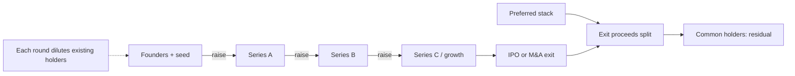


## What you'll learn
- The standard funding round structure from seed through IPO, and what each round is *for*.
- Pre-money vs. post-money valuations, dilution math, and the cap table.
- Preferred vs. common stock and why the distinction matters at exit.
- 409A valuations, option strike prices, and what they mean for your equity.

## Concepts

Software companies are unusual: they require lots of capital upfront to build product and acquire customers, but produce relatively little cash for years. The bridge between *capital needed* and *cash generated* is fundraising. Most engineers at startups encounter fundraising as a series of confusing emails and dilutive moments without understanding the structure.

The structure matters. Your equity, your understanding of company runway, and your ability to read board-level signals all depend on knowing how the money flows.

### The standard round structure

Companies raise in a sequence of rounds. Each round has a typical purpose, size, and valuation pattern.

| Round | Typical size | Purpose | Typical valuation |
|---|---|---|---|
| Pre-seed / friends-and-family | $100k-$1M | Build prototype | $3-10M |
| Seed | $1-5M | Reach product-market fit | $10-30M |
| Series A | $5-15M | Scale early traction; build sales motion | $30-100M |
| Series B | $20-50M | Scale GTM; expand product | $100-500M |
| Series C | $50-100M | Scale further; consider international | $500M-$2B |
| Series D+ / growth | $100M+ | Capital for acquisitions, public-market prep | $2B+ |
| IPO | varies | Liquidity for founders/investors; growth capital | varies |

The numbers shifted dramatically in different eras. 2020-2021 saw inflated rounds at any stage; 2022-2024 saw the same companies struggle to raise at flat or down valuations. The structure is consistent; the multiples are not.

The pattern within software:

```text
Seed: prove the product
Series A: prove the GTM
Series B: prove the scaling
Series C: prove the durability
Growth/IPO: prove the cash flow
```

Companies that try to raise rounds without proving the corresponding milestone struggle. The rule of thumb: each round should validate the next.

### Pre-money vs. post-money

The arithmetic that confuses everyone the first time.

**Pre-money valuation**: the company's worth *before* the new capital enters. If a Series A is "$50M pre" and the round is $10M, the company is valued at $50M just before the round and $60M just after.

**Post-money valuation**: pre-money + new capital. The valuation *after* the round closes.

The investor's ownership is: (round size) / (post-money valuation).

```text
Round: $10M
Pre-money: $50M
Post-money: $50M + $10M = $60M
Investor ownership: $10M / $60M = 16.67%
```

Founders prefer to negotiate on pre-money (the company is worth $50M before you put money in). Investors prefer post-money (the company is worth $60M after). Same arithmetic, different anchoring.

### Dilution

Every funding round dilutes existing shareholders. A 20% round means existing shareholders' ownership shrinks to 80% of what it was.

```text
Before Series A:
  Founders: 70%
  Seed investors: 20%
  Option pool: 10%

After Series A (20% round):
  Founders: 70% × 0.80 = 56%
  Seed investors: 20% × 0.80 = 16%
  Option pool: 10% × 0.80 = 8%
  Series A investors: 20%
  Total: 100%
```

Notice the option pool got diluted too. In practice, Series A investors usually require the option pool to be *expanded back* to a target percentage (often 10-15%) before they invest - which means the dilution comes out of the founders' and existing investors' shares, not the new investors'.

Over the full lifecycle, founders typically end with 15-30% of the company by IPO. The rest is investors, employees, and management hires.

### Preferred vs. common stock

**Common stock** is what employees get (via options) and what founders typically hold. Standard ordinary shares.

**Preferred stock** is what investors get. Preferred carries protections that common doesn't:

- **Liquidation preference.** At exit, preferred holders get their money back *first* before common holders get anything. 1x preference (the standard) means $X invested → $X out before common. 2x or 3x preferences existed historically but are rare now.
- **Anti-dilution protection.** If a future round happens at a lower price, preferred shares get re-priced to limit dilution.
- **Pro-rata rights.** The right to maintain ownership percentage in future rounds.
- **Information rights.** Board seats, financial reporting, etc.
- **Veto rights.** Approval over major decisions (acquisition, new fundraising, executive hires).

The implication: at exit, the *split* of proceeds depends heavily on the preference stack. A company that "sold for $100M" might pay $80M to preferred holders (recovering their investment) and only $20M to common. Founders and employees with common-only get the residual.

Worst-case: a "down exit" where the company sells for less than the total preference stack. Founders and employees can get $0 even from a $50M sale if preferred holders absorb the whole amount.

### 409A and option strike price

The 409A is an independent valuation of common stock for tax purposes. It must be done by a third-party valuation firm every 12 months or when material events occur (fundraising, large product launch).

The 409A sets the *strike price* for new option grants. When you join a company and get options at "$2/share strike," the 409A determined that $2.

Why this matters to you:
- A *low* 409A is good for new option grants (lower strike = more upside).
- A *high* 409A means a smaller spread between strike and current value.
- The 409A is usually 30-50% of the preferred share price. So if a Series B priced at $10/share, the 409A might be $4-5/share.

When a company raises a new round at a higher preferred price, the 409A usually rises too (but with a lag). Employees joining *before* the 409A re-priced get the old strike - sometimes a significant arbitrage.

If you ever join an early-stage company and get options, your real upside depends on the spread between strike and eventual exit price. A $0.50 strike on options that exit at $20 is a 40x return. A $15 strike on options that exit at $20 is barely worth exercising.

### Reading the cap table

The cap table (capitalization table) is the list of all shareholders, their share counts, their share class, and their percentages. Every company has one; many employees never see theirs.

The relevant lines for an employee:

- **Total shares outstanding** - denominator for ownership calculations.
- **Your option grant size** - numerator. Plus your vesting schedule.
- **Outstanding preferred stack** - affects exit math.
- **Available option pool** - informs whether future grants are likely.

You usually have legal rights to information about your own grant. Many companies provide a self-service portal (Carta, Pulley) showing your equity status.

### Why this matters to engineers

Several practical reasons:

1. **Compensation negotiation.** Equity is part of the offer. Understanding the offer requires understanding what stage the company is at, what the dilution path looks like, and what the strike/valuation implies.
2. **Company-stage signals.** "We raised a $20M Series A at $80M pre" tells you a lot: the company is at growth-acceleration stage; the burn rate is probably ~$5M/year; the next round will need significant revenue scaling.
3. **Strategic context.** A company that just raised a big round will spend; a company that hasn't raised in 18 months is either profitable or running out of runway. The fundraising state is a strong signal about company behaviour.
4. **Personal financial planning.** Your equity is potentially a major asset; treating it as "lottery tickets" without understanding the math is leaving money on the table.

## Walkthrough

A worked example. You're being offered a Series B startup with these terms:

```text
Offer:
  Base: $200k
  Equity: 0.10% of the company (1,000 options out of 1,000,000 outstanding)
  Strike price: $2.50 per option
  Vesting: 4 years, 1-year cliff, monthly thereafter

Company context:
  Series B raised 6 months ago: $30M at $200M pre, $230M post
  Preferred Series B price: $11.50/share
  409A: $2.50/share (consistent with strike)
  
  Total preferred stack across rounds: ~$50M cumulative invested
```

What this offer looks like in different scenarios:

```text
Scenario: Company sells for $1B
  Preferred stack ($50M) gets paid first
  Remaining $950M distributed by ownership
  Your 0.10% × $950M = $950k
  Less strike cost: 1000 × $2.50 = $2.5k
  Less taxes (~30-40%)
  Net: ~$570-670k

Scenario: Company sells for $300M
  Preferred stack ($50M) gets paid first
  Remaining $250M distributed
  Your 0.10% × $250M = $250k
  Less strike + taxes
  Net: ~$150-175k

Scenario: Company sells for $50M (down exit)
  Preferred stack absorbs the entire $50M
  Common gets $0
  Your options: worth $0
  Net loss: time-opportunity cost
```

A senior engineer should be able to do this math before signing the offer. The "good" outcome scenarios anchor expectations; the "bad" scenarios reveal the downside risk that equity represents. A reasonable offer evaluation includes some probability-weighting across these scenarios.

## How it fits together



## Common pitfalls

| Pitfall | Why it happens | Fix |
|---|---|---|
| Treating equity as fixed | Forgetting future dilution | Model dilution through all expected future rounds. |
| Ignoring liquidation preference | Optimistic equity math | Check the preference stack; it can absorb the entire exit. |
| Counting option grants as 'free' | Strike cost is real | Include strike × shares in the cost calculation. |
| Misreading 'fully diluted' | Different ownership numbers depending on definition | Ask: "what's my percentage on a fully-diluted basis assuming the announced future grants?" |
| Skipping 409A timing | Joining right after a re-price means high strike | Joining before the 409A update can yield a better strike. |

## Exercises

1. For your own company (if private), find out the current valuation, the total preferred stack, and the size of the option pool. If you have options, compute the breakeven exit price (the price at which your options become worth exercising).
2. Read a Form S-1 from a recent tech IPO ([Snowflake](https://www.sec.gov/Archives/edgar/data/1640147/000162828020013010/snowflakes-1.htm), [HashiCorp](https://www.sec.gov/cgi-bin/browse-edgar?action=getcompany&CIK=0001783029), etc). Find the cap table section. Note the dilution pattern from seed to IPO, and the founder vs. employee vs. investor splits.
3. Pretend you've been offered a job at three companies - pre-PMF startup, Series B, and pre-IPO. For each, write down what you'd want to know before signing. The list is longer than most engineers realise.

## Recap & next

- Funding rounds follow a standard pattern (seed → A → B → C → growth → IPO), each validating a specific milestone.
- Pre-money + investment = post-money; ownership = investment / post-money.
- Preferred stock has liquidation preference; common holders get the residual at exit.
- 409A sets option strike prices; the spread between strike and exit price is your real upside.

Next, **The investment case** - how to write a memo asking for resources that gets read, taken seriously, and approved.

