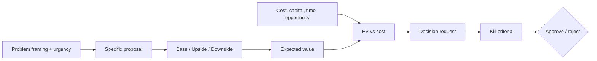


## What you'll learn
- The structure of a memo that gets read, taken seriously, and approved.
- Base/upside/downside cases - how to write each and what they actually accomplish.
- Expected value reasoning and how to bring it into engineering proposals.
- Kill criteria - why specifying them upfront makes funding more likely, not less.

## Concepts

An *investment case* is a memo asking the company to commit resources - money, engineering time, executive attention - to a specific bet. It can be a half-page Slack message for a small project or a 10-page memo for a major strategic move. The structure is the same.

Engineers usually write investment cases badly. The common failure modes:

- Lead with the solution, not the problem.
- Argue technical merit without business framing.
- Present one scenario instead of a range.
- Hide the assumptions.
- No kill criteria.
- No clear ask.

The good news: writing investment cases is a learnable skill, and the framework is consistent enough that you can get fluent at it in a few iterations.

### The structure

A working investment case has five sections:

```text
1. The problem and why it matters now
2. The proposal
3. Expected outcome - base, upside, downside
4. Cost (capital + time + opportunity)
5. Decision required + kill criteria
```

Most exec readers will read section 1, glance at sections 2-4, and look for the decision in section 5. So lead with the problem clearly stated, and have a clear decision request at the bottom.

### 1. The problem and why now

The most important section. Two questions to answer:

- **What problem are we solving?** Specifically - in customer terms or revenue terms, not engineering terms.
- **Why now?** What changed that makes this urgent? A new customer requirement, a competitive entry, a regulatory deadline, a market window.

If you can't answer "why now," the project probably isn't urgent and shouldn't be funded *yet*. Many great proposals lose to "let's revisit next quarter" because they don't establish urgency.

```text
Bad: We should build an audit log feature.
Good: Three enterprise prospects ($4.2M total ACV) have audit log
       as a hard requirement in their RFP. Two more will start RFP
       in Q3. Without audit log, we lose all five deals.
```

### 2. The proposal

What you're proposing to do. Crisp, one paragraph. Include the rough scope so readers know what's in and out.

```text
Build an enterprise-grade audit log that captures user actions,
admin changes, and data access, retains 1 year, exports via API,
and meets the SOC 2 requirement. Phase 1: core capture + UI.
Phase 2: SIEM integrations. Total 4 engineer-months.
```

### 3. Expected outcome - base, upside, downside

Three scenarios. Most engineering proposals show only the "this will go well" case. That's not analysis; that's marketing. Show all three.

- **Base case** - what we realistically expect.
- **Upside** - what's possible if it goes better than expected.
- **Downside** - what happens if it goes worse than expected.

For each, attach a rough probability. The expected value of the project is:

```text
EV = P(base) × value(base) + P(upside) × value(upside) + P(downside) × value(downside)
```

Concretely:

```text
Base case (60% prob): Win 3 of 5 RFPs → $2.4M ARR. EV contribution: $1.44M
Upside (20% prob): Win all 5 → $4.2M ARR + reference logos. EV contribution: $840k
Downside (20% prob): Win 1, deals delayed → $700k ARR. EV contribution: $140k
                                                       ────────
Total expected value: ~$2.4M ARR
```

Compare to the cost ($400-500k of engineering, see [Module 4 Chapter 4](/courses/engineers-mba/04-operating-a-software-business/04-headcount-and-cost-of-engineer/)). EV/cost ratio of 5-6x is excellent. The proposal funds itself.

The discipline of writing down the scenarios is more valuable than the math. It surfaces what you're really betting on. If you can't construct a credible upside or downside, you don't understand the problem well enough.

### 4. Cost - capital, time, opportunity

Three components:

- **Capital cost** - fully-loaded engineering cost, plus any vendor, infrastructure, or third-party costs. See [Module 4 Chapter 4](/courses/engineers-mba/04-operating-a-software-business/04-headcount-and-cost-of-engineer/) for fully-loaded.
- **Time cost** - calendar time. "4 engineer-months" can mean 4 months × 1 engineer or 2 months × 2 engineers - different time-to-value.
- **Opportunity cost** - what else those engineers won't do. Be specific.

```text
Cost:
  Capital: 2 engineers × 4 months × $400k/yr = $267k
  Time: Ships in 4 months calendar time (parallel team allocation)
  Opportunity cost: Defers the analytics dashboard work for the
                    same period; impact ~$300k of post-Q3 ARR.
  Net: $567k of capital + opportunity, against $2.4M expected ARR.
```

### 5. Decision and kill criteria

Two parts:

**The decision** - what specifically are you asking for? "Approve" is rarely enough. "Approve allocation of 2 engineers for 4 months starting June 1st, plus $30k for SIEM partner setup" is operational.

**Kill criteria** - what would make us stop the project mid-flight? This is *counterintuitively* the section that increases the probability of funding. Why?

- It demonstrates honest engagement with downside risk.
- It pre-commits to walking away if signals are bad - making the bet recoverable.
- It limits the loss without limiting the upside.

```text
Decision required:
  - Approve 2 engineers × 4 months starting June 1st
  - Approve $30k SIEM partner setup
  - Approve scope freeze on adjacent features for the period

Kill criteria:
  - If by month 2, technical complexity has expanded such that
    Phase 1 timeline slips past month 5, pause and reassess.
  - If by month 3, two of the five RFPs have moved on without us,
    consider whether the urgency case still applies.
```

Good kill criteria are specific, time-bound, and tied to observable signals. "We'll re-evaluate periodically" is not kill criteria.

### When to write each level

The intensity of the memo should match the size of the ask.

| Ask size | Format |
|---|---|
| < 1 engineer-month | Slack message, paragraph |
| 1-3 engineer-months | 1-page memo |
| 3-6 engineer-months | 2-3 page memo, includes the five sections |
| 6+ engineer-months | Full memo, often a 6-pager (see [Module 6 Chapter 2](/courses/engineers-mba/06-technical-leaders-playbook/02-strategy-and-investment-memos/)) |
| Strategic bets (multi-team, $5M+) | Full memo + verbal pitch + Q&A cycle |

Over-investing in the memo for small asks looks weird; under-investing for big asks gets you rejected.

### Writing tone

A few mechanics:

- **Lead with the problem; bury the solution.** Many engineers do the reverse.
- **Use customer/business language.** "Reduce SOC 2 questionnaire response time by 80%" beats "automate audit log capture."
- **Show your assumptions.** "Based on 5 RFPs in the last quarter requiring audit log..."
- **Quantify wherever possible.** "Significant" or "important" carries less weight than a specific number with a specific source.
- **Anticipate objections.** A skeptical reader is silently saying "but what about...". Address it before they ask.

## Walkthrough

A complete investment case. You're proposing a 6-month project to migrate the company's deployment infrastructure.

```text
TITLE: Migrate deployment infrastructure to platform-as-a-service

PROBLEM AND WHY NOW
Our current deployment pipeline is the #2 reason new hires take 
>3 months to ship their first feature (per Q2 onboarding survey). 
Average deploy time is 47 minutes. Two of three Series B-class 
companies we benchmarked deploy in <5 minutes.

Why now: We're hiring 20 engineers in the next two quarters. The 
onboarding cost (engineer-weeks lost) of the current pipeline 
scales linearly with hiring. At current headcount growth, the 
cost will exceed $1.5M/year by Q4.

PROPOSAL
Migrate from our custom Jenkins-based pipeline to GitHub Actions 
+ a managed deployment platform. Phase 1: pilot with two product 
teams (2 months). Phase 2: rollout to the rest of engineering 
(3 months). Phase 3: deprecate Jenkins (1 month).

EXPECTED OUTCOME

Base case (60% prob): 
  Deploy time reduced to <8 minutes
  Onboarding time reduced by 2 weeks per new hire
  $800k/year capacity recovery from reduced deployment overhead
  
Upside (25%):
  Deploy time <3 minutes; standardised deploy tooling enables 
  feature flags, blue-green, and rollout automation
  $1.2M/year capacity recovery + 30% reduction in deploy-related 
  incidents

Downside (15%):
  Migration takes 9 months instead of 6; pipeline disruption 
  causes 1-2 incidents during transition; modest gain ($400k/year)

EV ~ 0.6 × $800k + 0.25 × $1.2M + 0.15 × $400k = $840k/year ongoing

COST

Capital: 4 engineers × 6 months × $400k loaded = $800k
Vendor: New platform-as-a-service licensing = $80k Year 1, $50k/yr ongoing
Opportunity cost: Defers internal developer-tools roadmap by 6 months 
                   (~$300k of efficiency improvements deferred)

Total Year 1 cost: ~$1.2M
Total Year 2+ cost: $50k/year vendor + replaced custom maintenance

DECISION REQUIRED

  - Approve 4-engineer team for 6 months starting July 1
  - Approve vendor contract negotiation (target close: Aug 15)
  - Approve scope freeze on internal-tools roadmap for the duration

KILL CRITERIA

  - If by month 2, pilot deploy times exceed 15 minutes, pause and 
    reassess vendor choice.
  - If by month 4, rollout produces >2 P1 incidents, pause and 
    consolidate before continuing.
  - If by month 6, less than half of engineering teams have migrated, 
    re-evaluate timeline.
```

This is a strong memo because: the problem is concrete (47-minute deploys, $1.5M/year cost), urgency is explicit (hiring will compound it), three scenarios are shown, cost is honestly disclosed including opportunity cost, the decision is specific, and kill criteria let the company walk away cleanly if it goes sideways.

## How it fits together



## Common pitfalls

| Pitfall | Why it happens | Fix |
|---|---|---|
| Leading with the solution | "We want to build X" | Lead with the problem the X solves. |
| One scenario only | "Here's what will happen" | Show base/upside/downside with probabilities. |
| No "why now" | The project isn't urgent | If you can't explain urgency, the project isn't ready. |
| Hidden assumptions | "Trust me" | List assumptions explicitly; let readers challenge them. |
| No kill criteria | "We'll figure it out" | Specify kill criteria upfront; it increases funding likelihood. |

## Exercises

1. Take the last engineering proposal you wrote (or one your team wrote). Score it against the five-section framework. Identify which sections are missing or weak.
2. For a current project on your roadmap, write a one-page investment case using the structure above. Especially focus on the three-scenario analysis and kill criteria.
3. Read a public business memo (Jeff Bezos' annual letters are great, [Ben Thompson's Stratechery](https://stratechery.com/) deep-dives). Note the structure they use to make arguments - most of them follow the problem-proposal-scenarios pattern even without explicit headers.

## Recap & next

- A good investment case has five sections: problem, proposal, scenarios, cost, decision + kill criteria.
- Lead with the problem and "why now"; bury the solution.
- Show base/upside/downside with probabilities; compute expected value vs. cost.
- Kill criteria increase funding probability by making the bet recoverable.

Next, **Risk: regulatory, security, reputational, key-person** - the categories of risk that show up in board decks and how engineering moves each.

