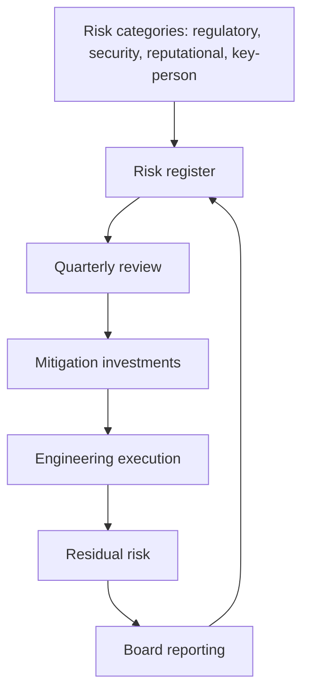


## What you'll learn
- The four major risk categories tracked in board decks and how each materially affects the business.
- How engineering work moves each category (and where engineering is the *only* function that can).
- The risk register - what it is, who owns it, and how to read one.
- The asymmetry of risk costs: small ongoing investment vs. catastrophic downside.

## Concepts

A *risk* is something that could happen that would damage the business. Boards track them. The CFO and General Counsel often co-own the risk register. Engineering frequently owns the *mitigation* for several categories whether or not they realise it.

The four categories most relevant to software companies:

### 1. Regulatory risk

The risk of penalties, bans, or operational restrictions from government bodies. Examples:

- **Data protection** - [GDPR](https://gdpr.eu/), CCPA, sector-specific (HIPAA for healthcare, FERPA for education, PCI DSS for payments).
- **Antitrust** - Apple, Google, Meta have all faced significant regulatory actions affecting product design.
- **Sector-specific** - financial services (SOX, FINRA, OCC), aviation (FAA), pharma (FDA).
- **Trade controls** - export restrictions, sanctioned-country handling, data localisation.

Regulatory risk is *categorical*. A single violation can produce penalties of 4% of global revenue (GDPR), product injunctions, or criminal charges for executives. Compared to operational issues, regulatory risk has the highest "low frequency, catastrophic outcome" profile.

**Engineering's role**: Implementing controls (data deletion, consent management, access controls, audit logging, region pinning, content moderation). Engineering owns the *execution* of regulatory compliance even though legal owns the *strategy*.

### 2. Security risk

The risk of breaches, data leaks, or compromise. Categories:

- **External breach** - attacker steals customer data, source code, internal systems.
- **Insider threat** - current or former employee causes damage.
- **Supply chain** - compromised dependency, contaminated build pipeline ([SolarWinds](https://www.cisa.gov/news-events/news/cisa-issues-emergency-directive-mitigate-compromise-solarwinds-orion-network), [xz-utils](https://en.wikipedia.org/wiki/XZ_Utils_backdoor)).
- **Account takeover** - credential theft, session hijacking.
- **Ransomware / availability** - extortion via denial of service.

Security risk has shifted dramatically in the last decade. A decade ago it was an IT concern; today it's a board-level concern with regular cyber-insurance audits, named CISOs, and disclosure requirements for material breaches (SEC's 8-K disclosure rules).

**Engineering's role**: Owns most of the implementation. Authentication, encryption, secrets management, vulnerability management, secure development lifecycle. The CISO sets policy; engineering executes.

The asymmetry: a single breach can cost $10-100M+ in remediation, legal, customer churn, and reputation damage. Comparing this to the ongoing cost of security engineering ($1-5M/year for a typical SaaS company), the math heavily favours over-investment in prevention.

### 3. Reputational risk

The risk of public perception damage that affects customer acquisition, retention, talent, and capital access. Sources:

- **Outages and incidents** - when your service is down on the front page.
- **Security incidents** - even ones without legal consequence damage trust.
- **Customer experiences** - a viral support failure or pricing scandal.
- **Executive controversies** - public statements, social misconduct, financial impropriety.
- **Product harms** - algorithmic bias, harmful content, dangerous defaults.

Reputational damage is *slow* to build and *fast* to lose. A company can spend years building trust and lose it in a week. Recovery is asymmetric: building back trust takes 2-3x as long as the time to lose it.

**Engineering's role**: Reliability (the most underrated reputational asset in B2B), transparency in incidents, public status pages, performance, accessibility, product quality. Every visible engineering failure (outage, bug, security issue) is a small reputational debit.

### 4. Key-person risk

The risk of operational disruption from losing a critical individual. Categories:

- **Executive loss** - CEO, CTO, CFO departing or incapacitated.
- **Single-point-of-knowledge** - one engineer who knows how a critical system works.
- **Customer relationships** - one salesperson with 30% of the revenue book.
- **Domain expertise** - one researcher who knows the ML model.

Key-person risk is the form of organisational risk engineers most directly affect. A team where one person knows a critical system in depth and everyone else is several steps behind is high key-person risk.

**Engineering's role**: Documentation, knowledge sharing, code review practices, on-call rotation diversity, internal training. Most engineering teams under-invest here because the work is invisible - until the person leaves.

### Other relevant risk categories

A few less commonly named but real:

- **Concentration risk** - too much revenue from one customer, too much spend with one vendor, too much team dependency on one role. Diversification mitigates.
- **Technical debt as risk** - accumulated debt that limits future agility. Slow erosion vs. visible failure.
- **Geographic / political risk** - operating in jurisdictions that change rules; data residency requirements; sanctioned countries.
- **Currency and macroeconomic risk** - exchange rate exposure, interest rate exposure, recession risk on the customer base.

### The risk register

A *risk register* is the formal document listing the company's tracked risks. Each entry typically has:

- **Risk description** - what could happen.
- **Likelihood** - qualitative (low/med/high) or quantitative.
- **Impact** - financial cost if it occurs.
- **Owner** - who's responsible for monitoring and mitigation.
- **Mitigation status** - what's been done.
- **Residual risk** - what's left after mitigation.

Risk registers are usually owned by the General Counsel or CFO, reviewed quarterly, and presented to the board annually. Most engineers never see one. They should.

A useful exercise: ask for the engineering-relevant rows of the risk register. The list of "things the company is worried about and your team owns" is often informative - sometimes startling.

### The economics of risk investment

Risk investment is structurally asymmetric. The downside of a major risk event ($10-100M+) dwarfs the cost of ongoing mitigation ($1-5M/year). Expected-value math almost always favours over-investment.

| Risk | Mitigation cost (annual) | Catastrophic downside |
|---|---|---|
| Major data breach | $1-5M (security team + tooling) | $50-500M (legal, churn, brand) |
| GDPR violation | $500k (controls + DPO) | 4% of global revenue |
| Major outage | $2-3M (SRE team) | $5-20M direct + reputational |
| Key engineer leaves | $200k (documentation + cross-training) | $1-5M (delay + rebuild knowledge) |

The math is overwhelming. And yet, in steady state, companies often under-invest in risk because the mitigation cost is *visible and ongoing* while the downside is *invisible and possible*. The most expensive mistakes in software business history are mostly risk-event mistakes - Equifax, Target, Uber's pre-2018 controversies, the post-Twitter-acquisition exodus.

### How risk shows up in board decks

Board decks typically include 1-2 slides on risk. The format varies but usually includes:

- Risk register summary
- Recent incidents and learnings
- Risk-related projects and investments
- New or emerging risks

Engineering's contribution to the risk slide is usually security/reliability/outage data. The board reads this looking for trends and recurring categories. Engineers should know what the company tells the board about their domain.

## Walkthrough

A worked engineering risk assessment. You're the tech lead for the team that owns customer authentication. The annual risk-register review is coming up.

```text
Risk: Authentication service has a single-point-of-knowledge.
  Only one engineer (Alex) deeply understands the OIDC flow, federated 
  identity, MFA edge cases.
  
  Likelihood of "Alex leaves": Medium. Alex is senior, marketable, 
  potentially open to outside offers.
  Impact: High. New customer onboarding stalls; production incidents 
  in auth go unresolved; ~$2-3M of customer-acquisition slowdown.
  Owner: Eng manager (you).
  Mitigation status: 1 other engineer has shadowed; documentation 
  partial; no formal cross-training program.
  Residual risk: Medium.
  
Risk: Credential storage uses bcrypt at outdated cost factor.
  All passwords currently hashed at cost factor 8; current best 
  practice is cost factor 12 or argon2.
  
  Likelihood of "successful brute-force on stolen hashes": Low (no 
  known breach), but rising over time.
  Impact: Very high. Customer account takeover at scale; reputational 
  damage; SOC 2 finding.
  Owner: This team.
  Mitigation status: Migration to argon2 scoped but not prioritised.
  Residual risk: High.

Risk: Auth service relies on a single third-party library no longer 
  actively maintained.
  ...

[Continue for the team's risks]
```

This kind of exercise is unusual but valuable. It:
- Forces the team to think about *what could go wrong* not just *what they're building*.
- Surfaces investments that are easy to defer but high-EV.
- Gives the team something concrete to bring to the next QBR.
- Builds the engineering manager's relationship with the General Counsel and CISO, who own the broader risk function.

## How it fits together



## Common pitfalls

| Pitfall | Why it happens | Fix |
|---|---|---|
| Treating risk as legal/CFO's job | "Not my function" | Engineering owns execution of most risk mitigation. |
| Under-investing in prevention | Mitigation is visible, downside is invisible | Run the EV math; over-investment in prevention usually wins. |
| Risk theater | Documents without follow-through | Tie risk mitigation to specific engineering deliverables. |
| Ignoring key-person risk | "He'd never leave" | Cross-train, document, rotate; cheaper than recovery. |
| Risk paralysis | "Every change creates risk" | Risk-zero is impossible; manage risk, don't avoid all change. |

## Exercises

1. Ask your manager or finance partner for the engineering-relevant rows of the risk register. Read them. Note any you weren't aware of.
2. For your team's largest production system, write a one-page risk register: 4-6 risks with likelihood, impact, owner, mitigation status. Share with your manager.
3. Identify one key-person risk in your team (a system or process that only one person knows). Propose a 2-3 month mitigation plan: cross-training, documentation, code-review patterns. Most teams find this easy to do and high-leverage.

## Recap & next

- Four major risk categories - regulatory, security, reputational, key-person - show up in every board deck.
- Engineering owns execution for most risk mitigation regardless of who owns policy.
- Risk investment is structurally asymmetric: mitigation costs are visible and small; downside is invisible and catastrophic.
- The risk register is the formal tracking document; engineers should know what their team's rows say.

Next, **Time, optionality, and the cost of delay** - why speed often beats precision in decision-making.

