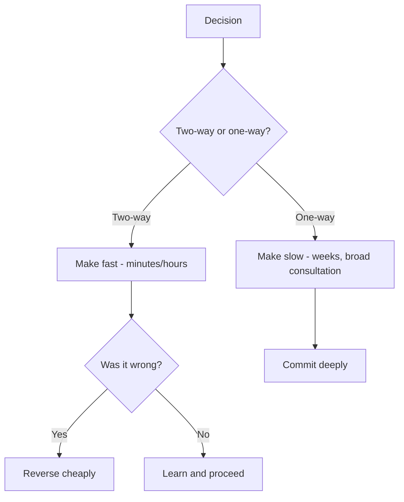


## What you'll learn
- Bezos' one-way vs. two-way doors framework and why most decisions are more reversible than they feel.
- Cost of delay as a first-class engineering economic concept.
- Real options thinking - when *not* deciding is itself a valuable position.
- When precision is worth waiting for, and when speed strictly dominates.

## Concepts

Most engineers spend more time than is rational deliberating decisions. The reason isn't laziness or fear - it's the reasonable instinct that *getting it right* matters. But this instinct overcorrects systematically. Many decisions in software are *highly reversible*, and treating them as permanent slows the team down without improving outcomes.

The frameworks below - Bezos' two doors, cost of delay, real options - give a vocabulary for talking about speed-precision trade-offs in a way that exec teams understand.

### Two-way doors vs. one-way doors

[Jeff Bezos' 1997 letter to shareholders](https://www.aboutamazon.com/news/company-news/2016-letter-to-shareholders) introduced the framing that still dominates:

> "Some decisions are consequential and irreversible or nearly irreversible - one-way doors - and these decisions must be made methodically, carefully, slowly, with great deliberation and consultation. If you walk through and don't like what you see on the other side, you can't get back to where you were before. We can call these Type 1 decisions.
>
> But most decisions aren't like that - they are changeable, reversible - they're two-way doors. If you've made a sub-optimal Type 2 decision, you don't have to live with the consequences for that long. You can reopen the door and go back through.
>
> Type 2 decisions can and should be made quickly by high-judgment individuals or small groups."

The insight: most decisions are two-way doors but get treated as one-way doors. The result is slower decision-making than necessary, with no compensating improvement in outcome.

Examples:

| Decision | Door type | Often treated as |
|---|---|---|
| Hire a senior engineer | Two-way (some cost to undo) | One-way |
| Choose between two SaaS vendors | Two-way (switching costs but doable) | One-way |
| Rebrand the company | One-way | Two-way (mistakenly) |
| Pick a tech-stack for a new service | Two-way | One-way |
| Acquire a company | One-way | Often appropriate consideration |
| Major architectural rewrite | One-way (effectively) | Sometimes too readily entered |

The discipline: for two-way doors, make the decision *fast* - within hours, by the senior-most person available. The wrong answer can be reversed. The cost of slowness compounds. For one-way doors, slow deliberation is justified.

### Cost of delay

Every decision left unmade has a cost - the *opportunity cost* of the things that could have happened during the delay.

For a software project, cost of delay is typically estimated as:

```text
Cost of Delay = (Expected monthly revenue impact when shipped)
              + (Cost of resources idling)
              + (Risk of competitive entry during delay)
              + (Strategic positioning lost)
```

A project worth $2M/year that's delayed by a quarter loses $500k of revenue alone. If the delay also opens a window for competitors or causes a strategic narrative to shift, the cost can be much higher.

Engineering decisions delayed for "let's think about it more" should be evaluated against the cost of delay. A decision worth $50k of optimisation isn't worth $200k of delay cost.

Don Reinertsen's [*Principles of Product Development Flow*](https://www.amazon.com/Principles-Product-Development-Flow-Generation/dp/1935401009) is the canonical treatment. The key insight: most product/engineering organizations don't *track* cost of delay, even though it's often the largest single factor in project economics.

### Real options thinking

Sometimes the *right* decision is to defer the decision - to keep optionality open.

A real option is the right (but not the obligation) to take an action at a future point. In engineering terms:

- A staged migration is a real option - you can roll back at any phase.
- A vendor-agnostic abstraction layer is a real option - you can switch vendors later.
- A modular architecture is a real option - you can refactor pieces independently.
- A "wait and see" on a hot new technology is a real option - let early adopters de-risk it.

Real options have *value*. The value of optionality is roughly the probability-weighted upside of being able to take the option × the cost saved by not committing yet.

Common engineering examples:

- **Building abstractions for cloud-vendor portability.** Has cost (engineering complexity, performance overhead). Has value (preserves the option to switch cloud vendors). Worth it only if the probability and value of needing to switch exceeds the upfront cost.
- **Microservices vs. monolith.** A monolith has lower optionality; microservices have more (each service can be rewritten independently) but higher complexity. The choice depends on your view of future change.
- **Investing in a fast iteration loop.** Has cost (build/test/deploy infrastructure). Has value (preserves the option to experiment with the product). Almost always worth it.

The danger of real-options thinking: it can justify *not committing* to anything. The discipline: pay for optionality only where there's a genuine probability the option will be exercised.

### When precision is worth it

Two-way doors should be entered fast. One-way doors deserve deliberation. But even two-way doors can sometimes justify slowing down:

- **The cost of unwinding is high.** A "two-way door" that takes 6 months to reverse is effectively a one-way door over short horizons.
- **The information is cheap and changes the decision.** If a one-hour conversation with a customer would settle the question, have the conversation.
- **The decision pre-commits other expensive decisions.** Picking a database technology pre-commits to ops investments, hiring profiles, learning curves.
- **High stakes with poor signal.** A high-impact decision where you have weak data warrants more analysis.

The practical heuristic from senior engineers: *make the decision in proportion to how easily it can be unmade*. If the answer is "easily, in an afternoon," make it now. If "with 6 months of engineering work," slow down.

### Speed as competitive advantage

A consistent finding across competitive software: faster decision-making compounds. Companies that move 2x faster than competitors on small decisions accumulate a large advantage over years.

The mechanisms:

- More iterations against the market.
- Less time spent in low-information deliberation.
- Better signal-to-noise (because more decisions = more learning).
- Stronger morale (people don't feel stuck).

The downside risk of fast decision-making is making more "bad" decisions. But: if most decisions are two-way doors, the wrong call costs the time to make a new decision, not the time of being stuck.

Bezos, Steve Jobs, Marc Andreessen, and Bret Taylor have all variously emphasised this. The implicit business model is: decision-making is a manufacturing process; the *velocity* of decisions is the rate of learning.

### Where engineers struggle

Engineers default toward "let's get this right" thinking. The reasons:

- Engineering tooling (CI, code review, type systems) reinforces the value of getting things right.
- Engineering culture rewards careful design over fast execution.
- Engineering systems penalize the wrong call (incidents, debt, rework) more visibly than they reward fast decisions.
- Status hierarchies in engineering favour thinkers over doers.

The corrective: distinguish *decisions about systems* (where precision compounds) from *decisions about plans* (where speed compounds). A buggy system is permanent damage; a wrong plan can be replanned in a day.

## Walkthrough

A worked decision. Your team is choosing between two API design approaches:

```text
Option A: Stateful REST API with sessions
Option B: Stateless API with JWTs
```

Junior engineer's instinct: research deeply, compare for two weeks, build proof-of-concept, RFC, discussion in architecture review.

Senior engineer's analysis:

1. **What kind of door is this?** Two-way. Either choice can be migrated later with moderate cost (a few months of engineering work).
2. **Cost of delay?** The API blocks 3 other teams. Delay costs ~$50k/week of other-team idle time and slipped customer commitments.
3. **What's the decision-quality gap?** Both options are workable. The difference in outcome is maybe 10-20% on operational characteristics. The decision-quality gap doesn't change with two weeks of further analysis.
4. **What information would actually change the answer?** A specific customer requirement that mandates JWTs (federated identity) or a specific operational constraint (server-side revocation). These are findable in an hour, not two weeks.

The senior engineer's call: "Spend one hour validating that JWTs satisfy the planned federation case. If yes, choose B. If no, choose A. Make the call by end of day."

The probability that the *other* option was "correct" and would have produced materially better outcomes is low. The cost of a 2-week analysis to reduce that probability is high. Speed wins here.

The same logic doesn't apply to choosing the database technology for a financial-records system: that's closer to a one-way door, with high cost of being wrong. Slow down for those.

## How it fits together



## Common pitfalls

| Pitfall | Why it happens | Fix |
|---|---|---|
| Treating two-way doors as one-way | Engineering preference for precision | Categorize the door first; speed the two-ways. |
| Ignoring cost of delay | Visible cost is the project; delay cost is invisible | Estimate cost of delay explicitly. |
| Real-options thinking everywhere | "We might need optionality" | Optionality has cost; pay only when probability of exercise is real. |
| Slowing down to "consult more" | Risk-aversion | Most consulting doesn't change the decision; speed up. |
| Treating speed as recklessness | Engineering culture | Speed is a *capability*. Recklessness is failure to assess door type. |

## Exercises

1. List 5 recent engineering decisions your team made. Classify each as one-way or two-way door. For the two-way doors, estimate the cost of how long it took. Identify any that took disproportionate time.
2. For a current decision in your queue, write a 5-minute pros/cons. Make the call. Compare to how long the actual decision process is taking. Note the gap.
3. Identify one place where your team has paid for real-options (e.g. a cloud-portability abstraction). Estimate the probability you'll ever exercise the option. If <30%, the cost may exceed the value.

## Recap & next

- Most decisions are two-way doors and should be made fast; reserve deliberation for one-way doors.
- Cost of delay is a real economic concept usually under-measured in engineering organisations.
- Real-options thinking justifies *not committing* - but optionality has cost; pay only when needed.
- Speed in decision-making compounds; it's a structural competitive advantage at scale.

Next, kicking off **Module 6 - The Technical Leader's Playbook (Capstone)**, starting with **Translating engineering work into business value**.

