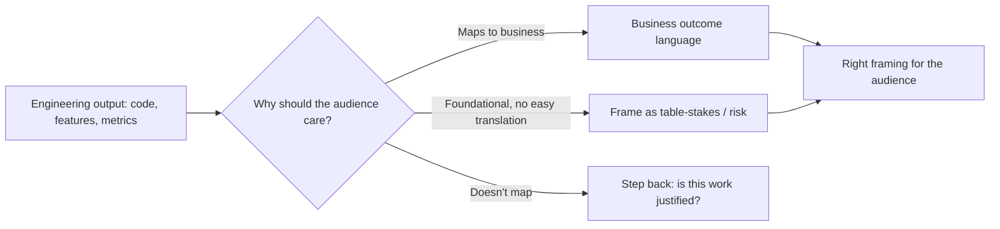


## What you'll learn
- The translation patterns that turn engineering output into business outcome language.
- How to map engineering metrics to business metrics (latency → conversion, reliability → NRR, etc.).
- Where pure engineering excellence is the right answer and translation is wrong.
- The common anti-patterns that make engineers' translations land badly.

## Concepts

This entire course has been building toward this chapter. The skill is *translation*: rendering engineering work in language that the rest of the company can value. It's the difference between work being respected at the exec level and being invisible.

The default engineering language is *output*: code shipped, features built, bugs fixed, latency reduced, deploys per day. Business language is *outcome*: revenue moved, customers retained, deals closed, costs reduced. The two languages talk past each other.

A senior engineer's job - increasingly so as they move into staff, principal, or management roles - is to be fluent in both, and to translate one to the other in real time.

### Output vs. outcome

The cleanest framing.

**Output** = what you produced.
- "Shipped distributed tracing across all microservices."
- "Reduced p99 latency from 800ms to 200ms."
- "Refactored the auth service."
- "Cleared 20% of the bug backlog."

**Outcome** = what changed in the world because of the output.
- "Reduced mean-time-to-resolve from 4 hours to 30 minutes; engineering team responds to ~12 fewer pages/month."
- "Improved checkout conversion by 0.4%, contributing ~$1.2M of annualized revenue."
- "Enabled the SSO/SAML feature the enterprise sales team needs to close $4M of stalled pipeline."
- "Reduced customer-reported reliability incidents by 30%, contributing to NRR moving from 108% to 113%."

Most engineering output has an outcome attached, even if no one measured it. The translation skill is identifying and articulating that outcome - and sometimes setting up the measurement upfront.

### Mapping engineering metrics to business metrics

Some translations are well-trodden. Engineers should know these by heart.

| Engineering metric | Business metric it moves | How |
|---|---|---|
| p99 latency | Conversion rate, retention | Frustrated users abandon |
| Uptime / reliability | NRR, GRR, churn | Outages → churn signals |
| MTTR (mean-time-to-resolve) | Operational cost, customer support volume | Faster resolution → cheaper ops |
| Onboarding time-to-value | Free-to-paid conversion | Users who don't see value churn |
| API throughput | Customer scalability | Customers that hit limits cap their growth |
| Infrastructure cost / unit | Gross margin | Cost-per-unit shows up in COGS |
| Test coverage / deployment frequency | Velocity of feature delivery | Faster delivery → faster validation |
| Security posture | Enterprise win rate | Security questionnaires gate enterprise deals |
| Internal developer velocity | Engineering capacity | More features per engineer-month |

These mappings aren't always 1:1, but they're directionally reliable. A senior engineer who can name the business metric their work is supposed to move is rare and valuable.

### Where translation goes wrong

Common patterns to avoid:

**1. Translating output as if it were outcome.**

> "We migrated 80% of services to Kubernetes."

This is output, not outcome. What changed in the world? Until you can say "...which reduced infra cost by $400k/year and allowed us to onboard 3 new product teams without infra friction," it's not translation.

**2. Quantifying without source.**

> "This will improve our conversion rate by 5%."

Where's the 5% from? If a senior engineer says this without a source, exec readers discount the entire memo. Use ranges with sources: "Industry data suggests latency improvements at this magnitude yield 0.3-1.5% conversion lift" with a link.

**3. Translation that's worse than the source.**

> "Reduced cyclomatic complexity by 15% by refactoring the order pipeline."

This is engineering-to-engineering translation; it's not for an exec audience. Translate higher: "Refactored the order pipeline so that future changes ship in 2 days instead of 2 weeks; the next 3 features in the roadmap will benefit."

**4. Cargo-culting business language.**

> "This work drives synergies and ROI across the value chain."

Don't. Specific, concrete claims always beat generic business-school phrasing.

**5. Over-claiming the outcome.**

> "Reduced incident rate by 50%, which is directly responsible for our NRR uptick."

NRR has many drivers; claiming sole credit for a movement strains credibility. Better: "Reduced incident rate by 50%; among the contributing factors, customer success cited reliability improvements in 4 of the 7 expansion-account conversations this quarter."

### When NOT to translate

A counterintuitive point. Sometimes the right answer is "this work is foundational engineering excellence; trust us." Examples:

- **Technical debt paydown** - sometimes the only honest framing is "we won't be able to ship anything in 18 months without this."
- **Security hardening** - sometimes the framing is "the cost of *not* doing this is catastrophic; the cost of doing it is bounded."
- **Refactoring legacy systems** - sometimes the framing is "the future of this product depends on this."

Forcing every piece of engineering work into a contrived business-metric narrative weakens credibility. Some work doesn't have a tidy ROI; it's *table stakes*. Exec teams generally respect "this is table stakes work; here's why" when delivered with confidence.

The distinction: feature work, performance work, scalability work usually has a translatable business outcome. Foundational work sometimes doesn't, and inventing one is worse than naming the foundational character honestly.

### Building the translation muscle

A few exercises that build the skill over time:

1. **Pre-write the outcome.** Before starting a project, write the one-sentence business-outcome story for what success looks like. If you can't write it, you may not understand what you're building for.
2. **Read sales calls.** Customer-success teams record calls. Listen to 5 of them in your team's space. Notice the language customers use to describe value. That language is your translation vocabulary.
3. **Practice on your team's standup.** Once a week, replace "we shipped X" with "we shipped X, which means [business outcome]." It feels awkward at first; the awkwardness fades.
4. **Read 10-Q filings.** Public companies translate constantly. Reading 3-4 SaaS company 10-Qs builds intuition for what business metrics matter and how they're framed.

### Example: a year-end engineering review

A worked example. You're a tech lead writing the year-end summary for your team.

**Engineering-only version:**

> "This year, our team shipped 4 major features (audit log, SSO/SAML, custom roles, API rate limits), reduced p99 latency by 60%, cleared 35% of the bug backlog, and migrated 12 services to the new deployment platform. We maintained 99.97% uptime."

**Business-translated version:**

> "This year our team's work contributed to three measurable business outcomes:
>
> 1. **$6.4M of enterprise pipeline unblocked.** Audit log, SSO/SAML, and custom roles were the three most-requested security features in enterprise RFPs. With these shipped, the deal team converted 4 of 6 stalled enterprise prospects (close-won $4.2M ARR), and the remaining 2 are now in active negotiation. (Reference: Q3 sales pipeline report.)
>
> 2. **Improved NRR from 109% to 114%.** Reliability work (60% p99 latency reduction, uptime 99.97%) was cited by CS as a top-3 retention factor in expansion conversations. The combined improvement contributes ~$2M of annualized revenue retention.
>
> 3. **Doubled team capacity for next year.** The deployment platform migration cut our mean PR-to-prod time from 47 minutes to 6 minutes. Per the onboarding survey, new hires now ship their first feature in 6 weeks instead of 12. Net effect: we can absorb 8 new engineers next year while shipping the same feature roadmap.
>
> Looking ahead: the three biggest engineering risks for next year are platform scale (we're at 70% of our hosting capacity), security tooling (one CISO-level audit signaled gaps in incident triage automation), and the auth migration (we still have one key-person dependency I'm working to reduce)."

The second version is the same work, framed for the audience that funds the team and decides whether the work mattered. It also names risks honestly - which builds credibility for future asks.

## Walkthrough

The translation conversation in real time. A scenario.

**Scene**: You're in a QBR. The CRO presents a slide showing churn ticked up in Q2. The room is dispirited. The CEO turns to you (CTO/VP Eng) and asks "what's engineering doing about churn?"

**Bad answer (output):**

> "We're focused on reliability and performance. We shipped distributed tracing this quarter."

**Better answer (outcome):**

> "Three things. First, the reliability work has reduced P0 incidents by 40% - and per CS, 3 of the 8 churned accounts this quarter cited reliability concerns, so we expect that to improve next quarter as customers see the change. Second, we shipped the API rate-limit fairness changes that unblocked the heaviest users - that was the most-cited frustration in churn interviews. Third, the bigger pattern in churn interviews is product breadth - customers leaving for competitors that have specific features we don't. We're prioritizing those for Q3 - three of the top five churn reasons should be addressed by end of Q3."

The second answer maps engineering work directly to the question being asked, acknowledges what engineering doesn't yet solve, and signals action. The first answer answers a different question. The skill of the second is purely translation.

## How it fits together

## Common pitfalls

| Pitfall | Why it happens | Fix |
|---|---|---|
| Listing output without outcome | Default to what you know | Pre-write the business outcome before starting work. |
| Cargo-culting business jargon | "I should sound businessy" | Use specific, concrete language. |
| Over-claiming credit for outcomes | Engineering ego | Share credit; let CS confirm the link from churn to reliability. |
| Forcing outcomes onto foundational work | "Everything needs a metric" | Name table-stakes work honestly; don't invent an ROI. |
| Skipping the translation entirely | "Let leadership figure it out" | They won't. The translation is your job. |

## Exercises

1. For your last 3 shipped projects, write the business-outcome translation for each. Compare to how the projects were framed in your team's quarterly review. The gap is your translation opportunity.
2. Listen to 3 customer-success calls about your product. Note the language customers use. Build a vocabulary list of business-outcome language that resonates with actual customers.
3. For your team's next quarterly review, prepare a 5-minute presentation framed entirely in business outcomes. Run it past a non-engineering peer before delivering. Iterate.

## Recap & next

- Translation is the rendering of engineering output in business-outcome language.
- Specific mappings (latency → conversion, reliability → NRR, etc.) cover most engineering work.
- Avoid over-claiming credit, cargo-culting business language, and forcing outcomes onto foundational work.
- Translation is a learnable skill that compounds: every time you do it, the next time is easier.

Next, **Writing strategy & investment memos** - the long-form version of translation, in the document formats executives actually read.

