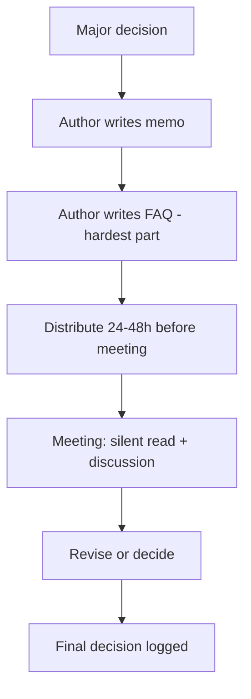


## What you'll learn
- The Amazon 6-pager - what it is, why it's structured the way it is, and how to write one.
- Working-backwards / PRFAQ - Amazon's product-design memo format, especially useful for new products.
- When to write a memo vs. when to make a deck.
- The discipline of writing for an audience that reads in silence.

## Concepts

The investment-case memo from [Chapter 5.3](/courses/engineers-mba/05-capital-risk-decisions/03-investment-case/) is the short form. For larger bets - new products, major strategic shifts, multi-year platform investments - the canonical format is the *long memo*. The best-known instance is the [Amazon 6-pager](https://www.aboutamazon.com/news/company-news/2017-letter-to-shareholders).

The 6-pager isn't six pages because of magic. It's six pages because (a) it's enough space to think rigorously about a real decision, (b) it's short enough that the audience will actually read it, (c) the constraint forces the writer to cut everything that isn't load-bearing. Companies that adopt it (Amazon, Stripe partially, Coinbase, many others) report that decision quality improves measurably.

### The Amazon 6-pager

The structure is informal - Amazon doesn't publish a template. The pattern that emerges from reading hundreds of them:

```text
1. Context and problem statement (½-1 page)
   - What is this about?
   - What's the problem we're trying to solve?
   - Why now?

2. Goals and non-goals (½ page)
   - What success looks like
   - What we're explicitly NOT trying to do

3. Background / current state (1 page)
   - What's the world look like today?
   - What's been tried? What's worked? What hasn't?

4. Proposal (1-1.5 pages)
   - What we're proposing to do
   - Architecture or approach
   - Phasing if applicable

5. Alternatives considered (½-1 page)
   - Other options we evaluated
   - Why they were rejected (vital - this signals the analysis is real)

6. Risks and mitigations (½ page)
   - What could go wrong
   - How we'd respond

7. Cost and timeline (½ page)
   - Capital, time, opportunity
   - Major milestones

8. Decision required (¼ page)
   - Exactly what we're asking for
   - Who needs to approve

9. Appendix: FAQs (1-2 pages)
   - Anticipated questions with answers
   - Often the most useful section
```

The total is 6-8 pages. Not 16, not 4. The constraint is the discipline.

### The meeting that follows

A 6-pager isn't a document distributed for asynchronous reading. It's the input to a *meeting*. The meeting runs in a specific format:

1. **Silent reading** - 20-30 minutes at the start. Everyone reads the memo, makes notes, prepares questions. No one talks. This is the part most people find awkward and is also the most important.
2. **Discussion** - the rest of the meeting (60-90 minutes typically). The author defends, clarifies, and notes follow-ups. The audience pressure-tests the analysis.
3. **Decision or follow-up** - the meeting ends with either a decision or specific items the author needs to revise.

Why the silent reading: because most meetings are dominated by whoever speaks fastest and most confidently. The silent-read flips this - everyone has read the memo before opinions are aired, so the discussion is grounded in the same content. Junior contributors with good questions can ask them; senior contributors don't dominate by reciting from memory what only they have access to.

### What makes a good 6-pager

A few principles, learned the hard way:

**Force the reader to disagree explicitly.** A memo that lists three alternatives, names why each was rejected, and explicitly identifies the assumptions that would change the answer makes it easy for a critic to push back: "I disagree with assumption X." Memos that hide the assumptions force critics to extract them, which produces longer, lower-quality meetings.

**Use the FAQ aggressively.** The appendix FAQ is where you anticipate the hard questions. "Q: Why not just use [obvious alternative]? A: [4-sentence answer]." A strong FAQ section turns a 60-minute discussion into a 30-minute one because the obvious questions have already been answered.

**Cut everything that doesn't change the decision.** Every paragraph should pull weight. The discipline of cutting is the source of the format's value.

**Make numbers concrete.** "We expect significant adoption" doesn't help. "Based on current trial-to-paid conversion of 8% and 200 trials/month, we project $2-3M ARR in Year 1, with the most likely outcome around $2.4M." This is testable; the first isn't.

**Use prose, not slides.** The 6-pager works because prose forces complete sentences and complete arguments. Slides hide arguments behind bullets.

### The PRFAQ format

For *new product* decisions, Amazon uses a variant called PRFAQ (Press Release + FAQ). The structure:

```text
1. The press release (1 page)
   - The press release we'd write when this product launches
   - Quote from a customer
   - Quote from an exec
   - Date of launch

2. Internal FAQ (3-5 pages)
   - Q: Why are we building this?
   - Q: Who's the customer?
   - Q: What's the experience?
   - Q: How big could this be?
   - Q: What are the risks?
   - Q: Build vs buy?
   - ... (continued)
```

The PRFAQ forces the team to *start from the customer outcome* - what does the world look like when this product is in market? - and work backward to the engineering plan. It's especially useful when the team is at risk of building features that won't add up to a coherent product.

[Working Backwards](https://www.amazon.com/Working-Backwards-Insights-Stories-Secrets/dp/1250267595) by Colin Bryar and Bill Carr is the canonical book on the format. Worth reading if you're going to write more than one.

### When to use which format

| Decision type | Format |
|---|---|
| Resource request, < 1 quarter | Slack message / 1-page memo |
| Feature investment | Investment case ([Chapter 5.3](/courses/engineers-mba/05-capital-risk-decisions/03-investment-case/)) |
| Multi-quarter project | Full 6-pager |
| New product or major strategic shift | PRFAQ |
| Tactical decision in a team | Verbal + decision log |
| Org change | 6-pager + verbal communication plan |

### Memo vs. deck

A persistent question in many companies: should this be a deck or a memo?

**Deck strengths:**
- Visual elements (charts, diagrams)
- Easier to skim
- More familiar in many companies
- Better for live presentation

**Memo strengths:**
- Forces complete arguments
- Async-friendly (read once, return to it)
- Critic-friendly (hard to hide weak reasoning)
- Compresses argument density

Decks are better for *communication*; memos are better for *decision-making*. The Amazon convention pushes decisions into memos. Many companies use both: a memo for the decision; a deck if the decision needs to be communicated broadly afterward.

A useful test: if the document needs to convince a critical, time-constrained reader who reads silently and forms an independent opinion, write a memo. If the document needs to be presented live with discussion as you go, a deck may be the better tool.

### The hidden discipline: writing forces thinking

The most under-appreciated benefit of the 6-pager isn't communication - it's *the act of writing it*. Forcing yourself to write 6 pages of complete sentences exposes gaps in your thinking that bullet points can hide.

Bezos famously wrote that he could "tell when a 6-pager has been written by someone who hasn't actually thought through the problem" - the prose breaks down, the FAQ is thin, the alternatives section is wave-of-hand. The reverse is true too: when you sit down to write a 6-pager and discover a gap in your reasoning, fixing the gap is the actual benefit.

A senior engineer's productivity boost from this format is often invisible to others but visible to themselves: they make better decisions because they've forced themselves to think them through completely.

## Walkthrough

A worked outline. You're proposing a new product: an AI-powered code-review assistant.

```text
1. CONTEXT
   We've shipped 47 features this year. Code review has emerged as 
   the #1 cycle-time bottleneck (per Q2 dev velocity survey). Average 
   review cycle is 36 hours. Six of nine engineering leaders cite 
   review backlog as a top friction point.

   AI-powered code review is now mature enough to ship (Year 1 of 
   tools like Cursor, Cody, Copilot Code Review). Two key competitors 
   announced offerings in Q2.

   Why now: industry trajectory + internal pain + investor pressure 
   to ship AI features visible to customers.

2. GOALS AND NON-GOALS
   Goals:
   - Reduce review cycle time from 36h to <12h
   - Catch common issues before human review (security, perf, 
     accessibility regressions)
   - Ship to internal teams in Q3; external in Q1 next year

   Non-goals:
   - Replace human review
   - General code generation (separate effort)
   - Support for languages beyond our top 5

3. BACKGROUND
   [1 page on current state, what's been tried, who's doing what]

4. PROPOSAL
   [1.5 pages on architecture, phasing, integration with current tooling]

5. ALTERNATIVES CONSIDERED
   - Buy a third-party tool (CodeRabbit, Greptile, etc.)
     Reject because: data sensitivity, brand requirements, want 
     ownership of the user experience for our customer base.
   - Build only an internal tool
     Reject because: customer asks suggest external product 
     opportunity with $50M+ TAM.
   - Defer
     Reject because: competitors shipping; window closing.

6. RISKS AND MITIGATIONS
   - AI quality below expectations → ship as "suggestions only" 
     mode initially; gate full automation behind a quality bar.
   - Integration complexity with existing review tooling → narrow 
     scope to GitHub-first, expand from there.
   - Strategic competition from existing tools → invest in 
     differentiation (security focus, languages).

7. COST AND TIMELINE
   8 engineers × 9 months → $2.9M loaded
   Vendor (model providers, training infra) → $400k Year 1
   Internal pilot Q3; external GA Q1 next year.

8. DECISION REQUIRED
   - Approve 8-engineer team starting July 1
   - Approve $400k vendor budget for first year
   - Designate a senior PM and senior staff engineer

9. FAQ (1.5 pages)
   - Q: Why 8 engineers? A: ...
   - Q: Why now vs Q4? A: ...
   - Q: How does this compare to [competitor]? A: ...
   - Q: What's the kill criteria? A: ...
   - Q: How do we measure success? A: ...
```

A full memo with each section filled out would be ~6 pages. The FAQ alone might be 2 of those pages. The format forces the proposal to engage with the obvious questions before the meeting, which makes the meeting shorter and more productive.

## How it fits together



## Common pitfalls

| Pitfall | Why it happens | Fix |
|---|---|---|
| Sending the memo too late | Authors run late | Distribute 24-48h in advance; silent-read time eats into the meeting otherwise. |
| Thin FAQ | "We'll address questions in the meeting" | FAQ is the highest-value section; invest in it. |
| Hidden assumptions | "Everyone knows this" | Make assumptions explicit; reviewers can challenge them then. |
| Skipping alternatives section | "Our proposal is obviously best" | Naming alternatives builds credibility; skipping them invites pushback. |
| Memo for small decisions | Format inflation | Use 1-pagers or Slack messages for small things. |

## Exercises

1. Take a recent major decision your team made. Outline a 6-pager retrospectively. Notice which sections are hard to fill in - those are usually the parts of the decision that weren't analyzed.
2. For your next significant proposal, draft a PRFAQ. The press release alone is a useful exercise: can you write a compelling launch story?
3. Find a public Bezos shareholder letter and read it as a long-form memo. Note the structure, the use of specific numbers, the clear positioning. Bezos has been training the world in this format for 25 years.

## Recap & next

- The Amazon 6-pager and PRFAQ are the canonical long-form decision documents.
- The format enforces discipline - forcing the writer to think through the problem completely.
- Silent reading at the start of the meeting flips the dynamic: ground discussion in the same content, give junior contributors space.
- FAQs are the highest-value section; invest in anticipating hard questions.

Next, **Reading & contributing in exec reviews** - what actually happens in QBRs and board meetings, and how to participate effectively.

