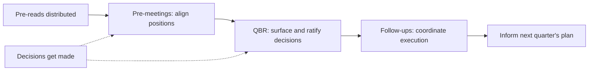


## What you'll learn
- The anatomy of a Quarterly Business Review (QBR) and what the audience is actually evaluating.
- How a board meeting works and how to read a board deck.
- When and how to interject in exec reviews without overstepping.
- The role of pre-reads and pre-meetings in shaping outcomes.

## Concepts

[Module 4 Chapter 2](/courses/engineers-mba/04-operating-a-software-business/02-operating-cadence/) introduced the operating cadence. This chapter goes deeper into the *mechanics* - the rhythm, etiquette, and unwritten rules of exec reviews.

The reason it matters: most strategic decisions get made in these meetings or in the conversations that surround them. Engineers who can participate fluently extract disproportionate value for their teams and their careers. Engineers who can't either skip the meetings or attend them passively, missing the windows where their work could shape the strategy.

### QBR anatomy

A QBR typically runs over 1-3 days. The agenda is set by the executive team, distributed in advance, and contains pre-read materials for each session. The flow:

```text
Day 1
  Morning: CEO opens, sets strategic context for the quarter
  Mid-morning: Sales & marketing review (often the longest)
  Afternoon: Product & engineering review
  Late afternoon: Customer success / support review

Day 2
  Morning: Finance review, board prep
  Mid-morning: Functional deep-dives (rotated topics)
  Afternoon: Strategy discussions / what-if planning
  Late afternoon: Decisions and follow-ups

Day 3 (sometimes)
  Working sessions on specific strategic topics
```

The format varies by company. Public companies often combine QBRs with board prep. Private companies typically separate them.

What the audience is *actually* evaluating:

- **Sales/marketing review** - Are we executing? Pipeline coverage, win rates, segments. Is the GTM motion working?
- **Product/engineering review** - Are we shipping what matters? Roadmap progress, customer impact, technical risks.
- **CS/support review** - Are we keeping the customers we won? NRR, support metrics, customer health.
- **Finance review** - Are the unit economics improving? Spend trajectory, runway, financial outlook.
- **Strategy discussions** - Are we on the right path? Course correction needed?

Engineers presenting in QBR should anticipate: which question does *this part of the meeting* answer, and how does my work fit?

### Pre-reads

The pre-read is the document distributed 1-3 days before the meeting. It usually includes:

- The agenda with timing
- Each function's slide deck or memo
- The board deck for board meetings
- Specific decision asks

The pre-read works *if people actually read it*. Most don't, fully. Most read the executive summary, skim the rest, and arrive at the meeting partially informed. This is sub-optimal but reality.

The implication for presenters: assume your audience has skimmed but not absorbed your full content. The first 30 seconds of your presentation should re-establish context. Don't assume they remember the details of last quarter.

### Pre-meetings

The actual decisions in many companies are made *before* the QBR, in 1:1 pre-meetings. Senior leaders meet pairwise to align on positions, surface concerns, and build coalitions. By the time the QBR happens, much of the substantive conversation has already occurred.

This isn't dysfunctional - it's how human organisations work above a certain size. The QBR is a *coordination* event where positions are aired publicly and decisions are made; the pre-meetings are where positions get formed.

For senior engineers, this means:
- The right time to influence a decision is *before* the QBR, in pre-meetings with the relevant decision-makers.
- Arriving at the QBR with a new position no one has heard is often unsuccessful - the existing positions have already coalesced.
- Building relationships with non-engineering leaders (CFO, CRO, CMO) is how positions get shaped pre-meeting.

The first time many engineers realise pre-meetings exist, they're frustrated. "I thought the QBR was where decisions happen." The QBR is where decisions are *ratified*. The decisions are made in the side channels.

### How to read a board deck

A board deck is the document distributed to the board ahead of a meeting. Typical structure:

```text
1. CEO update (3-5 pages)
   - Strategic narrative for the quarter
   - Major events, wins, losses
   - Forward outlook

2. Financial performance (5-10 pages)
   - The metric tree (Module 4 Chapter 1)
   - Cohort analyses, segment breakdowns
   - Variance to plan

3. Functional updates (10-20 pages)
   - Each major function (Product, Engineering, Sales, Marketing, CS)
   - Major projects and outcomes
   - Strategic risks and asks

4. Decisions required (1-3 pages)
   - Specific votes or approvals
   - New hires of senior executives
   - Acquisitions, partnerships
   - Major capital commitments

5. Appendices (variable)
   - Supporting analysis
   - Detailed financials
   - Risk register
```

When reading a board deck (as an employee or board member), look for:

- **Variance to plan** - where the company is hitting or missing commitments
- **Trend lines** - are key metrics getting better or worse?
- **New risks** - what wasn't there last quarter?
- **Strategic shifts** - is the narrative changing? Why?
- **Specific decisions** - what does the company want from the board?

The board reads this looking for signal. Effective engineering contributions to the board deck *make signal more visible* - clear charts, specific numbers, honest risk reporting.

### When and how to interject

In a QBR or exec meeting, when should you speak up?

**Almost always speak up when:**
- You have a question or concern that's been raised in pre-meeting and now isn't being addressed
- A factual statement is wrong (correct it briefly, without ego)
- A specific number being cited needs context (offer it)
- A decision is about to be made on incomplete information you can complete

**Rarely speak up when:**
- The discussion has reached agreement and you have a slight preference variant
- The point is about your team and you've already had the relevant pre-meeting
- The room is in a discussion you don't have material context for
- The point is purely technical and the audience won't follow

The skill is calibration. Senior engineers who interject too rarely become invisible; those who interject too often become exhausting. The right cadence varies by your role and the room.

A useful heuristic: ask yourself before interjecting, *"will this materially change the decision being made?"* If yes, speak. If you're just adding a slight nuance, save it for after the meeting.

### Reading the room

Some practical skills:

- **Who's running the meeting?** Different from who has the most authority - the meeting runner shapes the flow.
- **Who's asking probing questions?** Those people are forming the decision.
- **What's the energy level?** A QBR after a bad quarter has different dynamics than one after a great quarter.
- **What's being avoided?** Sometimes the most important topic is the one no one's bringing up - and someone should.

Engineers who learn to read these signals contribute more effectively. It's a skill that takes time to develop.

### The "follow up offline" close

Almost every meeting ends with "let's follow up on that offline." Take this seriously. The follow-ups are where the actual coordination happens between the formal meeting moments.

A useful practice: end each meeting with a clear list of follow-ups, each with an owner and a deadline. Track them through completion. Most meetings drift because the follow-ups go uncatalogued.

## Walkthrough

A worked scenario. You're a Staff engineer attending your first QBR. The agenda includes a "Product & Engineering Review" session where you'll present 5 minutes on your team's quarter.

**Pre-meeting (3 days before):**
- 1:1 with VP Engineering to align on what you'll present
- 1:1 with PM partner to make sure the messaging matches their narrative
- Quick check with CRO's office about any deal-specific stories worth highlighting

**Your 5 minutes:**

```text
[10 seconds opening]
"I'm going to cover three things our team shipped this quarter and 
the business outcomes we've tracked from each. Then a forward-looking 
risk I want the room aware of."

[1 minute, outcome 1]
"First, the SSO/SAML enterprise support. Three deals that had been 
stalled since Q1 closed this quarter, totaling $2.8M ARR. The deal 
team confirms SSO was named in the sales-stage notes as the blocker 
for all three. Going forward, audit log is the next-most-cited 
blocker - that's on our Q3 roadmap."

[1 minute, outcome 2]
"Second, reliability work. We reduced P0 incident rate from 2.1/month 
to 0.7/month. CS reported that 3 of the 8 at-risk renewals this 
quarter cited reliability concerns; by renewal, 2 of those had 
explicitly stabilized and stayed. The third is still at risk for 
other reasons but reliability isn't one anymore."

[1 minute, outcome 3]
"Third, the deployment platform migration is at 75% of services. 
Average deploy time has dropped from 47 to 9 minutes. New-hire 
time-to-first-feature is now 8 weeks instead of 12 weeks per the 
last onboarding survey. We're on track to complete the migration in 
Q3, freeing 1.5 FTEs of platform-team capacity for new product work."

[2 minutes, forward look + risk]
"Looking ahead, the biggest risk I want the room aware of is hiring. 
We have 3 senior platform roles open and have been struggling to 
fill them - average req-to-seated time has been 18 weeks vs target 
of 12. If we can't close this gap by mid-Q3, the analytics product 
launch slips by a quarter. I'd like to talk to recruiting leadership 
about expanding the search."
```

The presentation is short, outcome-focused, and surfaces a risk before it becomes an emergency. The forward-looking ask creates a follow-up the room can act on. Five minutes well spent.

## How it fits together



## Common pitfalls

| Pitfall | Why it happens | Fix |
|---|---|---|
| Skipping pre-meetings | "I'll cover it in the QBR" | The QBR ratifies what pre-meetings shape; you need both. |
| Long technical presentations in QBR | Default to what you know | Translate to outcomes; lead with the business metric, not the tech. |
| Quiet attendance | "I don't have anything to add" | If you have nothing to add, you may not need to be there. Earn the seat. |
| Bringing operational details to strategic meetings | Mismatch of forum and topic | Save operational for MBRs; QBR is strategic. |
| Missing follow-ups | No one tracks them | Catalog follow-ups with owners and deadlines; chase them. |

## Exercises

1. Attend your next exec meeting (or read the recording/notes). Track who interjects, when, and what for. Note the pattern of pre-meeting alignment vs. live discussion.
2. For the next QBR you present in, write your 5-minute script in advance. Test it against a non-engineering colleague (CFO partner, PM lead). Iterate.
3. Read your company's last board deck (if available). Read it the way a board member would - looking for signal, variance to plan, new risks. Note what jumps out.

## Recap & next

- QBRs are coordination events where decisions are ratified; pre-meetings are where positions are shaped.
- Pre-reads are distributed widely and skimmed broadly; assume your audience has partial context.
- Interject when it will materially change the decision; not when you have a slight preference variant.
- Follow-ups are where execution happens; track them as religiously as the decisions themselves.

Next, **Negotiating with sales, finance, product, legal** - the cross-functional vocabularies and how to map their incentives to yours.

