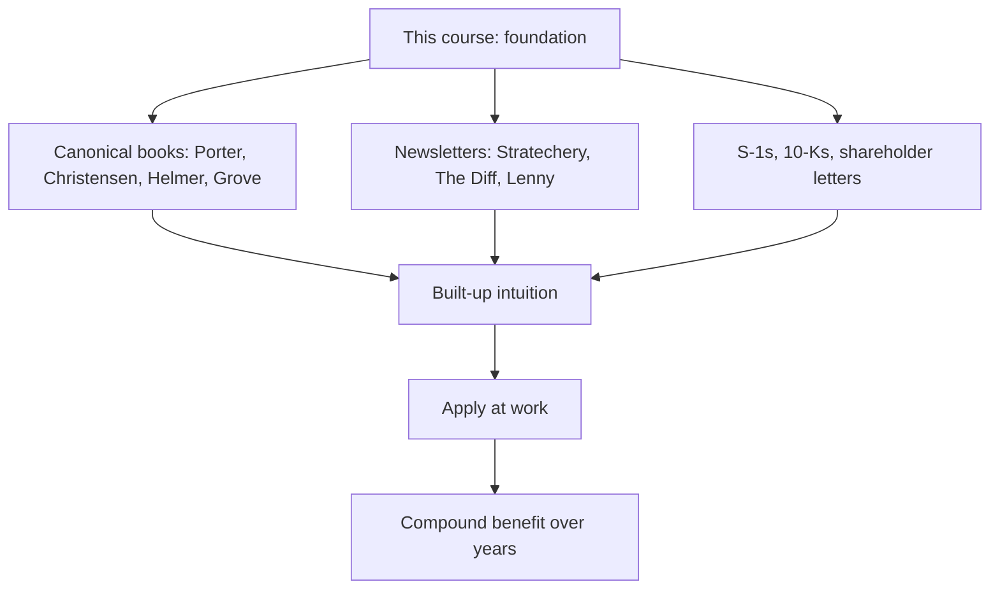


## What you'll learn
- The canonical books to read after this course, in priority order.
- The newsletters, podcasts, and operator playbooks worth tracking.
- Why public S-1s and 10-Qs are some of the highest-quality business education available.
- How to build a personal learning cadence that compounds.

## Concepts

This course covered the *core* of an engineer's business education in 30 chapters. It's enough to follow exec conversations, write investment cases, read board decks, and translate engineering work into business outcomes. It's not enough to be a deep expert in any one area.

This chapter is the map for going deeper. The recommendations below are biased toward signal - books and resources that have stood up to time, not the latest viral business book.

### The canonical books

These are the works most-cited by senior operators across software and venture. Read in approximately this order:

**Strategy (the foundation)**

1. **[*Competitive Strategy* <small>(Amazon affiliate link)</small>](https://www.amazon.com/Competitive-Strategy-Techniques-Industries-Competitors/dp/0743260880?tag=drin04-20) - Michael Porter (1980).** The Five Forces and competitive positioning, in the original. Heavy reading but every page is load-bearing.
2. **[*The Innovator's Dilemma* <small>(Amazon affiliate link)</small>](https://www.amazon.com/Innovators-Dilemma-Revolutionary-Change-Business/dp/0062060244?tag=drin04-20) - Clayton Christensen (1997).** Disruption theory in detail. Engineers often skip this because they think they get the gist - they usually don't.
3. **[*7 Powers* <small>(Amazon affiliate link)</small>](https://www.amazon.com/7-Powers-Foundations-Business-Strategy/dp/0998116319?tag=drin04-20) - Hamilton Helmer (2016).** The modern canonical treatment of moats. Short, dense, exceptional.
4. **[*Good Strategy / Bad Strategy* <small>(Amazon affiliate link)</small>](https://www.amazon.com/Good-Strategy-Bad-Difference-Matters/dp/0307886239?tag=drin04-20) - Richard Rumelt (2011).** Why most "strategies" are just goals; how to write a real one.

**Operating**

5. **[*The Hard Thing About Hard Things* <small>(Amazon affiliate link)</small>](https://www.amazon.com/Hard-Thing-About-Things-Building/dp/0062273205?tag=drin04-20) - Ben Horowitz (2014).** Operator wisdom from the trenches. Particularly good on hiring, firing, and leadership.
6. **[*Working Backwards* <small>(Amazon affiliate link)</small>](https://www.amazon.com/Working-Backwards-Insights-Stories-Secrets/dp/1250267595?tag=drin04-20) - Colin Bryar & Bill Carr (2021).** Amazon's operating playbook: PRFAQs, 6-pagers, OPI, working backwards.
7. **[*High Output Management* <small>(Amazon affiliate link)</small>](https://www.amazon.com/High-Output-Management-Andrew-Grove/dp/0679762884?tag=drin04-20) - Andy Grove (1983).** Still the best book on management. From Intel's CEO who set the template.
8. **[*Measure What Matters* <small>(Amazon affiliate link)</small>](https://www.amazon.com/Measure-What-Matters-Google-Foundation/dp/0525536221?tag=drin04-20) - John Doerr (2018).** OKRs in detail; not a glamorous topic but the canonical reference.

**Markets and customers**

9. **[*Obviously Awesome*](https://www.aprildunford.com/obviously-awesome) - April Dunford (2019).** The positioning canvas, in 200 readable pages.
10. **[*Crossing the Chasm* <small>(Amazon affiliate link)</small>](https://www.amazon.com/Crossing-Chasm-3rd-Disruptive-Mainstream/dp/0062292986?tag=drin04-20) - Geoffrey Moore (1991, updated 2014).** The classic on technology-product adoption curves. Slightly dated but the framing still works.
11. **[*The Mom Test* <small>(Amazon affiliate link)</small>](https://www.amazon.com/Mom-Test-customers-business-everyone/dp/1492180742?tag=drin04-20) - Rob Fitzpatrick (2013).** Customer discovery without leading questions. Short and practical.
12. **[*Competing Against Luck* <small>(Amazon affiliate link)</small>](https://www.amazon.co.uk/dp/0062435612?tag=drin04-20) - Clayton Christensen et al. (2016).** Jobs-to-be-Done in depth.

**Finance for non-finance people**

13. **[*Financial Intelligence* <small>(Amazon affiliate link)</small>](https://www.amazon.com/Financial-Intelligence-Revised-Knowing-Numbers/dp/1422144119?tag=drin04-20) - Karen Berman & Joe Knight (2013).** Accounting/finance for the non-finance manager. Read this if "EBITDA" still feels like a foreign word.
14. **[*Venture Deals* <small>(Amazon affiliate link)</small>](https://www.amazon.com/Venture-Deals-Smarter-Lawyer-Capitalist/dp/1119594820?tag=drin04-20) - Brad Feld & Jason Mendelson (2019).** Term sheets, dilution, board dynamics. Required reading if you're at a startup.
15. **[*The Snowball* <small>(Amazon affiliate link)</small>](https://www.amazon.com/Snowball-Warren-Buffett-Business-Life/dp/0553384619?tag=drin04-20) - Alice Schroeder (2008).** Warren Buffett's biography. Not strictly business-school content but the best book on capital allocation thinking.

**Adjacent / specialty**

16. **[*Zero to One* <small>(Amazon affiliate link)</small>](https://www.amazon.com/Zero-One-Notes-Startups-Future/dp/0804139296?tag=drin04-20) - Peter Thiel (2014).** Contrarian, opinionated, useful as a counterweight to default thinking.
17. **[*Amp It Up* <small>(Amazon affiliate link)</small>](https://www.amazon.com/Amp-Up-Leading-Hyper-Growth-Customers/dp/1119836115?tag=drin04-20) - Frank Slootman (2022).** Snowflake/ServiceNow CEO. Direct, no-nonsense operating philosophy.
18. **[*The Strategy of Conflict* <small>(Amazon affiliate link)</small>](https://www.amazon.com/Strategy-Conflict-Thomas-C-Schelling/dp/0674840313?tag=drin04-20) - Thomas Schelling (1960).** Game theory and strategic thinking. Dense; not for everyone, but every chapter rewards the work.

### Newsletters and ongoing reading

The half-life of business-strategy thinking is shorter than you'd think. Books cover the foundations; ongoing resources cover what's current.

| Resource | Cadence | What it covers |
|---|---|---|
| [Stratechery](https://stratechery.com/) (Ben Thompson) | Daily | Strategy analysis of tech companies; the canonical modern source |
| [The Diff](https://www.thediff.co/) (Byrne Hobart) | Daily/weekly | Capital allocation, valuation, finance-meets-tech |
| [Not Boring](https://www.notboring.co/) (Packy McCormick) | Weekly | Strategic deep-dives, more retail-investor-friendly than Stratechery |
| [SaaStr](https://www.saastr.com/) (Jason Lemkin) | Daily | SaaS metrics, GTM, B2B operating |
| [The Generalist](https://www.thegeneralist.com/) | Weekly | Long-form company analyses |
| [Lenny's Newsletter](https://www.lennysnewsletter.com/) (Lenny Rachitsky) | Weekly | Product management, growth, B2B/B2C operating |
| [Reforge](https://www.reforge.com/blog) | Variable | Growth, retention, product strategy |
| [Benedict Evans](https://www.ben-evans.com/newsletter) | Weekly | Strategy and macro tech trends |

Stratechery alone is worth more than any single book on this list. Ben Thompson has been writing daily strategy analysis since 2013; the archive is a master class.

### Podcasts

If you commute or run, podcasts are an efficient way to absorb operator thinking.

- **[Acquired](https://www.acquired.fm/)** - Deep-dive episodes (3-4 hours each) on individual company histories. Some of the highest-quality strategy content available.
- **[Invest Like the Best](https://joincolossus.com/episodes)** - Patrick O'Shaughnessy interviews investors, operators, and thinkers. Strong for capital allocation.
- **[Lenny's Podcast](https://www.lennysnewsletter.com/podcast)** - Product-management-focused interviews.
- **[Founders](https://founders.simplecast.com/)** - Long biographical sketches of business leaders. Great for the historical context most operators miss.
- **[The Twenty Minute VC](https://www.thetwentyminutevc.com/)** - Harry Stebbings; covers fundraising, growth, and the VC perspective.

### Public S-1s and 10-Qs

This is the highest-quality, lowest-cost business education available, and almost no engineer reads them.

When a company goes public, it files an [S-1](https://www.sec.gov/cgi-bin/srqsb?text=form-type%3DS-1) (sometimes S-1/A for amendments) with the SEC. This is a 200-400 page document that lays out the business, financials, strategy, risks, and capital structure in detail. It's audited; it's signed by the executives; everything in it is legally relevant.

Quarterly, public companies file [10-Qs](https://www.sec.gov/page/searchedgar-form-types-explanation); annually, [10-Ks](https://www.sec.gov/page/searchedgar-form-types-explanation). These contain the canonical financial data plus management discussion and analysis (MD&A) - exec-team commentary on results.

Recommended reading list:

- [Snowflake S-1 (2020)](https://www.sec.gov/Archives/edgar/data/1640147/000162828020013010/snowflakes-1.htm) - usage-based pricing strategy, NRR-led growth narrative.
- [HashiCorp S-1 (2021)](https://www.sec.gov/cgi-bin/browse-edgar?action=getcompany&CIK=0001783029) - open-source-to-commercial business model.
- [Stripe (not public yet, but their annual letters are public)](https://stripe.com/annual-updates/2025).
- [Atlassian S-1 (2015)](https://www.sec.gov/cgi-bin/browse-edgar?action=getcompany&CIK=0001650372) - self-service/PLG enterprise narrative.
- [GitLab S-1 (2021)](https://www.sec.gov/cgi-bin/browse-edgar?action=getcompany&CIK=0001653482) - open-source plus enterprise tier.

For any company you work for or aspire to work for, read their last 10-K. You'll learn more about how the business actually runs than any internal document will tell you.

### Operator memos and shareholder letters

A few are essential reading:

- **[Jeff Bezos' annual shareholder letters](https://www.aboutamazon.com/news/company-news/2023-letter-to-shareholders)** (1997-2020). The collected version is its own book ([*Invent and Wander* <small>(Amazon affiliate link)</small>](https://www.amazon.com/Invent-Wander-Collected-Writings-Introduction/dp/1647820715?tag=drin04-20)).
- **[Buffett's letters](https://www.berkshirehathaway.com/letters/letters.html)** (1965-present). The capital-allocation master class.
- **[Stripe's annual letters](https://stripe.com/annual-updates/2025)** (2019-present). Patrick Collison's writing is exceptional.

Reading 5-10 of these gives you a feel for how operators think and communicate. The writing style alone is worth absorbing.

### Building a personal learning cadence

A practical structure that works:

```text
Weekly:
  - Read Stratechery (15-30 min daily, or batched on weekends)
  - 1 newsletter (Lenny, The Diff, Not Boring, etc)
  - 1 podcast episode while commuting

Monthly:
  - 1 book from the canonical list (4-8 hours each)
  - Read the 10-Q of one company in your space
  - Reflect: what did I learn this month that changed my mind?

Quarterly:
  - Read 2-3 shareholder letters (Bezos, Buffett, Stripe)
  - Update your "what I believe" notes
  - Notice which beliefs from a year ago you now disagree with

Annually:
  - Read a long-form business biography (The Snowball, Steve Jobs, Bill Walsh)
  - Re-read one book from the canonical list (Porter, Christensen, Helmer)
  - Look at what your company committed to a year ago vs what it did
```

The compounding is striking. After two years of this cadence, you'll have read 20+ canonical books, hundreds of newsletters, dozens of podcasts, and several S-1s. The vocabulary, frameworks, and intuitions accumulate. Strategic conversations that used to feel foreign become legible.

### What this course doesn't cover

For honesty: this course is *introductory*. Deeper areas worth specialised study:

- **Pricing science.** Specialised firms (ProfitWell, Stax, Simon-Kucher) and books ([Tom Nagle's *The Strategy and Tactics of Pricing* <small>(Amazon affiliate link)</small>](https://www.amazon.com/Strategy-Tactics-Pricing-Implementing-Profitable/dp/0136106811?tag=drin04-20)).
- **Org and management.** [*The Effective Executive* <small>(Amazon affiliate link)</small>](https://www.amazon.com/Effective-Executive-Definitive-Harperbusiness-Essentials/dp/0060833459?tag=drin04-20) (Drucker), [*Multipliers* <small>(Amazon affiliate link)</small>](https://www.amazon.com/Multipliers-Best-Leaders-Everyone-Smarter/dp/0061964395?tag=drin04-20) (Wiseman), [*An Elegant Puzzle* <small>(Amazon affiliate link)</small>](https://www.amazon.com/Elegant-Puzzle-Systems-Engineering-Management/dp/1732265186?tag=drin04-20) (Larson) for engineering specifically.
- **Sales and GTM.** [*The Challenger Sale* <small>(Amazon affiliate link)</small>](https://www.amazon.com/Challenger-Sale-Customer-Conversation-Control/dp/1591844355?tag=drin04-20) (Dixon & Adamson) for the sales-led motion.
- **Finance and accounting.** Beyond Berman/Knight, [*Damodaran on Valuation* <small>(Amazon affiliate link)</small>](https://www.amazon.com/Damodaran-Valuation-Security-Analysis-Investment/dp/0471751219?tag=drin04-20) for the deep version.
- **Macroeconomics and monetary policy.** [The Diff](https://www.thediff.co/) covers this regularly; classic books include [*Manias, Panics, and Crashes* <small>(Amazon affiliate link)</small>](https://www.amazon.com/Manias-Panics-Crashes-History-Financial/dp/0230365353?tag=drin04-20) (Kindleberger).
- **Negotiation.** [*Getting to Yes* <small>(Amazon affiliate link)</small>](https://www.amazon.com/Getting-Yes-Negotiating-Agreement-Without/dp/0143118757?tag=drin04-20) (Fisher & Ury), [*Never Split the Difference* <small>(Amazon affiliate link)</small>](https://www.amazon.com/Never-Split-Difference-Chris-Voss/dp/B0GX6BSY1X?tag=drin04-20) (Voss).

### One closing thought

The course's title - "The Engineer's MBA" - is intentionally provocative. A real MBA is two years of full-time work with case studies, group projects, and a network. This course is 30 chapters and 20-30 hours of your time.

What it offers is the *fluency layer* - enough business vocabulary and structural understanding that the strategic conversations in your company become legible. That's worth a lot. The MBA-only crowd would tell you it's not enough; that's true if your goal is to become a CFO or a private-equity investor. If your goal is to be a more effective senior engineer, tech lead, or staff+ engineer who can hold their own in exec conversations and influence strategic decisions, this course is most of what you need.

The compound benefit comes from sustaining the learning cadence over years. Start with one item on this list. See it through. Pick another. Build the habit.

## How it fits together



## Common pitfalls

| Pitfall | Why it happens | Fix |
|---|---|---|
| Starting too many books | Enthusiasm | Pick one; finish it; pick another. |
| Reading too much without applying | Knowledge collecting | After each book, write one paragraph on what you'll change. |
| Treating newsletters as news | Daily anxiety | Read them as ongoing education; let yourself fall behind sometimes. |
| Ignoring S-1s and 10-Qs | "They look boring" | They're the highest-quality content available. Force yourself to read 3. |
| Expecting the course's full benefit immediately | "I read it, I should know everything" | Compounding takes 2-3 years to show up in fluency. |

## Exercises

1. Pick three books from the canonical list. Read one in the next month. Each subsequent month, read another. After three months, look back at strategic conversations you've had - note how the vocabulary and frameworks now feel natural.
2. Subscribe to Stratechery (free version is fine). Set a weekly time to read recent articles. After a month, notice how often the frameworks Ben Thompson uses match the ones in this course.
3. Read the 10-K of your current employer (if public) or the S-1 of a company you admire. Note 3 things you didn't know about the business. Most employees never read these documents about their own employer.

## Recap & next

- This course is the *foundation* layer; deeper expertise comes from sustained learning over years.
- Start with the canonical books in the priority order above; one per month is sustainable.
- S-1s, 10-Qs, and shareholder letters are the highest-quality, lowest-cost business education available.
- The compound benefit of a consistent learning cadence is dramatic; build the habit, not the burst.

You've reached the end of *The Engineer's MBA*. The next step is not another course - it's applying what you've learned at work. Pick one thing from this course you weren't doing before. Try it next week. See what happens.

