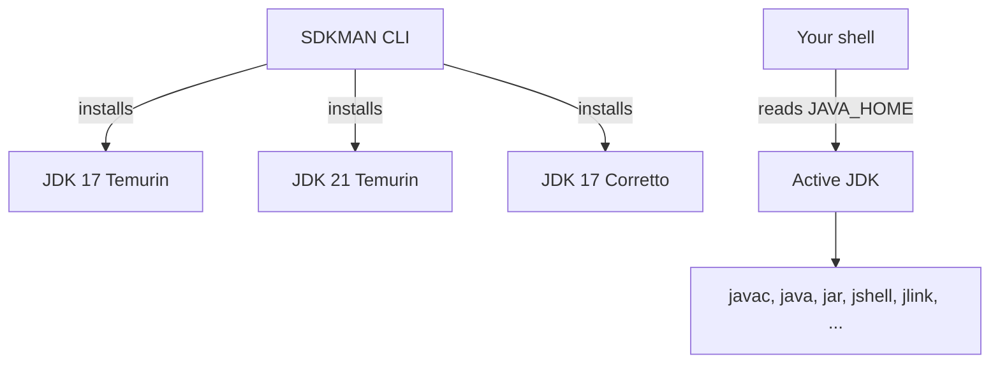


## What you'll learn
- The JDK/JRE distinction and why "just install Java" leads to mistakes.
- The core CLI tools - `javac`, `java`, `jar`, `jshell`, `jlink` - and their .NET analogues.
- Why there are many OpenJDK distributions, and which to pick.
- How to manage multiple JDKs cleanly with [SDKMAN](https://sdkman.io/).

## Concepts

The .NET SDK is a single shipped artifact. You install it, run `dotnet --info`, and you have the compiler, the runtime, the package manager, the templating engine, and the publish tooling. Java fragments this into separate concepts that you need to keep straight, because the failure modes differ.

A **JDK** (Java Development Kit) is what you want as a developer. It contains the JVM, the standard library, the compiler (`javac`), the JAR tool, the debugger, the linker - everything. A **JRE** (Java Runtime Environment) is the JVM plus standard library only, intended for execution. Modern OpenJDK distributions ship as JDKs by default; the standalone JRE has been deprecated since Java 11 in favour of `jlink`-generated runtimes. The practical rule for 2026: always install a JDK. If someone tells you to "install Java", they mean the JDK.

OpenJDK is the upstream reference implementation. Multiple vendors build and distribute their own OpenJDK binaries, all derived from the same source: **[Eclipse Temurin](https://adoptium.net/)** (formerly AdoptOpenJDK, the community default), **[Amazon Corretto](https://aws.amazon.com/corretto/)** (AWS's free LTS distribution), **[Azul Zulu](https://www.azul.com/downloads/?package=jdk)** (commercial support tier), **[BellSoft Liberica](https://bell-sw.com/pages/downloads/)** (small footprint, popular in containers), and Oracle's own JDK (free for development, paid for production since Oracle JDK 17 if you take the Oracle-built one rather than Oracle's OpenJDK build). For a .NET developer, the analogy is closest to "different vendors building the same .NET SDK" - pick any reputable one and move on. **Temurin 17 LTS** is the sane default.

The core tools you'll use directly:

| Tool | What it does | .NET analogue |
|---|---|---|
| `javac` | Compile `.java` to `.class` | `dotnet build` (does more) |
| `java` | Launch the JVM, run a class or JAR | `dotnet run`, `dotnet <dll>` |
| `jar` | Create / inspect / extract JAR archives | `dotnet publish` (kind of) |
| `jshell` | REPL for Java | `dotnet-script`, C# Interactive |
| `jlink` | Build a stripped, custom runtime image | `dotnet publish --self-contained` |
| `jpackage` | Create native installers (.msi, .dmg, .deb) | `dotnet publish` + installers |
| `javap` | Disassemble `.class` files | `ildasm` |
| `jdeps` | Static dependency analysis | `dotnet-symbol` (loosely) |

Notice what's *not* in that list: a package manager. Java has Maven Central as a registry, but the package manager is the build tool (Maven or Gradle), not a separate CLI like `dotnet add package`. Chapter 3 covers that in detail.

**SDKMAN** is the tool that closes the gap with the .NET SDK's version management. With one curl-pipe install, you get `sdk` - a CLI that lists, installs, and switches between JDK versions and distributions. There is no first-party Java equivalent. Install SDKMAN once, and the rest of your Java career is `sdk install java 17.0.x-tem`. It also manages Maven, Gradle, Kotlin, Spring CLI, and Scala - useful but not core.

## Walkthrough

Install SDKMAN and a JDK from scratch:

```bash
# One-time SDKMAN install (Linux/macOS - Windows users use Scoop or manually manage JAVA_HOME)
curl -s "https://get.sdkman.io" | bash
source "$HOME/.sdkman/bin/sdkman-init.sh"

# List installable JDK builds
sdk list java | head -40

# Install an LTS Temurin build
sdk install java 17.0.13-tem

# Confirm the active JDK
java -version
# openjdk version "17.0.13" 2024-10-15 ...
# OpenJDK Runtime Environment Temurin-17.0.13+11
```

Switch between versions:

```bash
sdk install java 21.0.5-tem   # try out a newer LTS
sdk use java 21.0.5-tem       # for this shell only
sdk default java 17.0.13-tem  # set the global default back
```

The interesting bit: `sdk use` sets `JAVA_HOME` and `PATH` for the current shell. Most build tools (Maven, Gradle, IntelliJ) honour `JAVA_HOME` by default, so per-project JDK selection becomes a one-liner. Compare with the .NET world's `global.json` - same concept, different mechanism.

Inspect what you have:

```bash
echo $JAVA_HOME                  # path to the active JDK
which java                       # shim that resolves to JAVA_HOME/bin/java
ls "$JAVA_HOME/bin"              # see the full tool set
```

## How it fits together



## Common pitfalls

| Pitfall | Why it happens | Fix |
|---|---|---|
| `javac: command not found` after installing "Java" | A JRE-only install ships no compiler. | Install a JDK (Temurin), not a JRE. |
| Different JDK in IDE vs. shell | IntelliJ picks its own JDK independently of `JAVA_HOME`. | Set IntelliJ's project SDK explicitly to match. |
| Maven uses the wrong JDK | Maven inherits `JAVA_HOME` at invocation time. | `sdk use java <version>` in the shell *before* `mvn`. |
| Pinned Java version drifts | No project file pins the JDK by default. | Use `.sdkmanrc` (per-project) and turn on `sdkman_auto_env=true`. |
| Vendor lock-in panic | "Should I use Oracle JDK?" | Use Temurin (or Corretto). They're OpenJDK builds; equivalent for your purposes. |

## Exercises

1. Install Temurin 17 and Temurin 21 via SDKMAN. Switch between them with `sdk use` and confirm `java -version` and `javac -version` agree.
2. Create a `.sdkmanrc` in a project directory, enable `sdkman_auto_env`, and verify that `cd`-ing into the directory swaps the active JDK.
3. Use `jlink` to build a minimal runtime that includes only `java.base` and `java.logging`. Compare its size to your full JDK install.

## Recap & next

- A JDK is the developer install; a JRE is the runtime-only install - always pick the JDK.
- OpenJDK distributions (Temurin, Corretto, Liberica, Zulu, Oracle) are all built from the same source; Temurin 17 LTS is the safe default.
- SDKMAN gives you per-shell, per-project JDK switching - the closest analogue to `dotnet --list-sdks` + `global.json`.
- The core tools (`javac`, `java`, `jar`, `jshell`, `jlink`, `jpackage`) cover compile, run, package, REPL, custom runtime, and installer use cases.

Next, **Maven and Gradle for a NuGet user** - dependency resolution, build lifecycles, and the practical Maven-vs-Gradle decision.

