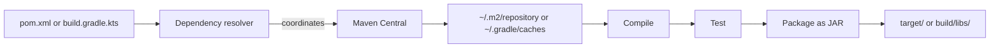


## What you'll learn
- How Java dependency coordinates differ from NuGet package IDs.
- Maven's lifecycle phases vs. `dotnet` subcommands.
- Gradle's task graph vs. Maven's lifecycle, and when each wins.
- Multi-module project layouts and the wrapper convention.

## Concepts

In .NET, dependency management is split: NuGet handles packages, MSBuild drives the build, the `dotnet` CLI ties them together. In Java, dependency management *is* the build tool. Maven and Gradle each own resolving dependencies, compiling sources, running tests, and packaging artifacts. There is no separate "Java NuGet."

Dependencies in Java are identified by three-part **coordinates**: `groupId:artifactId:version`. For example, `org.springframework.boot:spring-boot-starter-web:3.2.0` is unambiguous and globally unique across [Maven Central](https://central.sonatype.com/). NuGet uses a single ID (`Microsoft.AspNetCore.App`) plus version, and relies on author naming conventions; Java's three-part identity is enforced and prevents naming collisions. The trade-off: harder to type, easier to deduplicate at scale.

**Maven** is the older, more conservative choice. Its configuration is XML (`pom.xml`), declarative, and follows a fixed lifecycle: `validate → compile → test → package → verify → install → deploy`. Each phase has bound plugin goals; running `mvn package` executes every phase up to and including `package`. This is opinionated and predictable - once you know the lifecycle, every Maven project behaves the same way.

**Gradle** is more flexible. Its configuration is a Kotlin or Groovy DSL (`build.gradle.kts`) that defines tasks and dependencies between them. There is no fixed lifecycle; you compose what you need. Gradle's task graph is recomputed for every build, which lets it skip up-to-date work aggressively. The trade-off: a custom Gradle build can be inscrutable in ways a Maven build never is.

When to pick which:
- **Maven** for libraries, standard backend services, and teams that value predictability over flexibility.
- **Gradle** for Android (it's the default), for monorepos with shared build logic, for builds that genuinely benefit from incremental task graphs, or when you're already on the JetBrains/Kotlin stack.

For this course we use **Maven**, because Spring Boot's documentation defaults to it and the lifecycle is easier to teach. The concepts transfer directly.

The **wrapper** is a convention you should know: every Maven and Gradle project ships a `mvnw` or `gradlew` script (and a Windows `.cmd` companion) that downloads a pinned version of the tool on first use. Run `./mvnw` instead of `mvn` and your CI doesn't need a global Maven install - the project is self-contained. No NuGet equivalent; the closest .NET parallel is `global.json` pinning the SDK version.

## Walkthrough

A minimal `pom.xml` for a Spring Boot 3 service:

```xml
<?xml version="1.0" encoding="UTF-8"?>
<project xmlns="http://maven.apache.org/POM/4.0.0">
  <modelVersion>4.0.0</modelVersion>

  <parent>
    <groupId>org.springframework.boot</groupId>
    <artifactId>spring-boot-starter-parent</artifactId>
    <version>3.2.0</version>
  </parent>

  <groupId>com.example</groupId>
  <artifactId>orders-service</artifactId>
  <version>0.1.0-SNAPSHOT</version>

  <properties>
    <java.version>17</java.version>
  </properties>

  <dependencies>
    <!-- Web + JSON + embedded Tomcat -->
    <dependency>
      <groupId>org.springframework.boot</groupId>
      <artifactId>spring-boot-starter-web</artifactId>
    </dependency>

    <!-- JUnit 5 + Mockito + Spring Boot Test -->
    <dependency>
      <groupId>org.springframework.boot</groupId>
      <artifactId>spring-boot-starter-test</artifactId>
      <scope>test</scope>
    </dependency>
  </dependencies>
</project>
```

The interesting parts: the `<parent>` inherits Spring Boot's curated dependency versions and plugin configuration. You almost never specify a version for a `spring-boot-starter-*` dependency - the parent pins them. This is dependency management by convention, where .NET would expect you to manage versions explicitly in `Directory.Packages.props`.

Common commands:

```bash
./mvnw compile                # compile main sources
./mvnw test                   # compile + run unit tests
./mvnw package                # produce target/*.jar
./mvnw spring-boot:run        # run the app (Spring Boot plugin)
./mvnw dependency:tree        # show the resolved dependency graph
./mvnw -pl module-a -am test  # build module-a and what it needs (multi-module)
```

For Gradle, the equivalent `build.gradle.kts`:

```kotlin
plugins {
    java
    id("org.springframework.boot") version "3.2.0"
    id("io.spring.dependency-management") version "1.1.4"
}

group = "com.example"
version = "0.1.0-SNAPSHOT"
java.toolchain.languageVersion = JavaLanguageVersion.of(17)

repositories { mavenCentral() }

dependencies {
    implementation("org.springframework.boot:spring-boot-starter-web")
    testImplementation("org.springframework.boot:spring-boot-starter-test")
}
```

Same outcome, different mechanics. Gradle's `implementation` vs. `testImplementation` is more granular than Maven's `scope` - Gradle distinguishes `api` (transitive, exposed) from `implementation` (internal-only), which matters in libraries and shaves rebuild time in big graphs.

## How it fits together



## Common pitfalls

| Pitfall | Why it happens | Fix |
|---|---|---|
| "Why doesn't `dotnet add package` work?" | Java has no SDK-level package CLI; the build file is the source of truth. | Edit `pom.xml` / `build.gradle.kts` directly. |
| Version conflicts from transitive deps | Maven uses nearest-wins; Gradle resolves to the highest. | Run `dependency:tree` and pin explicitly. |
| Missing tests in CI | Maven's `test` phase only runs files matching `*Test.java` or `*Tests.java`. | Rename test files or configure Surefire. |
| `./mvnw` exists but isn't executable | Cloned repo, wrong file mode. | `chmod +x mvnw gradlew`. |
| Forgotten Spring Boot parent | Versions don't auto-align without it. | Inherit from `spring-boot-starter-parent` or import the BOM (Bill of Materials - a curated version-pinning POM). |

## Exercises

1. Generate a Spring Boot project from [start.spring.io](https://start.spring.io/) with both Maven and Gradle variants. Diff the two build files and explain three differences.
2. Add Guava (`com.google.guava:guava`) as a dependency, run `./mvnw dependency:tree`, and identify how many transitive dependencies it pulls.
3. Create a two-module Maven project: a library module and a service module that depends on it. Verify `./mvnw -pl service -am test` only rebuilds what's needed.

## Recap & next

- Java dependencies are identified by `groupId:artifactId:version` - three-part coordinates with global uniqueness.
- Maven is XML, fixed-lifecycle, predictable. Gradle is DSL, task-graph, flexible.
- Versions are usually pinned by a parent POM or BOM, not by hand per dependency.
- The wrapper (`mvnw`/`gradlew`) pins the build tool version inside the project.

Next, **Project layout: src/main/java, packages, and the classpath** - where files live, how they map to namespaces, and how the runtime finds them.

