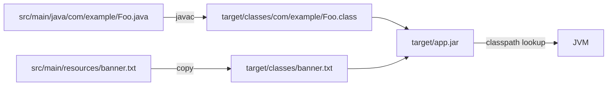


## What you'll learn
- The Maven Standard Directory Layout and what each directory means.
- How Java packages compare to C# namespaces - and where they intentionally diverge.
- What the classpath actually is, and how the JVM resolves classes at runtime.
- Where resources live and how they're loaded from a JAR.

## Concepts

A standard Maven (or Gradle) Java project looks like this:

```
orders-service/
├── pom.xml
├── mvnw
├── src/
│   ├── main/
│   │   ├── java/
│   │   │   └── com/example/orders/
│   │   │       ├── OrdersApplication.java
│   │   │       └── api/
│   │   │           └── OrderController.java
│   │   └── resources/
│   │       ├── application.yml
│   │       └── static/
│   └── test/
│       ├── java/
│       │   └── com/example/orders/
│       │       └── api/
│       │           └── OrderControllerTest.java
│       └── resources/
└── target/                  (generated)
    ├── classes/
    └── orders-service-0.1.0-SNAPSHOT.jar
```

This is the **Maven Standard Directory Layout** and Gradle defaults to it too. Important rules:

- **`src/main/java`** holds production sources; package directories must mirror package declarations exactly.
- **`src/main/resources`** holds non-code files (config, templates, static assets). Anything here ends up on the classpath at the JAR root.
- **`src/test/*`** mirrors the structure for tests. Test code can see main code, not vice versa.
- **`target/`** (or `build/` for Gradle) is generated output. Always gitignored.

Packages and the filesystem are coupled, not just convention. Java requires `OrderController.java` to live in `src/main/java/com/example/orders/api/` if it declares `package com.example.orders.api;`. The compiler will reject mismatches. C# is famously *not* like this - namespace and folder structure are independent in C# (a convention most teams follow, but the compiler doesn't enforce). In Java, the compiler is the enforcer.

That coupling extends to **packages versus namespaces**. A C# namespace is a logical grouping; a Java package is a logical grouping *and* a unit of access control. The default access modifier (no keyword - neither `public`, `protected`, nor `private`) makes a member **package-private**: visible to other classes in the same package, invisible outside. This is roughly C#'s `internal`, but scoped per-package rather than per-assembly. It's the access modifier you'll use more than you expect.

The **classpath** is the JVM's class lookup table. When `java -cp foo.jar:lib.jar:./classes com.example.Main` runs, the JVM searches those locations in order until it finds the requested class. Conceptually it's the same as .NET's probing path for assemblies, but per-class rather than per-assembly. Maven and Gradle assemble the classpath from your declared dependencies; you almost never set it by hand at the command line.

A JAR file is a ZIP with a `META-INF/MANIFEST.MF` and class files laid out by package directory. Inspect with `jar tf app.jar` or `unzip -l app.jar` - they're not opaque. Spring Boot's fat JARs add nested JARs in `BOOT-INF/lib/`, and a custom launcher handles the nested classpath. Chapter 5 covers that.

**Resources** are loaded by name from the classpath, not by file path. `getClass().getResourceAsStream("/application.yml")` walks the classpath to find a file at that path inside any JAR or directory entry. This is unlike `File.ReadAllText("appsettings.json")` in .NET, which is path-based and works against the running process's working directory. The classpath-based model means a packaged JAR works the same as an exploded directory - your code doesn't need to know.

## Walkthrough

Create the layout manually for a single class, just to internalize the rules:

```bash
mkdir -p src/main/java/com/example/hello
cat > src/main/java/com/example/hello/Greeter.java <<'EOF'
package com.example.hello;

public class Greeter {
    public String greet(String name) {
        return "hello, " + name;
    }
}
EOF
```

Now if you move that file to `src/main/java/com/example/different/Greeter.java` *without* updating the `package` declaration, `javac` rejects it:

```
error: class Greeter is public, should be declared in a file named Greeter.java
```

Or worse, if the package line says `com.example.hello` but the file lives at `com/example/different/`, the compile passes but the JAR layout will misplace it and runtime class loading fails with `NoClassDefFoundError`. Always: package line ↔ directory path ↔ filename, all in agreement.

Load a resource from the classpath:

```java
package com.example.hello;
import java.io.InputStream;

public class ConfigLoader {
    public String load() throws Exception {
        // Leading "/" means the JAR root; no leading "/" means "relative to this class's package".
        try (InputStream in = getClass().getResourceAsStream("/banner.txt")) {
            return new String(in.readAllBytes());
        }
    }
}
```

`src/main/resources/banner.txt` ends up at `/banner.txt` inside the packaged JAR. The same code works exploded (running from `target/classes`) and packaged (running from the JAR) because the lookup is classpath-based.

## How it fits together



## Common pitfalls

| Pitfall | Why it happens | Fix |
|---|---|---|
| Package declaration doesn't match folder | Coming from C# where folder structure is convention only. | Always: `package` line == directory path under `src/main/java`. |
| `NoClassDefFoundError` at runtime | A class on the classpath at compile-time is missing at runtime. | Inspect the runtime classpath with `jar tf` or `mvn dependency:tree`. |
| `getResourceAsStream` returns `null` | Leading slash semantics confused with relative path. | Leading `/` = classpath root; no slash = current package. |
| Tests can't see main classes | Mis-placed test files or wrong source set. | Tests live under `src/test/java` mirroring the main package structure. |
| Two `Main` classes on classpath | Two JARs both define `com.example.Main`. | The first loader wins; deduplicate dependencies. |

## Exercises

1. Place a `Greeter.java` file with `package com.example.hello;` under three different directory paths and confirm `javac`'s behaviour for each (matching, mismatching, missing).
2. Add a `messages.properties` file to `src/main/resources` and load it from a class via `getResourceAsStream`. Confirm it works both via `mvn spring-boot:run` and after `mvn package` + `java -jar`.
3. Run `jar tf target/your-app.jar` and identify (a) where your compiled classes live, (b) where your resources live, (c) where the manifest is.

## Recap & next

- The Maven Standard Directory Layout (`src/main/java`, `src/main/resources`, `src/test/*`) is universal.
- Java packages must match folder structure exactly - the compiler enforces it.
- The package-private default access modifier is your everyday tool; it's narrower than C#'s `internal`.
- The classpath is a per-class lookup table; resources are loaded by classpath path, not file path.

Next, **Hello, Service: your first Spring Boot 3 app** - bootstrap, run, and the dev inner loop with `mvn spring-boot:run`.

