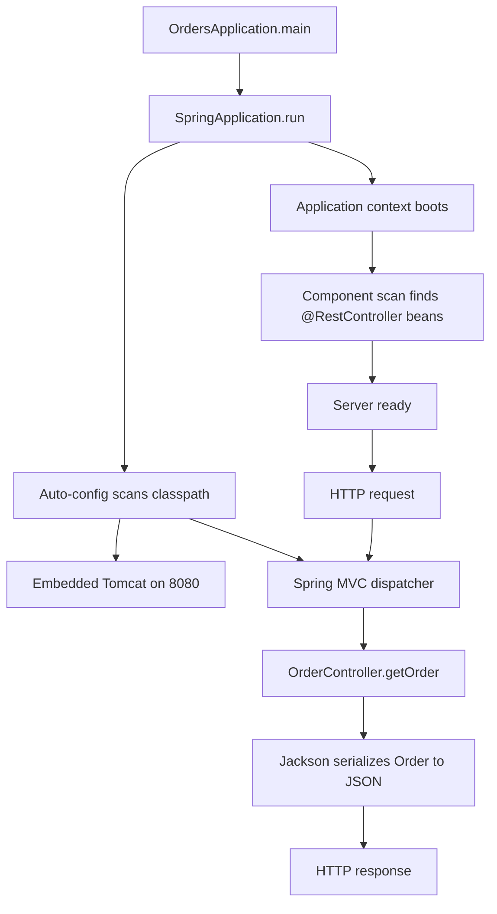


## What you'll learn
- How [start.spring.io](https://start.spring.io/) compares to `dotnet new webapi`.
- What `@SpringBootApplication` actually does.
- The Spring Boot dev inner loop: `mvn spring-boot:run`, DevTools, and hot reload.
- Where you write your first REST endpoint.

## Concepts

Spring Boot is to ASP.NET Core what Spring Framework is to ASP.NET - an opinionated, convention-over-configuration layer built on a more general platform. Spring Boot 3.x targets Java 17+ and Jakarta EE 9+ (note: package renames from `javax.*` to `jakarta.*`). The starter dependency `spring-boot-starter-web` brings in Spring MVC, Jackson for JSON, and an embedded Tomcat - equivalent to ASP.NET Core's `Microsoft.AspNetCore.App` shared framework.

**Bootstrapping** a new project mirrors `dotnet new webapi`. Use [start.spring.io](https://start.spring.io/) (web or `curl`/IntelliJ integration), pick:

- Project: Maven (or Gradle)
- Language: Java
- Spring Boot: 3.2.x or later
- Java: 17
- Dependencies: at least Spring Web; add Spring Boot DevTools for hot reload

You get a ZIP with `pom.xml`, the standard layout, and a generated main class.

**`@SpringBootApplication`** is a meta-annotation that combines three:

- `@SpringBootConfiguration` - marks this class as a configuration source.
- `@EnableAutoConfiguration` - turns on Boot's auto-configuration: when `spring-boot-starter-web` is on the classpath, configure a web server, register Jackson, set up MVC.
- `@ComponentScan` - scan this class's package and sub-packages for components (controllers, services, repositories).

The .NET parallel is the implicit `WebApplication.CreateBuilder(args)` in `Program.cs` minus the explicit service registration calls - Spring discovers and wires components based on annotations and classpath probing.

**Running** the app uses `mvn spring-boot:run` (or `./gradlew bootRun`). The Spring Boot Maven plugin starts a JVM, sets up the classpath, runs your main class, and hooks in DevTools for hot reload. For .NET developers, this is the equivalent of `dotnet watch run`.

**DevTools** (in `spring-boot-devtools`) restarts the application context when classpath resources change. It uses two class loaders - one for unchanging dependencies, one for your code - so restarts are sub-second once the JVM is warm. Combined with IntelliJ's "Build project automatically" and "Allow auto-make to start", you get an inner loop close to `dotnet watch`'s polish.

## Walkthrough

Generated `OrdersApplication.java`:

```java
package com.example.orders;

import org.springframework.boot.SpringApplication;
import org.springframework.boot.autoconfigure.SpringBootApplication;

@SpringBootApplication
public class OrdersApplication {
    public static void main(String[] args) {
        // SpringApplication.run boots the application context, embedded server, and dispatcher.
        SpringApplication.run(OrdersApplication.class, args);
    }
}
```

Add a controller in the same package or any sub-package (so `@ComponentScan` picks it up):

```java
package com.example.orders.api;

import org.springframework.web.bind.annotation.GetMapping;
import org.springframework.web.bind.annotation.PathVariable;
import org.springframework.web.bind.annotation.RestController;

@RestController
public class OrderController {

    @GetMapping("/orders/{id}")
    public Order getOrder(@PathVariable long id) {
        return new Order(id, "pending");
    }

    // A record makes a perfect DTO - see Module 2 Chapter 2.
    public record Order(long id, String status) {}
}
```

Run it:

```bash
./mvnw spring-boot:run
# ...
# Tomcat started on port(s): 8080 (http) with context path ''
# OrdersApplication started in 1.832 seconds (process running for 2.107)

curl -s http://localhost:8080/orders/42
# {"id":42,"status":"pending"}
```

The interesting bits:
- `@RestController` is `@Controller` + `@ResponseBody` - every return value is serialized to JSON automatically (Jackson is on the classpath). The .NET equivalent is `[ApiController]` plus the default `Ok(...)` response.
- `@GetMapping("/orders/{id}")` maps a route and HTTP method in one annotation - like `[HttpGet("orders/{id}")]`.
- `@PathVariable long id` binds the path segment. The type conversion (string → long) happens automatically; mismatches return 400.

DevTools in `pom.xml`:

```xml
<dependency>
  <groupId>org.springframework.boot</groupId>
  <artifactId>spring-boot-devtools</artifactId>
  <scope>runtime</scope>
  <optional>true</optional>
</dependency>
```

With this on the classpath, editing `OrderController.java` and triggering a recompile (IntelliJ does this automatically on save when configured) restarts the application context in ~1 second.

## How it fits together



## Common pitfalls

| Pitfall | Why it happens | Fix |
|---|---|---|
| Controller not picked up | Lives outside the main class's package tree. | Put it under `com.example.orders` or sub-packages, or set `scanBasePackages`. |
| `javax.*` imports don't resolve | Old tutorial, pre-Spring-Boot-3. | Use `jakarta.*` for Spring Boot 3.x. |
| DevTools not restarting | IntelliJ's "Build project automatically" is off. | Enable it; also enable "Allow auto-make to start". |
| Port 8080 in use | Another app already running. | Set `server.port: 0` for a random free port in dev. |
| Endpoint returns 404 in tests but works in browser | Test context didn't scan the controller's package. | Use `@SpringBootTest` or `@WebMvcTest(OrderController.class)`. |

## Exercises

1. Bootstrap a new Spring Boot 3 project from [start.spring.io](https://start.spring.io/) with `Spring Web` and `Spring Boot DevTools`. Run it and hit a `/hello` endpoint you add.
2. Move `OrderController` to a package *outside* the main class's tree (e.g. `com.example.other`). Observe the 404, then fix it with `@ComponentScan(basePackages = {...})`.
3. Add a `@PostMapping("/orders")` that accepts an `Order` body. Test with `curl -X POST -H 'content-type: application/json' -d '{"id":1,"status":"new"}' localhost:8080/orders`.

## Recap & next

- `start.spring.io` is the `dotnet new webapi` equivalent for Spring Boot.
- `@SpringBootApplication` = config + auto-configuration + component scan.
- The starter dependency `spring-boot-starter-web` provides MVC, Jackson, and an embedded Tomcat.
- `mvn spring-boot:run` + DevTools gives a fast inner loop comparable to `dotnet watch`.

Next, **Module 2: Core language - Java 17 through a C# lens** opens with **Types, values, and boxing** - the primitive/wrapper split that has no .NET equivalent.

