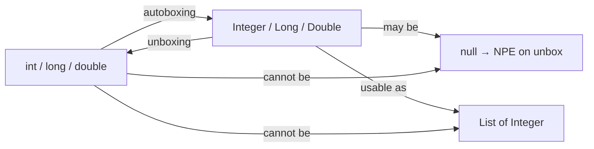


## What you'll learn
- Java's eight primitive types and their reference-type wrappers.
- How autoboxing works and where it bites you (`==`, the `Integer` cache).
- Why Java 17 has no `struct` and what to use instead of `int?`.
- When boxing actually costs you performance, and when it doesn't.

## Concepts

C# unifies value types and reference types under a single object model: an `int` is a struct, a `string` is a class, but both are `object` and you can call `.ToString()` on either. Java keeps the split explicit and visible. There are exactly **eight primitive types** - `boolean`, `byte`, `short`, `int`, `long`, `float`, `double`, `char` - and they are **not objects**. They have no methods. They cannot be null. They cannot appear as type arguments to a generic: `List<int>` doesn't compile (use `List<Integer>`).

For each primitive there is a **wrapper class**: `Boolean`, `Byte`, `Short`, `Integer`, `Long`, `Float`, `Double`, `Character`. These *are* objects: nullable, methodful, and usable as generic type arguments. The compiler **autoboxes** between them: writing `Integer i = 42` is shorthand for `Integer.valueOf(42)`, and writing `int j = i` is shorthand for `i.intValue()`.

This sounds clean. It bites in two places.

**`==` on wrapper types compares references, not values.** `Integer a = 1000; Integer b = 1000; a == b` is `false`. Always use `.equals()` for wrapper comparisons. The C# parallel - `==` on a class compares references unless overloaded - exists, but C# tends to overload `==` for value-like types (`string`, `decimal`). In Java, **never** use `==` on wrappers; use it only on primitives.

**The `Integer` cache.** For values in `[-128, 127]`, `Integer.valueOf(n)` returns a cached instance. So `Integer a = 100; Integer b = 100; a == b` happens to be `true`, but `Integer a = 200; Integer b = 200; a == b` is `false`. This is the single most reliable interview question and the bug you'll see in production code by people who forgot the rule.

**There is no `struct` in Java 17.** Value types are coming via [Project Valhalla](https://openjdk.org/projects/valhalla/), but as of Java 17 (and 21) you don't have them. Every non-primitive object lives on the heap. If you want a value-like `Point(int x, int y)`, you write a `record` (Chapter 2 of this module) and it's still a heap object - but with implicit `equals`/`hashCode`/`toString`. The performance cost is real but rarely matters; the JIT can escape-analyse short-lived objects and stack-allocate them.

**What to use instead of `int?`.** Three options, in order of preference:

1. **`Integer` (the wrapper)** - nullable, simple, autoboxes. The right default.
2. **`OptionalInt`** - primitive-specialised Optional, no boxing. Use for return types where absence is meaningful (see Module 3 Chapter 2).
3. **A sentinel** - `Integer.MIN_VALUE` or `-1` - when you control all callers and want to avoid allocation. Rarely worth it.

Don't use `Optional<Integer>` - you pay for the Optional *and* the boxed Integer.

## Walkthrough

A concrete tour of the gotchas:

```java
public class BoxingDemo {
    public static void main(String[] args) {
        // Primitives compare by value.
        int a = 1000;
        int b = 1000;
        System.out.println(a == b);          // true

        // Wrappers compare by reference.
        Integer x = 1000;
        Integer y = 1000;
        System.out.println(x == y);          // false  ← classic gotcha
        System.out.println(x.equals(y));     // true

        // The Integer cache makes small values look like value types.
        Integer p = 100;
        Integer q = 100;
        System.out.println(p == q);          // true  ← still wrong to rely on

        // Unboxing a null wrapper throws NPE.
        Integer maybeNull = null;
        try {
            int forced = maybeNull;          // unboxing → NullPointerException
        } catch (NullPointerException npe) {
            System.out.println("boom on unbox");
        }

        // OptionalInt avoids the boxing pair entirely.
        java.util.OptionalInt opt = java.util.OptionalInt.of(42);
        System.out.println(opt.getAsInt());  // 42
    }
}
```

The "boom on unbox" case is the production failure mode. A `Map<String, Integer>` lookup returns `null` for absent keys; assigning the result to an `int` is silent autoboxing → null check → NPE deep in your call chain. The C# analogue would require an explicit `.Value` call on `Nullable<int>`, which makes the failure point visible. Java's autoboxing hides it.

Boxing also costs you in tight loops:

```java
// Boxes every iteration: 100M allocations.
Long sum = 0L;
for (long i = 0; i < 100_000_000L; i++) sum += i;

// No boxing: same loop runs an order of magnitude faster on cold code.
long sumFast = 0L;
for (long i = 0; i < 100_000_000L; i++) sumFast += i;
```

The JIT's escape analysis can scalar-replace short-lived boxes, so the gap narrows after warm-up - but typing `Long` where you meant `long` is a real, common bug. Always prefer primitives unless you need null, a collection, or generics.

## How it fits together



## Common pitfalls

| Pitfall | Why it happens | Fix |
|---|---|---|
| `==` on `Integer` returns wrong result for 200+ | Wrapper `==` compares references, not values. | Use `.equals()` for wrappers. |
| NPE from autoboxing a null `Integer` | Compiler-inserted `intValue()` call on null. | Use `Integer` directly, or `OptionalInt`, or null-check before unboxing. |
| `List<int>` doesn't compile | Generics work only with reference types. | Use `List<Integer>`. |
| Surprising allocation in hot loop | Using `Long` instead of `long` in a sum. | Use the primitive in loops; box only at boundaries. |
| Expecting `int?` syntax | C# nullable value-type syntax has no Java equivalent. | Use the wrapper type or an `Optional*` variant. |

## Exercises

1. Write a method `count(List<Integer> xs)` that sums the values and skips nulls. Confirm what happens if you assign the result to an `int` vs. an `Integer`.
2. Reproduce the `Integer` cache gotcha: write a unit test that confirms `Integer.valueOf(127) == Integer.valueOf(127)` but `Integer.valueOf(128) != Integer.valueOf(128)`. Explain the asymmetry.
3. Benchmark `Long sum` vs. `long sum` over 10M iterations, run cold (no warm-up). Reproduce the warm comparison after 10,000 warm-up iterations.

## Recap & next

- Java's eight primitives are *not* objects; their wrapper classes are.
- Autoboxing is automatic but introduces NPE risk and reference-equality bugs.
- The `Integer` cache makes `==` look fine for small values; never rely on it.
- There is no Java 17 `struct`; use records for value-like types or primitives when generics aren't needed.
- For nullable ints: `Integer`, then `OptionalInt`, then sentinels - in that order.

Next, **Classes, records, and sealed types** - modern Java replacements for C# properties, init-only setters, and POCOs.

