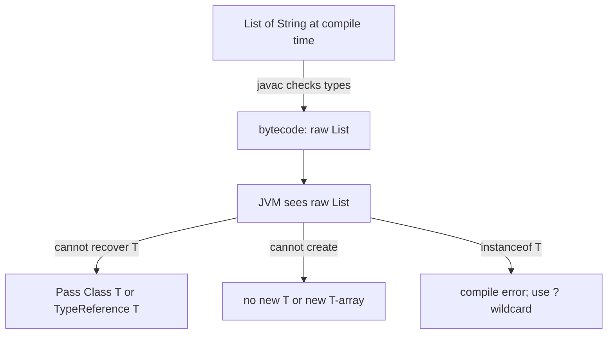


## What you'll learn
- What type erasure is and why Java's designers picked it.
- What breaks because of erasure: `instanceof`, `new T[]`, reflection.
- Wildcards (`? extends`, `? super`) and the PECS rule.
- How to thread a `Class<T>` token through your API when erasure forces you to.

## Concepts

C# generics are **reified** - type parameters survive into the runtime. At runtime, a `List<int>` and a `List<string>` are different types; the CLR knows the difference and you can ask via reflection. The JIT specializes generic code per type argument (for value types) and shares code for reference types, but the type information is preserved.

Java generics are **erased**. After compilation, `List<String>` and `List<Integer>` are both just `List`. The type argument is checked by `javac` for safety, then thrown away. The JVM sees raw `List`. This is deliberate - Java added generics in Java 5, and erasure was the price of backward compatibility with pre-generic code on existing JVMs.

What breaks because of this:

**Runtime type tests don't see type arguments.**

```java
Object x = new ArrayList<String>();
if (x instanceof List<String>) {            // does NOT compile
    // ...
}
if (x instanceof List<?>) {                 // OK - wildcard works
    // ...
}
```

You can ask "is this any kind of List?" but not "is this a list-of-string?". To recover element-type information at runtime, you must pass a `Class<T>` token explicitly:

```java
public <T> T parse(String json, Class<T> type) {
    // ObjectMapper accepts the token because it has to.
    return objectMapper.readValue(json, type);
}
parse(jsonString, Order.class);
```

This pattern shows up everywhere in Java APIs - Jackson, Spring, JDBI, Hibernate - because the alternative is impossible.

**Generic arrays don't exist.**

```java
List<String>[] arr = new List<String>[10];  // does NOT compile
```

Arrays are reified and would conflict with erasure. The workaround is either `List<List<String>>` (a list-of-lists) or an unchecked cast (`(List<String>[]) new List[10]`) with a `@SuppressWarnings("unchecked")` annotation. Modern code prefers collections to arrays.

**`new T()` doesn't exist.** You can't instantiate the type parameter directly because at runtime the JVM doesn't know what `T` is. Pass a `Supplier<T>` or a `Class<T>` and use `clazz.getDeclaredConstructor().newInstance()`.

**Wildcards and PECS.** Java generics are invariant by default - `List<String>` is not a `List<Object>`, even though `String` is an `Object`. Wildcards let you express variance per use-site:

- `List<? extends Number>` - a list of *some* subtype of Number. You can read `Number` from it but not add (except `null`). **P**roducer of values.
- `List<? super Integer>` - a list of *some* supertype of Integer. You can add `Integer` to it but reads come back as `Object`. **C**onsumer of values.
- **PECS**: **P**roducer **E**xtends, **C**onsumer **S**uper.

The C# analogue is declaration-site variance with `out T` and `in T`. Java pushes variance to the use site, which is more verbose but lets you mix.

## Walkthrough

The token pattern in action:

```java
public class JsonStore {
    private final ObjectMapper mapper = new ObjectMapper();

    // Without the Class token, the method couldn't know what to deserialize into.
    public <T> T load(String json, Class<T> type) throws Exception {
        return mapper.readValue(json, type);
    }

    // For generic types like List<Order>, the Class token isn't enough -
    // List.class loses the Order. Use TypeReference to capture the full type.
    public <T> T loadGeneric(String json, com.fasterxml.jackson.core.type.TypeReference<T> ref) throws Exception {
        return mapper.readValue(json, ref);
    }
}

// Caller:
Order o          = store.load(json, Order.class);
List<Order> list = store.loadGeneric(json, new TypeReference<List<Order>>() {});
```

The anonymous subclass `new TypeReference<List<Order>>() {}` is the standard trick to defeat erasure: subclassing captures the type argument in the subclass's metadata, where it survives erasure. Jackson, Spring, and Guice all use this.

PECS in practice:

```java
public class Pipe {
    // src produces Numbers (or subtypes). We read; we don't add.
    // dst consumes Numbers (or supertypes). We add; we don't read.
    public static void copy(List<? extends Number> src, List<? super Number> dst) {
        for (Number n : src) dst.add(n);
    }

    public static void main(String[] args) {
        List<Integer> ints   = List.of(1, 2, 3);
        List<Object>  things = new ArrayList<>();
        copy(ints, things);                  // works: Integer extends Number, Object super Number
        System.out.println(things);          // [1, 2, 3]
    }
}
```

Without the wildcards, you'd need `List<Number>` on both sides - but `List<Integer>` is not a `List<Number>`, so the call would fail at compile time. PECS makes the signature flexible.

## How it fits together



## Common pitfalls

| Pitfall | Why it happens | Fix |
|---|---|---|
| `instanceof List<String>` | Erasure removes the type argument. | Use `instanceof List<?>` and check elements individually if needed. |
| `Class<T> c = T.class` | T isn't a real type at runtime. | Pass `Class<T>` as a parameter from the caller. |
| `T[] arr = new T[n]` | Arrays are reified; generics are erased. | Use a `List<T>`; or cast and suppress the warning. |
| Mixing raw and generic types | Pre-Java-5 APIs return raw `List`. | Wrap and parameterize at the boundary; `@SuppressWarnings("unchecked")` minimally. |
| Reflective `Class<List<String>>` | Class literals can't be parameterized. | Use a `TypeReference` (Jackson) or `ParameterizedTypeReference` (Spring). |

## Exercises

1. Write a method `<T> T loadFirstOf(Class<T> type, String... candidates)` that returns the first candidate that parses as `T`. Use a JSON library of your choice and explain why the `Class<T>` token is mandatory.
2. Try writing a generic method that creates a `T[]`. Confirm the compile error and rewrite using `List<T>` instead.
3. Apply PECS: write a `concat(List<? extends T> a, List<? extends T> b, List<? super T> target)` method and test it with mixed subtype lists.

## Recap & next

- Java generics are erased at compile time; the JVM sees raw types.
- Erasure breaks `instanceof T`, `new T()`, `new T[]`, and reflection-by-type.
- Wildcards (`? extends`, `? super`) recover variance per use site. PECS: **P**roducer **E**xtends, **C**onsumer **S**uper.
- Workarounds: pass `Class<T>` tokens or `TypeReference` instances at API boundaries.
- This is the most common surprise for .NET developers - internalize it now.

Next, **Exceptions: checked vs. unchecked** - try-with-resources, when (if ever) to use `throws`, and why `using` was always a checked-exception story in disguise.

