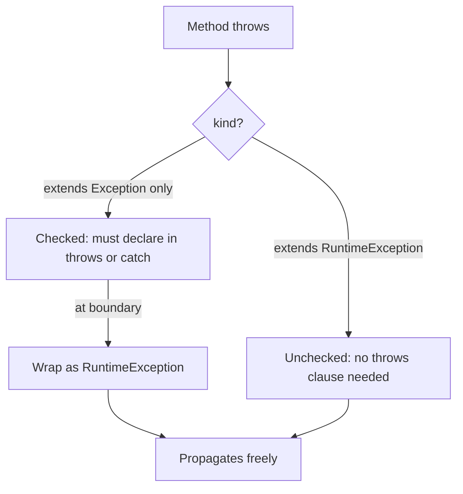


## What you'll learn
- The difference between checked and unchecked exceptions, and when each appears.
- Why modern Java code prefers unchecked exceptions.
- Try-with-resources as a stricter, safer `using` statement.
- How exception chaining and suppressed exceptions work.

## Concepts

C# has one kind of exception: an unchecked one. Any method can throw any exception; the compiler never forces you to catch or declare anything. Java has two kinds:

- **Unchecked exceptions** extend `RuntimeException` (or `Error`). They behave like C# exceptions - methods don't declare them, callers don't catch them unless they want to.
- **Checked exceptions** extend `Exception` but not `RuntimeException`. They must appear in the method's `throws` clause and any caller must either catch them or propagate them.

Checked exceptions were Java's bet on compile-time safety: "the caller cannot ignore that `Files.readString` might throw `IOException`." In practice the bet didn't pay off - checked exceptions:

- Pollute every method signature in a deep call stack (`throws IOException, SQLException, ParseException`).
- Don't compose with lambdas: `stream.map(f::readFile)` doesn't work because `readFile` throws `IOException`.
- Encourage `try { ... } catch (Exception e) { /* swallowed */ }` - the worst possible response.

Modern Java code (post-Java-7, certainly post-Spring-Boot) treats checked exceptions as a legacy mistake to wrap and rethrow. New code throws **unchecked** exceptions. Spring's `DataAccessException`, Jackson's `JsonProcessingException`, and most third-party libraries follow this rule. The standard library still throws checked exceptions (`IOException`, `SQLException`), and you must deal with them - but you handle them once, at the boundary, and don't propagate.

**Try-with-resources** (Java 7+) is the better `using`. Anything implementing `AutoCloseable` is eligible:

```java
try (var conn = dataSource.getConnection();
     var stmt = conn.prepareStatement("select 1");
     var rs   = stmt.executeQuery()) {
    while (rs.next()) {
        // ...
    }
}
// All three resources are closed in reverse order, even if the body throws.
```

Compared with C#'s `using`:
- Multiple resources are first-class - no nested `using` blocks. You can declare several in one `try`, and they close in reverse declaration order.
- If both the body *and* `close()` throw, the close exception is added as a **suppressed exception** on the body's exception, not lost. C# `using` historically discarded the close exception; `await using` in newer C# handles it better.
- Works with any `AutoCloseable`, including your own classes.

**Exception chaining** lets you wrap one exception in another while preserving the cause:

```java
try {
    return loadFromDb(id);
} catch (SQLException e) {
    throw new DataAccessException("could not load order " + id, e);
    //                                                          ^ cause
}
```

The `getCause()` chain is printed automatically by the JVM's stack trace formatter - you see "Caused by: java.sql.SQLException: …" beneath the outer exception. Always pass the original as the cause; never swallow it.

## Walkthrough

The migration from a `using`-style C# block to idiomatic Java:

```csharp
// C#: using statement
using var reader = new StreamReader("file.txt");
var contents = reader.ReadToEnd();
```

```java
// Java: try-with-resources
try (var reader = new java.io.BufferedReader(new java.io.FileReader("file.txt"))) {
    String contents = reader.lines().collect(Collectors.joining("\n"));
    System.out.println(contents);
} catch (java.io.IOException e) {
    // IOException is checked; you must catch or declare it.
    throw new UncheckedIOException("could not read file.txt", e);
}
```

A pattern you'll see often: catch the checked exception at the boundary and wrap it in an unchecked one. `UncheckedIOException` is built in for exactly this case.

The "lambdas don't compose with checked exceptions" pain:

```java
// Doesn't compile: readFile throws IOException, but Function<String,String> doesn't allow it.
List<String> contents = paths.stream()
    .map(p -> java.nio.file.Files.readString(java.nio.file.Path.of(p)))   // ERROR
    .toList();

// Workaround: wrap into a runtime exception.
List<String> contents = paths.stream()
    .map(p -> {
        try {
            return java.nio.file.Files.readString(java.nio.file.Path.of(p));
        } catch (java.io.IOException e) {
            throw new java.io.UncheckedIOException(e);
        }
    })
    .toList();
```

The boilerplate is the cost of checked exceptions meeting the stream API. Libraries like [vavr](https://www.vavr.io/) provide checked-exception-friendly functional types, but the standard pattern is just to wrap.

Suppressed exceptions:

```java
try (var primary = new ResourceThatFailsOnClose();
     var secondary = new ResourceThatFailsOnClose()) {
    throw new RuntimeException("body failure");
}
// The thrown RuntimeException carries .getSuppressed() containing the close exceptions.
// jvm prints all three: the body exception, then "Suppressed: ..." for each close.
```

## How it fits together



## Common pitfalls

| Pitfall | Why it happens | Fix |
|---|---|---|
| `throws Exception` on everything | "Just propagate" → signature pollution. | Wrap into unchecked at the boundary. |
| Empty `catch (Exception e) {}` | Suppressing a checked exception to satisfy the compiler. | At minimum log; preferably handle or rethrow. |
| Resource leak in old-style `try/finally` | Forgot `null` check or close throw. | Use try-with-resources. |
| Lost cause on rethrow | `throw new RuntimeException("oops");` discards the original. | Always pass the cause: `throw new RuntimeException("oops", e);`. |
| Checked exceptions in lambdas | Functional interfaces don't declare exceptions. | Wrap inside the lambda; or use a sneaky-throws library. |

## Exercises

1. Take a method that reads a file (`Files.readString`) and write three versions: (a) propagating `IOException`, (b) catching and wrapping into `UncheckedIOException`, (c) using a stream over multiple files with the wrapping pattern.
2. Write a custom `AutoCloseable` that prints when it's constructed, used, and closed. Confirm that two of them in a try-with-resources close in reverse order.
3. Throw from both the body and the resource's `close()` method. Inspect `getSuppressed()` on the resulting exception and reproduce the printed trace.

## Recap & next

- Java has two exception flavours; checked exceptions force the caller to handle or declare.
- Modern Java avoids new checked exceptions and wraps standard-library ones at the boundary.
- Try-with-resources is the safer `using`: multiple resources, reverse close order, suppressed exceptions.
- Always pass the original as the cause when wrapping; never swallow.
- `UncheckedIOException` exists for exactly the "I caught `IOException`, now what?" case.

Next, **Collections: List, Map, Set and friends** - the framework you'll touch on every line of business logic.

