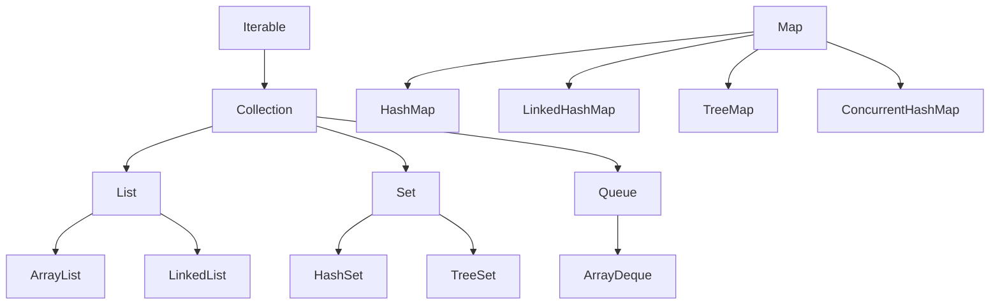


## What you'll learn
- The Java Collections Framework's interface-vs-implementation split.
- Direct mappings from `List<T>`, `Dictionary<K,V>`, `HashSet<T>` to Java equivalents.
- When to use `ArrayList` vs. `LinkedList`, `HashMap` vs. `LinkedHashMap` vs. `TreeMap`.
- Immutable factories (`List.of`, `Map.of`, `Set.of`) and their gotchas.
- Concurrent collections (`ConcurrentHashMap`) at a glance.

## Concepts

The Java Collections Framework is interface-first. You program against `List`, `Map`, `Set`, `Queue` interfaces and pick a concrete class only at construction. The mapping from .NET is mostly mechanical:

| .NET type                       | Java interface | Default implementation       |
|---------------------------------|----------------|------------------------------|
| `List<T>`                       | `List<E>`      | `ArrayList<E>`               |
| `Dictionary<K,V>`               | `Map<K,V>`     | `HashMap<K,V>`               |
| `HashSet<T>`                    | `Set<E>`       | `HashSet<E>`                 |
| `SortedDictionary<K,V>`         | `SortedMap<K,V>` | `TreeMap<K,V>`             |
| `SortedSet<T>`                  | `SortedSet<E>` | `TreeSet<E>`                 |
| `Queue<T>`                      | `Queue<E>`     | `ArrayDeque<E>`              |
| `Stack<T>`                      | `Deque<E>`     | `ArrayDeque<E>`              |
| `LinkedList<T>`                 | `LinkedList<E>`| (rare in practice)           |
| `ConcurrentDictionary<K,V>`     | `ConcurrentMap<K,V>` | `ConcurrentHashMap<K,V>` |
| `IEnumerable<T>`                | `Iterable<E>`  | (interface)                  |
| `IList<T>` read-only            | `List<E>` (unmodifiable) | `List.copyOf(...)` |

The interface-first style means you should declare variables against the interface (`List<String> names = new ArrayList<>();`) and only pin the concrete type at the new expression. This isn't a stylistic preference - it makes the data structure swappable. Even the JDK's own factory methods return interface types (`List.of(...)` returns a `List`, not specifically an `ImmutableCollections.ListN`).

**ArrayList vs. LinkedList.** In 2026 the answer is almost always `ArrayList`. Linked lists are worse than array lists for almost every workload (cache locality, allocation, memory overhead). The textbook benefit - O(1) insertion at arbitrary positions - only matters if you already have the node, which you almost never do. C# developers occasionally reach for `LinkedList<T>` for queue semantics; in Java use `ArrayDeque`, not `LinkedList`.

**HashMap vs. LinkedHashMap vs. TreeMap.**
- `HashMap` - no order guarantees, fastest, default choice.
- `LinkedHashMap` - preserves insertion order. Use when iteration order matters for output or debugging.
- `TreeMap` - sorted by key (natural or `Comparator`). Use for range queries (`subMap`, `headMap`, `tailMap`).

**Immutable factories** (Java 9+):

```java
List<String> names = List.of("alice", "bob", "carol");
Map<String, Integer> ages = Map.of("alice", 30, "bob", 25);
Set<Integer> primes = Set.of(2, 3, 5, 7);
```

These are truly immutable - `names.add(...)` throws `UnsupportedOperationException`, not a "this collection is read-only" wrapper. Two gotchas:

- `Map.of` overloads stop at 10 entries; for more use `Map.ofEntries(Map.entry(...), ...)`.
- `null` is rejected: `List.of("a", null)` throws `NullPointerException` immediately. If you need nulls, use `Arrays.asList(...)` or `new ArrayList<>(Arrays.asList(...))`.

**Unmodifiable wrappers** are different from immutable factories. `Collections.unmodifiableList(list)` returns a view that rejects mutations on itself but reflects changes to the underlying list. `List.copyOf(list)` does a defensive copy and returns a truly immutable result.

**Iteration.** `for (var x : collection)` works on anything implementing `Iterable<E>` - the equivalent of C#'s `foreach`. There is no LINQ-style chaining on collections directly; you pipe through the Stream API (Module 3 Chapter 1).

**Concurrent collections** live in `java.util.concurrent`. `ConcurrentHashMap` is the workhorse - comparable to `ConcurrentDictionary<K,V>`. Use it whenever you'd reach for thread-safe map semantics. Do *not* use `Collections.synchronizedMap(new HashMap<>())` in 2026 - it's coarser-grained and slower.

## Walkthrough

A quick tour:

```java
import java.util.*;

public class Collections101 {
    public static void main(String[] args) {
        // List
        List<String> names = new ArrayList<>(List.of("alice", "bob"));
        names.add("carol");
        names.removeIf(n -> n.startsWith("b"));
        System.out.println(names);                // [alice, carol]

        // Map: getOrDefault + merge
        Map<String, Integer> counts = new HashMap<>();
        for (String word : List.of("a", "b", "a", "c", "a")) {
            counts.merge(word, 1, Integer::sum);  // counts["a"] += 1
        }
        System.out.println(counts);               // {a=3, b=1, c=1}

        // Set
        Set<Integer> seen = new HashSet<>();
        for (int n : new int[]{1, 1, 2, 3, 3}) seen.add(n);
        System.out.println(seen);                 // [1, 2, 3]

        // TreeMap for sorted iteration
        SortedMap<String, Integer> sorted = new TreeMap<>(counts);
        System.out.println(sorted);               // {a=3, b=1, c=1} (alphabetical)

        // Concurrent
        ConcurrentMap<String, Integer> shared = new ConcurrentHashMap<>();
        shared.compute("hits", (k, v) -> v == null ? 1 : v + 1);

        // Immutable
        List<String> frozen = List.copyOf(names);
        try { frozen.add("dave"); }
        catch (UnsupportedOperationException e) { System.out.println("immutable"); }
    }
}
```

The interesting bits:
- `merge` is the idiomatic counter increment - atomic in `ConcurrentHashMap`, concise in `HashMap`.
- `removeIf` is the in-place equivalent of `RemoveAll` in .NET.
- `List.copyOf(arrayList)` defensive-copies into an immutable list; if the source is already immutable, the JVM may return it directly.

## How it fits together



Note that `Map` is *not* a `Collection` - it's its own interface, mirroring the .NET split between `ICollection<T>` and `IDictionary<K,V>`.

## Common pitfalls

| Pitfall | Why it happens | Fix |
|---|---|---|
| `list.add` on a `List.of(...)` | Immutable factories reject mutation. | Wrap in `new ArrayList<>(List.of(...))` if you need mutability. |
| Null entry in `List.of(null)` | Immutable factories reject nulls eagerly. | Use `Arrays.asList(...)` if you need nulls. |
| Custom key in `HashMap` with no `equals`/`hashCode` | Defaults compare by identity, so two equal keys count as different. | Implement both, or use a record as the key. |
| Iteration order of `HashMap` changes | No order contract; can vary between runs. | Use `LinkedHashMap` for stable insertion order. |
| `Collections.synchronizedMap` for thread safety | Coarse global locking. | Use `ConcurrentHashMap`. |

## Exercises

1. Build a word-frequency counter using `merge` on a `HashMap<String, Integer>`. Then make it thread-safe with `ConcurrentHashMap` and `compute`.
2. Use a `TreeMap<String, Integer>` to range-query: count entries with keys between "b" and "d" inclusive using `subMap`.
3. Try mutating a `List.of(...)` result and observe the exception. Then `new ArrayList<>(list.of(...))` and confirm mutation succeeds.

## Recap & next

- Interface-first: declare against `List`, `Map`, `Set`; choose the implementation at construction.
- `ArrayList`, `HashMap`, `HashSet`, `ArrayDeque`, `ConcurrentHashMap` cover 90% of cases.
- `List.of` / `Map.of` / `Set.of` are immutable, null-rejecting, and capped at 10 for `Map.of`.
- `merge` and `compute` are the idiomatic Map mutation methods.
- Use `ConcurrentHashMap`, not `Collections.synchronizedMap`, for thread-safe maps.

Next, **Module 3 opens with Streams and lambdas vs. LINQ** - translating the C# query syntax you already know to Java's stream pipelines.

