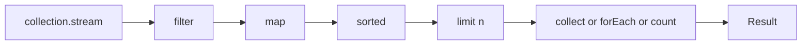


## What you'll learn
- The mapping from common LINQ operators to Java Stream operators.
- How Java streams handle laziness, short-circuiting, and terminal operations.
- The Collectors API (`toList`, `groupingBy`, `joining`) as the equivalent of `ToList`, `GroupBy`, `string.Join`.
- When parallel streams are a win, and when they're a trap.

## Concepts

LINQ and Java streams solve the same problem with the same shape: a pipeline of operations on a sequence, lazily evaluated, terminated by a sink. The vocabulary differs but the mental model transfers directly.

| LINQ            | Stream           | Notes                                            |
|-----------------|------------------|--------------------------------------------------|
| `Where`         | `filter`         | identical semantics                              |
| `Select`        | `map`            |                                                  |
| `SelectMany`    | `flatMap`        |                                                  |
| `OrderBy`       | `sorted(Comparator.comparing(...))` |                              |
| `GroupBy`       | `collect(groupingBy(...))` |                                        |
| `Distinct`      | `distinct`       |                                                  |
| `Take(n)`       | `limit(n)`       |                                                  |
| `Skip(n)`       | `skip(n)`        |                                                  |
| `Any(p)`        | `anyMatch(p)`    |                                                  |
| `All(p)`        | `allMatch(p)`    |                                                  |
| `Count()`       | `count()`        | terminal, returns `long`                         |
| `First()`       | `findFirst()`    | returns `Optional`                               |
| `FirstOrDefault()` | `findFirst().orElse(default)` |                                   |
| `Aggregate`     | `reduce`         |                                                  |
| `ToList()`      | `collect(toList())` or `.toList()` (Java 16+)    |             |
| `ToDictionary`  | `collect(toMap(keyFn, valueFn))` |                                |
| `Sum`/`Max`/`Min` | `mapToInt(...).sum()` etc.    | primitive stream avoids boxing      |

Streams are **lazy**: intermediate operations (`filter`, `map`, `sorted`) record what to do; nothing runs until a **terminal** operation (`collect`, `count`, `forEach`, `findFirst`) is called. This is identical to LINQ to Objects. Short-circuiting operators (`findFirst`, `anyMatch`, `limit`) stop early.

**Sources.** Get a stream from a collection with `collection.stream()`. From an array with `Arrays.stream(arr)`. From scratch with `Stream.of(...)`, `Stream.iterate(...)`, `Stream.generate(...)`. There is no `Enumerable.Range`; use `IntStream.range(lo, hi)` or `IntStream.rangeClosed(lo, hi)`.

**Primitive streams** (`IntStream`, `LongStream`, `DoubleStream`) exist to avoid boxing. `list.stream().mapToInt(Order::quantity).sum()` is faster and more readable than `.map(o -> o.quantity()).reduce(0, Integer::sum)`. Always reach for the primitive variant when summing or averaging.

**The Collectors API** is where streams diverge most from LINQ. Where `ToList()` is a single method, Java's `Collectors` is a static factory with dozens of named reducers: `toList()`, `toUnmodifiableList()`, `toSet()`, `toMap(...)`, `groupingBy(...)`, `partitioningBy(...)`, `joining(", ")`, `summingInt(...)`, `averagingDouble(...)`, `counting()`. They compose:

```java
Map<Status, Long> countsByStatus = orders.stream()
    .collect(groupingBy(Order::status, counting()));
```

The downstream collector (`counting()`) replaces the default `toList()` that `groupingBy` uses, so each group becomes a count instead of a list. This is more powerful than C#'s `GroupBy(...).ToDictionary(...)` chain, but takes practice to read.

**Streams are not collections.** You consume a stream exactly once. Calling a second terminal on the same stream throws `IllegalStateException`. If you need to reuse, materialize to a list first.

**Streams are lazy but eager about effects.** Avoid side effects in `map` or `filter`. If you need to perform an action per element, use `forEach` as the terminal. Mutating an external collection inside `map` is technically possible but breaks parallelization and confuses readers.

**Parallel streams** are not a free win. `.parallelStream()` (or `.stream().parallel()`) farms work to the common ForkJoinPool. Parallel can pay off for CPU-heavy element work on large, ordered-insensitive collections - but the framing tax is real, and most pipelines on small-to-medium data are slower in parallel. Profile first.

## Walkthrough

A C# LINQ pipeline:

```csharp
var topCustomers = orders
    .Where(o => o.Status == "paid")
    .GroupBy(o => o.CustomerId)
    .Select(g => new { CustomerId = g.Key, Total = g.Sum(o => o.Amount) })
    .OrderByDescending(x => x.Total)
    .Take(5)
    .ToList();
```

Translated to Java streams:

```java
record CustomerTotal(long customerId, BigDecimal total) {}

List<CustomerTotal> topCustomers = orders.stream()
    .filter(o -> o.status().equals("paid"))
    .collect(groupingBy(
        Order::customerId,
        reducing(BigDecimal.ZERO, Order::amount, BigDecimal::add)))
    .entrySet().stream()
    .map(e -> new CustomerTotal(e.getKey(), e.getValue()))
    .sorted(Comparator.comparing(CustomerTotal::total).reversed())
    .limit(5)
    .toList();
```

The interesting bits:
- `groupingBy` with a downstream `reducing` does the equivalent of `Sum`-per-group.
- The intermediate `Map<Long, BigDecimal>` becomes its own stream via `.entrySet().stream()`. Streams don't pivot for you.
- `Comparator.comparing(...).reversed()` is the idiomatic descending sort.
- `.toList()` (Java 16+) is the short form of `.collect(Collectors.toList())` and returns an *unmodifiable* list.

A primitive-stream sum:

```java
int totalItems = orders.stream()
    .mapToInt(Order::quantity)
    .sum();
```

Faster than `.map(...).reduce(0, Integer::sum)` because there's no boxing per element.

## How it fits together



Intermediate ops are lazy; the terminal op pulls values through and produces the result.

## Common pitfalls

| Pitfall | Why it happens | Fix |
|---|---|---|
| `stream.forEach(list::add)` for collection | Mutating shared state from a stream pipeline. | Use `collect(toList())` instead. |
| Reusing a consumed stream | Throws `IllegalStateException`. | Materialize to a list, then re-stream. |
| Boxing in summations | `.reduce(0, Integer::sum)` boxes per element. | Use `mapToInt(...).sum()`. |
| Parallel stream on small data | ForkJoinPool overhead dominates. | Profile; default to sequential. |
| `groupingBy` without a downstream collector | Always produces `Map<K, List<V>>`, even when you wanted a count. | Use `groupingBy(key, counting())` etc. |

## Exercises

1. Translate `customers.GroupBy(c => c.Region).Select(g => new { g.Key, Count = g.Count() }).ToList()` from LINQ to a Java stream and explain each operator's purpose.
2. Compute the average order amount per customer using `groupingBy` and `averagingDouble`. Handle the case where the amount is `BigDecimal`.
3. Benchmark a `parallelStream` against a sequential `stream` for the same pipeline over a list of 10,000 elements doing trivial work (`.map(i -> i + 1)`). Account for the result.

## Recap & next

- LINQ → Streams is mostly mechanical: `Where`→`filter`, `Select`→`map`, `ToList`→`toList()` or `collect(toList())`.
- Streams are lazy intermediate ops + one eager terminal op; you can't reuse a consumed stream.
- The Collectors API is the engine room: `groupingBy`, `partitioningBy`, `joining`, downstream collectors.
- Primitive streams (`IntStream`, `LongStream`) avoid boxing; use them for sums and averages.
- Parallel streams are a tool, not a default. Profile before reaching for them.

Next, **Optional vs. nullable reference types** - when `Optional` earns its keep, and when it's the wrong abstraction.

