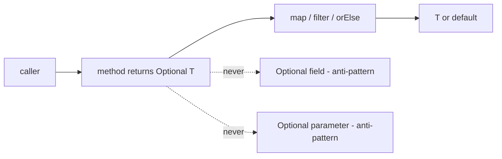


## What you'll learn
- Where `Optional<T>` belongs (return types) and where it doesn't (fields, parameters).
- How Java's nullability story compares to C#'s nullable reference types (NRT).
- The role of `JSpecify` and `@Nullable`/`@NonNull` annotations.
- Anti-patterns: `Optional` fields, `optional.get()`, `Optional<Boolean>`.

## Concepts

C# 8+ added **nullable reference types** (NRT): a compiler analysis that treats `string` as non-null and `string?` as nullable, with flow-sensitive analysis warning when you dereference a possibly-null value. It's a static check; nothing changes at runtime.

Java has no NRT and no plans to add one. Every reference type is implicitly nullable. Java's answer to "is this value possibly absent?" is `Optional<T>` - a wrapper type introduced in Java 8.

The two approaches are **not equivalent**, and pretending otherwise is the root of `Optional` misuse.

### What Optional is for

`Optional<T>` belongs on **return types of methods that may have no answer**. Examples:

- `Optional<User> findByEmail(String email)` - a lookup that may not match.
- `Optional<String> firstWord(String text)` - a parse that may fail.
- `stream.findFirst()` - returns `Optional<T>` because the stream may be empty.

The contract is: "I called this method, the answer may or may not exist, and the type tells me so before I dereference it." This catches the same bug NRT catches in C# (forgetting to handle the absent case), but at runtime via API contracts rather than at compile time via flow analysis.

### What Optional is not for

**Fields.** `private Optional<String> nickname;` is an anti-pattern. Reasons:
- An `Optional` field is itself a reference; you've added a layer that can be null. Now you can have `null` Optionals, which negates the point.
- Allocations per instance. A typical entity with three nullable fields allocates four extra objects.
- Serialization is awkward. JPA, Jackson with default config, and most ORMs were not designed for `Optional` fields. Spring Boot has gotten better at this, but the friction is real.

Use a nullable field (`private String nickname`) and document it. Or use [JSpecify](https://jspecify.dev/) / `@Nullable` annotations for tool-assisted checking.

**Parameters.** `void greet(Optional<String> name)` forces the caller to wrap. It's worse than overloading or providing a default:

```java
// Don't:
public void greet(Optional<String> name) { ... }

// Do:
public void greet(String name) { ... }     // accept null and document, or
public void greet() { ... }                // overload for the no-arg case
```

**Collections.** `Optional<List<X>>` rarely earns its keep - return an empty list instead. The empty list is the no-result signal; wrapping it adds a level of unwrapping at every call site.

**`Optional<Boolean>` and `Optional<Integer>`** are usually wrong. For nullable booleans, use a tri-state enum; for nullable ints, use `OptionalInt` or `Integer`.

### Working with Optional

```java
Optional<User> maybe = repo.findByEmail(email);

// Bad: defeats the type.
if (maybe.isPresent()) {
    User u = maybe.get();
    use(u);
}

// Good: chained transformations.
maybe.map(User::name)
     .filter(n -> !n.isBlank())
     .ifPresent(System.out::println);

// Provide a default.
String name = maybe.map(User::name).orElse("anonymous");

// Throw a typed exception.
User u = maybe.orElseThrow(() -> new NotFoundException(email));
```

`Optional.get()` without a prior `isPresent` check is the `null` of `Optional`. Treat it as suspicious - `orElseThrow` or `orElse` is almost always the right pattern.

### Tool-assisted nullness

The Java community has converged on annotation-based nullness checking. Three options:

1. **JSpecify** - the modern, vendor-neutral standard. Annotations `@Nullable` and `@NonNull`. Tools like Error Prone and IntelliJ understand them. Spring Boot 6+ is adding JSpecify support.
2. **JetBrains annotations** (`org.jetbrains.annotations.@Nullable`) - battle-tested, IntelliJ-native.
3. **Spring's `@Nullable` / `@NonNullApi`** - Spring's framework-level convention.

Pick one and apply at module entry/exit. JSpecify is the future-proof choice.

## Walkthrough

A repository pattern returning `Optional`:

```java
public interface UserRepository {
    Optional<User> findByEmail(String email);
}

@RestController
class UserController {
    private final UserRepository users;
    UserController(UserRepository users) { this.users = users; }

    @GetMapping("/users/{email}")
    public UserDto getUser(@PathVariable String email) {
        return users.findByEmail(email)
            .map(UserDto::from)
            .orElseThrow(() -> new ResponseStatusException(HttpStatus.NOT_FOUND));
    }
}
```

The Optional return type means the controller is forced to handle the not-found case at compile time. Without it, the same call would return `User` (or null), and the controller might silently NPE downstream.

A pattern to avoid:

```java
// Anti-pattern: Optional field.
public class Profile {
    private Optional<String> nickname = Optional.empty();
    // ...
}

// Better:
public class Profile {
    private String nickname;  // null = no nickname
    // Document the null contract in the class, or annotate with @Nullable.
}
```

A pattern to embrace - chained transformations:

```java
String displayName = userRepo.findByEmail(email)
    .map(User::profile)
    .map(Profile::nickname)
    .filter(n -> n != null && !n.isBlank())
    .orElse("anonymous");
```

This is the equivalent of a C# null-conditional chain (`user?.Profile?.Nickname ?? "anonymous"`), but with explicit `map`/`filter`/`orElse`. It's more verbose; it's also more flexible (each step can do real work, not just navigate).

## How it fits together



## Common pitfalls

| Pitfall | Why it happens | Fix |
|---|---|---|
| `Optional<X> field` | Treating Optional like a nullable type. | Use plain field; document with `@Nullable`. |
| `optional.get()` everywhere | Defeats the type. | Use `orElse`, `orElseThrow`, `ifPresent`. |
| `if (opt.isPresent()) opt.get()` | Lossy version of `ifPresent`. | `opt.ifPresent(x -> ...)`. |
| `Optional<List<X>>` | Empty list is the no-result signal. | Return empty list. |
| Null Optional reference | `someOptional == null` is possible. | Never return `null` Optional; return `Optional.empty()`. |

## Exercises

1. Refactor a repository method that returns `null` for missing entities to return `Optional`. Update one caller to use `orElseThrow`.
2. Take a class with three nullable fields modelled as `Optional<X>` and rewrite them as plain fields with `@Nullable` annotations. Compare the call-site code.
3. Compose a chain of `findByEmail`-style calls (user → profile → nickname) and produce a `String` with a fallback. Write it both with `Optional.map` chains and with a single combined method.

## Recap & next

- `Optional<T>` belongs on return types when absence is meaningful.
- `Optional` fields, parameters, and `Optional<Collection>` are anti-patterns.
- Compose `Optional` with `map`/`filter`/`orElse`/`orElseThrow`; avoid `get()`.
- Java has no compile-time nullness analysis; use JSpecify or IntelliJ annotations for tool-assisted checks.
- The closest thing to C#'s `?.` chain is a `map`/`filter` pipeline on an `Optional`.

Next, **`equals`, `hashCode`, and `Comparable`** - the contracts every Java collection assumes, and the bugs that hide in them.

