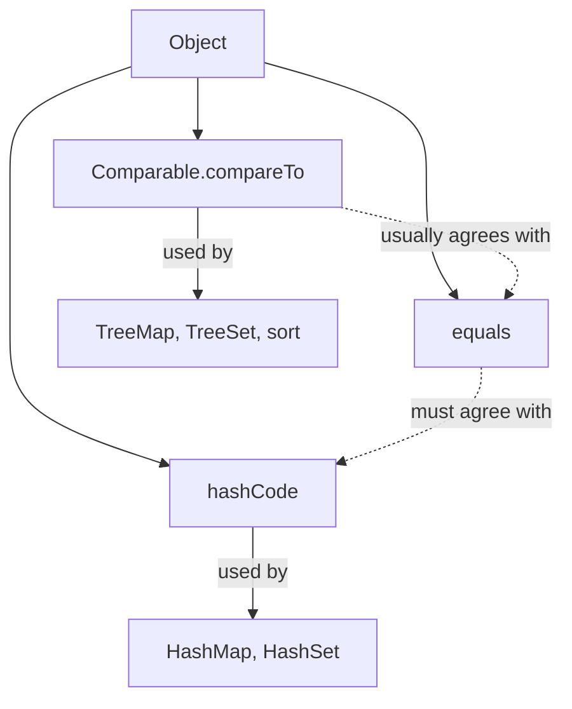


## What you'll learn
- The `equals`/`hashCode` contract and why violating it silently corrupts collections.
- When records save you and when they don't.
- `Comparable<T>` (natural ordering) vs. `Comparator<T>` (external ordering).
- How to write a defensible `equals` for a non-record class.

## Concepts

C# has `Equals`, `GetHashCode`, and `IComparable<T>` - same names, same shape. The bug surface in Java looks almost identical, with two differences worth knowing:

1. The contract is **enforced by the standard library**, not by some "you should" convention. Every `HashMap`, `HashSet`, and `Hashtable` assumes the contract holds. Violations cause silent corruption: an entry you added becomes unfindable; two equal keys count as two slots.
2. Records make this almost-free; classes don't. Mixing them is fine, but you must know which you're working with.

### The contract

For `equals`:
- **Reflexive**: `x.equals(x)` is `true`.
- **Symmetric**: `x.equals(y)` iff `y.equals(x)`.
- **Transitive**: if `x.equals(y)` and `y.equals(z)`, then `x.equals(z)`.
- **Consistent**: repeated calls without modification return the same result.
- **Null-safe**: `x.equals(null)` is `false`, never NPE.

For `hashCode`:
- If `x.equals(y)`, then `x.hashCode() == y.hashCode()`. (The reverse need not hold.)
- The same object returns the same hash code as long as the fields used in `equals` don't change.

The "equal implies same hash" rule is the one that bites. If you override `equals` to compare by a field, you *must* also override `hashCode` to include that field - otherwise the hash codes diverge and `HashMap`/`HashSet` route equal objects to different buckets.

### Records solve this

For a `record`, the canonical `equals` and `hashCode` are generated from the components automatically. No bugs unless you do something exotic (like overriding them and getting it wrong).

```java
public record OrderId(String namespace, long sequence) {}

var a = new OrderId("payments", 42);
var b = new OrderId("payments", 42);
a.equals(b);      // true - generated equals compares components
a.hashCode() == b.hashCode();   // true - generated hashCode hashes components
```

If you only need `id` to determine equality (not `namespace`), don't override - make `id` the only component, and put namespace elsewhere. Trying to override `equals` on a record to compare only a subset of components is a code smell.

### Classes still need it manually

For a non-record class, you typically generate via IntelliJ's "Generate equals/hashCode" or write it explicitly:

```java
public class Order {
    private final long id;
    private final String status;

    public Order(long id, String status) {
        this.id = id;
        this.status = status;
    }

    @Override
    public boolean equals(Object o) {
        if (this == o) return true;
        if (!(o instanceof Order other)) return false;   // pattern var (Java 16+)
        return id == other.id && Objects.equals(status, other.status);
    }

    @Override
    public int hashCode() {
        return Objects.hash(id, status);                 // utility method
    }
}
```

The pattern variable in `instanceof Order other` is Java 16's [pattern matching for instanceof](https://openjdk.org/jeps/394), which removes the redundant cast.

### Comparable vs. Comparator

`Comparable<T>` defines the **natural ordering** of a class. Implement it once; `Collections.sort(list)` and `TreeMap` use it by default.

```java
public record OrderId(String namespace, long sequence) implements Comparable<OrderId> {
    @Override
    public int compareTo(OrderId other) {
        int byNs = namespace.compareTo(other.namespace);
        return byNs != 0 ? byNs : Long.compare(sequence, other.sequence);
    }
}
```

`Comparator<T>` is an external ordering - pass to `sort` or `TreeMap` to override the natural one (or supply one when there isn't a natural ordering). Build with `Comparator.comparing(...)`:

```java
List<Order> byStatusThenId = orders.stream()
    .sorted(Comparator.comparing(Order::status)
                      .thenComparing(Order::id))
    .toList();
```

The `Comparator.comparing(...).thenComparing(...).reversed()` builder chain is the modern Java equivalent of LINQ's `OrderBy(...).ThenBy(...).Reverse()`.

The classic interview gotcha: `compareTo` must be **consistent with equals**. If `a.compareTo(b) == 0` but `!a.equals(b)`, then `TreeMap` and `TreeSet` (which use the comparator, not equals) will treat them as the same key - but a `HashMap` won't. Mixing the two leads to data appearing in one collection but not the other.

## Walkthrough

A bug that hides in plain sight:

```java
public class Person {
    String name;
    int age;
    Person(String n, int a) { name = n; age = a; }

    @Override
    public boolean equals(Object o) {
        if (!(o instanceof Person p)) return false;
        return name.equals(p.name);          // equals by name only
    }
    // Forgot hashCode!
}

var set = new HashSet<Person>();
set.add(new Person("alice", 30));
set.contains(new Person("alice", 99));   // false - different bucket!
```

The two `Person("alice", ...)` instances are `equals`, but they have different hash codes (the default identity hash). `HashSet` looks up by hash first; the second `Person` lands in a different bucket and never collides with the first.

Fix:

```java
@Override
public int hashCode() {
    return Objects.hash(name);
}
```

Now `contains` works. The general rule: any field in `equals` must appear in `hashCode`.

A `Comparator` build chain:

```java
import static java.util.Comparator.comparing;

List<Employee> roster = employees.stream()
    .sorted(comparing(Employee::department)
                .thenComparing(Employee::lastName)
                .thenComparing(Employee::firstName))
    .toList();
```

Compose by chaining `thenComparing`. Reverse one segment by appending `.reversed()` - but be careful: `comparing(x).reversed()` reverses the whole chain so far, not just the last step. Use parentheses or build the segment first if you only want one descending key.

## How it fits together



## Common pitfalls

| Pitfall | Why it happens | Fix |
|---|---|---|
| Override `equals` but not `hashCode` | Easy to forget; compiler doesn't enforce. | Always override both together; IntelliJ has a single command. |
| Use `==` to compare Strings or wrapped types | Reference vs. value comparison. | Use `.equals()` or `Objects.equals(a, b)` for null-safe compare. |
| Mutable field in `equals`/`hashCode` | Hash changes mid-lifetime; collections corrupt. | Use immutable fields for equality. |
| `compareTo` inconsistent with `equals` | TreeMap and HashMap disagree. | Make the natural ordering match equals, or document the deliberate divergence. |
| Custom class as `HashMap` key without override | Identity equality keeps two "equal" objects distinct. | Override both, or use a record. |

## Exercises

1. Write a `Person` class with three fields, override `equals` and `hashCode` correctly, and add it to a `HashSet`. Confirm the set's contains/remove semantics work.
2. Mutate a `Person`'s name field after adding it to a `HashSet`. Try `contains` - observe the failure. Explain in two sentences.
3. Sort a list of `Employee` records by department ascending, salary descending. Use `Comparator.comparing` and `.reversed` correctly.

## Recap & next

- `equals` and `hashCode` come as a pair - override both or neither.
- Records give you both for free; classes need explicit overrides.
- `Comparable<T>` provides natural ordering; `Comparator<T>` provides external ordering.
- The `Comparator.comparing(...).thenComparing(...)` builder is the modern multi-key sort.
- Inconsistencies between `equals` and `compareTo` cause TreeMap vs. HashMap divergence.

Next, **Annotations vs. attributes** - Java's metadata model, and what makes annotation processors so different from C# attributes.

