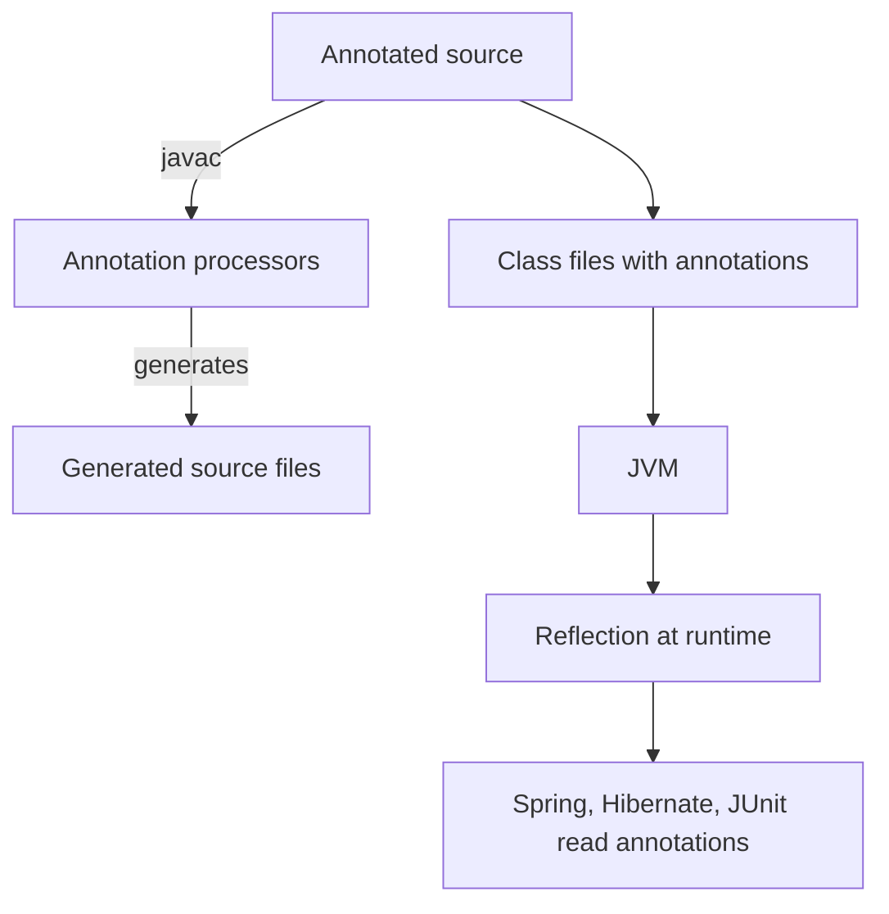


## What you'll learn
- How Java annotations compare to C# attributes - syntax, semantics, runtime model.
- Retention policies and what they mean for tooling.
- Annotation processors as a compile-time code-generation mechanism (Lombok, MapStruct).
- A reference of the Spring annotations you'll see daily.

## Concepts

C# attributes (`[Authorize]`, `[HttpGet]`, `[Required]`) and Java annotations (`@Authorize`, `@GetMapping`, `@NotNull`) serve the same purpose: attach metadata to declarations that the runtime, tools, or libraries can read. The differences are mostly mechanical.

**Syntax.**

- C#: `[Authorize(Roles = "admin")]` - square brackets.
- Java: `@Authorize(roles = "admin")` - `@` prefix.

Multi-attribute declarations stack:

```csharp
[ApiController]
[Route("api/orders")]
public class OrdersController { ... }
```

```java
@RestController
@RequestMapping("/api/orders")
public class OrdersController { ... }
```

**Element types.** Both languages allow annotations on classes, methods, fields, parameters, and local variables. Java additionally has type-use annotations (`List<@Nullable String>`) since Java 8, which C# doesn't have as a first-class concept.

**Retention policies** are the meaningful difference. Java annotations declare how long they live:

- `@Retention(SOURCE)` - visible to the compiler and source-processing tools, then dropped. Example: `@Override` (a sanity check) - the JVM never sees it.
- `@Retention(CLASS)` - in the `.class` file but not loaded into runtime metadata. Used by bytecode tools.
- `@Retention(RUNTIME)` - available via reflection at runtime. The default for almost everything you write.

C# attributes are always available at runtime via reflection; there is no "source-only" attribute. The retention concept is alien to .NET.

**Annotation processors** are the other big divergence. Java compilers run a configurable set of processors that can see annotated declarations during compilation and generate additional source files. This is how:

- **Lombok** (`@Data`, `@Getter`, `@Builder`) generates boilerplate at compile time without runtime cost.
- **MapStruct** generates DTO-mapping code from interface declarations.
- **Immutables**, **AutoValue**, **Dagger**, and **Hibernate ORM**'s static metamodel all use annotation processors.

C# achieves the same via source generators (introduced in C# 9). The mechanism is similar: read annotated declarations, emit additional sources. The Java version is older and more entrenched.

**Meta-annotations** are annotations on annotations:

```java
@Target(ElementType.METHOD)
@Retention(RetentionPolicy.RUNTIME)
public @interface Auditable {
    String operation() default "";
}
```

`@Target` restricts where `@Auditable` can appear. `@Retention` says "keep at runtime." This is how every Spring stereotype (`@Service`, `@Repository`, `@Controller`) is defined - each is a meta-annotation on `@Component`.

## Walkthrough

A daily-Spring annotation reference card:

```java
// Stereotype components
@Component                 // generic bean
@Service                   // semantic alias: business service
@Repository                // semantic alias: persistence + exception translation
@Controller                // server-rendered HTML
@RestController            // = @Controller + @ResponseBody

// REST routing
@RequestMapping("/api")    // class-level prefix
@GetMapping("/orders")
@PostMapping("/orders")
@PutMapping("/orders/{id}")
@DeleteMapping("/orders/{id}")
@PathVariable long id
@RequestParam String filter
@RequestBody Order body

// Dependency injection
@Autowired                 // optional on a single-constructor class
@Qualifier("primaryDataSource")
@Primary                   // pick this @Bean if multiple match
@Value("${app.timeout}")   // inject from configuration

// Configuration
@Configuration             // class containing @Bean methods
@Bean                      // factory method for a bean
@ConfigurationProperties("app")
@EnableScheduling
@EnableAsync

// Validation
@Valid                     // cascade validation
@NotNull, @NotBlank, @Size, @Email   // Jakarta Bean Validation
@Pattern(regexp = "...")

// Security (Spring Security)
@PreAuthorize("hasRole('ADMIN')")
@PostAuthorize("returnObject.ownerId == authentication.name")

// Transactions
@Transactional             // run within a DB transaction
@Transactional(readOnly = true)

// Testing
@SpringBootTest
@WebMvcTest(OrderController.class)
@DataJpaTest
@MockBean OrderRepository repo
```

You'll see most of these daily. The mapping to .NET:

| Java                                        | .NET                                        |
|---------------------------------------------|---------------------------------------------|
| `@RestController`                           | `[ApiController]` + automatic JSON          |
| `@GetMapping("/x")`                         | `[HttpGet("x")]`                            |
| `@PathVariable`                             | `[FromRoute]` (with route param)            |
| `@RequestParam`                             | `[FromQuery]`                               |
| `@RequestBody`                              | `[FromBody]`                                |
| `@Service`, `@Repository`, `@Component`     | DI registration in `Program.cs`             |
| `@PreAuthorize`                             | `[Authorize(Policy = "...")]`               |
| `@Transactional`                            | `IDbContextTransaction` / ambient via TransactionScope |
| `@Valid` + Jakarta annotations              | `[Required]` + model state validation       |

**A custom annotation** (compile + reflect at runtime):

```java
import java.lang.annotation.*;

@Target(ElementType.METHOD)
@Retention(RetentionPolicy.RUNTIME)
public @interface Audited {
    String action();
}

class Service {
    @Audited(action = "delete-order")
    public void deleteOrder(long id) { /* ... */ }
}

// At runtime, find annotated methods:
for (var m : Service.class.getDeclaredMethods()) {
    Audited a = m.getAnnotation(Audited.class);
    if (a != null) {
        System.out.println(m.getName() + " is audited as " + a.action());
    }
}
```

This is the mechanism every Spring annotation uses under the hood - reflection over declared annotations at startup, then wiring behaviour accordingly.

## How it fits together



## Common pitfalls

| Pitfall | Why it happens | Fix |
|---|---|---|
| Custom annotation invisible at runtime | Default retention is `CLASS`. | Add `@Retention(RUNTIME)`. |
| Lombok-generated methods not visible to other tools | Some tools run before annotation processors. | Configure `lombok` as an annotation processor in your build; restart IDE if stale. |
| `@Autowired` on multiple constructors | Spring 4.3+ doesn't need it on the only constructor. | Drop the annotation; the single constructor is implicit. |
| Stacking incompatible meta-annotations | Both demand the same `ElementType`. | Read the meta-annotation `@Target` to see legal targets. |
| Mixing javax and jakarta validation annotations | Spring Boot 3 moved to `jakarta.*`. | Update imports across the project consistently. |

## Exercises

1. Define a custom `@Slow` annotation with `RUNTIME` retention. Write a method that scans a class for `@Slow`-annotated methods and prints them.
2. Take a class with manual getters/setters and replace them with Lombok's `@Data`. Confirm equals/hashCode/toString are present via reflection.
3. Map five C# attributes from an ASP.NET Core controller you've written to their Spring annotation equivalents.

## Recap & next

- Java annotations and C# attributes serve the same role; syntax is `@Name(args)` vs. `[Name(args)]`.
- Retention policies (`SOURCE`, `CLASS`, `RUNTIME`) control how long the annotation lives - the C# world has no equivalent.
- Annotation processors generate code at compile time. Lombok, MapStruct, Dagger all use them.
- Spring's daily annotations cluster around stereotypes, MVC routing, DI, validation, security, transactions, and testing.
- Meta-annotations (annotations on annotations) are how Spring builds composed stereotypes.

Next, **Packages, modules, and visibility** - the access-control model and the (mostly optional) Java Platform Module System.

