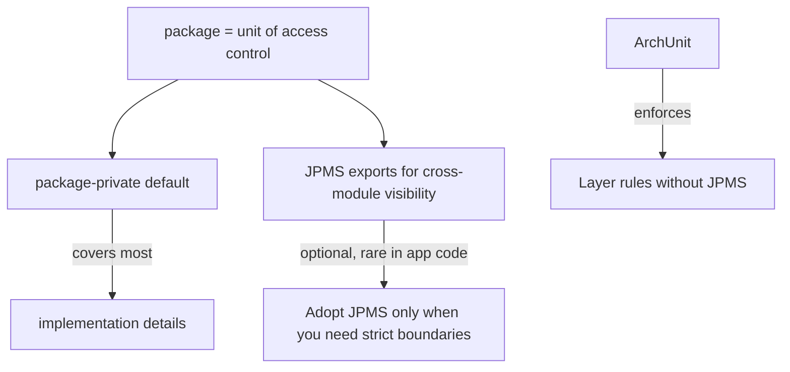


## What you'll learn
- The four Java access modifiers and how they compare to C#'s.
- Why package-private is your everyday access modifier.
- The Java Platform Module System (JPMS) - what it does, when to use it, when to skip it.
- Patterns for code organisation without `internal`/`InternalsVisibleTo`.

## Concepts

Java has four levels of member access:

| Modifier         | Same class | Same package | Subclass anywhere | Anywhere |
|------------------|------------|--------------|--------------------|----------|
| `private`        | ✓          |              |                    |          |
| (default / package-private) | ✓ | ✓        |                    |          |
| `protected`      | ✓          | ✓            | ✓                  |          |
| `public`         | ✓          | ✓            | ✓                  | ✓        |

Compared with C#:

| Java                | C#                                       |
|---------------------|------------------------------------------|
| `private`           | `private`                                |
| (package-private)   | *no exact equivalent*; `internal` is closest but per-assembly |
| `protected`         | `protected internal` (Java's protected = package + subclass) |
| `public`            | `public`                                 |

The asymmetry that surprises .NET developers: **Java's `protected` is broader than C#'s.** It includes the package, not just subclasses. If you want "subclass-only" semantics, there isn't a direct modifier - keep the field `private` and provide a `protected` method, or accept the broader access.

Java's `public` is **assembly-wide visible by default in .NET terms**. There is no JAR-level visibility short of the module system (below). A `public` class in a JAR is on every classpath that includes the JAR.

### Package-private is your everyday tool

Package-private - the absence of a keyword - is the access level you'll reach for constantly. It says "internal to my package, hidden from the rest of the world." Two patterns:

```java
package com.example.orders.api;

// Public: part of the module's external API.
public class OrderController { ... }

// Package-private: implementation detail used by OrderController.
class OrderRequestMapper { ... }
```

```java
package com.example.orders.api;

public class OrderController {
    // Package-private constructor: only this package can build one directly.
    OrderController(OrderRequestMapper mapper) { ... }
}
```

The naming convention is to keep `internal` or `impl` sub-packages where appropriate (e.g. `com.example.orders.internal.MapperImpl`), but the JVM doesn't enforce that - packages are flat from its perspective.

### What about C#'s `InternalsVisibleTo`?

`[InternalsVisibleTo("MyProject.Tests")]` lets test assemblies see `internal` members. Java has no direct equivalent. Three patterns:

1. **Put tests in the same package.** Test files in `src/test/java/com/example/orders/api/` share the package with main files; package-private members are visible. This is the standard approach.
2. **Widen access for tests.** Make the symbol public if it's worth a test. Tests are part of the contract.
3. **JPMS `opens` directive.** If you've adopted modules, you can `opens com.example.orders.internal to com.example.orders.tests;` for reflection.

The first pattern covers 95% of cases. The second is honest - if something needs testing it can be public.

### The Java Platform Module System

JPMS (introduced in Java 9) adds a layer above packages: **modules**. A module is a named, versionable unit declared by a `module-info.java`:

```java
module com.example.orders {
    requires java.sql;
    requires spring.context;

    exports com.example.orders.api;
    // com.example.orders.internal is NOT exported - invisible outside this module.

    opens com.example.orders.api to com.fasterxml.jackson.databind;
}
```

A module:
- **`requires`** other modules to bring them into the module graph.
- **`exports`** packages to make them visible to other modules. Non-exported packages are invisible *even if their classes are public*.
- **`opens`** packages for reflective access (Jackson, Hibernate, Spring), which `exports` alone doesn't grant.

This is the closest Java analogue to .NET assembly boundaries: an exported package is "public API," a non-exported public class is "internal to the module," and `opens` is the granular permission for frameworks.

### When to adopt JPMS

JPMS is mandatory for the JDK itself (every JDK class lives in `java.base`, `java.sql`, etc.). For application code, it's **optional and uncommon**. Spring Boot, Maven, and most enterprise frameworks haven't fully embraced it. Reasons to skip:

- Tooling friction. Reflection-heavy frameworks need `opens` declarations.
- Marginal benefit in monolithic services. The classpath is fine.
- Libraries you depend on may not be modular ("automatic modules" fill the gap but are awkward).

Reasons to adopt:
- Building a JDK-distributed library where bytewise-clean modularity matters.
- Using `jlink` to produce minimal custom runtimes (the modular layout matters).
- Strong API boundaries in a large monorepo.

For a Spring Boot service in 2026, **skip JPMS**. Use packages, package-private, and a clean structure. Revisit if you're shipping a library.

## Walkthrough

A representative package layout:

```
com.example.orders
├── OrdersApplication.java        // @SpringBootApplication, public
├── api/
│   ├── OrderController.java      // public - REST endpoint
│   ├── OrderDto.java             // public - request/response DTO
│   └── OrderMapper.java          // package-private - internal helper
├── domain/
│   ├── Order.java                // public - domain entity
│   └── OrderStatus.java          // public - enum
├── persistence/
│   ├── OrderRepository.java      // public - Spring Data interface
│   └── OrderEntity.java          // package-private - JPA entity, hidden from api
└── internal/
    └── EventPublisher.java       // package-private - implementation
```

Tests mirror the structure:

```
src/test/java/com/example/orders/
├── api/
│   ├── OrderControllerTest.java     // can call package-private OrderMapper
│   └── OrderMapperTest.java
└── persistence/
    └── OrderRepositoryTest.java
```

Both files in `src/main/java/com/example/orders/api/` and `src/test/java/com/example/orders/api/` belong to the same package `com.example.orders.api`. The compiler combines them; package-private symbols are visible across both source trees.

A custom architectural rule like "domain classes must not import from persistence" is enforced by tooling like [ArchUnit](https://www.archunit.org/), not by the access system. ArchUnit lets you assert package dependencies as tests:

```java
@Test
void domainShouldNotDependOnPersistence() {
    classes().that().resideInAPackage("..domain..")
             .should().onlyDependOnClassesThat()
             .resideOutsideOfPackage("..persistence..")
             .check(classes);
}
```

This is the standard answer to "I want layer enforcement without modules."

## How it fits together



## Common pitfalls

| Pitfall | Why it happens | Fix |
|---|---|---|
| Marking everything `public` | Habit from C# `public`/`private` defaults. | Default to package-private; promote only at API boundaries. |
| Expecting `protected` = subclass-only | Java's `protected` includes the package. | Use `private` + `protected` accessor for stricter scoping. |
| Test can't see main class member | Test in a different package than the SUT. | Mirror package structure in `src/test/java`. |
| `opens` missing for Jackson/Hibernate | JPMS app where reflection target wasn't declared open. | Add `opens com.example.x to com.fasterxml.jackson.databind;`. |
| Adopting JPMS before you need it | Premature complexity. | Use packages + ArchUnit until the friction is real. |

## Exercises

1. Take a class with three `public` methods. Decide which are real API and which are implementation; demote the implementation methods to package-private. Add a co-located unit test that still passes.
2. Set up [ArchUnit](https://www.archunit.org/) in your project and write a test that fails if anything in `com.example.orders.api` imports from `com.example.orders.persistence`.
3. Create a tiny multi-module Maven project with two modules. Try to access a `public` class in one from the other *without* a `module-info.java`. Then add `module-info.java` to both with `exports`/`requires` and observe what changes.

## Recap & next

- Java's four access levels: `private`, package-private, `protected` (package + subclass), `public`.
- Package-private is the everyday access modifier; reach for it before `public`.
- Java has no `InternalsVisibleTo`; place tests in the same package or widen access.
- JPMS is mandatory for the JDK, optional for app code. Skip it for Spring Boot services.
- Use ArchUnit to enforce layer dependencies without modules.

Next, **Module 4 starts with the Spring container vs. Microsoft.Extensions.DependencyInjection** - registering, qualifying, and resolving beans.

