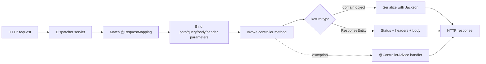


## What you'll learn
- `@RestController` vs. `[ApiController]` - what each implies about JSON, model binding, and status codes.
- Route templates: class-level `@RequestMapping` + method-level shortcuts.
- Binding: `@PathVariable`, `@RequestParam`, `@RequestBody`, `@RequestHeader`.
- `ResponseEntity<T>` vs. `IActionResult` - when to use which.
- Global error handling with `@ControllerAdvice`.

## Concepts

Spring MVC and ASP.NET Core MVC have nearly identical mental models: a dispatcher routes incoming HTTP requests to controller methods, binds parameters from path/query/body/headers, invokes the method, and serializes the return value. The annotations are different; the flow is the same.

### Controller stereotypes

- **`@Controller`** - server-rendered HTML (Thymeleaf / Mustache). Returns view names by default.
- **`@RestController`** - REST APIs. Combines `@Controller` and `@ResponseBody` so every return value is serialized to JSON (or XML) automatically.

For an API, always use `@RestController`. It's the equivalent of `[ApiController]` plus the automatic `Ok(...)` wrapper.

### Routing

Route templates appear in `@RequestMapping` (or the HTTP-method shortcuts: `@GetMapping`, `@PostMapping`, `@PutMapping`, `@PatchMapping`, `@DeleteMapping`).

```java
@RestController
@RequestMapping("/api/orders")
public class OrderController {

    @GetMapping("/{id}")
    public Order getOne(@PathVariable long id) { /* ... */ }

    @GetMapping
    public List<Order> list(@RequestParam(defaultValue = "10") int limit) { /* ... */ }

    @PostMapping
    public ResponseEntity<Order> create(@Valid @RequestBody NewOrder body) {
        Order saved = service.save(body);
        URI location = URI.create("/api/orders/" + saved.id());
        return ResponseEntity.created(location).body(saved);
    }

    @PutMapping("/{id}")
    public Order update(@PathVariable long id, @RequestBody Order body) { /* ... */ }

    @DeleteMapping("/{id}")
    @ResponseStatus(HttpStatus.NO_CONTENT)
    public void delete(@PathVariable long id) { /* ... */ }
}
```

Compared with ASP.NET Core:

| Spring                       | ASP.NET Core                          |
|------------------------------|---------------------------------------|
| `@RestController`            | `[ApiController]`                     |
| `@RequestMapping("/api/orders")` (class) | `[Route("api/orders")]` (class) |
| `@GetMapping("/{id}")`       | `[HttpGet("{id}")]`                   |
| `@PostMapping`               | `[HttpPost]`                          |
| `@PathVariable long id`      | `long id` (with `[FromRoute]` implicit) |
| `@RequestParam`              | `[FromQuery]`                         |
| `@RequestBody`               | `[FromBody]`                          |
| `@RequestHeader("X-Foo")`    | `[FromHeader(Name = "X-Foo")]`        |
| `ResponseEntity<T>`          | `ActionResult<T>` / `IActionResult`   |
| `@ResponseStatus(NO_CONTENT)`| `[ProducesResponseType(204)]` + return type |

### Path variables vs. request params

`@PathVariable long id` binds a segment from the route pattern (`/api/orders/{id}`). `@RequestParam` binds from the query string (`?limit=10`). Both convert types automatically - if the path or query parameter can't be parsed as the target type, Spring returns 400 Bad Request before the method runs.

`@RequestParam` defaults to required. To make it optional, supply a default:

```java
@GetMapping
public List<Order> list(
    @RequestParam(defaultValue = "10") int limit,
    @RequestParam(required = false) String status
) { /* ... */ }
```

### Request body binding

`@RequestBody` triggers JSON deserialization via Jackson (configured automatically by `spring-boot-starter-web`). Records work natively in Spring Boot 3:

```java
public record NewOrder(@NotBlank String sku, @Positive int quantity) {}

@PostMapping
public Order create(@Valid @RequestBody NewOrder body) { /* ... */ }
```

`@Valid` triggers Jakarta Bean Validation against the record's annotations. Failures throw `MethodArgumentNotValidException`, which Spring Boot's default handler turns into a 400 response with validation details.

### `ResponseEntity<T>` vs. `IActionResult`

`ResponseEntity<T>` is the typed response builder. Use it when you need to control the status code, headers, or location:

```java
return ResponseEntity.status(HttpStatus.CREATED)
    .location(URI.create("/api/orders/" + saved.id()))
    .body(saved);
```

For most GET endpoints, return the body directly - Spring wraps it in a 200 response automatically. Reach for `ResponseEntity` when you need 201 Created with a Location header, 202 Accepted with no body, or a conditional response.

`@ResponseStatus(HttpStatus.X)` on the method (or on a thrown exception) sets the status code without `ResponseEntity`. The two approaches mix freely.

### Global error handling

`@ControllerAdvice` is the equivalent of an exception filter / middleware:

```java
@ControllerAdvice
public class GlobalExceptionHandler {

    @ExceptionHandler(OrderNotFoundException.class)
    public ResponseEntity<ProblemDetail> notFound(OrderNotFoundException e) {
        var problem = ProblemDetail.forStatusAndDetail(HttpStatus.NOT_FOUND, e.getMessage());
        return ResponseEntity.status(HttpStatus.NOT_FOUND).body(problem);
    }

    @ExceptionHandler(MethodArgumentNotValidException.class)
    public ResponseEntity<Map<String, String>> validation(MethodArgumentNotValidException e) {
        Map<String, String> errors = new HashMap<>();
        e.getBindingResult().getFieldErrors().forEach(fe ->
            errors.put(fe.getField(), fe.getDefaultMessage()));
        return ResponseEntity.badRequest().body(errors);
    }
}
```

`ProblemDetail` (Spring 6) is the RFC 7807-compliant problem response body. Use it for structured error responses.

## Walkthrough

A complete, runnable controller for an orders API:

```java
package com.example.orders.api;

import jakarta.validation.Valid;
import jakarta.validation.constraints.NotBlank;
import jakarta.validation.constraints.Positive;
import org.springframework.http.HttpStatus;
import org.springframework.http.ProblemDetail;
import org.springframework.http.ResponseEntity;
import org.springframework.web.bind.annotation.*;
import org.springframework.web.servlet.support.ServletUriComponentsBuilder;

import java.net.URI;
import java.util.List;

@RestController
@RequestMapping("/api/orders")
public class OrderController {

    private final OrderService service;

    public OrderController(OrderService service) {
        this.service = service;
    }

    @GetMapping("/{id}")
    public Order get(@PathVariable long id) {
        return service.findById(id)
            .orElseThrow(() -> new OrderNotFoundException(id));
    }

    @GetMapping
    public List<Order> list(@RequestParam(defaultValue = "10") int limit) {
        return service.list(limit);
    }

    @PostMapping
    public ResponseEntity<Order> create(@Valid @RequestBody NewOrder body) {
        Order saved = service.create(body);
        URI location = ServletUriComponentsBuilder.fromCurrentRequest()
            .path("/{id}").buildAndExpand(saved.id()).toUri();
        return ResponseEntity.created(location).body(saved);
    }

    @DeleteMapping("/{id}")
    @ResponseStatus(HttpStatus.NO_CONTENT)
    public void delete(@PathVariable long id) {
        service.delete(id);
    }
}

record NewOrder(@NotBlank String sku, @Positive int quantity) {}
record Order(long id, String sku, int quantity, String status) {}

class OrderNotFoundException extends RuntimeException {
    OrderNotFoundException(long id) { super("order " + id + " not found"); }
}

@ControllerAdvice
class OrderExceptionHandler {
    @ExceptionHandler(OrderNotFoundException.class)
    public ResponseEntity<ProblemDetail> notFound(OrderNotFoundException e) {
        return ResponseEntity.status(HttpStatus.NOT_FOUND)
            .body(ProblemDetail.forStatusAndDetail(HttpStatus.NOT_FOUND, e.getMessage()));
    }
}
```

The interesting bits:
- `ServletUriComponentsBuilder.fromCurrentRequest().path("/{id}").buildAndExpand(id).toUri()` builds the Location header without hard-coding the base path.
- The `OrderNotFoundException` is unchecked (extends `RuntimeException`), so the service method's signature stays clean.
- `ProblemDetail` produces an RFC 7807 JSON body - the modern standard.

## How it fits together



## Common pitfalls

| Pitfall | Why it happens | Fix |
|---|---|---|
| Endpoint returns 200 with empty body for `void` | Default status for void return is 200 OK. | Add `@ResponseStatus(HttpStatus.NO_CONTENT)` for 204. |
| `@RequestParam(required=false)` plus primitive type | Null cannot unbox to primitive. | Use the wrapper (`Integer`) or provide `defaultValue`. |
| `@RequestBody` returns null fields | Jackson can't find a matching constructor. | Use a record, or annotate with `@JsonCreator`. |
| `@Valid` not triggering | Forgot the annotation on the parameter. | Annotate the parameter, not just the type. |
| `@PathVariable` name mismatch | Variable name in template doesn't match parameter. | Either match names or use `@PathVariable("id")` explicit. |

## Exercises

1. Build a `GET /api/orders?status=paid&limit=20` endpoint with optional query parameters. Verify the default values and the 400 response when `limit` is non-numeric.
2. Add a `POST /api/orders` endpoint that accepts a body, validates it with Jakarta annotations, and returns 201 with a Location header.
3. Throw a custom exception from a controller method and write a `@ControllerAdvice` handler that returns a `ProblemDetail` body with a 422 status.

## Recap & next

- Use `@RestController` for JSON APIs; `@Controller` is for server-rendered HTML.
- Class-level `@RequestMapping` sets a prefix; method-level shortcuts (`@GetMapping`, etc.) add the verb.
- Parameter binding: `@PathVariable`, `@RequestParam`, `@RequestBody`, `@RequestHeader`.
- `ResponseEntity<T>` builds custom responses; return the body directly when 200 + JSON is enough.
- `@ControllerAdvice` handles exceptions globally; `ProblemDetail` is the RFC 7807 response shape.

Next, **`application.yml` and profiles vs. `appsettings.json`** - configuring Spring Boot apps for dev, test, and prod.

