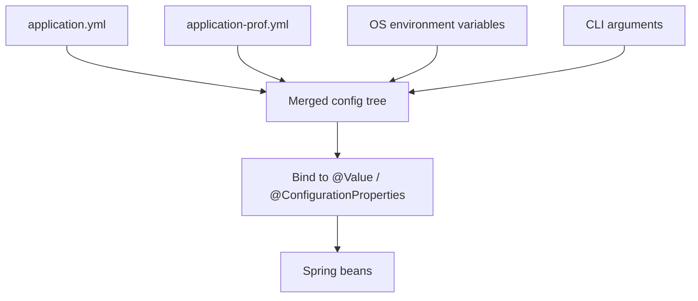


## What you'll learn
- How `application.yml` compares to `appsettings.json` + environment files.
- Spring profiles vs. `ASPNETCORE_ENVIRONMENT`.
- `@Value` vs. `@ConfigurationProperties` - which to reach for.
- The configuration precedence order, and why CLI args override file values.

## Concepts

ASP.NET Core stores configuration in `appsettings.json`, layered with `appsettings.{Environment}.json`, environment variables, command-line arguments, and user secrets. Spring Boot does the same with `application.yml` (or `application.properties`), `application-{profile}.yml`, environment variables, and CLI arguments.

The data model is the same - a hierarchical key/value tree. The mechanics differ slightly.

### File formats

`application.yml` (preferred):

```yaml
server:
  port: 8080
  servlet:
    context-path: /

spring:
  datasource:
    url: jdbc:postgresql://localhost:5432/orders
    username: orders
    password: secret
  jpa:
    hibernate:
      ddl-auto: validate

app:
  payments:
    url: https://api.example.com
    timeout-ms: 5000
  feature:
    beta-checkout: false
```

The equivalent `application.properties`:

```properties
server.port=8080
spring.datasource.url=jdbc:postgresql://localhost:5432/orders
app.payments.url=https://api.example.com
app.feature.beta-checkout=false
```

YAML is hierarchical, easier to read for nested structures, and the format you'll see in 95% of Spring Boot codebases. Properties files are a flat alternative that's still acceptable.

### Profiles

A **profile** is a named configuration slice. Spring loads `application.yml` as the base, then layers any profile-specific files on top:

```
src/main/resources/
├── application.yml              # base - applies always
├── application-dev.yml          # active when 'dev' profile is on
├── application-prod.yml
└── application-test.yml
```

Activate a profile via `SPRING_PROFILES_ACTIVE=dev` (env var) or `--spring.profiles.active=dev` (CLI). Multiple profiles can be active simultaneously and later profiles override earlier ones.

The ASP.NET Core mapping:

| Spring                          | ASP.NET Core                              |
|---------------------------------|-------------------------------------------|
| `application.yml`               | `appsettings.json`                        |
| `application-dev.yml`           | `appsettings.Development.json`            |
| `SPRING_PROFILES_ACTIVE=dev`    | `ASPNETCORE_ENVIRONMENT=Development`      |
| Multiple active profiles        | (no direct equivalent; environment is single-valued) |

Multi-document YAML lets you put per-profile sections in a single file:

```yaml
spring:
  datasource:
    url: jdbc:h2:mem:test
---
spring:
  config:
    activate:
      on-profile: prod
  datasource:
    url: jdbc:postgresql://prod-db:5432/orders
```

The `---` separator splits the file into documents; the `on-profile` selector picks one. Useful for small projects but less readable than separate files for anything substantial.

### Reading configuration

Two main approaches: `@Value` for individual values, `@ConfigurationProperties` for whole sections.

**`@Value`** - one value at a time:

```java
@Service
public class PaymentClient {
    private final String url;
    private final int timeoutMs;

    public PaymentClient(
        @Value("${app.payments.url}") String url,
        @Value("${app.payments.timeout-ms:5000}") int timeoutMs
    ) {
        this.url = url;
        this.timeoutMs = timeoutMs;
    }
}
```

The `:5000` default fires if the property is missing. Without a default, missing properties throw at startup.

`@Value` is comparable to manually pulling values from `IConfiguration`:

```csharp
public PaymentClient(IConfiguration cfg) {
    _url = cfg["App:Payments:Url"];
    _timeoutMs = cfg.GetValue<int>("App:Payments:TimeoutMs", 5000);
}
```

**`@ConfigurationProperties`** - bind a whole section to a type:

```java
@ConfigurationProperties("app.payments")
public record PaymentSettings(String url, int timeoutMs) {
}

// Enable scanning in your @SpringBootApplication or a @Configuration:
@SpringBootApplication
@ConfigurationPropertiesScan
public class OrdersApplication { ... }
```

Then inject `PaymentSettings` anywhere. This is the equivalent of `IOptions<PaymentSettings>` in ASP.NET Core - a typed, structured snapshot of a config section. Records work since Spring Boot 3.

Prefer `@ConfigurationProperties` when you have more than two related values or when you want validation:

```java
@ConfigurationProperties("app.payments")
@Validated
public record PaymentSettings(
    @NotBlank String url,
    @Positive int timeoutMs
) {}
```

Invalid configuration fails fast at startup, not on first use.

### Precedence

When the same key is set in multiple places, the **later** source wins. The order (simplified):

1. `application.yml` (base)
2. `application-{profile}.yml`
3. OS environment variables (`APP_PAYMENTS_URL=...`)
4. Command-line arguments (`--app.payments.url=...`)

That means `--spring.profiles.active=prod` on the command line beats anything in a file. This matches ASP.NET Core's precedence semantics exactly: env vars and CLI args override files.

Environment-variable name mapping follows Spring's relaxed binding: `app.payments.url` reads `APP_PAYMENTS_URL` (uppercase, dots become underscores, dashes-to-underscores). The same key works in either form.

### Externalized secrets

`application.yml` should not contain secrets in production. Three patterns:

- **Environment variables** for cloud deployments (Kubernetes, ECS).
- **[Spring Cloud Config](https://spring.io/projects/spring-cloud-config)** for centralized config.
- **HashiCorp Vault** via Spring Cloud Vault.

The .NET parallel is User Secrets in dev, Key Vault / AWS Secrets Manager in prod. Same problem, similar shape.

## Walkthrough

A typical setup. `application.yml`:

```yaml
server:
  port: 8080

spring:
  datasource:
    url: jdbc:postgresql://localhost:5432/orders
    username: orders
    password: ${DB_PASSWORD:dev-password}

app:
  payments:
    url: https://api.example.com
    timeout-ms: 5000
  feature:
    beta-checkout: false
```

The `${DB_PASSWORD:dev-password}` syntax substitutes the env var with a fallback. In production, set `DB_PASSWORD`; in dev, the fallback applies.

`application-prod.yml` overrides for production:

```yaml
spring:
  datasource:
    url: jdbc:postgresql://prod-db.internal:5432/orders
  jpa:
    hibernate:
      ddl-auto: validate

app:
  payments:
    url: https://api.production.example.com
  feature:
    beta-checkout: true
```

Running:

```bash
# Dev (default profile)
./mvnw spring-boot:run

# Prod
SPRING_PROFILES_ACTIVE=prod DB_PASSWORD=...  java -jar target/orders-service.jar

# Override one value on the command line
java -jar target/orders-service.jar --app.payments.timeout-ms=10000
```

The bean that consumes it:

```java
@ConfigurationProperties("app.payments")
@Validated
public record PaymentSettings(@NotBlank String url, @Positive int timeoutMs) {}

@Service
public class PaymentClient {
    private final PaymentSettings settings;

    public PaymentClient(PaymentSettings settings) {
        this.settings = settings;
    }

    // ...
}
```

## How it fits together



## Common pitfalls

| Pitfall | Why it happens | Fix |
|---|---|---|
| `@Value` injects literal string `${...}` | No `PropertySourcesPlaceholderConfigurer`; rare with Boot. | Use `application.yml`, not raw `PropertySource`. |
| `@ConfigurationProperties` returns nulls | Missing `@ConfigurationPropertiesScan` or `@EnableConfigurationProperties`. | Add one of them. |
| Profile-specific file ignored | Wrong filename or profile not activated. | Name `application-<profile>.yml` exactly; pass `--spring.profiles.active=<profile>`. |
| YAML indentation breaks | Tabs instead of spaces. | YAML demands spaces. |
| Env var override fails | Variable name not relaxed-binding-compatible. | `app.payments.url` → `APP_PAYMENTS_URL`. |

## Exercises

1. Add an `app.feature.beta-checkout` boolean to `application.yml`. Bind it via `@ConfigurationProperties`. Override on the command line with `--app.feature.beta-checkout=true`.
2. Create `application-dev.yml` that points `spring.datasource.url` to an H2 in-memory DB. Run with `SPRING_PROFILES_ACTIVE=dev` and confirm the H2 console works.
3. Add `@Validated` to a `@ConfigurationProperties` record with `@NotBlank` and `@Positive`. Break the values and confirm startup fails with a clear message.

## Recap & next

- `application.yml` + `application-{profile}.yml` mirrors `appsettings.json` + `appsettings.{env}.json`.
- Profiles are Spring's environment switch; activate via `SPRING_PROFILES_ACTIVE`.
- `@Value("${key}")` for individual values; `@ConfigurationProperties` for typed sections.
- Precedence: CLI > env > profile file > base file.
- Use `@Validated` on `@ConfigurationProperties` to fail fast on bad config.

Next, **Bean lifecycles and scopes** - singleton vs. prototype, `@PostConstruct`/`@PreDestroy`, and the cross-scope injection gotcha.

