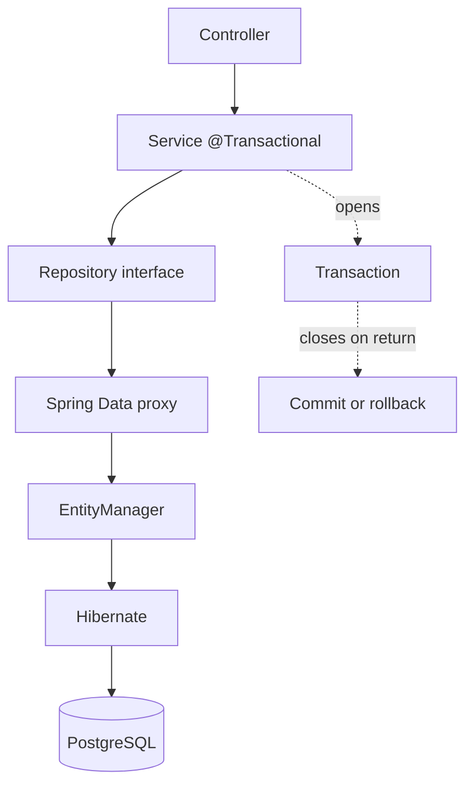


## What you'll learn
- The JPA / Hibernate / Spring Data JPA stack and how it maps to EF Core.
- Defining entities with annotations.
- Spring Data JPA repositories - derived queries, `@Query`, paging.
- The lazy-loading trap (`LazyInitializationException`) and how to avoid it.
- `@Transactional` semantics: where the transaction boundary is.

## Concepts

Spring Data JPA sits on top of two lower layers: **JPA** (Jakarta Persistence API) is the specification; **Hibernate** is the dominant implementation. Spring Data JPA adds repository abstractions on top.

For EF Core developers, the mapping is mostly intuitive:

| EF Core                          | Spring Data JPA                       |
|----------------------------------|---------------------------------------|
| `DbContext`                      | `EntityManager`                       |
| `[Table]`, `[Column]`            | `@Entity`, `@Table`, `@Column`        |
| `DbSet<T>`                       | `JpaRepository<T, ID>`                |
| `Find(id)`                       | `findById(id)` → `Optional<T>`        |
| LINQ queries                     | Derived methods, `@Query` (JPQL/native) |
| Migrations                       | Flyway / Liquibase (not built in)     |
| Lazy loading                     | Lazy loading (more aggressive)        |
| `SaveChanges()`                  | Implicit at transaction commit        |
| Identity insert                  | `@GeneratedValue(strategy = IDENTITY)` |

The big mental shift: **Spring Data JPA repositories are interfaces**, not classes. You declare an interface and Spring generates the implementation at runtime.

### Defining entities

```java
import jakarta.persistence.*;
import java.time.Instant;

@Entity
@Table(name = "orders")
public class Order {
    @Id
    @GeneratedValue(strategy = GenerationType.IDENTITY)
    private Long id;

    @Column(nullable = false)
    private String sku;

    @Column(nullable = false)
    private int quantity;

    @Enumerated(EnumType.STRING)
    @Column(nullable = false)
    private OrderStatus status;

    @Column(name = "created_at", nullable = false, updatable = false)
    private Instant createdAt = Instant.now();

    // JPA requires a no-arg constructor.
    protected Order() {}

    public Order(String sku, int quantity) {
        this.sku = sku;
        this.quantity = quantity;
        this.status = OrderStatus.PENDING;
    }

    // Getters; setters where mutability is needed.
    public Long getId() { return id; }
    public String getSku() { return sku; }
    public int getQuantity() { return quantity; }
    public OrderStatus getStatus() { return status; }
    public void setStatus(OrderStatus status) { this.status = status; }
    public Instant getCreatedAt() { return createdAt; }
}

public enum OrderStatus { PENDING, PAID, CANCELLED }
```

JPA entities **cannot be records**. Records are final and immutable; JPA needs a no-arg constructor and mutable state for dirty checking. Use classes for entities; use records for DTOs that ferry data between layers.

### Repositories

A repository is an interface:

```java
public interface OrderRepository extends JpaRepository<Order, Long> {

    // Derived query: parsed from the method name.
    List<Order> findByStatus(OrderStatus status);

    // Multiple conditions, sort.
    List<Order> findBySkuAndStatusOrderByCreatedAtDesc(String sku, OrderStatus status);

    // Paging support.
    Page<Order> findByStatus(OrderStatus status, Pageable pageable);

    // Custom JPQL.
    @Query("select o from Order o where o.createdAt < :cutoff and o.status = 'PENDING'")
    List<Order> findStalePending(@Param("cutoff") Instant cutoff);

    // Native SQL when you need it.
    @Query(value = "select * from orders where status = ?1 limit ?2", nativeQuery = true)
    List<Order> findRecentByStatus(String status, int limit);

    // Modifying queries.
    @Modifying
    @Query("update Order o set o.status = 'CANCELLED' where o.id = :id")
    int cancel(@Param("id") long id);
}
```

The derived-query parser supports `findBy`, `countBy`, `existsBy`, `deleteBy` prefixes plus `And`, `Or`, `Between`, `LessThan`, `OrderBy`, `Containing`, etc. The full grammar is in the [Spring Data JPA docs](https://docs.spring.io/spring-data/jpa/reference/jpa/query-methods.html). For complex queries reach for `@Query`; for the trivial 80% use derived methods.

### Transactions

By default, Spring opens a transaction around each repository method. For a service that touches multiple repositories, wrap the whole method:

```java
@Service
public class OrderService {
    private final OrderRepository orders;
    private final InventoryRepository inventory;

    public OrderService(OrderRepository orders, InventoryRepository inventory) {
        this.orders = orders;
        this.inventory = inventory;
    }

    @Transactional
    public Order place(NewOrder req) {
        inventory.reserve(req.sku(), req.quantity());
        Order o = new Order(req.sku(), req.quantity());
        return orders.save(o);
    }

    @Transactional(readOnly = true)
    public List<Order> recentByStatus(OrderStatus s) {
        return orders.findByStatus(s);
    }
}
```

`@Transactional` is comparable to wrapping in an EF Core `DbContextTransaction`. Key differences:

- Rolls back on unchecked exceptions by default. Checked exceptions don't roll back unless you opt in via `@Transactional(rollbackFor = SomeCheckedException.class)`.
- `readOnly = true` is a hint - Hibernate may skip dirty checking, enabling some optimisations.
- Self-invocation doesn't work. Calling `this.transactionalMethod()` from another method in the same class bypasses the proxy that implements the transaction. Call through an injected reference or extract the transactional method to another bean.

### The lazy-loading trap

JPA defaults to **lazy** loading for `@OneToMany` and `@ManyToMany` relationships. When you load an `Order` with `@OneToMany` `lineItems`, the `lineItems` collection is a proxy. Accessing it triggers a query - but only if a session/transaction is open. Outside the transaction, you get:

> `LazyInitializationException: could not initialize proxy - no Session`

This is the most common Spring Data JPA bug. Three fixes:

1. **Fetch eagerly via `@EntityGraph`** or `@Query` with `join fetch`:

   ```java
   @Query("select o from Order o left join fetch o.lineItems where o.id = :id")
   Optional<Order> findByIdWithLineItems(@Param("id") long id);
   ```

2. **Extend the transaction boundary**: mark the controller method `@Transactional` so the session is open during serialization. Considered bad practice (long-running transactions); prefer fetching what you need.

3. **DTO projection**: query straight into a DTO, avoiding the entity collection altogether.

   ```java
   public interface OrderSummary {
       Long getId();
       String getSku();
       int getQuantity();
   }

   List<OrderSummary> findBySkuStartingWith(String prefix);
   ```

The .NET parallel is EF Core's `Include(...)` for eager loading and the (now-deprecated) lazy loading via proxies. EF Core is more lazy-by-default-off; JPA is more lazy-by-default-on. The shift in mindset is real.

### Migrations

JPA itself doesn't do schema migrations. The standard combo is JPA for ORM + [Flyway](https://flywaydb.org/) or [Liquibase](https://www.liquibase.org/) for migrations. Spring Boot auto-configures both: drop SQL files in `src/main/resources/db/migration/` and Flyway runs them at startup. Comparable to EF Core's `Add-Migration`/`Update-Database` workflow but driven from versioned SQL files instead of generated migrations.

## Walkthrough

A repository-backed service:

```java
@Service
public class OrderService {
    private final OrderRepository orders;

    public OrderService(OrderRepository orders) {
        this.orders = orders;
    }

    @Transactional
    public Order create(NewOrder req) {
        Order o = new Order(req.sku(), req.quantity());
        return orders.save(o);
    }

    @Transactional(readOnly = true)
    public Optional<Order> findById(long id) {
        return orders.findById(id);
    }

    @Transactional(readOnly = true)
    public Page<Order> list(OrderStatus status, int page, int size) {
        return orders.findByStatus(status, PageRequest.of(page, size,
            Sort.by("createdAt").descending()));
    }

    @Transactional
    public void cancel(long id) {
        int updated = orders.cancel(id);
        if (updated == 0) throw new OrderNotFoundException(id);
    }
}
```

The interesting bits:
- `save` returns the persisted instance with a generated id.
- `findById` returns `Optional<Order>` - same shape as `FirstOrDefault`.
- Pagination is built-in via `PageRequest` and `Page<T>`. Spring MVC even binds `Pageable` from query params automatically (`?page=0&size=20&sort=createdAt,desc`).
- The custom `cancel` query uses `@Modifying` to tell JPA this isn't a `SELECT`; it returns the affected row count.

## How it fits together



## Common pitfalls

| Pitfall | Why it happens | Fix |
|---|---|---|
| `LazyInitializationException` outside the transaction | Lazy collection accessed after session closed. | Fetch eagerly via `@EntityGraph` / `join fetch`, or project to a DTO. |
| Self-invocation bypasses `@Transactional` | Spring proxies the bean; self-calls skip the proxy. | Call via injected reference; split into two beans. |
| Checked exception doesn't roll back | Default is rollback on unchecked only. | `@Transactional(rollbackFor = MyCheckedException.class)`. |
| Entity has no no-arg constructor | JPA requires one (can be `protected`). | Add `protected NoArg() {}`. |
| Records as entities | Records are final and immutable. | Use classes for entities, records for DTOs. |

## Exercises

1. Create an `Order` entity, an `OrderRepository`, and a derived query `findByStatusOrderByCreatedAtDesc`. Confirm the generated SQL via `spring.jpa.show-sql: true`.
2. Add an `@OneToMany` `lineItems` relation. Reproduce `LazyInitializationException` by reading `lineItems` outside the service. Fix it three ways: `@EntityGraph`, `join fetch`, DTO projection.
3. Set up Flyway with a single migration that creates the orders table. Run the app and confirm Flyway applies it on startup.

## Recap & next

- JPA + Hibernate is the EF Core analogue; Spring Data JPA wraps it with repository interfaces.
- Entities are classes (not records), need a no-arg constructor, and use mutable state.
- Repositories generate implementations from method names; `@Query` covers what derived queries can't.
- `@Transactional` is the transaction boundary; self-invocation skips the proxy.
- Lazy loading bites - fetch what you need with `@EntityGraph`, `join fetch`, or DTO projections.

Next, **Module 5 starts with HTTP clients** - `RestClient`, `WebClient`, and what to use when.

