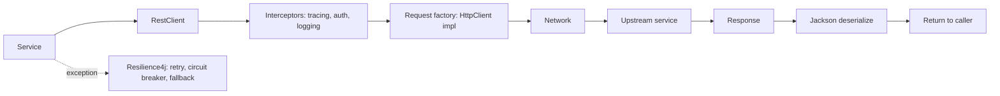


## What you'll learn
- Spring's three HTTP client options: `RestClient`, `WebClient`, `RestTemplate`.
- When to choose blocking (`RestClient`) vs. reactive (`WebClient`).
- Configuring timeouts, retries, and interceptors.
- Comparing with `HttpClient` from .NET, including `IHttpClientFactory` patterns.

## Concepts

For outbound HTTP, Spring offers three client options. Two are current; one is legacy.

| Client                | Style       | Status             |
|-----------------------|-------------|--------------------|
| **`RestClient`** (Spring 6.1+) | Blocking, fluent | Recommended default |
| **`WebClient`** (Spring 5+)    | Reactive (Project Reactor) | Use when you need reactive streams |
| `RestTemplate`        | Blocking, older | Maintenance mode; avoid in new code |

The .NET parallel is `HttpClient` - single API, fluent enough, configured via `IHttpClientFactory` for connection pooling and base addresses. Spring's `RestClient` is the closest analogue.

### `RestClient`

```java
@Configuration
public class HttpConfig {
    @Bean
    public RestClient paymentsClient() {
        return RestClient.builder()
            .baseUrl("https://payments.example.com")
            .defaultHeader("X-Service", "orders")
            .requestFactory(new SimpleClientHttpRequestFactory())
            .build();
    }
}
```

Use it:

```java
@Service
public class PaymentsService {
    private final RestClient client;

    public PaymentsService(RestClient paymentsClient) { this.client = paymentsClient; }

    public PaymentResult charge(ChargeRequest req) {
        return client.post()
            .uri("/charges")
            .contentType(MediaType.APPLICATION_JSON)
            .body(req)
            .retrieve()
            .body(PaymentResult.class);
    }

    public List<Payment> recent(String customerId) {
        return client.get()
            .uri(uriBuilder -> uriBuilder
                .path("/customers/{id}/payments")
                .queryParam("limit", 50)
                .build(customerId))
            .retrieve()
            .body(new ParameterizedTypeReference<List<Payment>>() {});
    }
}
```

The fluent API (`.get() / .post() / .uri() / .retrieve() / .body()`) mirrors `HttpClient`'s `GetFromJsonAsync` / `PostAsJsonAsync` pattern but is more granular. `ParameterizedTypeReference` is the same erasure workaround you saw in Module 2 Chapter 3 - type tokens for generic types.

### `WebClient`

If you want reactive streams (backpressure, non-blocking I/O), use `WebClient`:

```java
@Bean
public WebClient paymentsWebClient(WebClient.Builder builder) {
    return builder.baseUrl("https://payments.example.com").build();
}

public Mono<PaymentResult> charge(ChargeRequest req) {
    return client.post()
        .uri("/charges")
        .bodyValue(req)
        .retrieve()
        .bodyToMono(PaymentResult.class);
}
```

`Mono<T>` is "zero or one future value"; `Flux<T>` is "zero or more streamed values." If you're not already on the reactive stack (Spring WebFlux), prefer `RestClient` - mixing reactive and blocking is more friction than it's worth for a typical Spring MVC app.

### Error handling

`retrieve()` throws `RestClientResponseException` for 4xx/5xx by default. Customize:

```java
String result = client.get()
    .uri("/data")
    .retrieve()
    .onStatus(HttpStatusCode::is4xxClientError, (req, resp) -> {
        throw new BadRequestException("upstream rejected: " + resp.getStatusText());
    })
    .body(String.class);
```

For finer control, use `.exchange()` which gives you the raw `ClientHttpResponse` - but that's rarely needed.

### Timeouts

Set on the request factory:

```java
@Bean
public RestClient paymentsClient() {
    var factory = new SimpleClientHttpRequestFactory();
    factory.setConnectTimeout(2_000);     // ms
    factory.setReadTimeout(5_000);        // ms

    return RestClient.builder()
        .baseUrl("https://payments.example.com")
        .requestFactory(factory)
        .build();
}
```

For finer control (per-route, total request timeout), swap in Apache HttpClient 5 or Java's built-in `HttpClient` as the underlying transport. Spring delegates to whichever is on the classpath.

### Retries and circuit breakers

Spring's HTTP clients have no retry/circuit-breaker built in. Use [Resilience4j](https://resilience4j.readme.io/), wired via Spring Boot's `resilience4j-spring-boot3` starter:

```java
@Retry(name = "payments")
@CircuitBreaker(name = "payments", fallbackMethod = "chargeFallback")
public PaymentResult charge(ChargeRequest req) {
    return client.post().uri("/charges").body(req).retrieve().body(PaymentResult.class);
}

public PaymentResult chargeFallback(ChargeRequest req, Throwable t) {
    return new PaymentResult("PENDING_RETRY", null);
}
```

Configure in `application.yml`:

```yaml
resilience4j:
  retry:
    instances:
      payments:
        max-attempts: 3
        wait-duration: 200ms
        exponential-backoff-multiplier: 2
  circuitbreaker:
    instances:
      payments:
        failure-rate-threshold: 50
        sliding-window-size: 20
```

The .NET equivalent is [Polly](https://github.com/App-vNext/Polly), with similar shapes (retry, circuit breaker, bulkhead, timeout policies).

### Interceptors and observability

`RestClient` supports request interceptors for cross-cutting concerns (auth, logging, tracing):

```java
RestClient.builder()
    .requestInterceptor((request, body, execution) -> {
        request.getHeaders().add("X-Request-Id", MDC.get("requestId"));
        return execution.execute(request, body);
    })
    .build();
```

Spring Boot 3 with Micrometer integrates `RestClient` with distributed tracing automatically when the `micrometer-tracing-bridge-otel` dependency is present.

## Walkthrough

A complete client implementation with retry and tracing:

```java
package com.example.orders.payments;

import org.springframework.beans.factory.annotation.Value;
import org.springframework.context.annotation.Bean;
import org.springframework.context.annotation.Configuration;
import org.springframework.http.MediaType;
import org.springframework.http.client.SimpleClientHttpRequestFactory;
import org.springframework.web.client.RestClient;

@Configuration
public class PaymentsClientConfig {
    @Bean
    public RestClient paymentsClient(@Value("${app.payments.url}") String baseUrl) {
        var factory = new SimpleClientHttpRequestFactory();
        factory.setConnectTimeout(2_000);
        factory.setReadTimeout(5_000);

        return RestClient.builder()
            .baseUrl(baseUrl)
            .defaultHeader("Accept", "application/json")
            .requestFactory(factory)
            .build();
    }
}

@Service
public class PaymentsService {
    private final RestClient client;

    public PaymentsService(RestClient paymentsClient) { this.client = paymentsClient; }

    @Retry(name = "payments")
    @CircuitBreaker(name = "payments", fallbackMethod = "fallback")
    public PaymentResult charge(ChargeRequest req) {
        return client.post()
            .uri("/charges")
            .contentType(MediaType.APPLICATION_JSON)
            .body(req)
            .retrieve()
            .onStatus(HttpStatusCode::is4xxClientError, (request, response) -> {
                throw new BadRequestException("payments rejected " + response.getStatusText());
            })
            .body(PaymentResult.class);
    }

    public PaymentResult fallback(ChargeRequest req, Throwable t) {
        return new PaymentResult("DEFERRED", null);
    }
}

public record ChargeRequest(String customerId, BigDecimal amount, String currency) {}
public record PaymentResult(String status, String txId) {}
```

The interesting bits:
- `@CircuitBreaker(fallbackMethod = ...)` requires the fallback to have the same signature plus a `Throwable` parameter.
- The 4xx handler raises a typed exception that `@ControllerAdvice` can map to a structured response (Module 4 Chapter 2).
- Configuring timeouts on the factory protects against the most common production outage cause: a hanging upstream.

## How it fits together



## Common pitfalls

| Pitfall | Why it happens | Fix |
|---|---|---|
| No timeouts → hung threads | Default `SimpleClientHttpRequestFactory` has infinite read timeout. | Set `setReadTimeout` and `setConnectTimeout`. |
| `RestClientResponseException` for 4xx but you wanted a typed exception | Default behaviour throws generic. | Use `onStatus` with a handler. |
| Mixing `WebClient` (reactive) in a Spring MVC app | Stack mismatch; subscriptions on the wrong threads. | Use `RestClient` unless on WebFlux. |
| Retries on non-idempotent POSTs | Side effects duplicated. | Restrict retry to safe methods; use idempotency keys for POSTs. |
| `ParameterizedTypeReference` skipped on generic responses | Erasure loses `List<T>` info. | Always use it for `List<T>`/`Map<K,V>` responses. |

## Exercises

1. Build a `RestClient` that calls a public REST API (e.g. JSONPlaceholder). Configure timeouts and an interceptor that adds a custom header.
2. Add Resilience4j retry + circuit breaker to the call. Confirm retry count via metrics (`/actuator/metrics`).
3. Translate a `HttpClient` configuration from .NET (`AddHttpClient<T>` with a base URL and a `Polly` retry policy) into the Spring equivalent.

## Recap & next

- `RestClient` (Spring 6.1+) is the modern blocking default; closest to `HttpClient` in .NET.
- `WebClient` is reactive - use only on the WebFlux stack.
- `RestTemplate` is in maintenance mode; don't start new code with it.
- Always set timeouts at the request factory; use Resilience4j for retry/circuit-breaker.
- Use `ParameterizedTypeReference` for generic response types - erasure strikes again.

Next, **Validation: Jakarta Bean Validation vs. DataAnnotations** - `@Valid`, custom constraints, and global handling.

