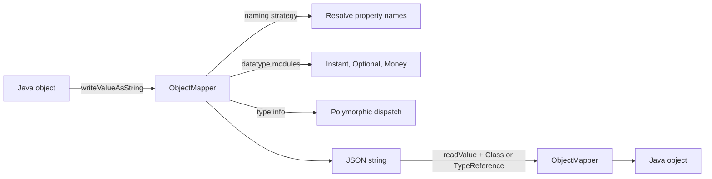


## What you'll learn
- Jackson's `ObjectMapper` and how Spring Boot configures it.
- Naming strategies (camelCase, snake_case) and per-field overrides.
- Polymorphic JSON via `@JsonTypeInfo` / `@JsonSubTypes`.
- Java time and modular Jackson support (`jackson-datatype-jsr310`).

## Concepts

Jackson is the default JSON library in Spring Boot - pulled in by `spring-boot-starter-web`. Compared with `System.Text.Json` it's older, more featureful, and slightly more configurable. The core type is `ObjectMapper`; it serializes Java objects to JSON and back.

Spring Boot's auto-configured `ObjectMapper` is generally fine. You configure it via:

- **`application.yml`** properties (`spring.jackson.*`) - quick tweaks.
- **A custom `@Bean ObjectMapper`** - for full control.
- **`Jackson2ObjectMapperBuilderCustomizer`** - surgically tweaking the default.

```yaml
spring:
  jackson:
    property-naming-strategy: SNAKE_CASE   # global naming
    default-property-inclusion: non_null   # skip null fields
    deserialization:
      fail-on-unknown-properties: false    # ignore extra fields in payloads
    time-zone: UTC
    date-format: yyyy-MM-dd'T'HH:mm:ss'Z'
```

The .NET parallel is `JsonSerializerOptions`. Same knobs, different names.

### Records and constructors

Spring Boot 3 + Jackson 2.13+ handles records natively. No `@JsonCreator` annotation required:

```java
public record Order(long id, String sku, int quantity) {}

// Serializes as:  {"id":1,"sku":"ABC-123","quantity":5}
// Deserializes from the same shape.
```

For classes, Jackson uses either a no-arg constructor + setters, or a constructor annotated with `@JsonCreator` and parameters annotated with `@JsonProperty`. Records require neither - the component names are visible via reflection on modern JDKs (with `-parameters` compile flag, which Spring Boot's Maven plugin sets by default).

### Per-field annotations

```java
public record Order(
    long id,
    @JsonProperty("product_sku") String sku,        // explicit JSON name
    int quantity,
    @JsonIgnore Instant internalCreatedAt,          // never appears in JSON
    @JsonInclude(JsonInclude.Include.NON_NULL) String note   // omit when null
) {}
```

Equivalent to System.Text.Json's `[JsonPropertyName]`, `[JsonIgnore]`, and `[JsonInclude(JsonIgnoreCondition.WhenWritingNull)]`.

### Naming strategies

Set globally (`spring.jackson.property-naming-strategy: SNAKE_CASE`) or per-class:

```java
@JsonNaming(PropertyNamingStrategies.SnakeCaseStrategy.class)
public record Order(long id, String productSku, int quantity) {}
// → {"id":1,"product_sku":"ABC-123","quantity":5}
```

For mixed APIs (camelCase in our service, snake_case from upstream), use per-class overrides.

### Java time

`Instant`, `LocalDate`, `LocalDateTime` need [`jackson-datatype-jsr310`](https://github.com/FasterXML/jackson-modules-java8) to serialize as ISO strings instead of arrays-of-numbers. Spring Boot pulls it in automatically - confirm in your dependency tree.

```java
public record AuditLog(long id, Instant timestamp) {}
// → {"id":1,"timestamp":"2026-05-25T08:42:00Z"}
```

Without the module: `{"timestamp":[2026,5,25,8,42,0]}`. If you ever see that shape in test output, the module isn't loaded.

### Polymorphic JSON

For discriminated unions on the wire, Jackson uses `@JsonTypeInfo` + `@JsonSubTypes`:

```java
@JsonTypeInfo(use = JsonTypeInfo.Id.NAME, property = "kind")
@JsonSubTypes({
    @JsonSubTypes.Type(value = Card.class,        name = "card"),
    @JsonSubTypes.Type(value = BankTransfer.class, name = "bank")
})
public sealed interface PaymentMethod permits Card, BankTransfer {}

public record Card(String last4, String brand) implements PaymentMethod {}
public record BankTransfer(String iban, String swift) implements PaymentMethod {}
```

Serializing a `Card` produces:
```json
{ "kind": "card", "last4": "4242", "brand": "VISA" }
```

Deserializing the same JSON dispatches on `"kind": "card"` to construct a `Card`. The .NET parallel is `[JsonPolymorphic]` and `[JsonDerivedType]` in System.Text.Json 7+.

Combined with sealed interfaces + records, this gives you a clean JSON representation for sum types.

### Custom serializers and modules

When annotations aren't enough, write a `JsonSerializer<T>` / `JsonDeserializer<T>` and register it via a module:

```java
public class MoneySerializer extends JsonSerializer<Money> {
    @Override
    public void serialize(Money m, JsonGenerator gen, SerializerProvider sp) throws IOException {
        gen.writeStartObject();
        gen.writeNumberField("amount", m.amount());
        gen.writeStringField("currency", m.currency());
        gen.writeEndObject();
    }
}

@Configuration
public class JacksonConfig {
    @Bean
    public Module moneyModule() {
        SimpleModule m = new SimpleModule();
        m.addSerializer(Money.class, new MoneySerializer());
        return m;
    }
}
```

Spring Boot auto-detects `Module` beans and registers them on the auto-configured `ObjectMapper`.

### Reading and writing manually

You'll occasionally need `ObjectMapper` directly:

```java
@Service
public class JsonOps {
    private final ObjectMapper mapper;

    public JsonOps(ObjectMapper mapper) { this.mapper = mapper; }

    public String toJson(Object o) throws JsonProcessingException {
        return mapper.writeValueAsString(o);
    }

    public <T> T fromJson(String json, Class<T> type) throws JsonProcessingException {
        return mapper.readValue(json, type);
    }

    public <T> T fromJson(String json, TypeReference<T> ref) throws JsonProcessingException {
        return mapper.readValue(json, ref);
    }
}
```

`JsonProcessingException` is checked - wrap in a runtime exception at the boundary (Module 2 Chapter 4).

## Walkthrough

A realistic mix of features in one DTO:

```java
@JsonNaming(PropertyNamingStrategies.SnakeCaseStrategy.class)
public record OrderEvent(
    long id,
    @JsonProperty("event_type") EventType type,
    Instant occurredAt,
    @JsonInclude(JsonInclude.Include.NON_NULL) String correlationId,
    PaymentMethod method
) {}

public enum EventType { CREATED, PAID, CANCELLED }
```

A round-trip test:

```java
@SpringBootTest
class OrderEventJsonTest {
    @Autowired ObjectMapper mapper;

    @Test
    void roundtripCard() throws Exception {
        OrderEvent ev = new OrderEvent(
            1L,
            EventType.PAID,
            Instant.parse("2026-05-25T08:42:00Z"),
            "trace-abc",
            new Card("4242", "VISA"));

        String json = mapper.writeValueAsString(ev);
        OrderEvent back = mapper.readValue(json, OrderEvent.class);

        assertThat(back).isEqualTo(ev);
        assertThat(json).contains("\"event_type\":\"PAID\"");
        assertThat(json).contains("\"kind\":\"card\"");
    }
}
```

The `event_type` field is `snake_case` thanks to `@JsonNaming`; the `kind` discriminator comes from `@JsonTypeInfo`; `correlation_id` is included because it's non-null.

## How it fits together



## Common pitfalls

| Pitfall | Why it happens | Fix |
|---|---|---|
| `Instant` serialized as array | Missing `jackson-datatype-jsr310` module. | Add the dep; Spring Boot usually has it. |
| `UnrecognizedPropertyException` on extra fields | Default behaviour fails. | `spring.jackson.deserialization.fail-on-unknown-properties: false`. |
| Polymorphic deserialization fails | No `@JsonSubTypes`. | Declare every subtype with a discriminator name. |
| Record component name mismatch | `-parameters` flag missing. | Spring Boot's Maven plugin sets it; verify if using a custom build. |
| Two `ObjectMapper` beans | Custom `@Bean ObjectMapper` overrides the auto-configured one and loses modules. | Use `Jackson2ObjectMapperBuilderCustomizer` to tweak. |

## Exercises

1. Define a record with a custom JSON name on one field and snake_case naming for the rest. Confirm both work via a round trip.
2. Build a polymorphic JSON for `PaymentMethod` with three variants. Serialize each and verify the discriminator field.
3. Write a custom `JsonSerializer` for a `Money` type and register it via a `Module` bean. Confirm Spring picks it up automatically.

## Recap & next

- Jackson is the default; `ObjectMapper` is the central type.
- Configure globally via `spring.jackson.*` or via `Jackson2ObjectMapperBuilderCustomizer`.
- Records work natively in Spring Boot 3 - no `@JsonCreator` needed.
- `@JsonTypeInfo` + `@JsonSubTypes` give you polymorphic JSON with sealed interfaces + records.
- Java time types need `jackson-datatype-jsr310` (auto-included by Spring Boot).

Next, **Concurrency: executors, CompletableFuture, and what async/await maps to** - Java 17's concurrency model in a world without language-level async.

