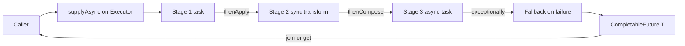


## What you'll learn
- Why Java 17 has no language-level `async/await` keyword.
- The executor model: `ExecutorService`, thread pools, and shutdown.
- `CompletableFuture` composition: `thenApply`, `thenCompose`, `allOf`, `exceptionally`.
- Spring's `@Async` and where it fits.
- What virtual threads (Java 21) will change.

## Concepts

C# has `async/await` baked into the language. The compiler rewrites `await` into a state machine, the runtime resumes continuations on the captured `SynchronizationContext`, and you write code that *looks* synchronous but doesn't block a thread.

Java 17 does not have this. The closest parallel is `CompletableFuture<T>` composed with `thenApply` / `thenCompose` - explicit continuations, no compiler-generated state machine. The mental model is .NET's TPL **before** `async/await`: a `Task<T>` plus `.ContinueWith(...)`.

Java 21 introduces **virtual threads** ([Project Loom](https://openjdk.org/projects/loom/)) - lightweight threads that block cheaply, removing most of the motivation for async-style code. Until you're on Java 21+, work with the model below.

### The executor model

An `ExecutorService` is a thread pool: submit a `Runnable` or `Callable<T>`, get a `Future<T>` back.

```java
ExecutorService exec = Executors.newFixedThreadPool(8);

Future<Integer> future = exec.submit(() -> heavyCompute(42));
Integer result = future.get();          // blocks until done

exec.shutdown();                        // accept no new tasks
exec.awaitTermination(10, TimeUnit.SECONDS);
```

Factory methods:
- `Executors.newFixedThreadPool(n)` - fixed-size pool.
- `Executors.newCachedThreadPool()` - unbounded, threads recycle after 60s idle. Risky for unknown workloads.
- `Executors.newSingleThreadExecutor()` - serialized work.
- `Executors.newVirtualThreadPerTaskExecutor()` (Java 21) - one virtual thread per task.

For a Spring app, configure a pool as a bean:

```java
@Bean
public ExecutorService backgroundExecutor() {
    return Executors.newFixedThreadPool(
        Runtime.getRuntime().availableProcessors() * 2);
}
```

Shutdown is handled by Spring if you mark it as `@Bean(destroyMethod = "shutdown")` - but Spring auto-detects `shutdown()` on `AutoCloseable` types since Spring 5, so this is implicit for `ExecutorService` (which is `Closeable`).

### CompletableFuture

`CompletableFuture<T>` is `Future<T>` plus composition. Created via `supplyAsync` (for a producer):

```java
CompletableFuture<Order> future = CompletableFuture.supplyAsync(
    () -> orderRepo.findById(id).orElseThrow(),
    backgroundExecutor);
```

Compose with `thenApply` (synchronous transform) or `thenCompose` (next async step):

```java
CompletableFuture<Receipt> receipt = future
    .thenApply(this::toCharge)                      // sync transform
    .thenCompose(charge ->                          // chain another async op
        CompletableFuture.supplyAsync(() -> paymentsClient.charge(charge), exec))
    .thenApply(this::toReceipt);
```

The .NET `await` parallel:

```csharp
var order = await orderRepo.FindByIdAsync(id);
var charge = ToCharge(order);
var payment = await paymentsClient.ChargeAsync(charge);
var receipt = ToReceipt(payment);
```

Java's chain is more verbose because every step is explicit. There's no syntax sugar.

### Error handling

```java
CompletableFuture<Order> future = supplyAsync(() -> /* may throw */);

future
    .exceptionally(t -> {
        log.warn("fallback", t);
        return Order.unknown();
    })
    .thenAccept(System.out::println);
```

`exceptionally` is the equivalent of `try/catch` around an `await`. It receives the `Throwable` (always wrapped in `CompletionException` if it came from `supplyAsync`, so unwrap with `t.getCause()` if needed).

For finer control: `handle((value, throwable) -> ...)` runs on both success and failure.

### Combining multiple futures

```java
CompletableFuture<Order> o = supplyAsync(...);
CompletableFuture<Customer> c = supplyAsync(...);

CompletableFuture<OrderView> view = o.thenCombine(c, OrderView::new);
```

For a list of futures:

```java
List<CompletableFuture<Order>> futures = ids.stream()
    .map(id -> supplyAsync(() -> repo.findById(id).orElseThrow(), exec))
    .toList();

CompletableFuture<Void> all = CompletableFuture.allOf(futures.toArray(new CompletableFuture[0]));

CompletableFuture<List<Order>> results = all.thenApply(v ->
    futures.stream().map(CompletableFuture::join).toList());
```

`allOf` waits for all (returns `Void`); `anyOf` returns when the first completes. Common pattern: fan out parallel work, collect results.

### Spring's `@Async`

Spring offers a convenience: annotate a method `@Async` and Spring runs it on a configured executor, returning `CompletableFuture<T>`.

```java
@EnableAsync
@Configuration
public class AsyncConfig {
    @Bean(name = "background")
    public Executor backgroundExecutor() {
        var exec = new ThreadPoolTaskExecutor();
        exec.setCorePoolSize(4);
        exec.setMaxPoolSize(8);
        exec.setQueueCapacity(100);
        exec.setThreadNamePrefix("bg-");
        exec.initialize();
        return exec;
    }
}

@Service
public class ReportService {
    @Async("background")
    public CompletableFuture<Report> generate(long id) {
        // runs on the 'background' executor
        return CompletableFuture.completedFuture(buildReport(id));
    }
}
```

Caveats:
- Like `@Transactional`, `@Async` is proxy-based. Self-invocation bypasses the proxy.
- The return type should be `CompletableFuture<T>` (or `void` for fire-and-forget); otherwise callers can't observe completion.

### `synchronized`, `ReentrantLock`, atomics

For shared mutable state:

- `synchronized` keyword on a method or block - intrinsic monitor lock. Simple, slightly heavier than C#'s `lock`.
- `ReentrantLock` - explicit lock with `lock()` / `unlock()`. Use `try { lock.lock(); ... } finally { lock.unlock(); }`.
- `AtomicInteger`, `AtomicLong`, `AtomicReference<T>` - CAS-based primitives.
- `ConcurrentHashMap.compute()` for atomic key-level updates.

Prefer the lock-free options when they fit. The `Atomic*` types' API mirrors `Interlocked` in .NET.

## Walkthrough

A fan-out/fan-in computation:

```java
@Service
public class OrderEnricher {
    private final OrderRepository orders;
    private final CustomerService customers;
    private final InventoryService inventory;
    private final ExecutorService exec;

    public OrderEnricher(OrderRepository orders, CustomerService customers,
                         InventoryService inventory, ExecutorService backgroundExecutor) {
        this.orders = orders;
        this.customers = customers;
        this.inventory = inventory;
        this.exec = backgroundExecutor;
    }

    public EnrichedOrder enrich(long orderId) {
        Order order = orders.findById(orderId).orElseThrow();

        CompletableFuture<Customer> cf = CompletableFuture.supplyAsync(
            () -> customers.findById(order.customerId()), exec);

        CompletableFuture<InventorySnapshot> invf = CompletableFuture.supplyAsync(
            () -> inventory.snapshot(order.sku()), exec);

        // Wait for both, combine.
        return cf.thenCombine(invf,
            (customer, inv) -> new EnrichedOrder(order, customer, inv))
            .join();   // blocks the caller; suitable for sync request handling
    }
}
```

The interesting bits:
- Two independent lookups run in parallel; `thenCombine` joins them.
- `.join()` blocks. In a Spring MVC handler that's acceptable (one request = one thread). In a reactive app you'd return the `CompletableFuture` directly or convert to `Mono`.
- The injected `ExecutorService` is reused - don't spin up a new one per request.

A failure-tolerant variant:

```java
public EnrichedOrder enrichOrNull(long orderId) {
    Order order = orders.findById(orderId).orElseThrow();

    CompletableFuture<Customer> cf = CompletableFuture
        .supplyAsync(() -> customers.findById(order.customerId()), exec)
        .exceptionally(t -> Customer.unknown());

    CompletableFuture<InventorySnapshot> invf = CompletableFuture
        .supplyAsync(() -> inventory.snapshot(order.sku()), exec)
        .exceptionally(t -> InventorySnapshot.empty());

    return cf.thenCombine(invf, (c, inv) -> new EnrichedOrder(order, c, inv)).join();
}
```

Each branch handles its own failure with a fallback. The composition continues.

## How it fits together



## Common pitfalls

| Pitfall | Why it happens | Fix |
|---|---|---|
| `Executors.newCachedThreadPool()` in unknown-load services | Unbounded thread creation. | Use a sized pool sized for the workload. |
| Blocking inside a CompletableFuture chain on the common ForkJoinPool | Starves the pool used by parallel streams. | Always supply an explicit executor for blocking work. |
| `future.get()` without a timeout | Hangs forever on stuck upstream. | `future.get(5, TimeUnit.SECONDS)`. |
| `@Async` self-invocation | Bypasses the proxy. | Call via injected reference. |
| Composing futures forgetting `thenCompose` | Returns `CompletableFuture<CompletableFuture<T>>`. | `thenCompose` flattens; `thenApply` doesn't. |

## Exercises

1. Compose three sequential async stages with `thenApply` and `thenCompose`. Note where you need each, and which signature shape you produce.
2. Fan out 100 ID lookups across an `ExecutorService` with `allOf` + `join` and produce a `List<Order>`. Bound the executor at 8 threads.
3. Add `@Async` to a service method. Verify it runs on the named executor (set the thread-name prefix and log it). Reproduce the self-invocation gotcha.

## Recap & next

- Java 17 has no language-level `async/await`. Use `CompletableFuture<T>` for explicit async composition.
- `ExecutorService` is the thread pool; size it for the workload.
- `thenApply` for sync transforms, `thenCompose` for chaining further async, `thenCombine` for fan-in.
- Spring's `@Async` is a convenient wrapper around `CompletableFuture` - proxy-based, so beware self-invocation.
- Java 21 brings virtual threads, which will change a lot of this; for now, explicit composition is the idiom.

Next, **Testing: JUnit 5, Mockito, and Spring Boot Test** - unit, slice, and integration tests with Testcontainers for real dependencies.

