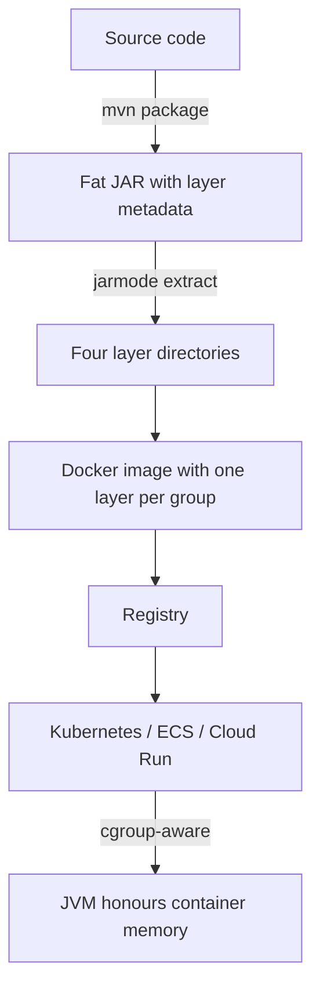


## What you'll learn
- The Spring Boot fat JAR (executable JAR) and how `mvn package` builds it.
- Layered JARs and why they matter for Docker image caching.
- Buildpacks (`spring-boot:build-image`) vs. handwritten Dockerfiles.
- How this compares to `dotnet publish --self-contained` and `NativeAOT`.

## Concepts

A standard Java JAR is a ZIP of class files with a manifest. To make it self-contained and executable, Spring Boot's Maven plugin repackages it as an **executable fat JAR**: classes from your project plus all dependencies in nested JARs under `BOOT-INF/lib/`, with a custom launcher in `org.springframework.boot.loader.launch.JarLauncher`.

You build with:

```bash
./mvnw package
ls target/
# orders-service-0.1.0-SNAPSHOT.jar          (this is the fat JAR)
# orders-service-0.1.0-SNAPSHOT.jar.original (the thin JAR, before repackage)

java -jar target/orders-service-0.1.0-SNAPSHOT.jar
```

The `.original` is what `javac` produced before Spring Boot's plugin added the launcher and dependencies. Useful when you want to attach the thin JAR to an artifact registry.

The mapping to .NET:

| Java                                | .NET                                       |
|-------------------------------------|--------------------------------------------|
| Fat JAR + JVM                       | `dotnet publish` (framework-dependent)     |
| Fat JAR + bundled JRE (`jlink`)     | `dotnet publish --self-contained`          |
| GraalVM Native Image                | `dotnet publish -p:PublishAot=true`        |
| Buildpacks                          | (no first-party equivalent; nearest is `dotnet publish` + base image) |

### Layered JARs

A single fat JAR has one big timestamp; every build invalidates the entire layer in Docker, even if only your source code changed. Spring Boot's **layered JAR** (default since 2.3) splits the JAR into four layers ordered by change frequency:

1. `dependencies/` - stable third-party deps (rarely change).
2. `spring-boot-loader/` - Spring Boot's launcher (almost never changes).
3. `snapshot-dependencies/` - SNAPSHOT versions (often change).
4. `application/` - your code (changes every build).

You don't see these as separate files; they're metadata that the Spring Boot Maven plugin emits. A Dockerfile uses them like this:

```dockerfile
FROM eclipse-temurin:17-jre-alpine AS extractor
WORKDIR /app
COPY target/orders-service-*.jar app.jar
RUN java -Djarmode=layertools -jar app.jar extract

FROM eclipse-temurin:17-jre-alpine
WORKDIR /app
COPY --from=extractor /app/dependencies/         ./
COPY --from=extractor /app/spring-boot-loader/   ./
COPY --from=extractor /app/snapshot-dependencies/ ./
COPY --from=extractor /app/application/          ./
ENTRYPOINT ["java", "org.springframework.boot.loader.launch.JarLauncher"]
```

Each `COPY` is its own Docker layer. The `dependencies` layer is cached across builds; only the `application` layer rebuilds when you change source code. Image push and pull is then fast - only the small application layer is transferred.

### Buildpacks

Spring Boot ships a `build-image` goal that uses [Paketo Buildpacks](https://paketo.io/) to produce a container image without writing a Dockerfile:

```bash
./mvnw spring-boot:build-image
docker run --rm -p 8080:8080 orders-service:0.1.0-SNAPSHOT
```

Buildpacks:
- Detect the project type (Java, Node, Python, Go).
- Pull a base image (`paketobuildpacks/run-jammy-tiny` by default).
- Install the JRE.
- Build the app.
- Configure ENTRYPOINT, environment variables, OCI labels.

Pros: zero Dockerfile, consistent base images, security patches via buildpack updates. Cons: less control, image size depends on the buildpack's choices, debugging is opaquer.

For a typical service, **buildpacks are the right starting point**. Drop to a custom Dockerfile when you need more control (specific JRE, extra packages, multi-stage builds with native tools).

### GraalVM Native Image

For sub-second startup and reduced memory, GraalVM produces a native binary. Spring Boot 3 supports it via the `native` Maven profile:

```bash
./mvnw -Pnative native:compile
# or for a Docker image:
./mvnw -Pnative spring-boot:build-image
```

Caveats:
- Reflection, dynamic proxies, and resource loading need explicit metadata. Spring AOT generates most of it; third-party libraries vary.
- Build time is long (3-10 minutes for a small service).
- Image size is small (~70 MB for a simple service vs. ~250 MB JVM image).
- Runtime memory is dramatically lower.

For most services, the JVM with a tuned heap is the right choice. GraalVM matters for short-lived workloads (serverless, CLI tools, low-memory containers).

### JVM-in-container tuning

A JVM in a container needs to be aware of the cgroup limits, or it'll over-allocate. Since Java 10+ the JVM detects cgroup memory and CPU limits automatically - no flags needed. For older versions or fine control:

```bash
java -XX:MaxRAMPercentage=75.0 -jar app.jar
```

`-XX:MaxRAMPercentage` caps the heap to a fraction of available memory. Use it instead of `-Xmx` so the same image works at different container sizes.

For Kubernetes specifically:

```yaml
resources:
  requests:
    memory: "512Mi"
    cpu: "500m"
  limits:
    memory: "1Gi"
    cpu: "1000m"
```

Set `-XX:MaxRAMPercentage=75.0` and the JVM sizes itself within the limit, leaving room for native memory, metaspace, and threads.

## Walkthrough

A complete build → image → deploy flow:

```bash
# Build the fat JAR
./mvnw clean package

# Verify the layered structure
java -Djarmode=layertools -jar target/orders-service-*.jar list
# dependencies
# spring-boot-loader
# snapshot-dependencies
# application

# Build a layered Docker image (option A: handwritten Dockerfile)
docker build -t orders-service:0.1.0 .

# Build via buildpacks (option B: no Dockerfile)
./mvnw spring-boot:build-image -Dspring-boot.build-image.imageName=orders-service:0.1.0

# Run locally
docker run --rm -p 8080:8080 \
  -e SPRING_PROFILES_ACTIVE=prod \
  -e DB_PASSWORD=secret \
  orders-service:0.1.0
```

The handwritten Dockerfile:

```dockerfile
FROM eclipse-temurin:17-jre-alpine AS extractor
WORKDIR /app
COPY target/orders-service-*.jar app.jar
RUN java -Djarmode=layertools -jar app.jar extract

FROM eclipse-temurin:17-jre-alpine
WORKDIR /app
COPY --from=extractor /app/dependencies/         ./
COPY --from=extractor /app/spring-boot-loader/   ./
COPY --from=extractor /app/snapshot-dependencies/ ./
COPY --from=extractor /app/application/          ./
EXPOSE 8080
ENTRYPOINT ["java", "-XX:MaxRAMPercentage=75.0", "org.springframework.boot.loader.launch.JarLauncher"]
```

The interesting bits:
- `extractor` stage uses `-Djarmode=layertools extract` to split the JAR into the four layer directories.
- Each `COPY` lands in its own Docker layer, ordered cold-to-hot.
- The runtime image is the JRE (not full JDK) for smaller size.
- `-XX:MaxRAMPercentage=75.0` keeps heap below the container limit with room for non-heap memory.

## How it fits together



## Common pitfalls

| Pitfall | Why it happens | Fix |
|---|---|---|
| OOMKilled in K8s | JVM ignored cgroup limit (older Java) | Use `-XX:MaxRAMPercentage` or upgrade JDK. |
| Docker layer cache misses on every build | Whole-JAR `COPY app.jar`. | Use layer extraction. |
| Buildpack image surprisingly large | Default base + JDK rather than JRE | Configure `BP_JVM_TYPE=JRE`. |
| Native image fails at runtime | Reflection target not registered. | Use Spring AOT or the GraalVM tracing agent. |
| Custom Dockerfile + Spring Boot loader main class wrong | Path changed in Spring Boot 3.2+. | Use `org.springframework.boot.loader.launch.JarLauncher`. |

## Exercises

1. Build a Spring Boot service as a fat JAR; inspect the layer structure with `jarmode=layertools list`.
2. Write a layered Dockerfile and build the image. Change one source file and rebuild; verify only the application layer rebuilds.
3. Build the same service with `spring-boot:build-image`. Compare image size and startup time with the handwritten Dockerfile.

## Recap & next

- Spring Boot fat JARs are executable JARs with all dependencies nested.
- Layered JARs let Docker cache stable layers and only rebuild your code on top.
- Buildpacks (`spring-boot:build-image`) produce images without a Dockerfile - good default.
- GraalVM Native Image gives sub-second startup with a long build time and reflection caveats.
- Use `-XX:MaxRAMPercentage` so the JVM sizes itself within the container limit.

Next, **Observability: Actuator, Micrometer, and OpenTelemetry** - health, metrics, and tracing in Spring Boot 3.

