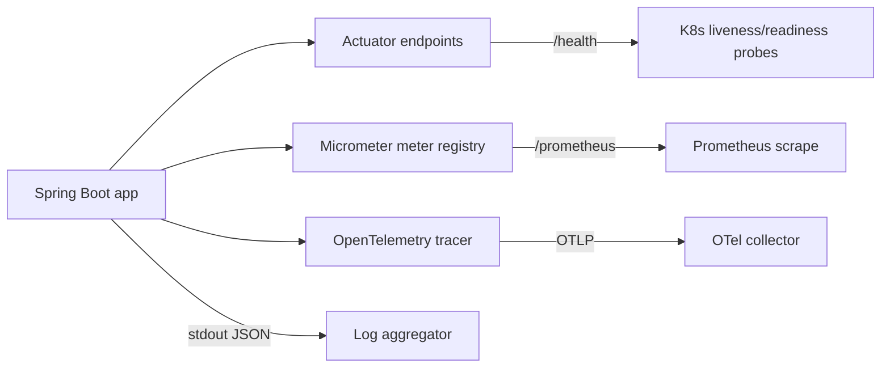


## What you'll learn
- The Spring Boot Actuator endpoints - health, info, env, metrics, threaddump.
- Micrometer as the metrics facade, with Prometheus as the typical backend.
- Distributed tracing with OpenTelemetry in Spring Boot 3.
- Structured logging with Logback + the MDC.

## Concepts

Observability in a Spring Boot service is provided by three layers, all built-in:

- **Spring Boot Actuator** - operational endpoints (`/actuator/health`, `/actuator/info`, etc.).
- **Micrometer** - the metrics SDK; vendor-neutral facade for Prometheus, Datadog, CloudWatch, etc.
- **OpenTelemetry** - the distributed tracing standard, supported via Micrometer Tracing in Spring Boot 3.

The .NET parallel is the official OpenTelemetry libraries plus `IHealthChecks` and `MeterFactory`. Same concepts, different packaging.

### Actuator

Add the dependency:

```xml
<dependency>
  <groupId>org.springframework.boot</groupId>
  <artifactId>spring-boot-starter-actuator</artifactId>
</dependency>
```

Out of the box, you get:

- `/actuator/health` - liveness and readiness checks.
- `/actuator/info` - build info (when `BuildProperties` is on the classpath).
- `/actuator` - index of available endpoints.

Most other endpoints (env, metrics, threaddump, heapdump) are gated. Enable selectively:

```yaml
management:
  endpoints:
    web:
      exposure:
        include: health, info, metrics, prometheus, env
  endpoint:
    health:
      show-details: when_authorized      # never | always | when_authorized
```

The `health` endpoint aggregates `HealthIndicator` beans. Spring Boot ships indicators for datasource connectivity, disk space, Redis, Kafka, etc. Write your own:

```java
@Component
public class PaymentsHealthIndicator implements HealthIndicator {
    private final PaymentClient client;

    public PaymentsHealthIndicator(PaymentClient client) { this.client = client; }

    @Override
    public Health health() {
        try {
            client.ping();
            return Health.up().build();
        } catch (Exception e) {
            return Health.down(e).build();
        }
    }
}
```

For Kubernetes, expose **liveness** and **readiness** separately:

```yaml
management:
  endpoint:
    health:
      probes:
        enabled: true   # enables /actuator/health/liveness and /readiness
```

The probes split health into "is the JVM running" (liveness) and "is the app ready to serve traffic" (readiness). Wire them to your pod's `livenessProbe` and `readinessProbe`.

### Micrometer

Micrometer is the abstraction over metric backends. Add a registry dependency to wire a specific backend:

```xml
<dependency>
  <groupId>io.micrometer</groupId>
  <artifactId>micrometer-registry-prometheus</artifactId>
</dependency>
```

Spring Boot auto-configures a `MeterRegistry` bean and exposes `/actuator/prometheus`. Out of the box you get JVM metrics (heap, GC, threads), Tomcat metrics (active connections), Spring MVC metrics (`http.server.requests` with status, method, URI labels), HikariCP metrics, and Logback metrics.

Custom metrics:

```java
@Service
public class OrderService {
    private final Counter created;
    private final Timer placeLatency;

    public OrderService(MeterRegistry registry) {
        this.created = Counter.builder("orders.created")
            .description("Orders created since start")
            .register(registry);

        this.placeLatency = Timer.builder("orders.place.latency")
            .publishPercentileHistogram()
            .register(registry);
    }

    public Order place(NewOrder req) {
        return placeLatency.record(() -> {
            Order o = save(req);
            created.increment();
            return o;
        });
    }
}
```

The .NET parallel is `IMeterFactory` + counters/histograms. Same primitives.

### Distributed tracing

Spring Boot 3 dropped Spring Cloud Sleuth in favour of [Micrometer Tracing](https://micrometer.io/docs/tracing), which bridges to OpenTelemetry (or Zipkin's Brave). Add:

```xml
<dependency>
  <groupId>io.micrometer</groupId>
  <artifactId>micrometer-tracing-bridge-otel</artifactId>
</dependency>
<dependency>
  <groupId>io.opentelemetry</groupId>
  <artifactId>opentelemetry-exporter-otlp</artifactId>
</dependency>
```

Then:

```yaml
management:
  tracing:
    sampling:
      probability: 1.0    # sample 100% in dev; lower in prod
  otlp:
    tracing:
      endpoint: http://otel-collector:4318/v1/traces
```

Spring auto-instruments incoming HTTP requests, `RestClient`, JDBC (via DataSource proxy), JPA, and `@Async` methods. Trace IDs propagate via `W3C traceparent` headers.

In code:

```java
@Service
public class OrderService {
    private final Tracer tracer;

    public OrderService(Tracer tracer) { this.tracer = tracer; }

    public Order place(NewOrder req) {
        Span span = tracer.spanBuilder("place-order").startSpan();
        try (Tracer.SpanInScope ignored = tracer.withSpan(span)) {
            // ... business logic
            return save(req);
        } finally {
            span.end();
        }
    }
}
```

Or use `@Observed` (Micrometer Observation API) for declarative instrumentation:

```java
@Observed(name = "orders.place")
public Order place(NewOrder req) { /* ... */ }
```

`@Observed` produces both a metric (`orders.place`) and a trace span - a single annotation for both signals.

### Structured logging

Spring Boot defaults to Logback. Configure structured JSON output for log aggregators with `logback-spring.xml`:

```xml
<configuration>
    <appender name="STDOUT" class="ch.qos.logback.core.ConsoleAppender">
        <encoder class="net.logstash.logback.encoder.LogstashEncoder"/>
    </appender>
    <root level="INFO">
        <appender-ref ref="STDOUT"/>
    </root>
</configuration>
```

(Requires `logstash-logback-encoder` on the classpath.)

The MDC (`org.slf4j.MDC`) carries contextual data per thread; Micrometer Tracing populates it with trace IDs automatically:

```java
log.info("Order placed");
// JSON: {"timestamp":"...","level":"INFO","message":"Order placed","traceId":"abc...","spanId":"def..."}
```

Use the MDC for request IDs, user IDs, tenant IDs - anything you want indexed in your log aggregator.

## Walkthrough

A complete observability setup. `pom.xml` additions:

```xml
<dependency>
  <groupId>org.springframework.boot</groupId>
  <artifactId>spring-boot-starter-actuator</artifactId>
</dependency>
<dependency>
  <groupId>io.micrometer</groupId>
  <artifactId>micrometer-registry-prometheus</artifactId>
</dependency>
<dependency>
  <groupId>io.micrometer</groupId>
  <artifactId>micrometer-tracing-bridge-otel</artifactId>
</dependency>
<dependency>
  <groupId>io.opentelemetry</groupId>
  <artifactId>opentelemetry-exporter-otlp</artifactId>
</dependency>
```

`application.yml`:

```yaml
management:
  endpoints:
    web:
      exposure:
        include: health, info, metrics, prometheus
  endpoint:
    health:
      probes:
        enabled: true
      show-details: when_authorized
  tracing:
    sampling:
      probability: 1.0
  otlp:
    tracing:
      endpoint: ${OTEL_COLLECTOR_URL:http://localhost:4318/v1/traces}
  metrics:
    distribution:
      percentiles-histogram:
        http.server.requests: true
```

A service that emits a custom metric + trace span:

```java
@Service
public class OrderService {
    private static final Logger log = LoggerFactory.getLogger(OrderService.class);
    private final OrderRepository repo;
    private final Counter created;

    public OrderService(OrderRepository repo, MeterRegistry registry) {
        this.repo = repo;
        this.created = Counter.builder("orders.created").register(registry);
    }

    @Observed(name = "orders.place", contextualName = "place-order")
    public Order place(NewOrder req) {
        Order saved = repo.save(new Order(req.sku(), req.quantity()));
        created.increment();
        log.info("Placed order id={}", saved.getId());
        return saved;
    }
}
```

Hitting `/actuator/prometheus` shows `orders_created_total` plus `orders_place_seconds_*` automatically. Hitting `/actuator/health/readiness` shows the readiness state. Traces flow to the OTLP collector.

## How it fits together



## Common pitfalls

| Pitfall | Why it happens | Fix |
|---|---|---|
| `/actuator/metrics` 404 | Endpoint not in the exposure list. | Add to `management.endpoints.web.exposure.include`. |
| Liveness probe failing during slow startup | Spring Boot's default liveness fails until context is ready. | Increase `initialDelaySeconds` or use the dedicated `/health/liveness`. |
| Trace IDs missing from logs | Logback encoder doesn't include MDC. | Use a JSON encoder that emits MDC fields. |
| Custom counter not incrementing | Created per request rather than once at construction. | Inject `MeterRegistry` once and cache the counter. |
| `/actuator/prometheus` reachable from internet | No security on Actuator. | Bind Actuator to a separate port or filter by IP. |

## Exercises

1. Add Actuator to a Spring Boot service. Expose `health`, `metrics`, and `prometheus`. Confirm the default `http.server.requests` timer appears in `/actuator/prometheus`.
2. Write a custom `HealthIndicator` for a downstream API. Make it fail-soft (return DOWN with a detail, not throw).
3. Add Micrometer Tracing with the OTLP bridge. Wire a local OpenTelemetry Collector. Confirm spans show up for an HTTP request crossing service → repository.

## Recap & next

- Actuator exposes operational endpoints; gate them with `management.endpoints.web.exposure`.
- Micrometer is the metrics facade; Prometheus is the typical backend.
- Spring Boot 3 uses Micrometer Tracing → OpenTelemetry for distributed tracing.
- `@Observed` is the declarative instrumentation that produces both metrics and spans.
- Logback with a JSON encoder + MDC gives you structured logs with trace IDs.

Next, **Security basics: Spring Security vs. ASP.NET Core Identity** - filter chains, OAuth2, and `@PreAuthorize`.

